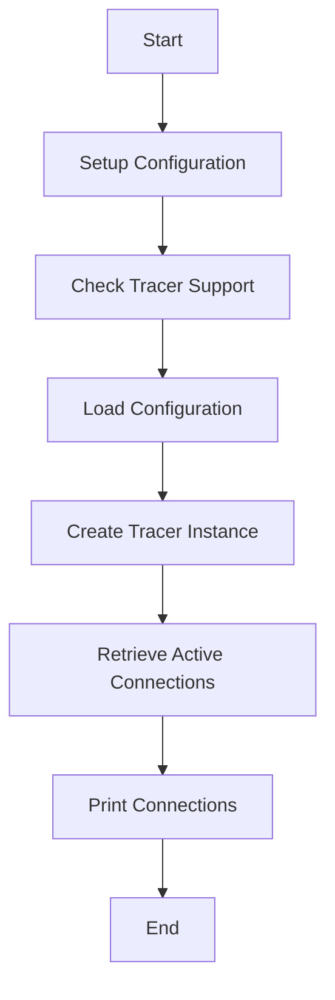

This document will cover the initialization and flow of the main function in the Datadog Agent. We'll cover:

1. Setting up the configuration
2. Initializing the tracer
3. Retrieving active connections

Technical document: <SwmLink doc-title="Initialization and Flow of Main Function">[Initialization and Flow of Main Function](/.swm/initialization-and-flow-of-main-function.ykdlfd1x.sw.md)</SwmLink>

# [Setting up the configuration](https://app.swimm.io/repos/Z2l0aHViJTNBJTNBZGF0YWRvZy1hZ2VudCUzQSUzQVN3aW1tLURlbW8=/docs/ykdlfd1x#initialization)

The main function begins by setting up the configuration file path. This step ensures that the Datadog Agent knows where to find its configuration file, which contains all the necessary settings for its operation. The configuration file path is typically set to <SwmPath>[test/regression/cases/basic_py_check/datadog-agent/datadog.yaml](test/regression/cases/basic_py_check/datadog-agent/datadog.yaml)</SwmPath>.

# [Checking Tracer Support](https://app.swimm.io/repos/Z2l0aHViJTNBJTNBZGF0YWRvZy1hZ2VudCUzQSUzQVN3aW1tLURlbW8=/docs/ykdlfd1x#initialization)

Next, the main function checks if the tracer is supported by the operating system. This is crucial because the tracer relies on specific OS capabilities to function correctly. If the tracer is not supported, the system-probe will not run, and an error message will be displayed.

# [Loading Configuration](https://app.swimm.io/repos/Z2l0aHViJTNBJTNBZGF0YWRvZy1hZ2VudCUzQSUzQVN3aW1tLURlbW8=/docs/ykdlfd1x#initialization)

If the tracer is supported, the main function proceeds to load the configuration. This step involves reading the configuration file and applying the settings. Any errors encountered during this process will cause the program to exit, ensuring that the agent does not run with an incomplete or incorrect configuration.

# [Creating Tracer Instance](https://app.swimm.io/repos/Z2l0aHViJTNBJTNBZGF0YWRvZy1hZ2VudCUzQSUzQVN3aW1tLURlbW8=/docs/ykdlfd1x#initialization)

Once the configuration is loaded, the main function creates a new tracer instance. The tracer is responsible for monitoring network activities and collecting data. This step involves initializing various components required by the tracer, such as eBPF programs and connection trackers.

# [Retrieving Active Connections](https://app.swimm.io/repos/Z2l0aHViJTNBJTNBZGF0YWRvZy1hZ2VudCUzQSUzQVN3aW1tLURlbW8=/docs/ykdlfd1x#active-connections-retrieval)

The main function then retrieves the active network connections using the tracer. This involves calling the GetActiveConnections method, which locks the buffer, flushes pending eBPF tracer data, and retrieves the latest active connections. The retrieved connections are then processed to provide a summary of each connection.

# [Printing Connections](https://app.swimm.io/repos/Z2l0aHViJTNBJTNBZGF0YWRvZy1hZ2VudCUzQSUzQVN3aW1tLURlbW8=/docs/ykdlfd1x#active-connections-retrieval)

Finally, the main function prints the active connections. This step involves iterating over the retrieved connections and printing a summary for each one. This provides a clear and concise view of the current network activity, which is useful for monitoring and troubleshooting purposes.

&nbsp;

*This is an auto-generated document by Swimm AI 🌊 and has not yet been verified by a human*

<SwmMeta version="3.0.0" repo-id="Z2l0aHViJTNBJTNBZGF0YWRvZy1hZ2VudCUzQSUzQVN3aW1tLURlbW8=" repo-name="datadog-agent">Powered by [Swimm](/)</SwmMeta>
