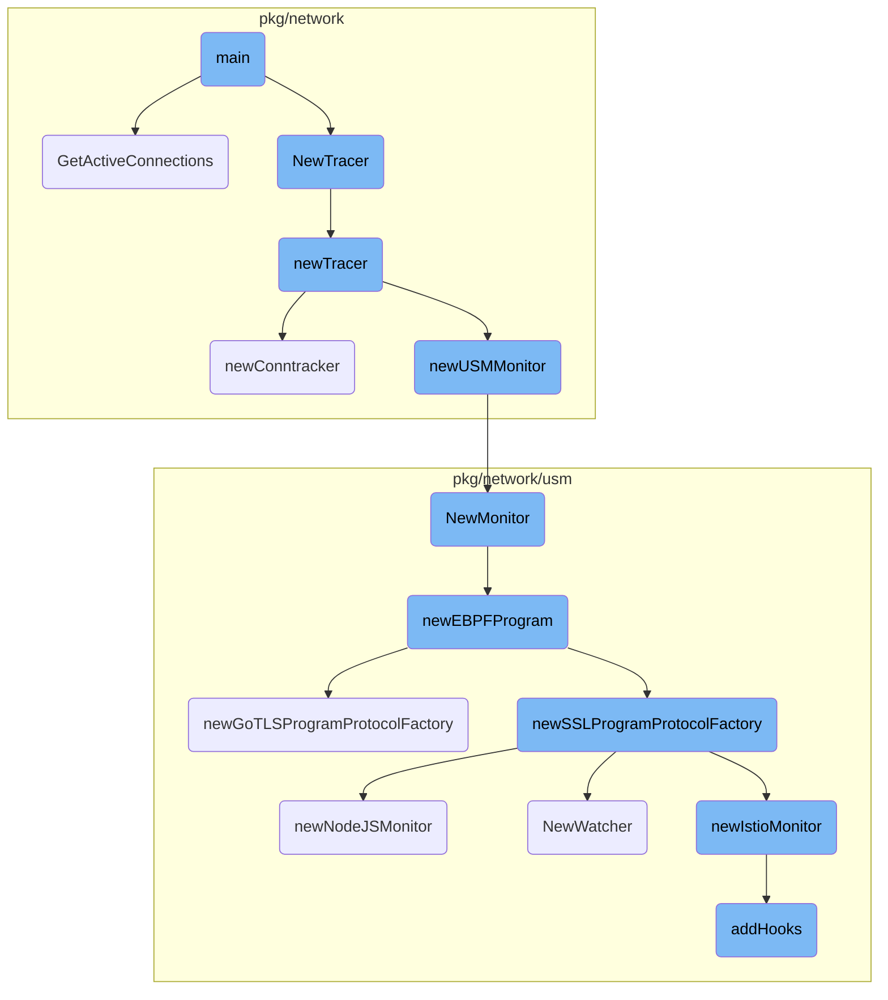
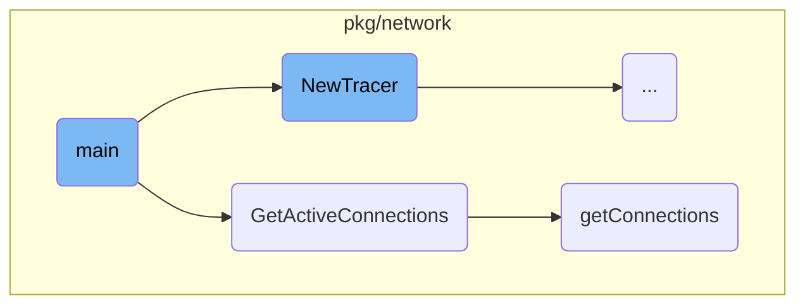
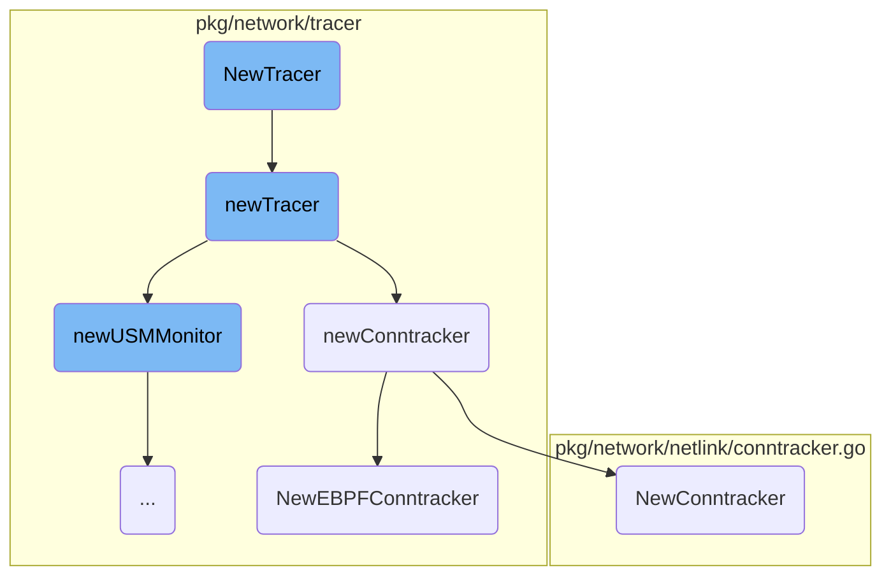
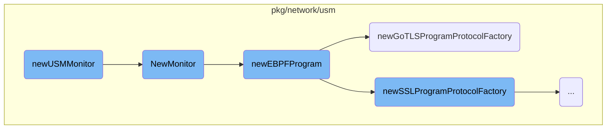
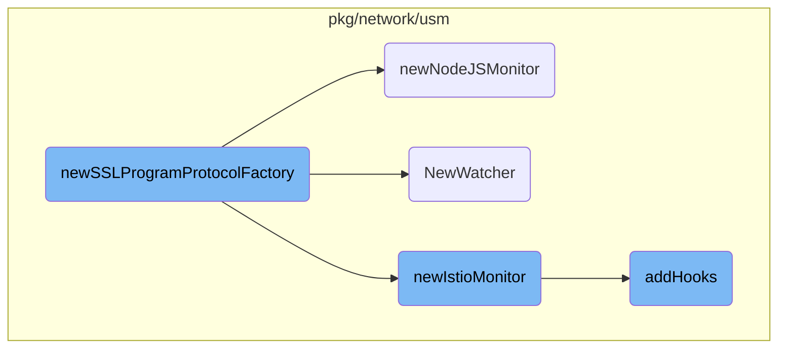

This document explains the initialization and flow of the main function. The main function is responsible for setting up the configuration, initializing the tracer, and retrieving active connections. It ensures that the necessary components are properly configured and running to monitor network activities.

The main function starts by setting up the configuration file path and checking if the tracer is supported by the operating system. If supported, it loads the configuration and creates a new tracer instance. The tracer is then used to retrieve and print active network connections. This involves calling the <SwmToken path="pkg/network/nettop/main.go" pos="54:10:10" line-data="		cs, err := t.GetActiveConnections(fmt.Sprintf(&quot;%d&quot;, os.Getpid()))">`GetActiveConnections`</SwmToken> method, which locks the buffer, flushes pending <SwmToken path="pkg/network/tracer/tracer.go" pos="513:18:18" line-data="// getConnections returns all the active connections in the ebpf maps along with the latest timestamp.  It takes">`ebpf`</SwmToken> tracer data, and retrieves the latest active connections.

Here is a high level diagram of the flow, showing only the most important functions:



# Flow drill down

First, we'll zoom into this section of the flow:



<SwmSnippet path="/pkg/network/nettop/main.go" line="23">

---

## Initialization

The <SwmToken path="pkg/network/nettop/main.go" pos="23:2:2" line-data="func main() {">`main`</SwmToken> function initializes the configuration and the tracer. It first sets up the configuration file path and checks if the tracer is supported by the OS. If supported, it loads the configuration and creates a new tracer instance.

```go
func main() {
	cfgpath := flag.String("config", "/etc/datadog-agent/datadog.yaml", "The Datadog main configuration file path")
	flag.Parse()

	if supported, err := tracer.IsTracerSupportedByOS(nil); !supported {
		fmt.Fprintf(os.Stderr, "system-probe is not supported: %s\n", err)
		os.Exit(1)
	}

	config.Datadog().SetConfigFile(*cfgpath)
	if _, err := config.LoadWithoutSecret(); err != nil {
		fmt.Fprintf(os.Stderr, "%s\n", err)
		os.Exit(1)
	}
	cfg := networkConfig.New()
	fmt.Printf("-- Config: %+v --\n", cfg)
	cfg.BPFDebug = true

	t, err := tracer.NewTracer(cfg, nil)
	if err != nil {
		fmt.Fprintf(os.Stderr, "%v\n", err)
```

---

</SwmSnippet>

<SwmSnippet path="/pkg/network/nettop/main.go" line="52">

---

## Active Connections Retrieval

The <SwmToken path="pkg/network/nettop/main.go" pos="52:1:1" line-data="	printConns := func(now time.Time) {">`printConns`</SwmToken> function within <SwmToken path="pkg/network/nettop/main.go" pos="23:2:2" line-data="func main() {">`main`</SwmToken> retrieves and prints active connections. It calls <SwmToken path="pkg/network/nettop/main.go" pos="54:10:10" line-data="		cs, err := t.GetActiveConnections(fmt.Sprintf(&quot;%d&quot;, os.Getpid()))">`GetActiveConnections`</SwmToken> on the tracer instance to get the current active connections and then prints a summary of each connection.

```go
	printConns := func(now time.Time) {
		fmt.Printf("-- %s --\n", now)
		cs, err := t.GetActiveConnections(fmt.Sprintf("%d", os.Getpid()))
		if err != nil {
			fmt.Println(err)
		}
		for _, c := range cs.Conns {
			fmt.Println(network.ConnectionSummary(&c, cs.DNS))
		}
	}
```

---

</SwmSnippet>

<SwmSnippet path="/pkg/network/tracer/tracer.go" line="403">

---

### <SwmToken path="pkg/network/tracer/tracer.go" pos="403:2:2" line-data="// GetActiveConnections returns the delta for connection info from the last time it was called with the same clientID">`GetActiveConnections`</SwmToken>

The <SwmToken path="pkg/network/tracer/tracer.go" pos="403:2:2" line-data="// GetActiveConnections returns the delta for connection info from the last time it was called with the same clientID">`GetActiveConnections`</SwmToken> method in the <SwmToken path="pkg/network/tracer/tracer.go" pos="404:6:6" line-data="func (t *Tracer) GetActiveConnections(clientID string) (*network.Connections, error) {">`Tracer`</SwmToken> class retrieves the delta of connection information since the last call. It locks the buffer, flushes pending <SwmToken path="pkg/network/tracer/tracer.go" pos="513:18:18" line-data="// getConnections returns all the active connections in the ebpf maps along with the latest timestamp.  It takes">`ebpf`</SwmToken> tracer data, and then calls <SwmToken path="pkg/network/tracer/tracer.go" pos="413:13:13" line-data="	latestTime, active, err := t.getConnections(buffer.ConnectionBuffer)">`getConnections`</SwmToken> to get the latest active connections.

```go
// GetActiveConnections returns the delta for connection info from the last time it was called with the same clientID
func (t *Tracer) GetActiveConnections(clientID string) (*network.Connections, error) {
	t.bufferLock.Lock()
	defer t.bufferLock.Unlock()
	if log.ShouldLog(seelog.TraceLvl) {
		log.Tracef("GetActiveConnections clientID=%s", clientID)
	}
	t.ebpfTracer.FlushPending()

	buffer := network.ClientPool.Get(clientID)
	latestTime, active, err := t.getConnections(buffer.ConnectionBuffer)
	if err != nil {
		return nil, fmt.Errorf("error retrieving connections: %s", err)
	}

	delta := t.state.GetDelta(clientID, latestTime, active, t.reverseDNS.GetDNSStats(), t.usmMonitor.GetProtocolStats())

	ips := make(map[util.Address]struct{}, len(delta.Conns)/2)
	var udpConns, tcpConns int
	for i := range delta.Conns {
		conn := &delta.Conns[i]
```

---

</SwmSnippet>

<SwmSnippet path="/pkg/network/tracer/tracer.go" line="513">

---

### <SwmToken path="pkg/network/tracer/tracer.go" pos="513:2:2" line-data="// getConnections returns all the active connections in the ebpf maps along with the latest timestamp.  It takes">`getConnections`</SwmToken>

The <SwmToken path="pkg/network/tracer/tracer.go" pos="513:2:2" line-data="// getConnections returns all the active connections in the ebpf maps along with the latest timestamp.  It takes">`getConnections`</SwmToken> method retrieves all active connections from the <SwmToken path="pkg/network/tracer/tracer.go" pos="513:18:18" line-data="// getConnections returns all the active connections in the ebpf maps along with the latest timestamp.  It takes">`ebpf`</SwmToken> maps and the latest timestamp. It uses a reusable buffer to avoid continuous allocation and processes each connection to add additional information like IP translation and process info.

```go
// getConnections returns all the active connections in the ebpf maps along with the latest timestamp.  It takes
// a reusable buffer for appending the active connections so that this doesn't continuously allocate
func (t *Tracer) getConnections(activeBuffer *network.ConnectionBuffer) (latestUint uint64, activeConnections []network.ConnectionStats, err error) {
	cachedConntrack := newCachedConntrack(t.config.ProcRoot, netlink.NewConntrack, 128)
	defer func() { _ = cachedConntrack.Close() }()

	latestTime, err := ddebpf.NowNanoseconds()
	if err != nil {
		return 0, nil, fmt.Errorf("error retrieving latest timestamp: %s", err)
	}

	var expired []network.ConnectionStats
	err = t.ebpfTracer.GetConnections(activeBuffer, func(c *network.ConnectionStats) bool {
		if t.connectionExpired(c, uint64(latestTime), cachedConntrack) {
			expired = append(expired, *c)
			if c.Type == network.TCP {
				tracerTelemetry.expiredTCPConns.Inc()
			}
			tracerTelemetry.closedConns.IncWithTags(c.Type.Tags())
			return false
		}
```

---

</SwmSnippet>

Now, lets zoom into this section of the flow:



<SwmSnippet path="/pkg/network/tracer/tracer.go" line="107">

---

## <SwmToken path="pkg/network/tracer/tracer.go" pos="107:2:2" line-data="// NewTracer creates a Tracer">`NewTracer`</SwmToken> Initialization

The <SwmToken path="pkg/network/tracer/tracer.go" pos="107:2:2" line-data="// NewTracer creates a Tracer">`NewTracer`</SwmToken> function is responsible for creating and initializing a new <SwmToken path="pkg/network/tracer/tracer.go" pos="107:8:8" line-data="// NewTracer creates a Tracer">`Tracer`</SwmToken> instance. It first calls the <SwmToken path="pkg/network/tracer/tracer.go" pos="107:2:2" line-data="// NewTracer creates a Tracer">`NewTracer`</SwmToken> function to set up the tracer and then starts it. If any errors occur during these steps, they are returned.

```go
// NewTracer creates a Tracer
func NewTracer(config *config.Config, telemetryComponent telemetryComponent.Component) (*Tracer, error) {
	tr, err := newTracer(config, telemetryComponent)
	if err != nil {
		return nil, err
	}

	if err := tr.start(); err != nil {
		return nil, err
	}

	return tr, nil
}
```

---

</SwmSnippet>

<SwmSnippet path="/pkg/network/tracer/tracer.go" line="121">

---

## Internal Tracer Setup

The <SwmToken path="pkg/network/tracer/tracer.go" pos="121:2:2" line-data="// newTracer is an internal function used by tests primarily">`newTracer`</SwmToken> function performs the internal setup for the tracer. It checks the kernel version, configures various components like <SwmToken path="pkg/network/tracer/tracer.go" pos="410:3:3" line-data="	t.ebpfTracer.FlushPending()">`ebpfTracer`</SwmToken>, <SwmToken path="pkg/network/tracer/tracer.go" pos="239:22:22" line-data="func newConntracker(cfg *config.Config, telemetryComponent telemetryComponent.Component) (netlink.Conntracker, error) {">`Conntracker`</SwmToken>, and <SwmToken path="pkg/network/tracer/tracer.go" pos="418:31:31" line-data="	delta := t.state.GetDelta(clientID, latestTime, active, t.reverseDNS.GetDNSStats(), t.usmMonitor.GetProtocolStats())">`usmMonitor`</SwmToken>, and initializes state and connection filters. This function ensures that all necessary components are properly configured before the tracer is used.

```go
// newTracer is an internal function used by tests primarily
// (and NewTracer above)
func newTracer(cfg *config.Config, telemetryComponent telemetryComponent.Component) (_ *Tracer, reterr error) {
	if _, err := tracefs.Root(); err != nil {
		return nil, fmt.Errorf("system-probe unsupported: %s", err)
	}

	// check if current platform is using old kernel API because it affects what kprobe are we going to enable
	currKernelVersion, err := kernel.HostVersion()
	if err != nil {
		// if the platform couldn't be determined, treat it as new kernel case
		log.Warn("could not detect the kernel version, will use kprobes from kernel version >= 4.1.0")
	}

	// check to see if current kernel is earlier than version 4.1.0
	pre410Kernel := currKernelVersion < kernel.VersionCode(4, 1, 0)
	if pre410Kernel {
		log.Infof("detected kernel version %s, will use kprobes from kernel version < 4.1.0", currKernelVersion)
	}

	if cfg.ServiceMonitoringEnabled {
```

---

</SwmSnippet>

<SwmSnippet path="/pkg/network/tracer/tracer.go" line="239">

---

### Connection Tracker Initialization

The <SwmToken path="pkg/network/tracer/tracer.go" pos="239:2:2" line-data="func newConntracker(cfg *config.Config, telemetryComponent telemetryComponent.Component) (netlink.Conntracker, error) {">`newConntracker`</SwmToken> function initializes the connection tracker based on the configuration. It attempts to load the <SwmToken path="pkg/network/tracer/tracer.go" pos="249:27:27" line-data="		log.Warnf(&quot;error fetching root net namespace, will not attempt to load nf_conntrack_netlink module: %s&quot;, err)">`nf_conntrack_netlink`</SwmToken> module and falls back to different methods if the <SwmToken path="pkg/network/tracer/tracer.go" pos="513:18:18" line-data="// getConnections returns all the active connections in the ebpf maps along with the latest timestamp.  It takes">`ebpf`</SwmToken> conntracker is not enabled or fails to initialize.

```go
func newConntracker(cfg *config.Config, telemetryComponent telemetryComponent.Component) (netlink.Conntracker, error) {
	if !cfg.EnableConntrack {
		return netlink.NewNoOpConntracker(), nil
	}

	var c netlink.Conntracker
	var err error

	ns, err := cfg.GetRootNetNs()
	if err != nil {
		log.Warnf("error fetching root net namespace, will not attempt to load nf_conntrack_netlink module: %s", err)
	} else {
		defer ns.Close()
		if err = netlink.LoadNfConntrackKernelModule(ns); err != nil {
			log.Warnf("failed to load conntrack kernel module, though it may already be loaded: %s", err)
		}
	}
	if cfg.EnableEbpfConntracker {
		if c, err = NewEBPFConntracker(cfg, telemetryComponent); err == nil {
			return c, nil
		}
```

---

</SwmSnippet>

<SwmSnippet path="/pkg/network/netlink/conntracker.go" line="111">

---

### Netlink Connection Tracker

The <SwmToken path="pkg/network/netlink/conntracker.go" pos="111:2:2" line-data="// NewConntracker creates a new conntracker with a short term buffer capped at the given size">`NewConntracker`</SwmToken> function creates a new netlink-based connection tracker. It runs the initialization in a goroutine and waits for it to complete or timeout, ensuring that the connection tracker is ready for use.

```go
// NewConntracker creates a new conntracker with a short term buffer capped at the given size
func NewConntracker(config *config.Config, telemetrycomp telemetryComp.Component) (Conntracker, error) {
	var (
		err         error
		conntracker Conntracker
	)

	done := make(chan struct{})

	go func() {
		conntracker, err = newConntrackerOnce(config, telemetrycomp)
		done <- struct{}{}
	}()

	select {
	case <-done:
		return conntracker, err
	case <-time.After(config.ConntrackInitTimeout):
		return nil, fmt.Errorf("could not initialize conntrack after: %s", config.ConntrackInitTimeout)
	}
}
```

---

</SwmSnippet>

<SwmSnippet path="/pkg/network/tracer/ebpf_conntracker.go" line="85">

---

### <SwmToken path="pkg/network/tracer/ebpf_conntracker.go" pos="85:24:24" line-data="// NewEBPFConntracker creates a netlink.Conntracker that monitor conntrack NAT entries via eBPF">`eBPF`</SwmToken> Connection Tracker

The <SwmToken path="pkg/network/tracer/ebpf_conntracker.go" pos="85:2:2" line-data="// NewEBPFConntracker creates a netlink.Conntracker that monitor conntrack NAT entries via eBPF">`NewEBPFConntracker`</SwmToken> function creates an eBPF-based connection tracker. It tries to load the <SwmToken path="pkg/network/tracer/ebpf_conntracker.go" pos="85:24:24" line-data="// NewEBPFConntracker creates a netlink.Conntracker that monitor conntrack NAT entries via eBPF">`eBPF`</SwmToken> programs using different methods (CO-RE, runtime compiled, prebuilt) and starts the manager. If successful, it initializes the connection tracking maps and dumps the initial tables.

```go
// NewEBPFConntracker creates a netlink.Conntracker that monitor conntrack NAT entries via eBPF
func NewEBPFConntracker(cfg *config.Config, telemetrycomp telemetryComp.Component) (netlink.Conntracker, error) {
	allowRC := cfg.EnableRuntimeCompiler
	var m *manager.Manager
	var err error
	if cfg.EnableCORE {
		m, err = ebpfConntrackerCORECreator(cfg)
		if err != nil {
			if cfg.EnableRuntimeCompiler && cfg.AllowRuntimeCompiledFallback {
				log.Warnf("error loading CO-RE conntracker, falling back to runtime compiled: %s", err)
			} else if cfg.AllowPrecompiledFallback {
				allowRC = false
				log.Warnf("error loading CO-RE conntracker, falling back to pre-compiled: %s", err)
			} else {
				return nil, fmt.Errorf("error loading CO-RE conntracker: %w", err)
			}
		}
	}

	if m == nil && allowRC {
		m, err = ebpfConntrackerRCCreator(cfg)
```

---

</SwmSnippet>

Now, lets zoom into this section of the flow:



<SwmSnippet path="/pkg/network/tracer/tracer.go" line="837">

---

## <SwmToken path="pkg/network/tracer/tracer.go" pos="837:2:2" line-data="func newUSMMonitor(c *config.Config, tracer connection.Tracer) *usm.Monitor {">`newUSMMonitor`</SwmToken> Initialization

The <SwmToken path="pkg/network/tracer/tracer.go" pos="837:2:2" line-data="func newUSMMonitor(c *config.Config, tracer connection.Tracer) *usm.Monitor {">`newUSMMonitor`</SwmToken> function initializes the USM monitor if it is supported and enabled. It retrieves the connection protocol map from the tracer and creates a new monitor instance using <SwmToken path="pkg/network/tracer/tracer.go" pos="846:8:10" line-data="	monitor, err := usm.NewMonitor(c, connectionProtocolMap)">`usm.NewMonitor`</SwmToken>. If the monitor starts successfully, it is returned; otherwise, errors are logged, and <SwmToken path="pkg/network/tracer/tracer.go" pos="840:3:3" line-data="		return nil">`nil`</SwmToken> is returned.

```go
func newUSMMonitor(c *config.Config, tracer connection.Tracer) *usm.Monitor {
	if !usmconfig.IsUSMSupportedAndEnabled(c) {
		// If USM is not supported, or if USM is not enabled, we should not start the USM monitor.
		return nil
	}

	// Shared with the USM program
	connectionProtocolMap := tracer.GetMap(probes.ConnectionProtocolMap)

	monitor, err := usm.NewMonitor(c, connectionProtocolMap)
	if err != nil {
		log.Errorf("usm initialization failed: %s", err)
		return nil
	}

	if err := monitor.Start(); err != nil {
		log.Errorf("usm startup failed: %s", err)
		return nil
	}

	return monitor
```

---

</SwmSnippet>

<SwmSnippet path="/pkg/network/usm/monitor.go" line="63">

---

## Creating a New Monitor

The <SwmToken path="pkg/network/usm/monitor.go" pos="63:2:2" line-data="// NewMonitor returns a new Monitor instance">`NewMonitor`</SwmToken> function sets up and initializes a new USM monitor. It first creates a new <SwmToken path="pkg/network/usm/monitor.go" pos="64:15:15" line-data="func NewMonitor(c *config.Config, connectionProtocolMap *ebpf.Map) (m *Monitor, err error) {">`ebpf`</SwmToken> program using <SwmToken path="pkg/network/usm/monitor.go" pos="74:8:8" line-data="	mgr, err := newEBPFProgram(c, connectionProtocolMap)">`newEBPFProgram`</SwmToken>. If no protocols are enabled, the monitor is not started. The function then initializes the <SwmToken path="pkg/network/usm/monitor.go" pos="64:15:15" line-data="func NewMonitor(c *config.Config, connectionProtocolMap *ebpf.Map) (m *Monitor, err error) {">`ebpf`</SwmToken> program, retrieves the socket filter, and sets up traffic inspection. Finally, it returns the initialized monitor instance.

```go
// NewMonitor returns a new Monitor instance
func NewMonitor(c *config.Config, connectionProtocolMap *ebpf.Map) (m *Monitor, err error) {
	defer func() {
		// capture error and wrap it
		if err != nil {
			state = notRunning
			err = fmt.Errorf("could not initialize USM: %w", err)
			startupError = err
		}
	}()

	mgr, err := newEBPFProgram(c, connectionProtocolMap)
	if err != nil {
		return nil, fmt.Errorf("error setting up ebpf program: %w", err)
	}

	if len(mgr.enabledProtocols) == 0 {
		state = disabled
		log.Debug("not enabling USM as no protocols monitoring were enabled.")
		return nil, nil
	}
```

---

</SwmSnippet>

<SwmSnippet path="/pkg/network/usm/ebpf_main.go" line="98">

---

## Setting Up <SwmToken path="pkg/network/usm/ebpf_main.go" pos="98:15:15" line-data="func newEBPFProgram(c *config.Config, connectionProtocolMap *ebpf.Map) (*ebpfProgram, error) {">`ebpf`</SwmToken> Program

The <SwmToken path="pkg/network/usm/ebpf_main.go" pos="98:2:2" line-data="func newEBPFProgram(c *config.Config, connectionProtocolMap *ebpf.Map) (*ebpfProgram, error) {">`newEBPFProgram`</SwmToken> function configures the <SwmToken path="pkg/network/usm/ebpf_main.go" pos="98:15:15" line-data="func newEBPFProgram(c *config.Config, connectionProtocolMap *ebpf.Map) (*ebpfProgram, error) {">`ebpf`</SwmToken> program by setting up maps and probes required for monitoring. It also initializes <SwmToken path="pkg/network/usm/ebpf_main.go" pos="586:13:15" line-data="// For each enabled protocols, a protocol-specific instance of the Protocol">`protocol-specific`</SwmToken> factories for SSL and <SwmToken path="pkg/network/usm/ebpf_gotls.go" pos="171:11:11" line-data="			return nil, errors.New(&quot;goTLS not supported by this platform&quot;)">`goTLS`</SwmToken> support. The function returns the configured <SwmToken path="pkg/network/usm/ebpf_main.go" pos="98:15:15" line-data="func newEBPFProgram(c *config.Config, connectionProtocolMap *ebpf.Map) (*ebpfProgram, error) {">`ebpf`</SwmToken> program instance.

```go
func newEBPFProgram(c *config.Config, connectionProtocolMap *ebpf.Map) (*ebpfProgram, error) {
	mgr := &manager.Manager{
		Maps: []*manager.Map{
			{Name: protocols.TLSDispatcherProgramsMap},
			{Name: protocols.ProtocolDispatcherProgramsMap},
			{Name: protocols.ProtocolDispatcherClassificationPrograms},
			{Name: protocols.TLSProtocolDispatcherClassificationPrograms},
			{Name: connectionStatesMap},
			{Name: sockFDLookupArgsMap},
			{Name: tupleByPidFDMap},
			{Name: pidFDByTupleMap},
		},
		Probes: []*manager.Probe{
			{
				ProbeIdentificationPair: manager.ProbeIdentificationPair{
					EBPFFuncName: "kprobe__tcp_sendmsg",
					UID:          probeUID,
				},
			},
			{
				ProbeIdentificationPair: manager.ProbeIdentificationPair{
```

---

</SwmSnippet>

<SwmSnippet path="/pkg/network/usm/ebpf_gotls.go" line="164">

---

## <SwmToken path="pkg/network/usm/ebpf_gotls.go" pos="171:11:11" line-data="			return nil, errors.New(&quot;goTLS not supported by this platform&quot;)">`goTLS`</SwmToken> Program Protocol Factory

The <SwmToken path="pkg/network/usm/ebpf_gotls.go" pos="164:2:2" line-data="func newGoTLSProgramProtocolFactory(m *manager.Manager) protocols.ProtocolFactory {">`newGoTLSProgramProtocolFactory`</SwmToken> function returns a protocol factory for <SwmToken path="pkg/network/usm/ebpf_gotls.go" pos="171:11:11" line-data="			return nil, errors.New(&quot;goTLS not supported by this platform&quot;)">`goTLS`</SwmToken> support. It checks if <SwmToken path="pkg/network/usm/ebpf_gotls.go" pos="171:11:11" line-data="			return nil, errors.New(&quot;goTLS not supported by this platform&quot;)">`goTLS`</SwmToken> support is enabled and supported by the platform. If the conditions are met, it initializes and returns a new <SwmToken path="pkg/network/usm/ebpf_gotls.go" pos="178:4:4" line-data="		return &amp;goTLSProgram{">`goTLSProgram`</SwmToken> instance.

```go
func newGoTLSProgramProtocolFactory(m *manager.Manager) protocols.ProtocolFactory {
	return func(c *config.Config) (protocols.Protocol, error) {
		if !c.EnableGoTLSSupport {
			return nil, nil
		}

		if !usmconfig.TLSSupported(c) {
			return nil, errors.New("goTLS not supported by this platform")
		}

		if !c.EnableRuntimeCompiler && !c.EnableCORE {
			return nil, errors.New("goTLS support requires runtime-compilation or CO-RE to be enabled")
		}

		return &goTLSProgram{
			done:              make(chan struct{}),
			cfg:               c,
			manager:           m,
			procRoot:          c.ProcRoot,
			binAnalysisMetric: libtelemetry.NewCounter("usm.go_tls.analysis_time", libtelemetry.OptPrometheus),
			registry:          utils.NewFileRegistry("go-tls"),
```

---

</SwmSnippet>

Now, lets zoom into this section of the flow:



<SwmSnippet path="/pkg/network/usm/ebpf_ssl.go" line="428">

---

## SSL Program Protocol Factory

The <SwmToken path="pkg/network/usm/ebpf_ssl.go" pos="428:2:2" line-data="func newSSLProgramProtocolFactory(m *manager.Manager) protocols.ProtocolFactory {">`newSSLProgramProtocolFactory`</SwmToken> function initializes the SSL monitoring setup. It checks the configuration to determine if native TLS, Istio, or <SwmToken path="pkg/network/usm/ebpf_ssl.go" pos="621:3:3" line-data="		// nodejs monitoring, but our uprobe hooks only properly support 64-bit">`nodejs`</SwmToken> monitoring is enabled. If native TLS monitoring is enabled, it creates a new <SwmToken path="pkg/network/usm/ebpf_ssl.go" pos="435:1:1" line-data="			watcher *sharedlibraries.Watcher">`watcher`</SwmToken> instance with specific rules for shared libraries like <SwmToken path="pkg/network/usm/ebpf_ssl.go" pos="444:9:11" line-data="					Re:           regexp.MustCompile(`libssl.so`),">`libssl.so`</SwmToken>, <SwmToken path="pkg/network/usm/ebpf_ssl.go" pos="449:9:11" line-data="					Re:           regexp.MustCompile(`libcrypto.so`),">`libcrypto.so`</SwmToken>, and <SwmToken path="pkg/network/usm/ebpf_ssl.go" pos="454:9:11" line-data="					Re:           regexp.MustCompile(`libgnutls.so`),">`libgnutls.so`</SwmToken>. It then returns an <SwmToken path="pkg/network/usm/ebpf_ssl.go" pos="248:8:8" line-data="// The constructor of SSLProgram requires more parameters than we provide in the general way, thus we need to have">`SSLProgram`</SwmToken> instance that includes the watcher and monitors for Istio and <SwmToken path="pkg/network/usm/ebpf_ssl.go" pos="621:3:3" line-data="		// nodejs monitoring, but our uprobe hooks only properly support 64-bit">`nodejs`</SwmToken>.

```go
func newSSLProgramProtocolFactory(m *manager.Manager) protocols.ProtocolFactory {
	return func(c *config.Config) (protocols.Protocol, error) {
		if (!c.EnableNativeTLSMonitoring || !usmconfig.TLSSupported(c)) && !c.EnableIstioMonitoring && !c.EnableNodeJSMonitoring {
			return nil, nil
		}

		var (
			watcher *sharedlibraries.Watcher
			err     error
		)

		procRoot := kernel.ProcFSRoot()

		if c.EnableNativeTLSMonitoring && usmconfig.TLSSupported(c) {
			watcher, err = sharedlibraries.NewWatcher(c,
				sharedlibraries.Rule{
					Re:           regexp.MustCompile(`libssl.so`),
					RegisterCB:   addHooks(m, procRoot, openSSLProbes),
					UnregisterCB: removeHooks(m, openSSLProbes),
				},
				sharedlibraries.Rule{
```

---

</SwmSnippet>

<SwmSnippet path="/pkg/network/usm/nodejs.go" line="129">

---

### <SwmToken path="pkg/network/usm/nodejs.go" pos="136:9:9" line-data="		registry: utils.NewFileRegistry(&quot;nodejs&quot;),">`nodejs`</SwmToken> Monitor

The <SwmToken path="pkg/network/usm/nodejs.go" pos="129:2:2" line-data="func newNodeJSMonitor(c *config.Config, mgr *manager.Manager) *nodeJSMonitor {">`newNodeJSMonitor`</SwmToken> function initializes the <SwmToken path="pkg/network/usm/nodejs.go" pos="136:9:9" line-data="		registry: utils.NewFileRegistry(&quot;nodejs&quot;),">`nodejs`</SwmToken> monitoring setup. It checks if <SwmToken path="pkg/network/usm/nodejs.go" pos="136:9:9" line-data="		registry: utils.NewFileRegistry(&quot;nodejs&quot;),">`nodejs`</SwmToken> monitoring is enabled in the configuration. If enabled, it creates a <SwmToken path="pkg/network/usm/nodejs.go" pos="129:21:21" line-data="func newNodeJSMonitor(c *config.Config, mgr *manager.Manager) *nodeJSMonitor {">`nodeJSMonitor`</SwmToken> instance with a file registry, process root, and channels for callbacks to register and unregister hooks for <SwmToken path="pkg/network/usm/nodejs.go" pos="136:9:9" line-data="		registry: utils.NewFileRegistry(&quot;nodejs&quot;),">`nodejs`</SwmToken> probes.

```go
func newNodeJSMonitor(c *config.Config, mgr *manager.Manager) *nodeJSMonitor {
	if !c.EnableNodeJSMonitoring {
		return nil
	}

	procRoot := kernel.ProcFSRoot()
	return &nodeJSMonitor{
		registry: utils.NewFileRegistry("nodejs"),
		procRoot: procRoot,
		done:     make(chan struct{}),

		// Callbacks
		registerCB:   addHooks(mgr, procRoot, nodeJSProbes),
		unregisterCB: removeHooks(mgr, nodeJSProbes),
	}
}
```

---

</SwmSnippet>

<SwmSnippet path="/pkg/network/usm/sharedlibraries/watcher.go" line="69">

---

### Watcher Initialization

The <SwmToken path="pkg/network/usm/sharedlibraries/watcher.go" pos="69:2:2" line-data="// NewWatcher creates a new Watcher instance">`NewWatcher`</SwmToken> function creates a new <SwmToken path="pkg/network/usm/sharedlibraries/watcher.go" pos="69:10:10" line-data="// NewWatcher creates a new Watcher instance">`Watcher`</SwmToken> instance for monitoring shared libraries. It initializes an <SwmToken path="pkg/network/tracer/tracer.go" pos="513:18:18" line-data="// getConnections returns all the active connections in the ebpf maps along with the latest timestamp.  It takes">`ebpf`</SwmToken> program and sets up various properties like process root, rules, load events, and a file registry. This watcher is used to monitor shared libraries specified in the rules.

```go
// NewWatcher creates a new Watcher instance
func NewWatcher(cfg *config.Config, rules ...Rule) (*Watcher, error) {
	ebpfProgram := newEBPFProgram(cfg)
	err := ebpfProgram.Init()
	if err != nil {
		return nil, fmt.Errorf("error initializing shared library program: %w", err)
	}

	return &Watcher{
		wg:             sync.WaitGroup{},
		done:           make(chan struct{}),
		procRoot:       kernel.ProcFSRoot(),
		rules:          rules,
		loadEvents:     ebpfProgram.GetPerfHandler(),
		processMonitor: monitor.GetProcessMonitor(),
		ebpfProgram:    ebpfProgram,
		registry:       utils.NewFileRegistry("shared_libraries"),

		libHits:    telemetry.NewCounter("usm.so_watcher.hits", telemetry.OptPrometheus),
		libMatches: telemetry.NewCounter("usm.so_watcher.matches", telemetry.OptPrometheus),
	}, nil
```

---

</SwmSnippet>

<SwmSnippet path="/pkg/network/usm/istio.go" line="111">

---

### Istio Monitor

The <SwmToken path="pkg/network/usm/istio.go" pos="111:2:2" line-data="func newIstioMonitor(c *config.Config, mgr *manager.Manager) *istioMonitor {">`newIstioMonitor`</SwmToken> function initializes the Istio monitoring setup. It checks if Istio monitoring is enabled in the configuration. If enabled, it creates an <SwmToken path="pkg/network/usm/istio.go" pos="111:21:21" line-data="func newIstioMonitor(c *config.Config, mgr *manager.Manager) *istioMonitor {">`istioMonitor`</SwmToken> instance with a file registry, process root, and channels for callbacks to register and unregister hooks for Istio probes.

```go
func newIstioMonitor(c *config.Config, mgr *manager.Manager) *istioMonitor {
	if !c.EnableIstioMonitoring {
		return nil
	}

	procRoot := kernel.ProcFSRoot()
	return &istioMonitor{
		registry: utils.NewFileRegistry("istio"),
		procRoot: procRoot,
		done:     make(chan struct{}),

		// Callbacks
		registerCB:   addHooks(mgr, procRoot, istioProbes),
		unregisterCB: removeHooks(mgr, istioProbes),
	}
}
```

---

</SwmSnippet>

<SwmSnippet path="/pkg/network/usm/ebpf_ssl.go" line="601">

---

### Adding Hooks

The <SwmToken path="pkg/network/usm/ebpf_ssl.go" pos="601:2:2" line-data="func addHooks(m *manager.Manager, procRoot string, probes []manager.ProbesSelector) func(utils.FilePath) error {">`addHooks`</SwmToken> function is used to add <SwmToken path="pkg/network/tracer/tracer.go" pos="513:18:18" line-data="// getConnections returns all the active connections in the ebpf maps along with the latest timestamp.  It takes">`ebpf`</SwmToken> hooks for monitoring. It takes a manager, process root, and a list of probes as arguments. The function checks the process and path, retrieves the architecture, and adds hooks for the specified probes. This function is used in the initialization of SSL, <SwmToken path="pkg/network/usm/ebpf_ssl.go" pos="621:3:3" line-data="		// nodejs monitoring, but our uprobe hooks only properly support 64-bit">`nodejs`</SwmToken>, and Istio monitors to set up the necessary hooks for monitoring.

```go
func addHooks(m *manager.Manager, procRoot string, probes []manager.ProbesSelector) func(utils.FilePath) error {
	return func(fpath utils.FilePath) error {
		if isBuildKit(procRoot, fpath.PID) {
			return fmt.Errorf("process %d is buildkitd, skipping", fpath.PID)
		} else if isContainerdTmpMount(fpath.HostPath) {
			return fmt.Errorf("path %s from process %d is tempmount of containerd, skipping", fpath.HostPath, fpath.PID)
		}

		uid := getUID(fpath.ID)

		elfFile, err := elf.Open(fpath.HostPath)
		if err != nil {
			return err
		}
		defer elfFile.Close()

		// This only allows amd64 and arm64 and not the 32-bit variants, but that
		// is fine since we don't monitor 32-bit applications at all in the shared
		// library watcher since compat syscalls aren't supported by the syscall
		// trace points.  We do actually monitor 32-bit applications for istio and
		// nodejs monitoring, but our uprobe hooks only properly support 64-bit
```

---

</SwmSnippet>

&nbsp;

*This is an auto-generated document by Swimm AI 🌊 and has not yet been verified by a human*

<SwmMeta version="3.0.0" repo-id="Z2l0aHViJTNBJTNBZGF0YWRvZy1hZ2VudCUzQSUzQVN3aW1tLURlbW8=" repo-name="datadog-agent"><sup>Powered by [Swimm](/)</sup></SwmMeta>
