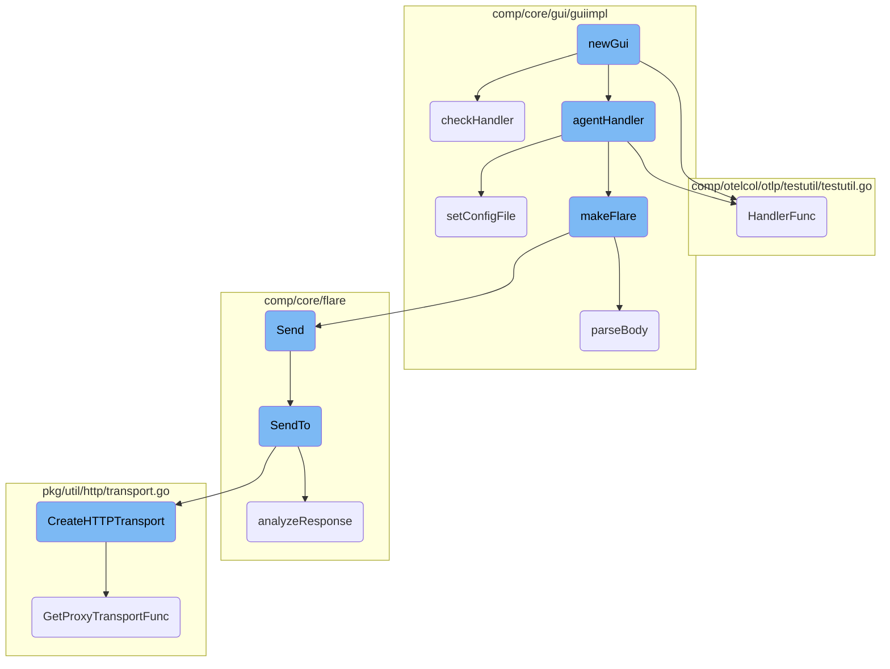
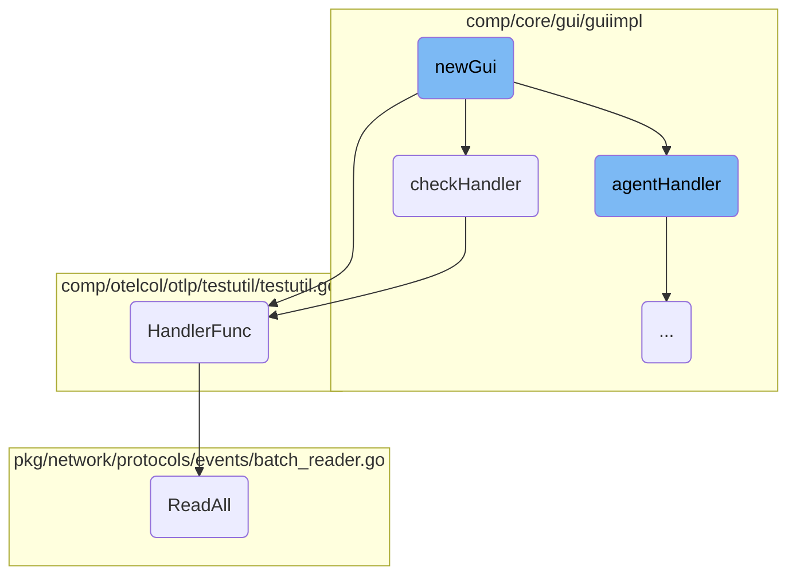
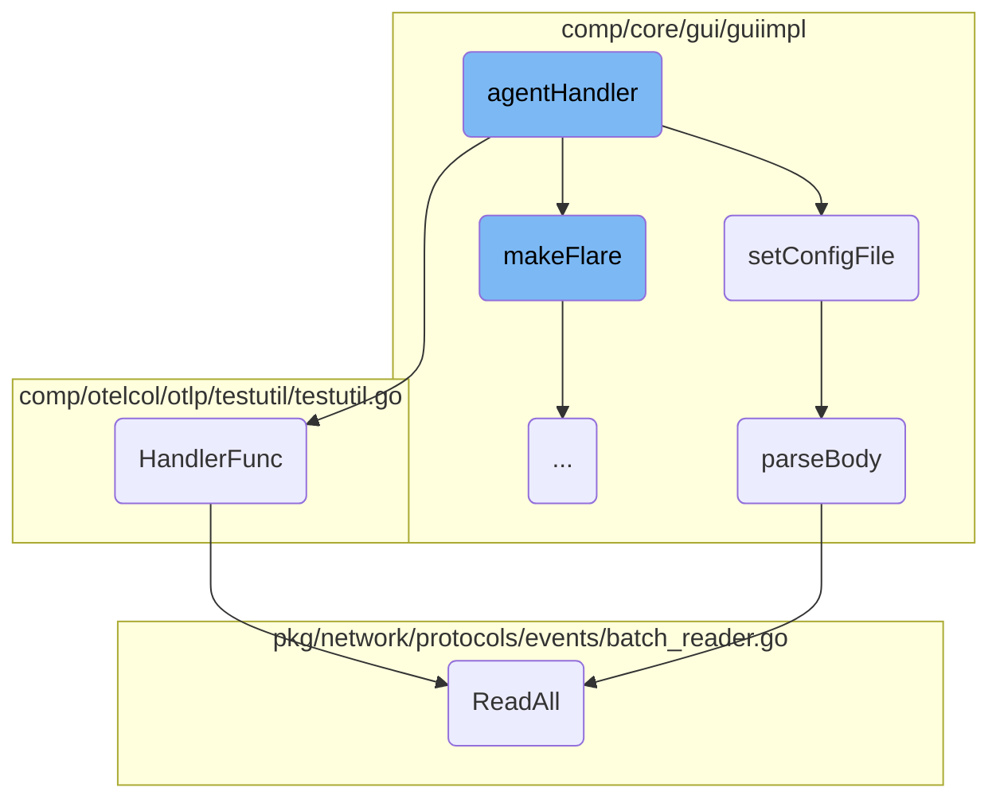
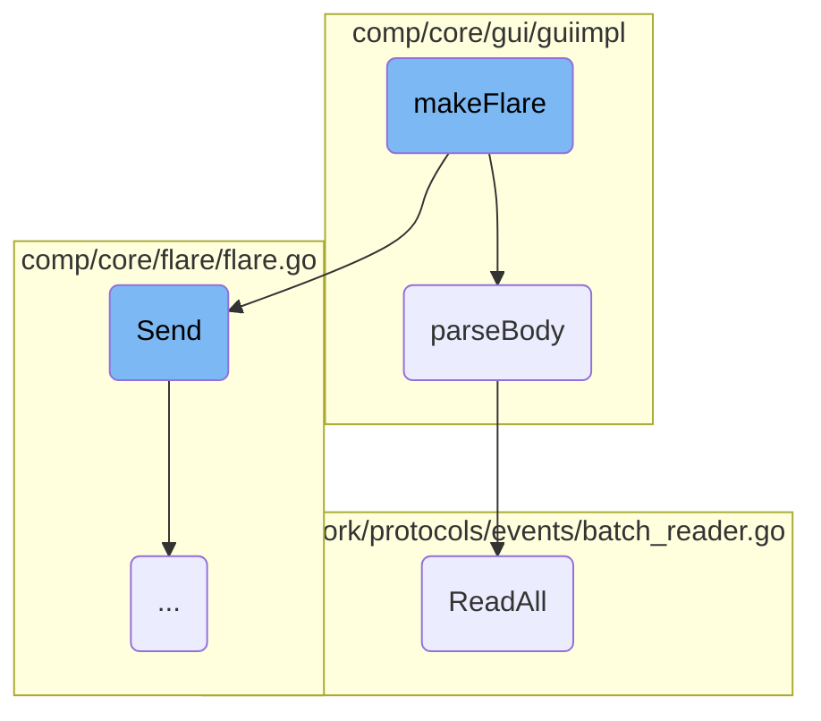
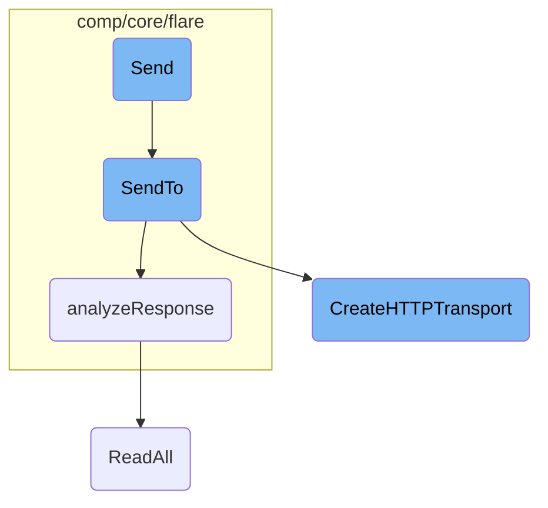

This document explains the <SwmToken path="comp/core/gui/guiimpl/gui.go" pos="96:2:2" line-data="func newGui(deps dependencies) provides {">`newGui`</SwmToken> function, which is responsible for initializing the GUI component, setting up routes, and handling specific endpoints. The function configures the GUI port, sets up public and secured routes, and registers handlers for different endpoints such as root, authentication, and agent routes.

The <SwmToken path="comp/core/gui/guiimpl/gui.go" pos="96:2:2" line-data="func newGui(deps dependencies) provides {">`newGui`</SwmToken> function starts by checking the GUI port configuration. If the port is set to <SwmToken path="comp/core/gui/guiimpl/gui.go" pos="103:8:9" line-data="	if guiPort == &quot;-1&quot; {">`-1`</SwmToken>, it logs a message and does not start the GUI. Otherwise, it initializes the GUI with the specified port and logger. It then sets up a public router for handling routes like the root and authentication. For routes that require authentication, it creates a secured router. The function registers handlers for various endpoints, including <SwmPath>[Dockerfiles/agent/](Dockerfiles/agent/)</SwmPath> and <SwmPath>[cmd/agent/dist/checks/](cmd/agent/dist/checks/)</SwmPath>, which manage operations like running checks and handling configuration files.

Here is a high level diagram of the flow, showing only the most important functions:



# Flow drill down

First, we'll zoom into this section of the flow:



<SwmSnippet path="/comp/core/gui/guiimpl/gui.go" line="96">

---

## Initialization

The <SwmToken path="comp/core/gui/guiimpl/gui.go" pos="96:2:2" line-data="func newGui(deps dependencies) provides {">`newGui`</SwmToken> function initializes the GUI component by setting up the necessary configurations and dependencies. It checks the GUI port configuration and fetches the authentication token required for secure access.

```go
func newGui(deps dependencies) provides {

	p := provides{
		Comp: optional.NewNoneOption[guicomp.Component](),
	}
	guiPort := deps.Config.GetString("GUI_port")

	if guiPort == "-1" {
		deps.Log.Infof("GUI server port -1 specified: not starting the GUI.")
		return p
	}

	g := gui{
		port:         guiPort,
		logger:       deps.Log,
		intentTokens: make(map[string]bool),
	}

	// Instantiate the gorilla/mux publicRouter
	publicRouter := mux.NewRouter()

```

---

</SwmSnippet>

<SwmSnippet path="/comp/core/gui/guiimpl/gui.go" line="128">

---

## Route Handling

The <SwmToken path="comp/core/gui/guiimpl/gui.go" pos="96:2:2" line-data="func newGui(deps dependencies) provides {">`newGui`</SwmToken> function sets up the public and secured routes for the GUI. It registers handlers for different endpoints, including the root, authentication, and agent routes. The <SwmToken path="comp/core/gui/guiimpl/gui.go" pos="139:1:1" line-data="	checkHandler(checkRouter, deps.Collector, deps.Ac)">`checkHandler`</SwmToken> function is specifically used to add handlers for <SwmPath>[cmd/agent/dist/checks/](cmd/agent/dist/checks/)</SwmPath> endpoints.

```go
	publicRouter.HandleFunc("/", renderIndexPage).Methods("GET")
	publicRouter.HandleFunc("/auth", g.getAccessToken).Methods("GET")
	// Mount our filesystem at the view/{path} route
	publicRouter.PathPrefix("/view/").Handler(http.StripPrefix("/view/", http.HandlerFunc(serveAssets)))

	// Create a subrouter to handle routes that needs authentication
	securedRouter := publicRouter.PathPrefix("/").Subrouter()
	// Set up handlers for the API
	agentRouter := securedRouter.PathPrefix("/agent").Subrouter().StrictSlash(true)
	agentHandler(agentRouter, deps.Flare, deps.Status, deps.Config, g.startTimestamp)
	checkRouter := securedRouter.PathPrefix("/checks").Subrouter().StrictSlash(true)
	checkHandler(checkRouter, deps.Collector, deps.Ac)
```

---

</SwmSnippet>

<SwmSnippet path="/comp/core/gui/guiimpl/checks.go" line="49">

---

### Check Handler

The <SwmToken path="comp/core/gui/guiimpl/checks.go" pos="49:2:2" line-data="func checkHandler(r *mux.Router, collector collector.Component, ac autodiscovery.Component) {">`checkHandler`</SwmToken> function adds specific handlers for various <SwmPath>[cmd/agent/dist/checks/](cmd/agent/dist/checks/)</SwmPath> endpoints. These handlers manage operations like running checks, reloading checks, and handling configuration files.

```go
func checkHandler(r *mux.Router, collector collector.Component, ac autodiscovery.Component) {
	r.HandleFunc("/running", http.HandlerFunc(sendRunningChecks)).Methods("POST")
	r.HandleFunc("/run/{name}", http.HandlerFunc(runCheckHandler(collector, ac))).Methods("POST")
	r.HandleFunc("/run/{name}/once", http.HandlerFunc(runCheckOnceHandler(ac))).Methods("POST")
	r.HandleFunc("/reload/{name}", http.HandlerFunc(reloadCheckHandler(collector, ac))).Methods("POST")
	r.HandleFunc("/getConfig/{fileName}", http.HandlerFunc(getCheckConfigFile)).Methods("POST")
	r.HandleFunc("/getConfig/{checkFolder}/{fileName}", http.HandlerFunc(getCheckConfigFile)).Methods("POST")
	r.HandleFunc("/setConfig/{fileName}", http.HandlerFunc(setCheckConfigFile)).Methods("POST")
	r.HandleFunc("/setConfig/{checkFolder}/{fileName}", http.HandlerFunc(setCheckConfigFile)).Methods("POST")
	r.HandleFunc("/setConfig/{fileName}", http.HandlerFunc(setCheckConfigFile)).Methods("DELETE")
	r.HandleFunc("/setConfig/{checkFolder}/{fileName}", http.HandlerFunc(setCheckConfigFile)).Methods("DELETE")
	r.HandleFunc("/listChecks", http.HandlerFunc(listChecks)).Methods("POST")
	r.HandleFunc("/listConfigs", http.HandlerFunc(listConfigs)).Methods("POST")
}
```

---

</SwmSnippet>

<SwmSnippet path="/comp/otelcol/otlp/testutil/testutil.go" line="205">

---

### HTTP Request Recorder

The <SwmToken path="comp/otelcol/otlp/testutil/testutil.go" pos="205:9:9" line-data="func (rec *HTTPRequestRecorder) HandlerFunc() (string, http.HandlerFunc) {">`HandlerFunc`</SwmToken> method in <SwmToken path="comp/otelcol/otlp/testutil/testutil.go" pos="205:6:6" line-data="func (rec *HTTPRequestRecorder) HandlerFunc() (string, http.HandlerFunc) {">`HTTPRequestRecorder`</SwmToken> implements an HTTP handler that records the request headers and body. This is useful for testing and debugging HTTP requests.

```go
func (rec *HTTPRequestRecorder) HandlerFunc() (string, http.HandlerFunc) {
	return rec.Pattern, func(_ http.ResponseWriter, r *http.Request) {
		rec.Header = r.Header
		rec.ByteBody, _ = io.ReadAll(r.Body)
	}
```

---

</SwmSnippet>

<SwmSnippet path="/pkg/network/protocols/events/batch_reader.go" line="60">

---

### Batch Reader

The <SwmToken path="pkg/network/protocols/events/batch_reader.go" pos="60:9:9" line-data="func (r *batchReader) ReadAll(f func(cpu int, b *batch)) {">`ReadAll`</SwmToken> function in <SwmToken path="pkg/network/protocols/events/batch_reader.go" pos="60:6:6" line-data="func (r *batchReader) ReadAll(f func(cpu int, b *batch)) {">`batchReader`</SwmToken> reads batches from <SwmToken path="pkg/network/protocols/events/batch_reader.go" pos="13:14:14" line-data="	&quot;github.com/DataDog/datadog-agent/pkg/ebpf/maps&quot;">`ebpf`</SwmToken> concurrently and executes a callback function for each batch. It manages synchronization and ensures that the batches are processed correctly.

```go
func (r *batchReader) ReadAll(f func(cpu int, b *batch)) {
	// This lock is used only for the purposes of synchronizing termination
	// and it's only held while *enqueing* the jobs.
	r.Lock()
	if r.stopped {
		r.Unlock()
		return
	}

	var wg sync.WaitGroup
	wg.Add(r.numCPUs)

	for i := 0; i < r.numCPUs; i++ {
		cpu := i // required to properly capture this variable in the function closure
		r.workerPool.Do(func() {
			defer wg.Done()
			batchID, key := r.generateBatchKey(cpu)

			b := batchPool.Get()
			defer func() {
				*b = batch{}
```

---

</SwmSnippet>

Now, lets zoom into this section of the flow:



<SwmSnippet path="/comp/core/gui/guiimpl/agent.go" line="34">

---

## Handling agent-specific endpoints

The <SwmToken path="comp/core/gui/guiimpl/agent.go" pos="35:2:2" line-data="func agentHandler(r *mux.Router, flare flare.Component, statusComponent status.Component, config config.Component, startTimestamp int64) {">`agentHandler`</SwmToken> function is responsible for setting up HTTP handlers for various <SwmPath>[Dockerfiles/agent/](Dockerfiles/agent/)</SwmPath> endpoints. These endpoints include actions like pinging the agent, retrieving status and version information, fetching and updating configuration files, and more. Each endpoint is associated with a specific handler function that processes the request and generates the appropriate response.

```go
// Adds the specific handlers for /agent/ endpoints
func agentHandler(r *mux.Router, flare flare.Component, statusComponent status.Component, config config.Component, startTimestamp int64) {
	r.HandleFunc("/ping", func(w http.ResponseWriter, _ *http.Request) { ping(w, startTimestamp) }).Methods("POST")
	r.HandleFunc("/status/{type}", func(w http.ResponseWriter, r *http.Request) { getStatus(w, r, statusComponent) }).Methods("POST")
	r.HandleFunc("/version", http.HandlerFunc(getVersion)).Methods("POST")
	r.HandleFunc("/hostname", http.HandlerFunc(getHostname)).Methods("POST")
	r.HandleFunc("/log/{flip}", func(w http.ResponseWriter, r *http.Request) { getLog(w, r, config) }).Methods("POST")
	r.HandleFunc("/flare", func(w http.ResponseWriter, r *http.Request) { makeFlare(w, r, flare) }).Methods("POST")
	r.HandleFunc("/restart", http.HandlerFunc(restartAgent)).Methods("POST")
	r.HandleFunc("/getConfig", func(w http.ResponseWriter, _ *http.Request) { getConfigFile(w, config) }).Methods("POST")
	r.HandleFunc("/getConfig/{setting}", func(w http.ResponseWriter, r *http.Request) { getConfigSetting(w, r, config) }).Methods("GET")
	r.HandleFunc("/setConfig", func(w http.ResponseWriter, r *http.Request) { setConfigFile(w, r, config) }).Methods("POST")
```

---

</SwmSnippet>

<SwmSnippet path="/comp/core/gui/guiimpl/agent.go" line="216">

---

## Overwriting the main config file

The <SwmToken path="comp/core/gui/guiimpl/agent.go" pos="217:2:2" line-data="func setConfigFile(w http.ResponseWriter, r *http.Request, config configmodel.Reader) {">`setConfigFile`</SwmToken> function handles the <SwmToken path="comp/core/gui/guiimpl/checks.go" pos="56:6:7" line-data="	r.HandleFunc(&quot;/setConfig/{fileName}&quot;, http.HandlerFunc(setCheckConfigFile)).Methods(&quot;POST&quot;)">`/setConfig`</SwmToken> endpoint. It reads the new configuration data from the request body, validates it as a YAML file, and then writes it to the main configuration file (<SwmPath>[pkg/util/scrubber/test/datadog.yaml](pkg/util/scrubber/test/datadog.yaml)</SwmPath>). If any errors occur during this process, appropriate error messages are returned to the client.

```go
// Overwrites the main config file (datadog.yaml) with new data
func setConfigFile(w http.ResponseWriter, r *http.Request, config configmodel.Reader) {
	payload, e := parseBody(r)
	if e != nil {
		w.Write([]byte(e.Error()))
		return
	}
	data := []byte(payload.Config)

	// Check that the data is actually a valid yaml file
	cf := make(map[string]interface{})
	e = yaml.Unmarshal(data, &cf)
	if e != nil {
		w.Write([]byte("Error: " + e.Error()))
		return
	}

	path := config.ConfigFileUsed()
	e = os.WriteFile(path, data, 0644)
	if e != nil {
		w.Write([]byte("Error: " + e.Error()))
```

---

</SwmSnippet>

<SwmSnippet path="/comp/core/gui/guiimpl/gui.go" line="294">

---

### Parsing the request body

The <SwmToken path="comp/core/gui/guiimpl/gui.go" pos="295:2:2" line-data="func parseBody(r *http.Request) (Payload, error) {">`parseBody`</SwmToken> function is a helper that reads and unmarshals the JSON data from the POST request body into a <SwmToken path="comp/core/gui/guiimpl/gui.go" pos="294:22:22" line-data="// Helper function which unmarshals a POST requests data into a Payload object">`Payload`</SwmToken> object. This function is used by <SwmToken path="comp/core/gui/guiimpl/agent.go" pos="45:30:30" line-data="	r.HandleFunc(&quot;/setConfig&quot;, func(w http.ResponseWriter, r *http.Request) { setConfigFile(w, r, config) }).Methods(&quot;POST&quot;)">`setConfigFile`</SwmToken> to extract the new configuration data from the incoming request.

```go
// Helper function which unmarshals a POST requests data into a Payload object
func parseBody(r *http.Request) (Payload, error) {
	var p Payload
	body, e := io.ReadAll(r.Body)
	if e != nil {
		return p, e
	}

	e = json.Unmarshal(body, &p)
	if e != nil {
		return p, e
	}

	return p, nil
}
```

---

</SwmSnippet>

Now, lets zoom into this section of the flow:



<SwmSnippet path="/comp/core/gui/guiimpl/agent.go" line="141">

---

## Validating the Request

The function <SwmToken path="comp/core/gui/guiimpl/agent.go" pos="41:30:30" line-data="	r.HandleFunc(&quot;/flare&quot;, func(w http.ResponseWriter, r *http.Request) { makeFlare(w, r, flare) }).Methods(&quot;POST&quot;)">`makeFlare`</SwmToken> starts by parsing the request body using <SwmToken path="comp/core/gui/guiimpl/agent.go" pos="141:8:8" line-data="	payload, e := parseBody(r)">`parseBody`</SwmToken>. It then validates the parsed payload to ensure that the <SwmToken path="comp/core/gui/guiimpl/agent.go" pos="145:9:9" line-data="	} else if payload.Email == &quot;&quot; || payload.CaseID == &quot;&quot; {">`Email`</SwmToken> and <SwmToken path="comp/core/gui/guiimpl/agent.go" pos="145:20:20" line-data="	} else if payload.Email == &quot;&quot; || payload.CaseID == &quot;&quot; {">`CaseID`</SwmToken> fields are present and that the <SwmToken path="comp/core/gui/guiimpl/agent.go" pos="145:20:20" line-data="	} else if payload.Email == &quot;&quot; || payload.CaseID == &quot;&quot; {">`CaseID`</SwmToken> is a valid number. If any of these checks fail, an appropriate error message is written to the response.

```go
	payload, e := parseBody(r)
	if e != nil {
		w.Write([]byte(e.Error()))
		return
	} else if payload.Email == "" || payload.CaseID == "" {
		w.Write([]byte("Error creating flare: missing information"))
		return
	} else if _, err := strconv.ParseInt(payload.CaseID, 10, 0); err != nil {
		w.Write([]byte("Invalid CaseID (must be a number)"))
		return
	}
```

---

</SwmSnippet>

<SwmSnippet path="/comp/core/gui/guiimpl/agent.go" line="153">

---

## Creating the Flare

After validation, the function attempts to create a flare zip file by calling <SwmToken path="comp/core/gui/guiimpl/agent.go" pos="153:8:10" line-data="	filePath, e := flare.Create(nil, nil)">`flare.Create`</SwmToken>. If an error occurs during this process, an error message is written to the response, and the error is logged.

```go
	filePath, e := flare.Create(nil, nil)
	if e != nil {
		w.Write([]byte("Error creating flare zipfile: " + e.Error()))
		log.Errorf("Error creating flare zipfile: " + e.Error())
		return
```

---

</SwmSnippet>

<SwmSnippet path="/comp/core/gui/guiimpl/agent.go" line="160">

---

## Sending the Flare

If the flare zip file is successfully created, the function proceeds to send the flare using <SwmToken path="comp/core/gui/guiimpl/agent.go" pos="160:8:10" line-data="	res, e := flare.Send(filePath, payload.CaseID, payload.Email, helpers.NewLocalFlareSource())">`flare.Send`</SwmToken>. The result of this operation is then written to the response, and the outcome is logged.

```go
	res, e := flare.Send(filePath, payload.CaseID, payload.Email, helpers.NewLocalFlareSource())
	if e != nil {
		w.Write([]byte("Flare zipfile successfully created: " + filePath + "<br><br>" + e.Error()))
		log.Errorf("Flare zipfile successfully created: " + filePath + "\n" + e.Error())
		return
	}

	w.Write([]byte("Flare zipfile successfully created: " + filePath + "<br><br>" + res))
	log.Errorf("Flare zipfile successfully created: " + filePath + "\n" + res)
}
```

---

</SwmSnippet>

Now, lets zoom into this section of the flow:



<SwmSnippet path="/comp/core/flare/flare.go" line="149">

---

## Sending the Flare Archive

The <SwmToken path="comp/core/flare/flare.go" pos="149:2:2" line-data="// Send sends a flare archive to Datadog">`Send`</SwmToken> function is responsible for sending a flare archive to Datadog. It acts as a wrapper around the <SwmToken path="comp/core/flare/flare.go" pos="153:5:5" line-data="	return helpers.SendTo(f.config, flarePath, caseID, email, f.config.GetString(&quot;api_key&quot;), utils.GetInfraEndpoint(f.config), source)">`SendTo`</SwmToken> function from the helpers package, passing necessary parameters like <SwmToken path="comp/core/flare/flare.go" pos="150:11:11" line-data="func (f *flare) Send(flarePath string, caseID string, email string, source helpers.FlareSource) (string, error) {">`flarePath`</SwmToken>, <SwmToken path="comp/core/flare/flare.go" pos="150:16:16" line-data="func (f *flare) Send(flarePath string, caseID string, email string, source helpers.FlareSource) (string, error) {">`caseID`</SwmToken>, <SwmToken path="comp/core/flare/flare.go" pos="150:21:21" line-data="func (f *flare) Send(flarePath string, caseID string, email string, source helpers.FlareSource) (string, error) {">`email`</SwmToken>, and <SwmToken path="comp/core/flare/flare.go" pos="150:26:26" line-data="func (f *flare) Send(flarePath string, caseID string, email string, source helpers.FlareSource) (string, error) {">`source`</SwmToken>.

```go
// Send sends a flare archive to Datadog
func (f *flare) Send(flarePath string, caseID string, email string, source helpers.FlareSource) (string, error) {
	// For now this is a wrapper around helpers.SendFlare since some code hasn't migrated to FX yet.
	// The `source` is the reason why the flare was created, for now it's either local or remote-config
	return helpers.SendTo(f.config, flarePath, caseID, email, f.config.GetString("api_key"), utils.GetInfraEndpoint(f.config), source)
```

---

</SwmSnippet>

<SwmSnippet path="/comp/core/flare/helpers/send_flare.go" line="227">

---

## Sending to Backend

The <SwmToken path="comp/core/flare/helpers/send_flare.go" pos="227:2:2" line-data="// SendTo sends a flare file to the backend. This is part of the &quot;helpers&quot; package while all the code is moved to">`SendTo`</SwmToken> function handles the actual sending of the flare file to the backend. It prepares the HTTP client, constructs the URL, and posts the flare file. It also handles errors and responses from the server.

```go
// SendTo sends a flare file to the backend. This is part of the "helpers" package while all the code is moved to
// components. When possible use the "Send" method of the "flare" component instead.
func SendTo(cfg pkgconfigmodel.Reader, archivePath, caseID, email, apiKey, url string, source FlareSource) (string, error) {
	hostname, err := hostnameUtil.Get(context.TODO())
	if err != nil {
		hostname = "unknown"
	}

	apiKey = configUtils.SanitizeAPIKey(apiKey)
	baseURL, _ := configUtils.AddAgentVersionToDomain(url, "flare")

	transport := httputils.CreateHTTPTransport(cfg)
	client := &http.Client{
		Transport: transport,
		Timeout:   httpTimeout,
	}

	url = mkURL(baseURL, caseID)

	url, err = resolveFlarePOSTURL(url, client, apiKey)
	if err != nil {
```

---

</SwmSnippet>

<SwmSnippet path="/comp/core/flare/helpers/send_flare.go" line="144">

---

### Analyzing the Response

The <SwmToken path="comp/core/flare/helpers/send_flare.go" pos="144:2:2" line-data="func analyzeResponse(r *http.Response, apiKey string) (string, error) {">`analyzeResponse`</SwmToken> function processes the HTTP response from the server. It checks for errors, deserializes the response body, and returns a user-friendly message based on the server's response.

```go
func analyzeResponse(r *http.Response, apiKey string) (string, error) {
	if r.StatusCode == http.StatusForbidden {
		var errStr string

		if len(apiKey) == 0 {
			errStr = "API key is missing"
		} else {
			if len(apiKey) > 5 {
				apiKey = apiKey[len(apiKey)-5:]
			}
			errStr = fmt.Sprintf("Make sure your API key is valid. API Key ending with: %v", apiKey)
		}

		return "", fmt.Errorf("HTTP 403 Forbidden: %s", errStr)
	}

	res := flareResponse{}

	var err error
	b, _ := io.ReadAll(r.Body)
	if r.StatusCode != http.StatusOK {
```

---

</SwmSnippet>

<SwmSnippet path="/pkg/util/http/transport.go" line="63">

---

## Creating HTTP Transport

The <SwmToken path="pkg/util/http/transport.go" pos="63:2:2" line-data="// CreateHTTPTransport creates an *http.Transport for use in the agent">`CreateHTTPTransport`</SwmToken> function creates an HTTP transport configuration for the agent. It sets up TLS configurations, timeouts, and proxy settings to ensure secure and efficient communication with the backend.

```go
// CreateHTTPTransport creates an *http.Transport for use in the agent
func CreateHTTPTransport(cfg pkgconfigmodel.Reader) *http.Transport {
	// It’s OK to reuse the same file for all the http.Transport objects we create
	// because all the writes to that file are protected by a global mutex.
	// See https://github.com/golang/go/blob/go1.17.3/src/crypto/tls/common.go#L1316-L1318
	keyLogWriterInit.Do(func() {
		sslKeyLogFile := cfg.GetString("sslkeylogfile")
		if sslKeyLogFile != "" {
			var err error
			keyLogWriter, err = os.OpenFile(sslKeyLogFile, os.O_WRONLY|os.O_CREATE|os.O_APPEND, 0600)
			if err != nil {
				log.Warnf("Failed to open %s for writing NSS keys: %v", sslKeyLogFile, err)
			}
		}
	})

	tlsConfig := &tls.Config{
		KeyLogWriter:       keyLogWriter,
		InsecureSkipVerify: cfg.GetBool("skip_ssl_validation"),
	}

```

---

</SwmSnippet>

&nbsp;

*This is an auto-generated document by Swimm AI 🌊 and has not yet been verified by a human*

<SwmMeta version="3.0.0" repo-id="Z2l0aHViJTNBJTNBZGF0YWRvZy1hZ2VudCUzQSUzQVN3aW1tLURlbW8=" repo-name="datadog-agent"><sup>Powered by [Swimm](/)</sup></SwmMeta>
