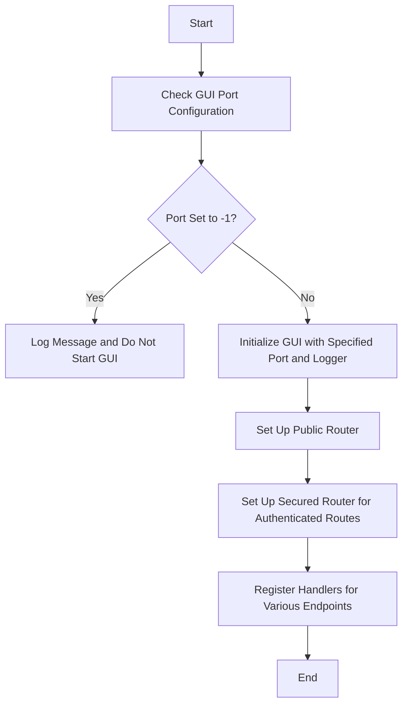

This document will cover the Initialization and Routing in newGui, which includes:

1. Initializing the GUI component
2. Setting up routes
3. Handling specific endpoints.

Technical document: <SwmLink doc-title="Initialization and Routing in newGui">[Initialization and Routing in newGui](/.swm/initialization-and-routing-in-newgui.1ctgkmwx.sw.md)</SwmLink>

# [Initializing the GUI Component](https://app.swimm.io/repos/Z2l0aHViJTNBJTNBZGF0YWRvZy1hZ2VudCUzQSUzQVN3aW1tLURlbW8=/docs/1ctgkmwx#initialization)

The initialization process begins by checking the GUI port configuration. If the port is set to -1, a message is logged, and the GUI does not start. This ensures that the GUI is only started when a valid port is specified. If a valid port is provided, the GUI is initialized with the specified port and logger. This step is crucial for setting up the GUI environment correctly.

# [Setting Up Routes](https://app.swimm.io/repos/Z2l0aHViJTNBJTNBZGF0YWRvZy1hZ2VudCUzQSUzQVN3aW1tLURlbW8=/docs/1ctgkmwx#route-handling)

Once the GUI is initialized, the next step is to set up the routes. A public router is created to handle routes that do not require authentication, such as the root and authentication routes. For routes that require authentication, a secured router is created. This separation ensures that sensitive operations are protected and only accessible to authenticated users.

# [Handling Specific Endpoints](https://app.swimm.io/repos/Z2l0aHViJTNBJTNBZGF0YWRvZy1hZ2VudCUzQSUzQVN3aW1tLURlbW8=/docs/1ctgkmwx#check-handler)

The function registers handlers for various endpoints, including <SwmPath>[Dockerfiles/agent/](Dockerfiles/agent/)</SwmPath> and <SwmPath>[cmd/agent/dist/checks/](cmd/agent/dist/checks/)</SwmPath>. These handlers manage operations like running checks, reloading checks, and handling configuration files. For example, the <SwmPath>[cmd/agent/dist/checks/](cmd/agent/dist/checks/)</SwmPath> endpoints allow users to run specific checks, reload them, and manage their configurations. This functionality is essential for maintaining and monitoring the system's health and performance.

# [Handling Agent-Specific Endpoints](https://app.swimm.io/repos/Z2l0aHViJTNBJTNBZGF0YWRvZy1hZ2VudCUzQSUzQVN3aW1tLURlbW8=/docs/1ctgkmwx#handling-agent-specific-endpoints)

The `agentHandler` function sets up HTTP handlers for various <SwmPath>[Dockerfiles/agent/](Dockerfiles/agent/)</SwmPath> endpoints. These endpoints include actions like pinging the agent, retrieving status and version information, fetching and updating configuration files, and more. Each endpoint is associated with a specific handler function that processes the request and generates the appropriate response. This setup allows users to interact with the agent and perform necessary operations efficiently.

# [Overwriting the Main Config File](https://app.swimm.io/repos/Z2l0aHViJTNBJTNBZGF0YWRvZy1hZ2VudCUzQSUzQVN3aW1tLURlbW8=/docs/1ctgkmwx#overwriting-the-main-config-file)

The `setConfigFile` function handles the `/setConfig` endpoint. It reads the new configuration data from the request body, validates it as a YAML file, and then writes it to the main configuration file (<SwmPath>[pkg/util/scrubber/test/datadog.yaml](pkg/util/scrubber/test/datadog.yaml)</SwmPath>). If any errors occur during this process, appropriate error messages are returned to the client. This functionality allows users to update the configuration settings dynamically.

&nbsp;

*This is an auto-generated document by Swimm AI 🌊 and has not yet been verified by a human*

<SwmMeta version="3.0.0" repo-id="Z2l0aHViJTNBJTNBZGF0YWRvZy1hZ2VudCUzQSUzQVN3aW1tLURlbW8=" repo-name="datadog-agent">Powered by [Swimm](/)</SwmMeta>
