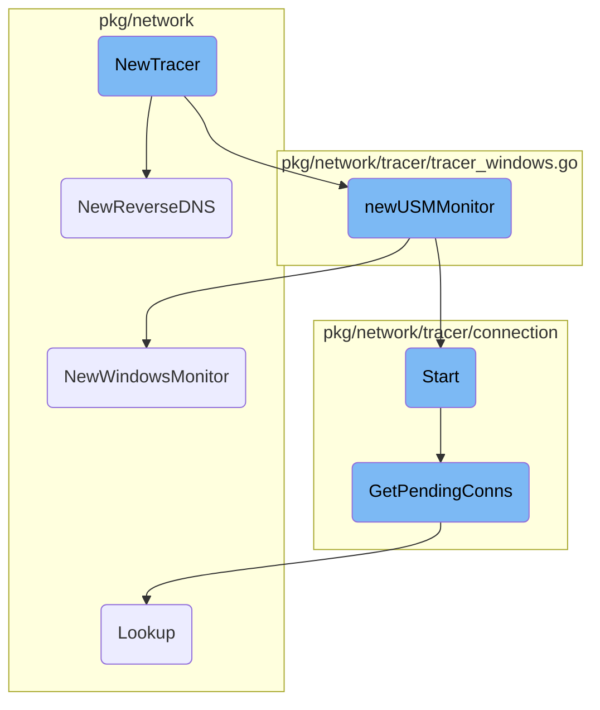
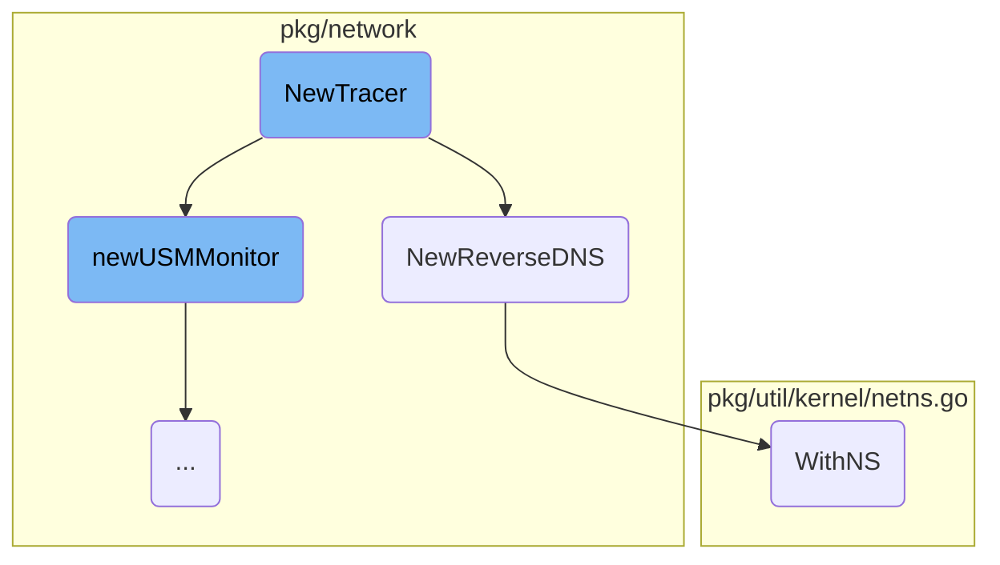
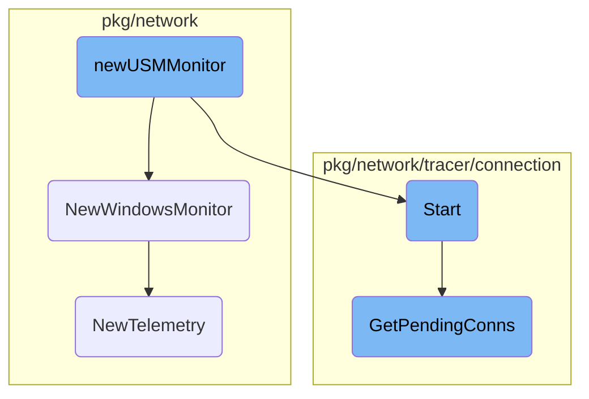

This document explains the initialization and setup process of the <SwmToken path="pkg/network/tracer/tracer_windows.go" pos="64:2:2" line-data="// NewTracer returns an initialized tracer struct">`NewTracer`</SwmToken>. It covers the steps involved in starting the driver, setting up DNS monitoring, and configuring various components necessary for network tracing.

The process starts by initializing the <SwmToken path="pkg/network/tracer/tracer_windows.go" pos="64:2:2" line-data="// NewTracer returns an initialized tracer struct">`NewTracer`</SwmToken>, which involves starting the driver and creating a driver interface. If DNS inspection is enabled, it sets up DNS monitoring. The tracer then configures various settings and starts a background process to handle closed connection events. The flow continues with setting up a Universal Service Monitor (USM) if HTTP or Native TLS monitoring is enabled. Finally, the tracer starts monitoring connections and retrieves pending connections for processing.

Here is a high level diagram of the flow, showing only the most important functions:



# Flow drill down

First, we'll zoom into this section of the flow:



<SwmSnippet path="/pkg/network/tracer/tracer_windows.go" line="64">

---

## <SwmToken path="pkg/network/tracer/tracer_windows.go" pos="64:2:2" line-data="// NewTracer returns an initialized tracer struct">`NewTracer`</SwmToken> Initialization

The <SwmToken path="pkg/network/tracer/tracer_windows.go" pos="64:2:2" line-data="// NewTracer returns an initialized tracer struct">`NewTracer`</SwmToken> function initializes a new tracer instance. It starts by attempting to start the driver and create a driver interface. If DNS inspection is enabled, it initializes the reverse DNS functionality. It also sets up various configurations and starts a goroutine to handle closed connection events.

```go
// NewTracer returns an initialized tracer struct
func NewTracer(config *config.Config, telemetry telemetry.Component) (*Tracer, error) {
	if err := driver.Start(); err != nil {
		return nil, fmt.Errorf("error starting driver: %s", err)
	}
	di, err := network.NewDriverInterface(config, driver.NewHandle, telemetry)

	if err != nil && errors.Is(err, syscall.ERROR_FILE_NOT_FOUND) {
		log.Debugf("could not create driver interface: %v", err)
		return nil, fmt.Errorf("The Windows driver was not installed, reinstall the Datadog Agent with network performance monitoring enabled")
	} else if err != nil {
		return nil, fmt.Errorf("could not create windows driver controller: %v", err)
	}

	state := network.NewState(
		telemetry,
		config.ClientStateExpiry,
		config.MaxClosedConnectionsBuffered,
		config.MaxConnectionsStateBuffered,
		config.MaxDNSStatsBuffered,
		config.MaxHTTPStatsBuffered,
```

---

</SwmSnippet>

<SwmSnippet path="/pkg/network/dns/monitor_linux.go" line="34">

---

## <SwmToken path="pkg/network/dns/monitor_linux.go" pos="34:2:2" line-data="// NewReverseDNS starts snooping on DNS traffic to allow IP -&gt; domain reverse resolution">`NewReverseDNS`</SwmToken> Setup

The <SwmToken path="pkg/network/dns/monitor_linux.go" pos="34:2:2" line-data="// NewReverseDNS starts snooping on DNS traffic to allow IP -&gt; domain reverse resolution">`NewReverseDNS`</SwmToken> function sets up DNS monitoring by determining the kernel version and initializing either a BPF filter or an <SwmToken path="pkg/network/tracer/tracer_windows.go" pos="23:14:14" line-data="	&quot;github.com/DataDog/datadog-agent/pkg/ebpf&quot;">`ebpf`</SwmToken> program based on the kernel version. It then creates a raw socket in the root network namespace and initializes a packet source for DNS snooping.

```go
// NewReverseDNS starts snooping on DNS traffic to allow IP -> domain reverse resolution
func NewReverseDNS(cfg *config.Config, _ telemetry.Component) (ReverseDNS, error) {
	currKernelVersion, err := kernel.HostVersion()
	if err != nil {
		// if the platform couldn't be determined, treat it as new kernel case
		log.Warn("could not detect the platform, will use kprobes from kernel version >= 4.1.0")
		currKernelVersion = math.MaxUint32
	}
	pre410Kernel := currKernelVersion < kernel.VersionCode(4, 1, 0)

	var p *ebpfProgram
	var filter *manager.Probe
	var bpfFilter []bpf.RawInstruction
	if pre410Kernel {
		bpfFilter, err = generateBPFFilter(cfg)
		if err != nil {
			return nil, fmt.Errorf("error creating bpf classic filter: %w", err)
		}
	} else {
		p, err = newEBPFProgram(cfg)
		if err != nil {
```

---

</SwmSnippet>

<SwmSnippet path="/pkg/util/kernel/netns.go" line="37">

---

### Executing in Network Namespace

The <SwmToken path="pkg/util/kernel/netns.go" pos="37:2:2" line-data="// WithNS executes the given function in the given network namespace, and then">`WithNS`</SwmToken> function executes a given function within a specified network namespace and then switches back to the previous namespace. This is crucial for setting up the packet source in the correct network namespace during the <SwmToken path="pkg/network/dns/monitor_linux.go" pos="34:2:2" line-data="// NewReverseDNS starts snooping on DNS traffic to allow IP -&gt; domain reverse resolution">`NewReverseDNS`</SwmToken> setup.

```go
// WithNS executes the given function in the given network namespace, and then
// switches back to the previous namespace.
func WithNS(ns netns.NsHandle, fn func() error) error {
	if ns == netns.None() {
		return fn()
	}

	runtime.LockOSThread()
	defer runtime.UnlockOSThread()

	prevNS, err := netns.Get()
	if err != nil {
		return err
	}
	defer prevNS.Close()

	if ns.Equal(prevNS) {
		return fn()
	}

	if err := netns.Set(ns); err != nil {
```

---

</SwmSnippet>

Now, lets zoom into this section of the flow:



<SwmSnippet path="/pkg/network/tracer/tracer_windows.go" line="282">

---

## <SwmToken path="pkg/network/tracer/tracer_windows.go" pos="282:2:2" line-data="func newUSMMonitor(c *config.Config, dh driver.Handle) usm.Monitor {">`newUSMMonitor`</SwmToken> Initialization

The <SwmToken path="pkg/network/tracer/tracer_windows.go" pos="282:2:2" line-data="func newUSMMonitor(c *config.Config, dh driver.Handle) usm.Monitor {">`newUSMMonitor`</SwmToken> function initializes a new USM (Universal Service Monitor) monitor. It first checks if HTTP and Native TLS monitoring are enabled in the configuration. If neither is enabled, it returns nil. If monitoring is enabled, it proceeds to create a new Windows monitor using the <SwmToken path="pkg/network/tracer/tracer_windows.go" pos="291:10:10" line-data="	monitor, err = usm.NewWindowsMonitor(c, dh)">`NewWindowsMonitor`</SwmToken> function and starts it.

```go
func newUSMMonitor(c *config.Config, dh driver.Handle) usm.Monitor {
	if !c.EnableHTTPMonitoring && !c.EnableNativeTLSMonitoring {
		return nil
	}
	log.Infof("http monitoring has been enabled")

	var monitor usm.Monitor
	var err error

	monitor, err = usm.NewWindowsMonitor(c, dh)

	if err != nil {
		log.Errorf("could not instantiate http monitor: %s", err)
		return nil
	}
	monitor.Start()
	return monitor
}
```

---

</SwmSnippet>

<SwmSnippet path="/pkg/network/usm/monitor_windows.go" line="40">

---

## <SwmToken path="pkg/network/usm/monitor_windows.go" pos="40:2:2" line-data="// NewWindowsMonitor returns a new WindowsMonitor instance">`NewWindowsMonitor`</SwmToken> Setup

The <SwmToken path="pkg/network/usm/monitor_windows.go" pos="40:2:2" line-data="// NewWindowsMonitor returns a new WindowsMonitor instance">`NewWindowsMonitor`</SwmToken> function sets up the Windows monitor by creating driver and ETW interfaces for HTTP monitoring. It configures the maximum number of tracked connections and request bytes, and sets the protocols to be captured. It also initializes telemetry for HTTP and returns a new <SwmToken path="pkg/network/usm/monitor_windows.go" pos="40:10:10" line-data="// NewWindowsMonitor returns a new WindowsMonitor instance">`WindowsMonitor`</SwmToken> instance.

```go
// NewWindowsMonitor returns a new WindowsMonitor instance
func NewWindowsMonitor(c *config.Config, dh driver.Handle) (Monitor, error) {
	di, err := http.NewDriverInterface(c, dh)
	if err != nil {
		return nil, err
	}
	hei, err := http.NewEtwInterface(c)
	if err != nil {
		return nil, err
	}

	hei.SetMaxFlows(uint64(c.MaxTrackedConnections))
	hei.SetMaxRequestBytes(uint64(c.HTTPMaxRequestFragment))
	hei.SetCapturedProtocols(c.EnableHTTPMonitoring, c.EnableNativeTLSMonitoring)

	telemetry := http.NewTelemetry("http")

	return &WindowsMonitor{
		di:         di,
		hei:        hei,
		telemetry:  telemetry,
```

---

</SwmSnippet>

<SwmSnippet path="/pkg/network/tracer/connection/tcp_close_consumer.go" line="91">

---

## Start Monitoring

The <SwmToken path="pkg/network/tracer/connection/tcp_close_consumer.go" pos="91:9:9" line-data="func (c *tcpCloseConsumer) Start(callback func([]network.ConnectionStats)) {">`Start`</SwmToken> method in the <SwmToken path="pkg/network/tracer/connection/tcp_close_consumer.go" pos="91:6:6" line-data="func (c *tcpCloseConsumer) Start(callback func([]network.ConnectionStats)) {">`tcpCloseConsumer`</SwmToken> struct begins the monitoring process. It registers a health check and starts a goroutine to handle incoming data and lost events from the event handler's channels. It processes the data, extracts connection information, and invokes the provided callback with the connection stats.

```go
func (c *tcpCloseConsumer) Start(callback func([]network.ConnectionStats)) {
	if c == nil {
		return
	}
	health := health.RegisterLiveness("network-tracer")

	var (
		then             = time.Now()
		closedCount      uint64
		lostSamplesCount uint64
	)

	go func() {
		defer func() {
			err := health.Deregister()
			if err != nil {
				log.Warnf("error de-registering health check: %s", err)
			}
		}()

		dataChannel := c.eventHandler.DataChannel()
```

---

</SwmSnippet>

<SwmSnippet path="/pkg/network/tracer/connection/perf_batching.go" line="93">

---

## Get Pending Connections

The <SwmToken path="pkg/network/tracer/connection/perf_batching.go" pos="93:2:2" line-data="// GetPendingConns return all connections that are in batches that are not yet full.">`GetPendingConns`</SwmToken> method retrieves all connections that are in batches but not yet full. It ensures that connections are not double-processed by tracking processed connections by batch ID. It extracts the connections into the provided buffer and cleans up expired state.

```go
// GetPendingConns return all connections that are in batches that are not yet full.
// It tracks which connections have been processed by this call, by batch id.
// This prevents double-processing of connections between GetPendingConns and Extract.
func (p *perfBatchManager) GetPendingConns(buffer *network.ConnectionBuffer) {
	b := new(netebpf.Batch)
	for cpu := uint32(0); cpu < uint32(len(p.stateByCPU)); cpu++ {
		cpuState := &p.stateByCPU[cpu]

		err := p.batchMap.Lookup(&cpu, b)
		if err != nil {
			continue
		}

		batchLen := b.Len
		if batchLen == 0 {
			continue
		}

		// have we already processed these messages?
		start := uint16(0)
		batchID := b.Id
```

---

</SwmSnippet>

<SwmSnippet path="/pkg/network/protocols/kafka/telemetry.go" line="23">

---

## New Telemetry

The <SwmToken path="pkg/network/protocols/kafka/telemetry.go" pos="23:2:2" line-data="// NewTelemetry creates a new Telemetry">`NewTelemetry`</SwmToken> function creates a new telemetry instance for Kafka. It initializes a metric group and counters for tracking produce and fetch hits, as well as dropped messages.

```go
// NewTelemetry creates a new Telemetry
func NewTelemetry() *Telemetry {
	metricGroup := libtelemetry.NewMetricGroup("usm.kafka")

	return &Telemetry{
		metricGroup: metricGroup,
		produceHits: newAPIVersionCounter(metricGroup, "total_hits", "operation:produce", libtelemetry.OptStatsd),
		fetchHits:   newAPIVersionCounter(metricGroup, "total_hits", "operation:fetch", libtelemetry.OptStatsd),
		dropped:     metricGroup.NewCounter("dropped", libtelemetry.OptStatsd),
	}
}
```

---

</SwmSnippet>

&nbsp;

*This is an auto-generated document by Swimm AI 🌊 and has not yet been verified by a human*

<SwmMeta version="3.0.0" repo-id="Z2l0aHViJTNBJTNBZGF0YWRvZy1hZ2VudCUzQSUzQVN3aW1tLURlbW8=" repo-name="datadog-agent"><sup>Powered by [Swimm](/)</sup></SwmMeta>
