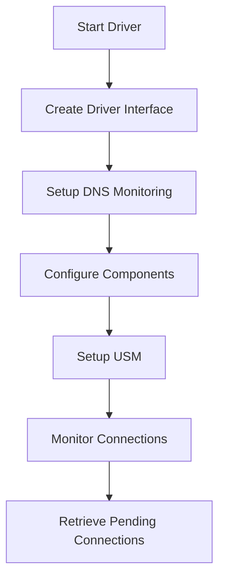

This document will cover the initialization and setup process of the NewTracer, which includes:

1. Starting the driver and creating a driver interface
2. Setting up DNS monitoring
3. Configuring various components for network tracing
4. Setting up a Universal Service Monitor (USM)
5. Monitoring connections and retrieving pending connections.

Technical document: <SwmLink doc-title="Initialization and Setup of NewTracer">[Initialization and Setup of NewTracer](/.swm/initialization-and-setup-of-newtracer.pj1s3pvb.sw.md)</SwmLink>

# [Starting the Driver and Creating a Driver Interface](https://app.swimm.io/repos/Z2l0aHViJTNBJTNBZGF0YWRvZy1hZ2VudCUzQSUzQVN3aW1tLURlbW8=/docs/pj1s3pvb#newtracer-initialization)

The initialization of the NewTracer begins with starting the driver. This step is essential as it enables the tracer to interact with the underlying network stack. Following this, a driver interface is created, which acts as a bridge between the tracer and the network driver. This interface is crucial for capturing network events and data.

# [Setting Up DNS Monitoring](https://app.swimm.io/repos/Z2l0aHViJTNBJTNBZGF0YWRvZy1hZ2VudCUzQSUzQVN3aW1tLURlbW8=/docs/pj1s3pvb#newreversedns-setup)

If DNS inspection is enabled, the next step involves setting up DNS monitoring. This process includes determining the kernel version and initializing the appropriate monitoring tools based on the kernel version. DNS monitoring allows the tracer to resolve IP addresses to domain names, providing more meaningful data for analysis.

# [Configuring Various Components for Network Tracing](https://app.swimm.io/repos/Z2l0aHViJTNBJTNBZGF0YWRvZy1hZ2VudCUzQSUzQVN3aW1tLURlbW8=/docs/pj1s3pvb#newtracer-initialization)

The tracer then configures various settings necessary for network tracing. This includes setting up state management for tracking connections, DNS statistics, and HTTP statistics. Additionally, a background process is started to handle closed connection events, ensuring that all network activities are monitored and recorded.

# [Setting Up a Universal Service Monitor (USM)](https://app.swimm.io/repos/Z2l0aHViJTNBJTNBZGF0YWRvZy1hZ2VudCUzQSUzQVN3aW1tLURlbW8=/docs/pj1s3pvb#newusmmonitor-initialization)

If HTTP or Native TLS monitoring is enabled, a Universal Service Monitor (USM) is set up. This involves creating a new Windows monitor that tracks HTTP and TLS connections. The monitor is configured to capture specific protocols and track the maximum number of connections and request bytes. This setup is vital for comprehensive monitoring of web traffic.

# [Monitoring Connections and Retrieving Pending Connections](https://app.swimm.io/repos/Z2l0aHViJTNBJTNBZGF0YWRvZy1hZ2VudCUzQSUzQVN3aW1tLURlbW8=/docs/pj1s3pvb#start-monitoring)

Finally, the tracer starts monitoring network connections. It registers a health check and begins processing incoming data and lost events. The tracer retrieves pending connections that are in batches but not yet full, ensuring that no connections are double-processed. This step is crucial for maintaining accurate and up-to-date network statistics.

&nbsp;

*This is an auto-generated document by Swimm AI 🌊 and has not yet been verified by a human*

<SwmMeta version="3.0.0" repo-id="Z2l0aHViJTNBJTNBZGF0YWRvZy1hZ2VudCUzQSUzQVN3aW1tLURlbW8=" repo-name="datadog-agent">Powered by [Swimm](/)</SwmMeta>
