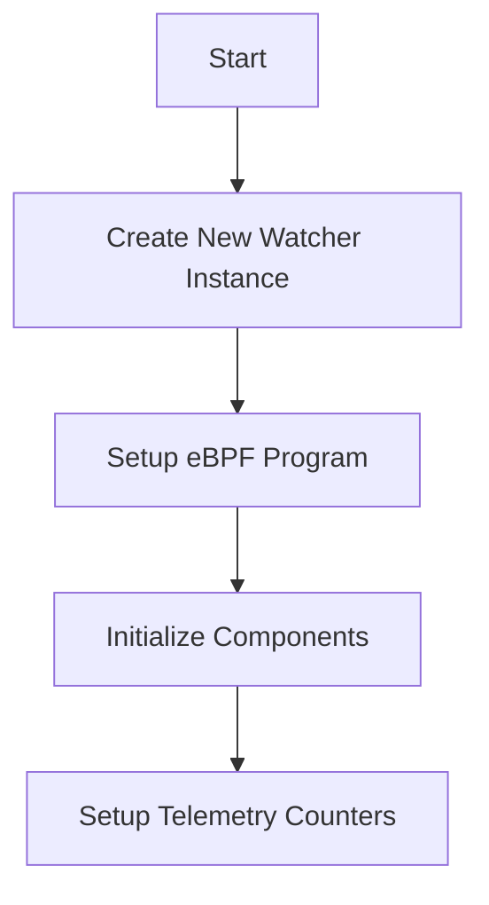

This document will cover the initialization and setup process of the NewWatcher feature, which includes:

1. Creating a new Watcher instance
2. Setting up the eBPF program
3. Initializing various components and telemetry counters.

Technical document: <SwmLink doc-title="Initialization and Setup of NewWatcher">[Initialization and Setup of NewWatcher](/.swm/initialization-and-setup-of-newwatcher.uoudxts3.sw.md)</SwmLink>

# [Creating a New Watcher Instance](https://app.swimm.io/repos/Z2l0aHViJTNBJTNBZGF0YWRvZy1hZ2VudCUzQSUzQVN3aW1tLURlbW8=/docs/uoudxts3#initialization)

The process begins by creating a new Watcher instance. This instance is responsible for monitoring and managing various components within the system. The Watcher instance is initialized with several key elements, including synchronization mechanisms, channels for communication, and a registry for managing files. This setup ensures that the Watcher can effectively monitor and manage the system's components.

# [Setting Up the eBPF Program](https://app.swimm.io/repos/Z2l0aHViJTNBJTNBZGF0YWRvZy1hZ2VudCUzQSUzQVN3aW1tLURlbW8=/docs/uoudxts3#ebpf-program-initialization)

The eBPF program is a critical component that allows for efficient monitoring and data collection within the system. During the setup process, the eBPF program is initialized and configured based on the system's requirements. If any errors occur during this process, they are handled appropriately to ensure the system remains stable. The eBPF program's initialization includes setting up various monitoring rules and handlers to capture relevant data.

# [Initializing Components](https://app.swimm.io/repos/Z2l0aHViJTNBJTNBZGF0YWRvZy1hZ2VudCUzQSUzQVN3aW1tLURlbW8=/docs/uoudxts3#initialization)

Several components are initialized as part of the Watcher setup. These components include synchronization mechanisms like WaitGroups, communication channels, and process monitors. Each component plays a vital role in ensuring the Watcher can effectively manage and monitor the system. For example, the process monitor tracks the state of various processes, while the communication channels facilitate data exchange between different parts of the system.

# [Setting Up Telemetry Counters](https://app.swimm.io/repos/Z2l0aHViJTNBJTNBZGF0YWRvZy1hZ2VudCUzQSUzQVN3aW1tLURlbW8=/docs/uoudxts3#counter-initialization)

Telemetry counters are essential for tracking various metrics within the system. During the setup process, several telemetry counters are initialized to monitor specific events and states. These counters provide valuable insights into the system's performance and help identify potential issues. For instance, counters may track the number of times a particular event occurs or the state of specific components. This data is crucial for maintaining the system's health and optimizing its performance.

&nbsp;

*This is an auto-generated document by Swimm AI 🌊 and has not yet been verified by a human*

<SwmMeta version="3.0.0" repo-id="Z2l0aHViJTNBJTNBZGF0YWRvZy1hZ2VudCUzQSUzQVN3aW1tLURlbW8=" repo-name="datadog-agent">Powered by [Swimm](/)</SwmMeta>
