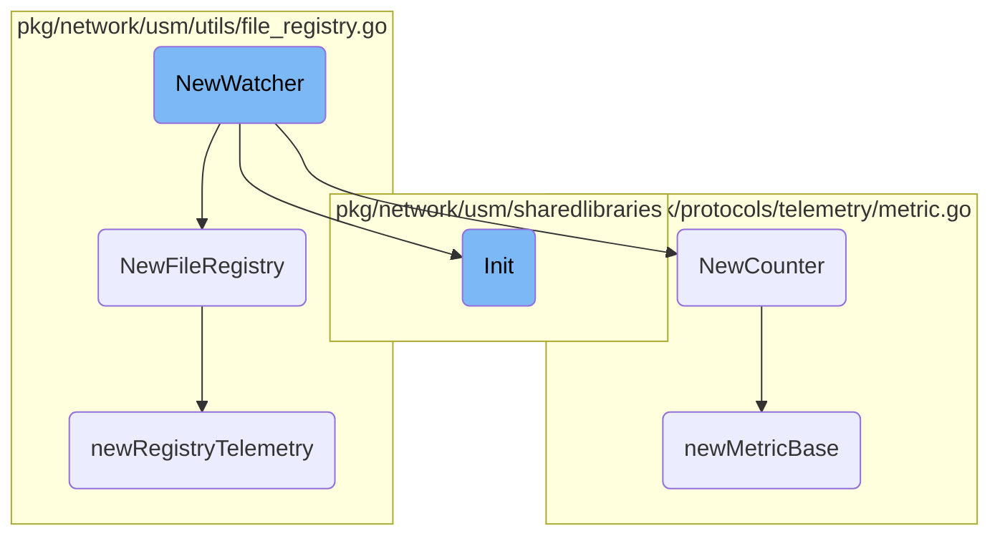
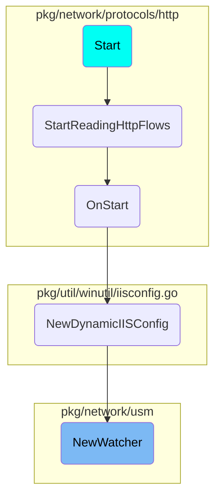

This document explains the initialization and setup process of the <SwmToken path="pkg/network/usm/sharedlibraries/watcher.go" pos="69:2:2" line-data="// NewWatcher creates a new Watcher instance">`NewWatcher`</SwmToken> function. It covers the creation of a new Watcher instance, the setup of the <SwmToken path="pkg/network/usm/sharedlibraries/watcher.go" pos="20:16:16" line-data="	ddebpf &quot;github.com/DataDog/datadog-agent/pkg/ebpf&quot;">`ebpf`</SwmToken> program, and the initialization of various components and telemetry counters.

The <SwmToken path="pkg/network/usm/sharedlibraries/watcher.go" pos="69:2:2" line-data="// NewWatcher creates a new Watcher instance">`NewWatcher`</SwmToken> function starts by creating a new Watcher instance. It sets up an <SwmToken path="pkg/network/usm/sharedlibraries/watcher.go" pos="20:16:16" line-data="	ddebpf &quot;github.com/DataDog/datadog-agent/pkg/ebpf&quot;">`ebpf`</SwmToken> program and initializes it. If any errors occur during this process, they are handled appropriately. The function then sets up several components such as synchronization mechanisms, channels, and monitors. It also initializes telemetry counters to track various metrics. Additionally, the function creates a new <SwmToken path="pkg/network/usm/utils/file_registry.go" pos="83:11:11" line-data="// NewFileRegistry creates a new `FileRegistry` instance">`FileRegistry`</SwmToken> instance, which manages file registrations and sets up telemetry for the registry. Finally, the function initializes a new Counter metric to track specific events.

# Flow drill down



<SwmSnippet path="/pkg/network/usm/sharedlibraries/watcher.go" line="69">

---

## Initialization

The <SwmToken path="pkg/network/usm/sharedlibraries/watcher.go" pos="69:2:2" line-data="// NewWatcher creates a new Watcher instance">`NewWatcher`</SwmToken> function initializes a new Watcher instance. It sets up the <SwmToken path="pkg/network/usm/sharedlibraries/watcher.go" pos="20:16:16" line-data="	ddebpf &quot;github.com/DataDog/datadog-agent/pkg/ebpf&quot;">`ebpf`</SwmToken> program, initializes it, and handles any errors that occur during this process. The function also sets up various components such as <SwmToken path="pkg/network/usm/sharedlibraries/watcher.go" pos="78:4:6" line-data="		wg:             sync.WaitGroup{},">`sync.WaitGroup`</SwmToken>, <SwmToken path="pkg/network/usm/sharedlibraries/watcher.go" pos="79:1:1" line-data="		done:           make(chan struct{}),">`done`</SwmToken> channel, <SwmToken path="pkg/network/usm/sharedlibraries/watcher.go" pos="80:1:1" line-data="		procRoot:       kernel.ProcFSRoot(),">`procRoot`</SwmToken>, <SwmToken path="pkg/network/usm/sharedlibraries/watcher.go" pos="70:12:12" line-data="func NewWatcher(cfg *config.Config, rules ...Rule) (*Watcher, error) {">`rules`</SwmToken>, <SwmToken path="pkg/network/usm/sharedlibraries/watcher.go" pos="82:1:1" line-data="		loadEvents:     ebpfProgram.GetPerfHandler(),">`loadEvents`</SwmToken>, <SwmToken path="pkg/network/usm/sharedlibraries/watcher.go" pos="83:1:1" line-data="		processMonitor: monitor.GetProcessMonitor(),">`processMonitor`</SwmToken>, and <SwmToken path="pkg/network/usm/sharedlibraries/watcher.go" pos="85:1:1" line-data="		registry:       utils.NewFileRegistry(&quot;shared_libraries&quot;),">`registry`</SwmToken>. Additionally, it initializes telemetry counters for <SwmToken path="pkg/network/usm/sharedlibraries/watcher.go" pos="87:1:1" line-data="		libHits:    telemetry.NewCounter(&quot;usm.so_watcher.hits&quot;, telemetry.OptPrometheus),">`libHits`</SwmToken> and <SwmToken path="pkg/network/usm/sharedlibraries/watcher.go" pos="88:1:1" line-data="		libMatches: telemetry.NewCounter(&quot;usm.so_watcher.matches&quot;, telemetry.OptPrometheus),">`libMatches`</SwmToken>.

```go
// NewWatcher creates a new Watcher instance
func NewWatcher(cfg *config.Config, rules ...Rule) (*Watcher, error) {
	ebpfProgram := newEBPFProgram(cfg)
	err := ebpfProgram.Init()
	if err != nil {
		return nil, fmt.Errorf("error initializing shared library program: %w", err)
	}

	return &Watcher{
		wg:             sync.WaitGroup{},
		done:           make(chan struct{}),
		procRoot:       kernel.ProcFSRoot(),
		rules:          rules,
		loadEvents:     ebpfProgram.GetPerfHandler(),
		processMonitor: monitor.GetProcessMonitor(),
		ebpfProgram:    ebpfProgram,
		registry:       utils.NewFileRegistry("shared_libraries"),

		libHits:    telemetry.NewCounter("usm.so_watcher.hits", telemetry.OptPrometheus),
		libMatches: telemetry.NewCounter("usm.so_watcher.matches", telemetry.OptPrometheus),
	}, nil
```

---

</SwmSnippet>

<SwmSnippet path="/pkg/network/usm/utils/file_registry.go" line="83">

---

## File Registry Setup

The <SwmToken path="pkg/network/usm/utils/file_registry.go" pos="83:2:2" line-data="// NewFileRegistry creates a new `FileRegistry` instance">`NewFileRegistry`</SwmToken> function creates a new <SwmToken path="pkg/network/usm/utils/file_registry.go" pos="83:11:11" line-data="// NewFileRegistry creates a new `FileRegistry` instance">`FileRegistry`</SwmToken> instance. It initializes the blocklist cache and sets up maps for tracking file registrations by ID and PID. The function also adds the registry to the debugger for inspection and initializes telemetry for the registry.

```go
// NewFileRegistry creates a new `FileRegistry` instance
func NewFileRegistry(programName string) *FileRegistry {
	blocklistByID, err := simplelru.NewLRU[PathIdentifier, string](2000, nil)
	if err != nil {
		log.Warnf("running without block cache list, creation error: %s", err)
		blocklistByID = nil
	}
	r := &FileRegistry{
		procRoot:      kernel.ProcFSRoot(),
		byID:          make(map[PathIdentifier]*registration),
		byPID:         make(map[uint32]pathIdentifierSet),
		blocklistByID: blocklistByID,
		telemetry:     newRegistryTelemetry(programName),
	}

	// Add self to the debugger so we can inspect internal state of this
	// FileRegistry using our debugging endpoint
	debugger.AddRegistry(r)

	return r
}
```

---

</SwmSnippet>

<SwmSnippet path="/pkg/network/protocols/telemetry/metric.go" line="20">

---

## Counter Initialization

The <SwmToken path="pkg/network/protocols/telemetry/metric.go" pos="20:2:2" line-data="// NewCounter returns a new metric of type `Counter`">`NewCounter`</SwmToken> function returns a new metric of type <SwmToken path="pkg/network/protocols/telemetry/metric.go" pos="20:17:17" line-data="// NewCounter returns a new metric of type `Counter`">`Counter`</SwmToken>. It initializes the counter using <SwmToken path="pkg/network/protocols/telemetry/metric.go" pos="23:1:1" line-data="		newMetricBase(name, tagsAndOptions),">`newMetricBase`</SwmToken> and registers it in the global registry.

```go
// NewCounter returns a new metric of type `Counter`
func NewCounter(name string, tagsAndOptions ...string) *Counter {
	c := &Counter{
		newMetricBase(name, tagsAndOptions),
	}

	return globalRegistry.FindOrCreate(c).(*Counter)
}
```

---

</SwmSnippet>

<SwmSnippet path="/pkg/network/protocols/telemetry/metric.go" line="80">

---

### Metric Base Initialization

The <SwmToken path="pkg/network/protocols/telemetry/metric.go" pos="80:2:2" line-data="func newMetricBase(name string, tagsAndOptions []string) *metricBase {">`newMetricBase`</SwmToken> function initializes the base structure for a metric. It splits tags and options, and sets up the metric's name, value, tags, and options.

```go
func newMetricBase(name string, tagsAndOptions []string) *metricBase {
	tags, opts := splitTagsAndOptions(tagsAndOptions)

	return &metricBase{
		name:  name,
		value: atomic.NewInt64(0),
		tags:  tags,
		opts:  opts,
	}
}
```

---

</SwmSnippet>

<SwmSnippet path="/pkg/network/usm/sharedlibraries/ebpf.go" line="84">

---

## <SwmToken path="pkg/network/usm/sharedlibraries/watcher.go" pos="20:16:16" line-data="	ddebpf &quot;github.com/DataDog/datadog-agent/pkg/ebpf&quot;">`ebpf`</SwmToken> Program Initialization

The <SwmToken path="pkg/network/usm/sharedlibraries/ebpf.go" pos="84:9:9" line-data="func (e *ebpfProgram) Init() error {">`Init`</SwmToken> method in the <SwmToken path="pkg/network/usm/sharedlibraries/watcher.go" pos="20:16:16" line-data="	ddebpf &quot;github.com/DataDog/datadog-agent/pkg/ebpf&quot;">`ebpf`</SwmToken> program handles the initialization process. It attempts to initialize the program using CORE, and if that fails, it falls back to runtime compilation or prebuilt initialization based on the configuration.

```go
func (e *ebpfProgram) Init() error {
	var err error
	if e.cfg.EnableCORE {
		err = e.initCORE()
		if err == nil {
			return nil
		}

		if !e.cfg.AllowRuntimeCompiledFallback && !e.cfg.AllowPrecompiledFallback {
			return fmt.Errorf("co-re load failed: %w", err)
		}
		log.Warnf("co-re load failed. attempting fallback: %s", err)
	}

	if e.cfg.EnableRuntimeCompiler || (err != nil && e.cfg.AllowRuntimeCompiledFallback) {
		err = e.initRuntimeCompiler()
		if err == nil {
			return nil
		}

		if !e.cfg.AllowPrecompiledFallback {
```

---

</SwmSnippet>

<SwmSnippet path="/pkg/network/usm/utils/file_registry.go" line="338">

---

## Registry Telemetry Setup

The <SwmToken path="pkg/network/usm/utils/file_registry.go" pos="338:2:2" line-data="func newRegistryTelemetry(programName string) registryTelemetry {">`newRegistryTelemetry`</SwmToken> function sets up telemetry for the file registry. It creates a metric group and initializes various gauges and counters to track the state and events related to file registration.

```go
func newRegistryTelemetry(programName string) registryTelemetry {
	metricGroup := telemetry.NewMetricGroup(
		"usm.file_registry",
		fmt.Sprintf("program:%s", programName),
		telemetry.OptPrometheus,
	)

	return registryTelemetry{
		programName: programName,
		metricGroup: metricGroup,

		totalFiles: metricGroup.NewGauge("total_files"),
		totalPIDs:  metricGroup.NewGauge("total_pids"),

		// Counters
		fileHookFailed:               metricGroup.NewCounter("hook_failed"),
		fileRegistered:               metricGroup.NewCounter("registered"),
		fileAlreadyRegistered:        metricGroup.NewCounter("already_registered"),
		fileBlocked:                  metricGroup.NewCounter("blocked"),
		fileUnregistered:             metricGroup.NewCounter("unregistered"),
		fileUnregisterErrors:         metricGroup.NewCounter("unregister_errors"),
```

---

</SwmSnippet>

# Where is this flow used?

This flow is used once, in a flow starting from <SwmToken path="tasks/kernel_matrix_testing/compiler.py" pos="104:3:3" line-data="    def start(self) -&gt; None:">`start`</SwmToken> as represented in the following diagram:



&nbsp;

*This is an auto-generated document by Swimm AI 🌊 and has not yet been verified by a human*

<SwmMeta version="3.0.0" repo-id="Z2l0aHViJTNBJTNBZGF0YWRvZy1hZ2VudCUzQSUzQVN3aW1tLURlbW8=" repo-name="datadog-agent"><sup>Powered by [Swimm](/)</sup></SwmMeta>
