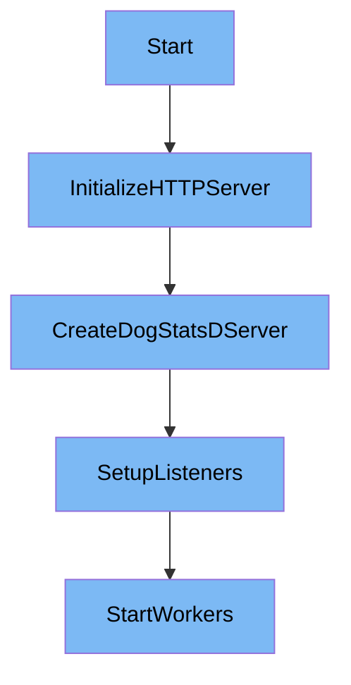

This document will cover the Initialization and Starting Process of the Datadog Agent, which includes:

1. Initializing the HTTP server for testing
2. Creating and configuring the <SwmToken path="tasks/flavor.py" pos="9:1:1" line-data="    dogstatsd = 4">`dogstatsd`</SwmToken> server
3. Setting up listeners and packet handling mechanisms
4. Starting workers to process incoming packets concurrently.

Technical document: <SwmLink doc-title="Initialization and Starting Process">[Initialization and Starting Process](/.swm/initialization-and-starting-process.u100wl7b.sw.md)</SwmLink>

# [Initializing the HTTP server for testing](https://app.swimm.io/repos/Z2l0aHViJTNBJTNBZGF0YWRvZy1hZ2VudCUzQSUzQVN3aW1tLURlbW8=/docs/u100wl7b#initialization-and-starting-the-server)

The initialization process begins with setting up an HTTP server specifically for testing purposes. This server is crucial for creating a controlled environment where various components of the Datadog Agent can be tested effectively. By using a dedicated HTTP server, we ensure that the testing environment is isolated and does not interfere with the actual production environment. This step is essential for validating the functionality and performance of the agent under different scenarios.

# [Creating and configuring the DogStatsD server](https://app.swimm.io/repos/Z2l0aHViJTNBJTNBZGF0YWRvZy1hZ2VudCUzQSUzQVN3aW1tLURlbW8=/docs/u100wl7b#newserver)

Next, we create and configure the <SwmToken path="tasks/flavor.py" pos="9:1:1" line-data="    dogstatsd = 4">`dogstatsd`</SwmToken> server. This server is responsible for collecting and processing metrics from various sources. The configuration involves setting up necessary components such as demultiplexers, which help in efficiently managing and routing the incoming metrics. By properly configuring the <SwmToken path="tasks/flavor.py" pos="9:1:1" line-data="    dogstatsd = 4">`dogstatsd`</SwmToken> server, we ensure that it can handle a high volume of metrics and provide accurate and timely data to the Datadog platform.

# [Setting up listeners and packet handling mechanisms](https://app.swimm.io/repos/Z2l0aHViJTNBJTNBZGF0YWRvZy1hZ2VudCUzQSUzQVN3aW1tLURlbW8=/docs/u100wl7b#start)

Once the <SwmToken path="tasks/flavor.py" pos="9:1:1" line-data="    dogstatsd = 4">`dogstatsd`</SwmToken> server is configured, we set up listeners and packet handling mechanisms. Listeners are responsible for receiving incoming data packets from various sources. Different types of listeners, such as UDP and UDS, are configured to handle different types of network traffic. The packet handling mechanisms ensure that the received data packets are processed efficiently and accurately. This step is crucial for ensuring that the server can handle a large number of incoming packets without any loss of data.

# [Starting workers to process incoming packets concurrently](https://app.swimm.io/repos/Z2l0aHViJTNBJTNBZGF0YWRvZy1hZ2VudCUzQSUzQVN3aW1tLURlbW8=/docs/u100wl7b#handlemessages)

Finally, we start the workers that process incoming packets concurrently. Multiple workers are run to ensure that the server can handle multiple packets at the same time, thereby improving the overall efficiency and performance of the system. Each worker is responsible for processing a specific set of packets, and by running them concurrently, we ensure that the system can handle a high volume of data without any bottlenecks. This step is essential for maintaining the scalability and reliability of the Datadog Agent.

&nbsp;

*This is an auto-generated document by Swimm AI 🌊 and has not yet been verified by a human*

<SwmMeta version="3.0.0" repo-id="Z2l0aHViJTNBJTNBZGF0YWRvZy1hZ2VudCUzQSUzQVN3aW1tLURlbW8=" repo-name="datadog-agent">Powered by [Swimm](/)</SwmMeta>
