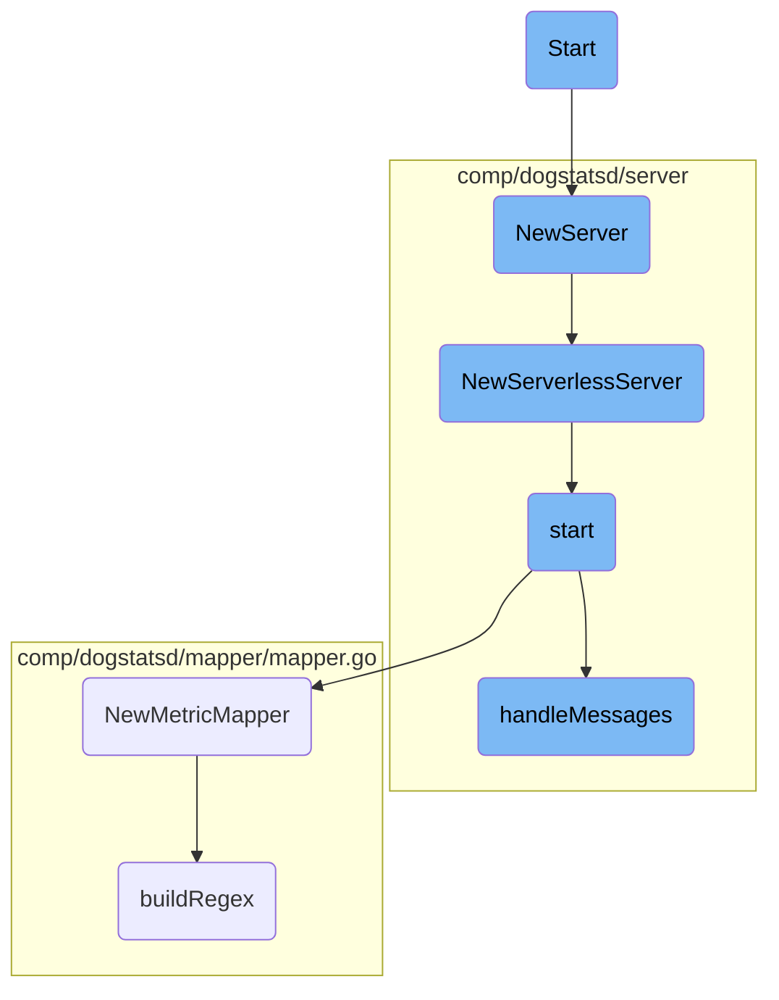

This document explains the initialization and starting process for different components within the Datadog Agent. It covers the setup of an HTTP server for testing, the creation of a <SwmToken path="pkg/serverless/metrics/metric.go" pos="58:10:10" line-data="// NewServer returns a running DogStatsD server">`DogStatsD`</SwmToken> server, and the initialization of various components necessary for handling metrics and packets.

The process starts with initializing an HTTP server for testing purposes. Then, a <SwmToken path="pkg/serverless/metrics/metric.go" pos="58:10:10" line-data="// NewServer returns a running DogStatsD server">`DogStatsD`</SwmToken> server is created and configured with necessary components. The server is then started, setting up listeners and packet handling mechanisms. Finally, workers are started to process incoming packets concurrently, ensuring efficient handling of metrics.

# Flow drill down



<SwmSnippet path="/pkg/util/ecs/metadata/testutil/dummy_ecs.go" line="79">

---

## Initialization and Starting the Server

The <SwmToken path="pkg/util/ecs/metadata/testutil/dummy_ecs.go" pos="79:2:2" line-data="// Start starts the HTTP server">`Start`</SwmToken> function initializes and starts an HTTP server using the <SwmToken path="pkg/util/ecs/metadata/testutil/dummy_ecs.go" pos="80:14:14" line-data="func (d *DummyECS) Start() *httptest.Server {">`httptest`</SwmToken> package. This is crucial for setting up a test environment for ECS metadata.

```go
// Start starts the HTTP server
func (d *DummyECS) Start() *httptest.Server {
	return httptest.NewServer(d)
}
```

---

</SwmSnippet>

<SwmSnippet path="/pkg/serverless/metrics/metric.go" line="58">

---

The <SwmToken path="pkg/serverless/metrics/metric.go" pos="58:2:2" line-data="// NewServer returns a running DogStatsD server">`NewServer`</SwmToken> function creates and returns a running <SwmToken path="pkg/serverless/metrics/metric.go" pos="58:10:10" line-data="// NewServer returns a running DogStatsD server">`DogStatsD`</SwmToken> server by calling <SwmToken path="pkg/serverless/metrics/metric.go" pos="60:5:5" line-data="	return dogstatsdServer.NewServerlessServer(demux)">`NewServerlessServer`</SwmToken>. This is essential for initializing the server with the necessary configurations.

```go
// NewServer returns a running DogStatsD server
func (m *MetricDogStatsD) NewServer(demux aggregator.Demultiplexer) (dogstatsdServer.ServerlessDogstatsd, error) {
	return dogstatsdServer.NewServerlessServer(demux)
}
```

---

</SwmSnippet>

<SwmSnippet path="/comp/dogstatsd/server/serverless.go" line="31">

---

The <SwmToken path="comp/dogstatsd/server/serverless.go" pos="32:2:2" line-data="func NewServerlessServer(demux aggregator.Demultiplexer) (ServerlessDogstatsd, error) {">`NewServerlessServer`</SwmToken> function sets up a serverless <SwmToken path="pkg/serverless/metrics/metric.go" pos="58:10:10" line-data="// NewServer returns a running DogStatsD server">`DogStatsD`</SwmToken> server. It initializes various components and starts the server, ensuring it is ready to handle incoming metrics.

```go
//nolint:revive // TODO(AML) Fix revive linter
func NewServerlessServer(demux aggregator.Demultiplexer) (ServerlessDogstatsd, error) {
	wmeta := optional.NewNoneOption[workloadmeta.Component]()
	s := newServerCompat(config.Datadog(), logComponentImpl.NewTemporaryLoggerWithoutInit(), replay.NewNoopTrafficCapture(), serverdebugimpl.NewServerlessServerDebug(), true, demux, wmeta, pidmapimpl.NewServerlessPidMap(), telemetry.GetCompatComponent())

	err := s.start(context.TODO())
	if err != nil {
		return nil, err
	}

	return s, nil
}
```

---

</SwmSnippet>

<SwmSnippet path="/comp/dogstatsd/server/server.go" line="339">

---

The <SwmToken path="comp/dogstatsd/server/server.go" pos="339:9:9" line-data="func (s *server) start(context.Context) error {">`start`</SwmToken> function is responsible for setting up listeners and packet handling mechanisms. It configures various types of listeners <SwmToken path="comp/dogstatsd/server/server.go" pos="137:13:16" line-data="	// of flooding the logger output (e.g. parsing messages error).">`(e.g`</SwmToken>., UDP, UDS) and starts the message handling process.

```go
func (s *server) start(context.Context) error {
	packetsChannel := make(chan packets.Packets, s.config.GetInt("dogstatsd_queue_size"))
	tmpListeners := make([]listeners.StatsdListener, 0, 2)

	if err := s.tCapture.GetStartUpError(); err != nil {
		return err
	}

	// sharedPacketPool is used by the packet assembler to retrieve already allocated
	// buffer in order to avoid allocation. The packets are pushed back by the server.
	sharedPacketPool := packets.NewPool(s.config.GetInt("dogstatsd_buffer_size"), s.packetsTelemetry)
	sharedPacketPoolManager := packets.NewPoolManager[packets.Packet](sharedPacketPool)

	udsListenerRunning := false

	socketPath := s.config.GetString("dogstatsd_socket")
	socketStreamPath := s.config.GetString("dogstatsd_stream_socket")
	originDetection := s.config.GetBool("dogstatsd_origin_detection")
	var sharedUDSOobPoolManager *packets.PoolManager[[]byte]
	if originDetection {
		sharedUDSOobPoolManager = listeners.NewUDSOobPoolManager()
```

---

</SwmSnippet>

<SwmSnippet path="/comp/dogstatsd/mapper/mapper.go" line="55">

---

The <SwmToken path="comp/dogstatsd/mapper/mapper.go" pos="55:2:2" line-data="// NewMetricMapper creates, validates, prepares a new MetricMapper">`NewMetricMapper`</SwmToken> function creates and validates a new <SwmToken path="comp/dogstatsd/mapper/mapper.go" pos="55:16:16" line-data="// NewMetricMapper creates, validates, prepares a new MetricMapper">`MetricMapper`</SwmToken>. It processes mapping profiles and prepares them for use in metric mapping.

```go
// NewMetricMapper creates, validates, prepares a new MetricMapper
func NewMetricMapper(configProfiles []config.MappingProfile, cacheSize int) (*MetricMapper, error) {
	profiles := make([]MappingProfile, 0, len(configProfiles))
	for profileIndex, configProfile := range configProfiles {
		if configProfile.Name == "" {
			return nil, fmt.Errorf("missing profile name %d", profileIndex)
		}
		if configProfile.Prefix == "" {
			return nil, fmt.Errorf("missing prefix for profile: %s", configProfile.Name)
		}
		profile := MappingProfile{
			Name:     configProfile.Name,
			Prefix:   configProfile.Prefix,
			Mappings: make([]*MetricMapping, 0, len(configProfile.Mappings)),
		}
		for i, currentMapping := range configProfile.Mappings {
			matchType := currentMapping.MatchType
			if matchType == "" {
				matchType = matchTypeWildcard
			}
			if matchType != matchTypeWildcard && matchType != matchTypeRegex {
```

---

</SwmSnippet>

<SwmSnippet path="/comp/dogstatsd/server/server.go" line="504">

---

The <SwmToken path="comp/dogstatsd/server/server.go" pos="504:9:9" line-data="func (s *server) handleMessages() {">`handleMessages`</SwmToken> function starts the workers that process incoming packets. It ensures that the server can handle multiple packets concurrently by running multiple workers.

```go
func (s *server) handleMessages() {
	if s.Statistics != nil {
		go s.Statistics.Process()
		go s.Statistics.Update(&dogstatsdPacketsLastSec)
	}

	for _, l := range s.listeners {
		l.Listen()
	}

	workersCount, _ := aggregator.GetDogStatsDWorkerAndPipelineCount()

	// undocumented configuration field to force the amount of dogstatsd workers
	// mainly used for benchmarks or some very specific use-case.
	if configWC := s.config.GetInt("dogstatsd_workers_count"); configWC != 0 {
		s.log.Debug("Forcing the amount of DogStatsD workers to:", configWC)
		workersCount = configWC
	}

	s.log.Debug("DogStatsD will run", workersCount, "workers")

```

---

</SwmSnippet>

<SwmSnippet path="/comp/dogstatsd/mapper/mapper.go" line="99">

---

The <SwmToken path="comp/dogstatsd/mapper/mapper.go" pos="99:2:2" line-data="func buildRegex(matchRe string, matchType string) (*regexp.Regexp, error) {">`buildRegex`</SwmToken> function compiles a regular expression based on the provided match pattern and type. This is used for matching metric names against the mapping profiles.

```go
func buildRegex(matchRe string, matchType string) (*regexp.Regexp, error) {
	if matchType == matchTypeWildcard {
		if !allowedWildcardMatchPattern.MatchString(matchRe) {
			return nil, fmt.Errorf("invalid wildcard match pattern `%s`, it does not match allowed match regex `%s`", matchRe, allowedWildcardMatchPattern)
		}
		if strings.Contains(matchRe, "**") {
			return nil, fmt.Errorf("invalid wildcard match pattern `%s`, it should not contain consecutive `*`", matchRe)
		}
		matchRe = strings.Replace(matchRe, ".", "\\.", -1)
		matchRe = strings.Replace(matchRe, "*", "([^.]*)", -1)
	}
	regex, err := regexp.Compile("^" + matchRe + "$")
	if err != nil {
		return nil, fmt.Errorf("invalid match `%s`. cannot compile regex: %v", matchRe, err)
	}
	return regex, nil
}
```

---

</SwmSnippet>

&nbsp;

*This is an auto-generated document by Swimm AI 🌊 and has not yet been verified by a human*

<SwmMeta version="3.0.0" repo-id="Z2l0aHViJTNBJTNBZGF0YWRvZy1hZ2VudCUzQSUzQVN3aW1tLURlbW8=" repo-name="datadog-agent"><sup>Powered by [Swimm](/)</sup></SwmMeta>
