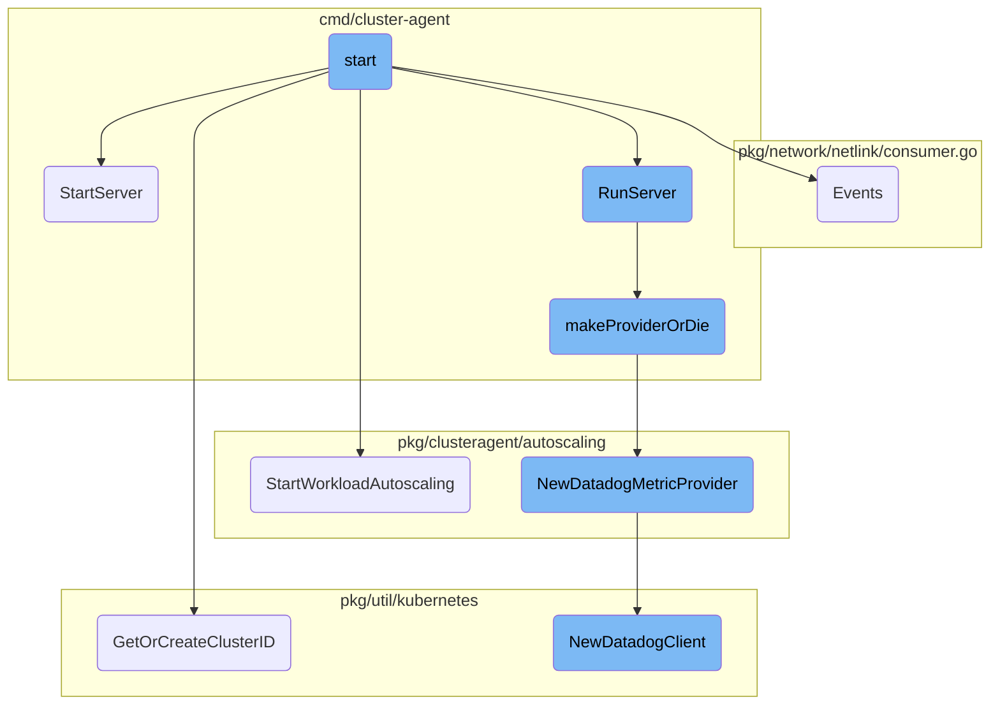
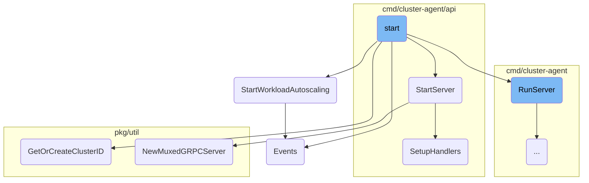
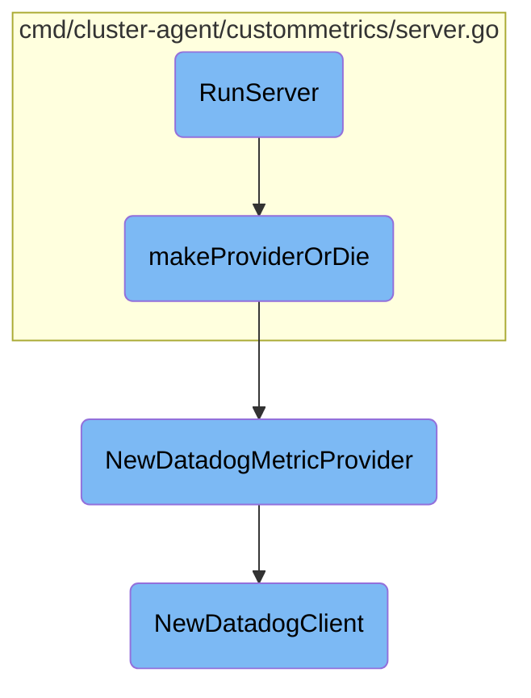

This document provides an overview of the initialization and startup processes for the Datadog Agent. It covers the main steps involved in starting the agent, including setting up core components, starting servers, and initializing workload autoscaling and event handling.

The process starts with initializing various components and settings required for the Datadog Agent to function. This includes setting up core dumps, internal profiling, and checking for API key configuration. Next, an HTTP server is started to expose registered metrics. The server setup involves creating an HTTP router, setting up API endpoints, validating tokens, and configuring TLS settings. Additionally, the workload autoscaling controller is initialized and started, which involves setting up leader election, event broadcasting, and starting necessary informers and controllers. Event handling is also set up to manage new connections added to the Conntrack table.

Here is a high level diagram of the flow, showing only the most important functions:



# Flow drill down

First, we'll zoom into this section of the flow:



<SwmSnippet path="/cmd/cluster-agent/subcommands/start/command.go" line="211">

---

## Initialization

The <SwmToken path="cmd/cluster-agent/subcommands/start/command.go" pos="211:2:2" line-data="func start(log log.Component,">`start`</SwmToken> function initializes various components and settings required for the Datadog Agent to function. It sets up core dumps, internal profiling, and checks for the API key configuration. It also starts an HTTP server to expose registered metrics.

```go
func start(log log.Component,
	config config.Component,
	taggerComp tagger.Component,
	telemetry telemetry.Component,
	demultiplexer demultiplexer.Component,
	wmeta workloadmeta.Component,
	ac autodiscovery.Component,
	secretResolver secrets.Component,
	statusComponent status.Component,
	collector collector.Component,
	rcService optional.Option[rccomp.Component],
	logReceiver optional.Option[integrations.Component],
	_ healthprobe.Component,
	settings settings.Component,
) error {
	stopCh := make(chan struct{})

	mainCtx, mainCtxCancel := context.WithCancel(context.Background())
	defer mainCtxCancel()

	signalCh := make(chan os.Signal, 1)
```

---

</SwmSnippet>

<SwmSnippet path="/cmd/cluster-agent/api/server.go" line="55">

---

## Server Start

The <SwmToken path="cmd/cluster-agent/api/server.go" pos="55:2:2" line-data="// StartServer creates the router and starts the HTTP server">`StartServer`</SwmToken> function creates the HTTP router and starts the HTTP server. It sets up various API endpoints, validates tokens for requests, and configures TLS settings. It also starts a <SwmToken path="cmd/cluster-agent/api/server.go" pos="30:8:8" line-data="	grpc_auth &quot;github.com/grpc-ecosystem/go-grpc-middleware/auth&quot;">`grpc`</SwmToken> server for secure communication.

```go
// StartServer creates the router and starts the HTTP server
func StartServer(ctx context.Context, w workloadmeta.Component, taggerComp tagger.Component, ac autodiscovery.Component, statusComponent status.Component, settings settings.Component, cfg config.Component) error {
	// create the root HTTP router
	router = mux.NewRouter()
	apiRouter = router.PathPrefix("/api/v1").Subrouter()

	// IPC REST API server
	agent.SetupHandlers(router, w, ac, statusComponent, settings)

	// API V1 Metadata APIs
	v1.InstallMetadataEndpoints(apiRouter, w)

	// API V1 Language Detection APIs
	languagedetection.InstallLanguageDetectionEndpoints(ctx, apiRouter, w, cfg)

	// Validate token for every request
	router.Use(validateToken)

	// get the transport we're going to use under HTTP
	var err error
	listener, err = getListener()
```

---

</SwmSnippet>

<SwmSnippet path="/pkg/clusteragent/autoscaling/workload/provider.go" line="26">

---

## Workload Autoscaling

The <SwmToken path="pkg/clusteragent/autoscaling/workload/provider.go" pos="26:2:2" line-data="// StartWorkloadAutoscaling starts the workload autoscaling controller">`StartWorkloadAutoscaling`</SwmToken> function initializes and starts the workload autoscaling controller. It sets up leader election, event broadcasting, and starts the necessary informers and controllers for autoscaling.

```go
// StartWorkloadAutoscaling starts the workload autoscaling controller
func StartWorkloadAutoscaling(ctx context.Context, apiCl *apiserver.APIClient, rcClient rcClient, wlm workloadmeta.Component) (PodPatcher, error) {
	if apiCl == nil {
		return nil, fmt.Errorf("Impossible to start workload autoscaling without valid APIClient")
	}

	le, err := leaderelection.GetLeaderEngine()
	if err != nil {
		return nil, fmt.Errorf("Unable to start workload autoscaling as LeaderElection failed with: %v", err)
	}

	eventBroadcaster := record.NewBroadcaster()
	eventBroadcaster.StartRecordingToSink(&v1core.EventSinkImpl{Interface: apiCl.Cl.CoreV1().Events("")})
	eventRecorder := eventBroadcaster.NewRecorder(scheme.Scheme, corev1.EventSource{Component: "datadog-workload-autoscaler"})

	store := autoscaling.NewStore[model.PodAutoscalerInternal]()
	podPatcher := newPODPatcher(store, le.IsLeader, apiCl.DynamicCl, eventRecorder)
	podWatcher := newPodWatcher(wlm, podPatcher)

	_, err = newConfigRetriever(store, le.IsLeader, rcClient)
	if err != nil {
```

---

</SwmSnippet>

<SwmSnippet path="/pkg/network/netlink/consumer.go" line="152">

---

## Event Handling

The <SwmToken path="pkg/network/netlink/consumer.go" pos="152:2:2" line-data="// Events returns a channel of Event objects (wrapping netlink messages) which receives">`Events`</SwmToken> function returns a channel of Event objects that receive new connections added to the Conntrack table. It initializes the netlink socket and starts a goroutine to handle incoming events.

```go
// Events returns a channel of Event objects (wrapping netlink messages) which receives
// all new connections added to the Conntrack table.
func (c *Consumer) Events() (<-chan Event, error) {
	if err := c.initNetlinkSocket(1.0); err != nil {
		return nil, fmt.Errorf("could not initialize conntrack netlink socket: %w", err)
	}

	output := make(chan Event, outputBuffer)

	go func() {
		defer func() {
			log.Info("exited conntrack netlink receive loop")
			close(output)
		}()

		c.streaming = true
		_ = c.conn.JoinGroup(netlinkCtNew)
		c.receive(output, 0)
	}()

	return output, nil
```

---

</SwmSnippet>

Now, lets zoom into this section of the flow:



<SwmSnippet path="/cmd/cluster-agent/custommetrics/server.go" line="49">

---

## <SwmToken path="cmd/cluster-agent/custommetrics/server.go" pos="49:2:2" line-data="// RunServer creates and start a k8s custom metrics API server">`RunServer`</SwmToken> Initialization

The <SwmToken path="cmd/cluster-agent/custommetrics/server.go" pos="49:2:2" line-data="// RunServer creates and start a k8s custom metrics API server">`RunServer`</SwmToken> function is responsible for creating and starting a Kubernetes custom metrics API server. It initializes the <SwmToken path="cmd/cluster-agent/custommetrics/server.go" pos="56:6:6" line-data="	cmd = &amp;DatadogMetricsAdapter{}">`DatadogMetricsAdapter`</SwmToken>, configures the <SwmToken path="cmd/cluster-agent/custommetrics/server.go" pos="18:14:14" line-data="	openapinamer &quot;k8s.io/apiserver/pkg/endpoints/openapi&quot;">`openapi`</SwmToken> settings, and parses the necessary flags. The function then calls <SwmToken path="cmd/cluster-agent/custommetrics/server.go" pos="95:9:9" line-data="func (a *DatadogMetricsAdapter) makeProviderOrDie(ctx context.Context, apiCl *as.APIClient) (provider.ExternalMetricsProvider, error) {">`makeProviderOrDie`</SwmToken> to set up the metrics provider and completes the server configuration before running it.

```go
// RunServer creates and start a k8s custom metrics API server
func RunServer(ctx context.Context, apiCl *as.APIClient) error {
	defer clearServerResources()
	if apiCl == nil {
		return fmt.Errorf("unable to run server with nil APIClient")
	}

	cmd = &DatadogMetricsAdapter{}
	cmd.Name = adapterName

	cmd.OpenAPIConfig = genericapiserver.DefaultOpenAPIConfig(generatedopenapi.GetOpenAPIDefinitions, openapinamer.NewDefinitionNamer(apiserver.Scheme))
	cmd.OpenAPIConfig.Info.Title = adapterName
	cmd.OpenAPIConfig.Info.Version = adapterVersion

	cmd.FlagSet = pflag.NewFlagSet(cmd.Name, pflag.ExitOnError)

	var c []string
	for k, v := range config.Datadog().GetStringMapString(metricsServerConf) {
		c = append(c, fmt.Sprintf("--%s=%s", k, v))
	}

```

---

</SwmSnippet>

<SwmSnippet path="/cmd/cluster-agent/custommetrics/server.go" line="95">

---

## Provider Setup with <SwmToken path="cmd/cluster-agent/custommetrics/server.go" pos="95:9:9" line-data="func (a *DatadogMetricsAdapter) makeProviderOrDie(ctx context.Context, apiCl *as.APIClient) (provider.ExternalMetricsProvider, error) {">`makeProviderOrDie`</SwmToken>

The <SwmToken path="cmd/cluster-agent/custommetrics/server.go" pos="95:9:9" line-data="func (a *DatadogMetricsAdapter) makeProviderOrDie(ctx context.Context, apiCl *as.APIClient) (provider.ExternalMetricsProvider, error) {">`makeProviderOrDie`</SwmToken> function is crucial for setting up the metrics provider. It constructs a dynamic client and a REST mapper. Depending on the configuration, it either creates a <SwmToken path="pkg/clusteragent/autoscaling/externalmetrics/provider.go" pos="50:14:14" line-data="// NewDatadogMetricProvider configures and returns a new datadogMetricProvider">`datadogMetricProvider`</SwmToken> or a `DatadogProvider` using a <SwmToken path="cmd/cluster-agent/custommetrics/server.go" pos="115:12:12" line-data="		log.Errorf(&quot;Unable to create ConfigMap Store: %v&quot;, err)">`ConfigMap`</SwmToken> store. This function ensures that the appropriate provider is initialized based on the configuration settings.

```go
func (a *DatadogMetricsAdapter) makeProviderOrDie(ctx context.Context, apiCl *as.APIClient) (provider.ExternalMetricsProvider, error) {
	client, err := a.DynamicClient()
	if err != nil {
		log.Infof("Unable to construct dynamic client: %v", err)
		return nil, err
	}

	mapper, err := a.RESTMapper()
	if err != nil {
		log.Errorf("Unable to construct discovery REST mapper: %v", err)
		return nil, err
	}

	if config.Datadog().GetBool("external_metrics_provider.use_datadogmetric_crd") {
		return externalmetrics.NewDatadogMetricProvider(ctx, apiCl)
	}

	datadogHPAConfigMap := custommetrics.GetConfigmapName()
	store, err := custommetrics.NewConfigMapStore(apiCl.Cl, common.GetResourcesNamespace(), datadogHPAConfigMap)
	if err != nil {
		log.Errorf("Unable to create ConfigMap Store: %v", err)
```

---

</SwmSnippet>

<SwmSnippet path="/pkg/clusteragent/autoscaling/externalmetrics/provider.go" line="50">

---

### Creating <SwmToken path="pkg/clusteragent/autoscaling/externalmetrics/provider.go" pos="50:14:14" line-data="// NewDatadogMetricProvider configures and returns a new datadogMetricProvider">`datadogMetricProvider`</SwmToken>

The <SwmToken path="pkg/clusteragent/autoscaling/externalmetrics/provider.go" pos="50:2:2" line-data="// NewDatadogMetricProvider configures and returns a new datadogMetricProvider">`NewDatadogMetricProvider`</SwmToken> function configures and returns a new <SwmToken path="pkg/clusteragent/autoscaling/externalmetrics/provider.go" pos="50:14:14" line-data="// NewDatadogMetricProvider configures and returns a new datadogMetricProvider">`datadogMetricProvider`</SwmToken>. It sets up leader election, initializes the metrics retriever, and starts the necessary informers and controllers. This function ensures that the metrics provider is properly configured and ready to handle external metrics.

```go
// NewDatadogMetricProvider configures and returns a new datadogMetricProvider
func NewDatadogMetricProvider(ctx context.Context, apiCl *apiserver.APIClient) (provider.ExternalMetricsProvider, error) {
	if apiCl == nil {
		return nil, fmt.Errorf("Impossible to create DatadogMetricProvider without valid APIClient")
	}

	le, err := leaderelection.GetLeaderEngine()
	if err != nil {
		return nil, fmt.Errorf("Unable to create DatadogMetricProvider as LeaderElection failed with: %v", err)
	}

	aggregator := config.Datadog().GetString("external_metrics.aggregator")
	rollup := config.Datadog().GetInt("external_metrics_provider.rollup")
	setQueryConfigValues(aggregator, rollup)

	refreshPeriod := config.Datadog().GetInt64("external_metrics_provider.refresh_period")
	metricsMaxAge = int64(math.Max(config.Datadog().GetFloat64("external_metrics_provider.max_age"), float64(3*rollup)))
	metricsQueryValidityPeriod = int64(config.Datadog().GetFloat64("external_metrics_provider.query_validity_period"))
	splitBatchBackoffOnErrors := config.Datadog().GetBool("external_metrics_provider.split_batches_with_backoff")
	autogenNamespace := common.GetResourcesNamespace()
	autogenEnabled := config.Datadog().GetBool("external_metrics_provider.enable_datadogmetric_autogen")
```

---

</SwmSnippet>

<SwmSnippet path="/pkg/util/kubernetes/autoscalers/datadogclient.go" line="38">

---

### Initializing <SwmToken path="pkg/util/kubernetes/autoscalers/datadogclient.go" pos="38:14:14" line-data="// NewDatadogClient configures and returns a new DatadogClient">`DatadogClient`</SwmToken>

The <SwmToken path="pkg/util/kubernetes/autoscalers/datadogclient.go" pos="38:2:2" line-data="// NewDatadogClient configures and returns a new DatadogClient">`NewDatadogClient`</SwmToken> function configures and returns a new <SwmToken path="pkg/util/kubernetes/autoscalers/datadogclient.go" pos="38:14:14" line-data="// NewDatadogClient configures and returns a new DatadogClient">`DatadogClient`</SwmToken>. It checks for redundant endpoint configurations and creates either a fallback client or a single client based on the configuration. This function is essential for setting up the client that interacts with Datadog's API.

```go
// NewDatadogClient configures and returns a new DatadogClient
func NewDatadogClient() (DatadogClient, error) {
	if config.Datadog().IsSet(metricsRedundantEndpointConfig) {
		var endpoints []endpoint
		if err := config.Datadog().UnmarshalKey(metricsRedundantEndpointConfig, &endpoints); err != nil {
			return nil, log.Errorf("could not parse %s: %v", metricsRedundantEndpointConfig, err)
		}

		return newDatadogFallbackClient(endpoints)
	}

	return newDatadogSingleClient()
}
```

---

</SwmSnippet>

&nbsp;

*This is an auto-generated document by Swimm AI 🌊 and has not yet been verified by a human*

<SwmMeta version="3.0.0" repo-id="Z2l0aHViJTNBJTNBZGF0YWRvZy1hZ2VudCUzQSUzQVN3aW1tLURlbW8=" repo-name="datadog-agent"><sup>Powered by [Swimm](/)</sup></SwmMeta>
