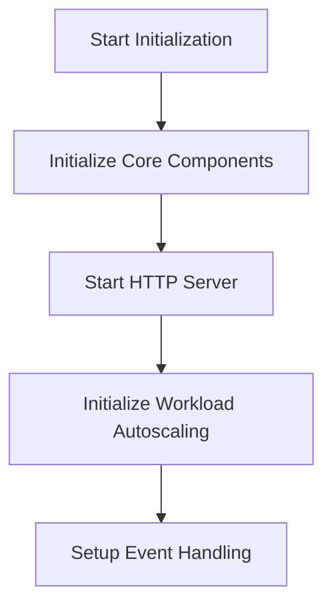

This document will cover the Initialization and Startup Processes for the Datadog Agent, which includes:

1. Initializing core components
2. Starting the HTTP server
3. Initializing workload autoscaling
4. Setting up event handling.

Technical document: <SwmLink doc-title="Initialization and Startup Processes">[Initialization and Startup Processes](/.swm/initialization-and-startup-processes.2ry80c6i.sw.md)</SwmLink>

# [Initializing Core Components](https://app.swimm.io/repos/Z2l0aHViJTNBJTNBZGF0YWRvZy1hZ2VudCUzQSUzQVN3aW1tLURlbW8=/docs/2ry80c6i#initialization)

The initialization process begins by setting up various core components and settings required for the Datadog Agent to function. This includes configuring core dumps, enabling internal profiling, and verifying the API key configuration. These steps ensure that the agent is prepared to collect and process data efficiently.

# [Starting the HTTP Server](https://app.swimm.io/repos/Z2l0aHViJTNBJTNBZGF0YWRvZy1hZ2VudCUzQSUzQVN3aW1tLURlbW8=/docs/2ry80c6i#server-start)

The HTTP server is started to expose registered metrics. This involves creating an HTTP router, setting up API endpoints, validating tokens for incoming requests, and configuring TLS settings for secure communication. The server also starts a gRPC server to handle secure communication between different components.

# [Initializing Workload Autoscaling](https://app.swimm.io/repos/Z2l0aHViJTNBJTNBZGF0YWRvZy1hZ2VudCUzQSUzQVN3aW1tLURlbW8=/docs/2ry80c6i#workload-autoscaling)

The workload autoscaling controller is initialized and started. This involves setting up leader election to ensure only one instance of the controller is active, broadcasting events, and starting the necessary informers and controllers. These steps ensure that the system can dynamically adjust resources based on the current workload.

# [Setting Up Event Handling](https://app.swimm.io/repos/Z2l0aHViJTNBJTNBZGF0YWRvZy1hZ2VudCUzQSUzQVN3aW1tLURlbW8=/docs/2ry80c6i#event-handling)

Event handling is set up to manage new connections added to the Conntrack table. This involves initializing the netlink socket and starting a process to handle incoming events. This ensures that the system can efficiently manage network connections and maintain performance.

&nbsp;

*This is an auto-generated document by Swimm AI 🌊 and has not yet been verified by a human*

<SwmMeta version="3.0.0" repo-id="Z2l0aHViJTNBJTNBZGF0YWRvZy1hZ2VudCUzQSUzQVN3aW1tLURlbW8=" repo-name="datadog-agent">Powered by [Swimm](/)</SwmMeta>
