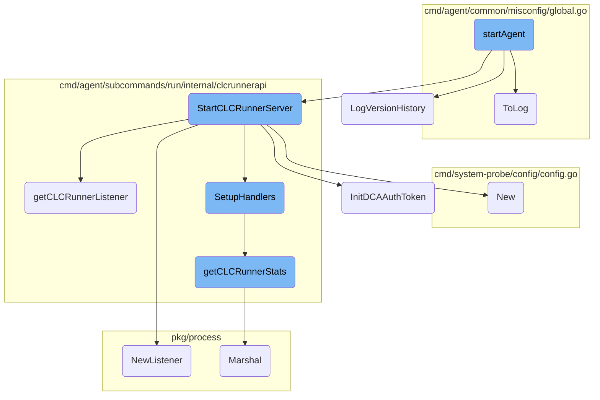
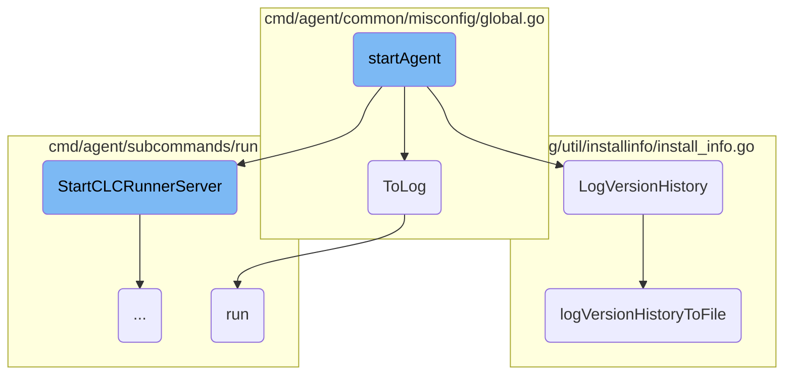

This document explains the initialization process of the Datadog Agent. It covers the main steps involved in starting the agent, including logging, setting up core dumps, and enabling memory profiling.

The process starts with initializing the agent and logging its version. It then sets up core dumps for debugging purposes and enables memory profiling if configured. The agent then proceeds to start various components and services required for its operation.

Here is a high level diagram of the flow, showing only the most important functions:



# Flow drill down

First, we'll zoom into this section of the flow:



<SwmSnippet path="/cmd/agent/subcommands/run/command.go" line="493">

---

## Initialization and Logging

The <SwmToken path="cmd/agent/subcommands/run/command.go" pos="493:2:2" line-data="// startAgent Initializes the agent process">`startAgent`</SwmToken> function initializes the agent process. It starts by logging the version of the Datadog Agent or <SwmToken path="tasks/flavor.py" pos="7:1:1" line-data="    iot = 2">`iot`</SwmToken> Agent being started.

```go
// startAgent Initializes the agent process
func startAgent(
	log log.Component,
	_ flare.Component,
	telemetry telemetry.Component,
	_ sysprobeconfig.Component,
	server dogstatsdServer.Component,
	wmeta workloadmeta.Component,
	_ tagger.Component,
	ac autodiscovery.Component,
	rcclient rcclient.Component,
	_ optional.Option[logsAgent.Component],
	_ processAgent.Component,
	_ defaultforwarder.Component,
	_ serializer.MetricSerializer,
	_ otelcollector.Component,
	demultiplexer demultiplexer.Component,
	_ internalAPI.Component,
	invChecks inventorychecks.Component,
	logReceiver optional.Option[integrations.Component],
	_ status.Component,
```

---

</SwmSnippet>

<SwmSnippet path="/cmd/agent/subcommands/run/command.go" line="528">

---

## Core Dump Setup

The function sets up core dumps, which are useful for debugging crashes. If it fails to set up core dumps, it logs a warning.

```go
	if err := util.SetupCoreDump(pkgconfig.Datadog()); err != nil {
		log.Warnf("Can't setup core dumps: %v, core dumps might not be available after a crash", err)
	}
```

---

</SwmSnippet>

<SwmSnippet path="/cmd/agent/subcommands/run/command.go" line="532">

---

## Memory Profiling

If internal profiling is enabled, the function sets the memory profile rate to capture every single memory allocation and logs this information.

```go
	if v := pkgconfig.Datadog().GetBool("internal_profiling.capture_all_allocations"); v {
		runtime.MemProfileRate = 1
		log.Infof("MemProfileRate set to 1, capturing every single memory allocation!")
	}
```

---

</SwmSnippet>

Now, lets zoom into this section of the flow:

```mermaid
graph TD;
      subgraph cmdagentsubcommandsruninternalclcrunnerapi["cmd/agent/subcommands/run/internal/clcrunnerapi"]
3fdadb3cfaa9529ba8367d2a1f2f1d76a610aecf520b300382d18b29ad3130d7(StartCLCRunnerServer):::mainFlowStyle --> 6f293f5530b38e435c12043ddbb7639ef1db55df744dc7c83ba1c239b74e3575(getCLCRunnerListener)
end

subgraph pkgprocesseventslistenerlinuxgo["pkg/process/events/listener_linux.go"]
3fdadb3cfaa9529ba8367d2a1f2f1d76a610aecf520b300382d18b29ad3130d7(StartCLCRunnerServer):::mainFlowStyle --> 7a2f85f5107e04e9d1dda0ebdbcc665146a2fc4749868d4960f580cded86dce1(NewListener)
end

subgraph cmdsystemprobeconfigconfiggo["cmd/system-probe/config/config.go"]
3fdadb3cfaa9529ba8367d2a1f2f1d76a610aecf520b300382d18b29ad3130d7(StartCLCRunnerServer):::mainFlowStyle --> 7b9ae8f0e8da20218611513a17d056f19bc58ec241f0e5aa7438d27342a22ddf(New)
end

subgraph pkgapi["pkg/api"]
3fdadb3cfaa9529ba8367d2a1f2f1d76a610aecf520b300382d18b29ad3130d7(StartCLCRunnerServer):::mainFlowStyle --> 973646e1d10940ed826f21832fba85decd1bcb1b67f29402bf25a0d83876107c(InitDCAAuthToken)
end

subgraph cmdagentsubcommandsruninternalclcrunnerapi["cmd/agent/subcommands/run/internal/clcrunnerapi"]
3fdadb3cfaa9529ba8367d2a1f2f1d76a610aecf520b300382d18b29ad3130d7(StartCLCRunnerServer):::mainFlowStyle --> 326374799aa78305b2ac504a080b397eb90d9a630b8735e1075aeaf4264b50d7(SetupHandlers):::mainFlowStyle
end

subgraph cmdagentsubcommandsruninternalclcrunnerapi["cmd/agent/subcommands/run/internal/clcrunnerapi"]
326374799aa78305b2ac504a080b397eb90d9a630b8735e1075aeaf4264b50d7(SetupHandlers):::mainFlowStyle --> ce57fa3b343c96191828db4d76400905238d0661933206f0b8c7cffb60367a82(getCLCRunnerStats):::mainFlowStyle
end

subgraph pkgapi["pkg/api"]
973646e1d10940ed826f21832fba85decd1bcb1b67f29402bf25a0d83876107c(InitDCAAuthToken) --> cb30150cf2074c8f7bfa02e1dce11cfa19d1df19f907327b79d4cc2e88eee885(CreateOrGetClusterAgentAuthToken)
end

subgraph cmdsystemprobeconfigconfiggo["cmd/system-probe/config/config.go"]
7b9ae8f0e8da20218611513a17d056f19bc58ec241f0e5aa7438d27342a22ddf(New) --> 2833bf0179adecd121acb14de5e3b9c407ca7d284b799db04829259b7ebbd10e(newSysprobeConfig)
end

subgraph pkgprocesseventslistenerlinuxgo["pkg/process/events/listener_linux.go"]
7a2f85f5107e04e9d1dda0ebdbcc665146a2fc4749868d4960f580cded86dce1(NewListener) --> 1c5c169732a94451a4204e259dcf2896dfa3d778e99e94f30c24a75b46e9f0e4(NewSysProbeListener)
end

subgraph compdogstatsdlistenersudsstreamgo["comp/dogstatsd/listeners/uds_stream.go"]
6f293f5530b38e435c12043ddbb7639ef1db55df744dc7c83ba1c239b74e3575(getCLCRunnerListener) --> 7e7a973f13afccd57ccb2e129cf12a1a8187eef689f11039f1e437c5acd11632(Listen)
end


      classDef mainFlowStyle color:#000000,fill:#7CB9F4
classDef rootsStyle color:#000000,fill:#00FFF4
classDef Style1 color:#000000,fill:#00FFAA
classDef Style2 color:#000000,fill:#FFFF00
classDef Style3 color:#000000,fill:#AA7CB9
```



<SwmSnippet path="/cmd/agent/subcommands/run/internal/clcrunnerapi/clc_runner_server.go" line="34">

---

## <SwmToken path="cmd/agent/subcommands/run/internal/clcrunnerapi/clc_runner_server.go" pos="34:2:2" line-data="// StartCLCRunnerServer creates the router and starts the HTTP server">`StartCLCRunnerServer`</SwmToken>

The <SwmToken path="cmd/agent/subcommands/run/internal/clcrunnerapi/clc_runner_server.go" pos="34:2:2" line-data="// StartCLCRunnerServer creates the router and starts the HTTP server">`StartCLCRunnerServer`</SwmToken> function is responsible for creating the router and starting the HTTP server for the Cluster Level Check (CLC) Runner. It sets up the root HTTP router, registers handlers for the API endpoints, validates tokens for every request, and initializes the server listener. It also configures TLS for secure communication and starts the server in a separate goroutine.

```go
// StartCLCRunnerServer creates the router and starts the HTTP server
func StartCLCRunnerServer(extraHandlers map[string]http.Handler, ac autodiscovery.Component) error {
	// create the root HTTP router
	r := mux.NewRouter()

	// IPC REST API server
	v1.SetupHandlers(r.PathPrefix("/api/v1").Subrouter(), ac)

	// Register extra hanlders
	for path, handler := range extraHandlers {
		r.Handle(path, handler)
	}

	// Validate token for every request
	r.Use(validateCLCRunnerToken)

	// get the transport we're going to use under HTTP
	var err error
	clcListener, err = getCLCRunnerListener()
	if err != nil {
		return fmt.Errorf("unable to create the clc runner api server: %v", err)
```

---

</SwmSnippet>

<SwmSnippet path="/cmd/agent/subcommands/run/internal/clcrunnerapi/clc_runner_listener.go" line="20">

---

### <SwmToken path="cmd/agent/subcommands/run/internal/clcrunnerapi/clc_runner_listener.go" pos="20:2:2" line-data="// getCLCRunnerListener returns a listening connection for the cluster level check runner server">`getCLCRunnerListener`</SwmToken>

The <SwmToken path="cmd/agent/subcommands/run/internal/clcrunnerapi/clc_runner_listener.go" pos="20:2:2" line-data="// getCLCRunnerListener returns a listening connection for the cluster level check runner server">`getCLCRunnerListener`</SwmToken> function returns a listening connection for the CLC Runner server. It ensures that the server listens only on the configured Pod IP and port, which is crucial for the security and proper functioning of the CLC Runner.

```go
// getCLCRunnerListener returns a listening connection for the cluster level check runner server
// The server must only listen on the cluster check runner pod ip
// The cluster check runner Agent won't start if the server host is not configured
func getCLCRunnerListener() (net.Listener, error) {
	podIP := config.Datadog().GetString("clc_runner_host")
	// This is not a security feature
	// util.IsForbidden only helps to avoid unnecessarily permissive server config
	if util.IsForbidden(podIP) {
		// The server must only listen on the Pod IP
		return nil, fmt.Errorf("Invalid cluster check runner host: %s, must be set to the Pod IP", podIP)
	}
	if util.IsIPv6(podIP) {
		// IPv6 addresses must be formatted [ip]:port
		podIP = fmt.Sprintf("[%s]", podIP)
	}
	return net.Listen("tcp", fmt.Sprintf("%v:%v", podIP, config.Datadog().GetInt("clc_runner_port")))
}
```

---

</SwmSnippet>

<SwmSnippet path="/pkg/process/events/listener_linux.go" line="46">

---

### <SwmToken path="pkg/process/events/listener_linux.go" pos="46:2:2" line-data="// NewListener returns a new SysProbeListener to listen for process events">`NewListener`</SwmToken>

The <SwmToken path="pkg/process/events/listener_linux.go" pos="46:2:2" line-data="// NewListener returns a new SysProbeListener to listen for process events">`NewListener`</SwmToken> function creates a new <SwmToken path="pkg/process/events/listener_linux.go" pos="46:10:10" line-data="// NewListener returns a new SysProbeListener to listen for process events">`SysProbeListener`</SwmToken> to listen for process events. It establishes a <SwmToken path="pkg/process/events/listener_linux.go" pos="53:8:8" line-data="	conn, err := grpc.Dial(socketPath, grpc.WithTransportCredentials(insecure.NewCredentials()), grpc.WithContextDialer(func(ctx context.Context, url string) (net.Conn, error) { //nolint:staticcheck // TODO (ASC) fix grpc.Dial is deprecated">`grpc`</SwmToken> connection to the specified socket path and returns a listener that can handle event monitoring.

```go
// NewListener returns a new SysProbeListener to listen for process events
func NewListener(handler EventHandler) (*SysProbeListener, error) {
	socketPath := ddconfig.SystemProbe.GetString("event_monitoring_config.socket")
	if socketPath == "" {
		return nil, errors.New("event_monitoring_config.socket must be set")
	}

	conn, err := grpc.Dial(socketPath, grpc.WithTransportCredentials(insecure.NewCredentials()), grpc.WithContextDialer(func(ctx context.Context, url string) (net.Conn, error) { //nolint:staticcheck // TODO (ASC) fix grpc.Dial is deprecated
		return net.Dial("unix", url)
	}))
	if err != nil {
		return nil, err
	}

	client := api.NewEventMonitoringModuleClient(conn)
	return NewSysProbeListener(conn, client, handler)
}
```

---

</SwmSnippet>

<SwmSnippet path="/cmd/system-probe/config/config.go" line="46">

---

### New

The <SwmToken path="cmd/system-probe/config/config.go" pos="46:2:2" line-data="// New creates a config object for system-probe. It assumes no configuration has been loaded as this point.">`New`</SwmToken> function creates a configuration object for the <SwmToken path="cmd/system-probe/config/config.go" pos="46:14:16" line-data="// New creates a config object for system-probe. It assumes no configuration has been loaded as this point.">`system-probe`</SwmToken>. It calls <SwmToken path="cmd/system-probe/config/config.go" pos="48:3:3" line-data="	return newSysprobeConfig(configPath)">`newSysprobeConfig`</SwmToken> to load the configuration from the specified path.

```go
// New creates a config object for system-probe. It assumes no configuration has been loaded as this point.
func New(configPath string) (*types.Config, error) {
	return newSysprobeConfig(configPath)
}
```

---

</SwmSnippet>

<SwmSnippet path="/pkg/api/util/util.go" line="66">

---

### <SwmToken path="pkg/api/util/util.go" pos="66:2:2" line-data="// InitDCAAuthToken initialize the session token for the Cluster Agent based on config options">`InitDCAAuthToken`</SwmToken>

The <SwmToken path="pkg/api/util/util.go" pos="66:2:2" line-data="// InitDCAAuthToken initialize the session token for the Cluster Agent based on config options">`InitDCAAuthToken`</SwmToken> function initializes the session token for the Cluster Agent based on the configuration options. It ensures that the token is set up before the CLC Runner server starts.

```go
// InitDCAAuthToken initialize the session token for the Cluster Agent based on config options
// Requires that the config has been set up before calling
func InitDCAAuthToken(config model.Reader) error {
	tokenLock.Lock()
	defer tokenLock.Unlock()

	// Noop if dcaToken is already set
	if dcaToken != "" {
		return nil
	}

	var err error
	dcaToken, err = security.CreateOrGetClusterAgentAuthToken(config)
	return err
}
```

---

</SwmSnippet>

<SwmSnippet path="/cmd/agent/subcommands/run/internal/clcrunnerapi/v1/clcrunner.go" line="24">

---

### <SwmToken path="cmd/agent/subcommands/run/internal/clcrunnerapi/v1/clcrunner.go" pos="30:2:2" line-data="// SetupHandlers adds the specific handlers for /api/v1 endpoints">`SetupHandlers`</SwmToken>

The <SwmToken path="cmd/agent/subcommands/run/internal/clcrunnerapi/v1/clcrunner.go" pos="30:2:2" line-data="// SetupHandlers adds the specific handlers for /api/v1 endpoints">`SetupHandlers`</SwmToken> function adds specific handlers for the <SwmPath>[cmd/agent/subcommands/run/internal/clcrunnerapi/v1/](cmd/agent/subcommands/run/internal/clcrunnerapi/v1/)</SwmPath> endpoints. These handlers are used to expose stats and other information required by the Cluster Agent.

```go
// IMPORTANT NOTE:
// Every payload change requires a version bump of the API
// This API is NOT meant to:
// - expose check configs
// - configure the Agent or change its behaviour

// SetupHandlers adds the specific handlers for /api/v1 endpoints
// The API is only meant to expose stats used by the Cluster Agent
// Check configs and any data that could contain sensitive information
// MUST NEVER be sent via this API
func SetupHandlers(r *mux.Router, ac autodiscovery.Component) {
	r.HandleFunc("/clcrunner/version", common.GetVersion).Methods("GET")
	r.HandleFunc("/clcrunner/stats", func(w http.ResponseWriter, r *http.Request) {
		getCLCRunnerStats(w, r, ac)
	}).Methods("GET")
	r.HandleFunc("/clcrunner/workers", getCLCRunnerWorkers).Methods("GET")
}
```

---

</SwmSnippet>

<SwmSnippet path="/cmd/agent/subcommands/run/internal/clcrunnerapi/v1/clcrunner.go" line="42">

---

### <SwmToken path="cmd/agent/subcommands/run/internal/clcrunnerapi/v1/clcrunner.go" pos="42:2:2" line-data="// getCLCRunnerStats retrieves Cluster Level Check runners stats">`getCLCRunnerStats`</SwmToken>

The <SwmToken path="cmd/agent/subcommands/run/internal/clcrunnerapi/v1/clcrunner.go" pos="42:2:2" line-data="// getCLCRunnerStats retrieves Cluster Level Check runners stats">`getCLCRunnerStats`</SwmToken> function retrieves the stats for the Cluster Level Check runners. It processes the stats and sends them as a JSON response.

```go
// getCLCRunnerStats retrieves Cluster Level Check runners stats
func getCLCRunnerStats(w http.ResponseWriter, _ *http.Request, ac autodiscovery.Component) {
	log.Info("Got a request for the runner stats. Making stats.")
	w.Header().Set("Content-Type", "application/json")
	stats, err := status.GetExpvarRunnerStats()
	if err != nil {
		log.Errorf("Error getting exp var stats: %v", err)
		body, _ := json.Marshal(map[string]string{"error": err.Error()})
		http.Error(w, string(body), 500)
		return
	}
	flattenedStats := flattenCLCStats(stats)
	statsWithIDsKnownByDCA := replaceIDsWithIDsKnownByDCA(ac, flattenedStats)
	jsonStats, err := json.Marshal(statsWithIDsKnownByDCA)
	if err != nil {
		log.Errorf("Error marshalling stats. Error: %v, Stats: %v", err, statsWithIDsKnownByDCA)
		body, _ := json.Marshal(map[string]string{"error": err.Error()})
		http.Error(w, string(body), 500)
		return
	}

```

---

</SwmSnippet>

<SwmSnippet path="/pkg/api/security/security.go" line="181">

---

### <SwmToken path="pkg/api/security/security.go" pos="181:2:2" line-data="// CreateOrGetClusterAgentAuthToken load the authentication token from:">`CreateOrGetClusterAgentAuthToken`</SwmToken>

The <SwmToken path="pkg/api/security/security.go" pos="181:2:2" line-data="// CreateOrGetClusterAgentAuthToken load the authentication token from:">`CreateOrGetClusterAgentAuthToken`</SwmToken> function loads the authentication token for the Cluster Agent from the configuration or filesystem. If the token file does not exist, it creates a new token.

```go
// CreateOrGetClusterAgentAuthToken load the authentication token from:
// 1st. the configuration value of "cluster_agent.auth_token" in datadog.yaml
// 2nd. from the filesystem
// If using the token from the filesystem, the token file must be next to the datadog.yaml
// with the filename: cluster_agent.auth_token, if such file does not exist it will be
// created and populated with a newly generated token.
func CreateOrGetClusterAgentAuthToken(config configModel.Reader) (string, error) {
	return getClusterAgentAuthToken(config, true)
}
```

---

</SwmSnippet>

<SwmSnippet path="/cmd/system-probe/config/config.go" line="51">

---

### <SwmToken path="cmd/system-probe/config/config.go" pos="51:2:2" line-data="func newSysprobeConfig(configPath string) (*types.Config, error) {">`newSysprobeConfig`</SwmToken>

The <SwmToken path="cmd/system-probe/config/config.go" pos="51:2:2" line-data="func newSysprobeConfig(configPath string) (*types.Config, error) {">`newSysprobeConfig`</SwmToken> function loads the <SwmToken path="cmd/system-probe/config/config.go" pos="52:8:10" line-data="	aconfig.SystemProbe.SetConfigName(&quot;system-probe&quot;)">`system-probe`</SwmToken> configuration from the specified path. It handles various scenarios, such as custom config paths and default paths, and ensures the configuration is loaded correctly.

```go
func newSysprobeConfig(configPath string) (*types.Config, error) {
	aconfig.SystemProbe.SetConfigName("system-probe")
	// set the paths where a config file is expected
	if len(configPath) != 0 {
		// if the configuration file path was supplied on the command line,
		// add that first, so it's first in line
		aconfig.SystemProbe.AddConfigPath(configPath)
		// If they set a config file directly, let's try to honor that
		if strings.HasSuffix(configPath, ".yaml") {
			aconfig.SystemProbe.SetConfigFile(configPath)
		}
	} else {
		// only add default if a custom configPath was not supplied
		aconfig.SystemProbe.AddConfigPath(defaultConfigDir)
	}
	// load the configuration
	err := aconfig.LoadCustom(aconfig.SystemProbe, aconfig.Datadog().GetEnvVars())
	if err != nil {
		if errors.Is(err, fs.ErrPermission) {
			// special-case permission-denied with a clearer error message
			if runtime.GOOS == "windows" {
```

---

</SwmSnippet>

<SwmSnippet path="/pkg/process/events/listener_linux.go" line="64">

---

### <SwmToken path="pkg/process/events/listener_linux.go" pos="64:2:2" line-data="// NewSysProbeListener returns a new SysPobeListener">`NewSysProbeListener`</SwmToken>

The <SwmToken path="pkg/process/events/listener_linux.go" pos="64:2:2" line-data="// NewSysProbeListener returns a new SysPobeListener">`NewSysProbeListener`</SwmToken> function creates a new <SwmToken path="pkg/process/events/listener_linux.go" pos="65:26:26" line-data="func NewSysProbeListener(conn *grpc.ClientConn, client api.EventMonitoringModuleClient, handler EventHandler) (*SysProbeListener, error) {">`SysProbeListener`</SwmToken> with the specified <SwmToken path="pkg/process/events/listener_linux.go" pos="65:7:7" line-data="func NewSysProbeListener(conn *grpc.ClientConn, client api.EventMonitoringModuleClient, handler EventHandler) (*SysProbeListener, error) {">`grpc`</SwmToken> connection, client, and event handler. It ensures that the listener is properly initialized and ready to handle events.

```go
// NewSysProbeListener returns a new SysPobeListener
func NewSysProbeListener(conn *grpc.ClientConn, client api.EventMonitoringModuleClient, handler EventHandler) (*SysProbeListener, error) {
	if handler == nil {
		return nil, errors.New("can't create a Listener without an EventHandler")
	}

	return &SysProbeListener{
		client:        client,
		conn:          conn,
		retryInterval: 2 * time.Second,
		handler:       handler,
		exit:          make(chan struct{}),
	}, nil
}
```

---

</SwmSnippet>

<SwmSnippet path="/comp/dogstatsd/listeners/uds_stream.go" line="66">

---

### Listen

The <SwmToken path="comp/dogstatsd/listeners/uds_stream.go" pos="66:2:2" line-data="// Listen runs the intake loop. Should be called in its own goroutine">`Listen`</SwmToken> method runs the intake loop for the <SwmToken path="comp/dogstatsd/listeners/uds_stream.go" pos="67:6:6" line-data="func (l *UDSStreamListener) Listen() {">`UDSStreamListener`</SwmToken>. It should be called in its own goroutine to handle incoming data streams.

```go
// Listen runs the intake loop. Should be called in its own goroutine
func (l *UDSStreamListener) Listen() {
	l.listenWg.Add(1)
	go func() {
		defer l.listenWg.Done()
		l.listen()
	}()
}
```

---

</SwmSnippet>

&nbsp;

*This is an auto-generated document by Swimm AI 🌊 and has not yet been verified by a human*

<SwmMeta version="3.0.0" repo-id="Z2l0aHViJTNBJTNBZGF0YWRvZy1hZ2VudCUzQSUzQVN3aW1tLURlbW8=" repo-name="datadog-agent"><sup>Powered by [Swimm](/)</sup></SwmMeta>
