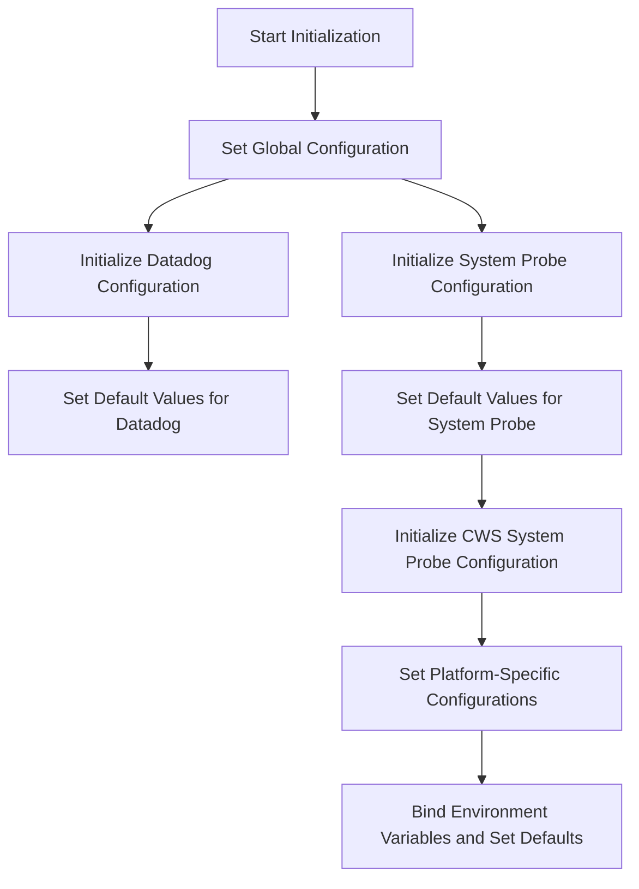

This document will cover the Initialization Process Overview for the Datadog Agent, which includes:

1. Setting up the global configuration
2. Initializing specific configurations for different components
3. Binding environment variables and setting default values.

Technical document: <SwmLink doc-title="Initialization Process Overview">[Initialization Process Overview](/.swm/initialization-process-overview.ln5q0fww.sw.md)</SwmLink>

# [Setting up the global configuration](https://app.swimm.io/repos/Z2l0aHViJTNBJTNBZGF0YWRvZy1hZ2VudCUzQSUzQVN3aW1tLURlbW8=/docs/ln5q0fww#initialization-of-configuration-settings)

The initialization process begins by setting up the global configuration for both Datadog and the System Probe. This involves creating new configuration objects and setting default values for various settings. This step ensures that the basic configuration framework is in place before moving on to more specific configurations.

# [Initializing specific configurations for different components](https://app.swimm.io/repos/Z2l0aHViJTNBJTNBZGF0YWRvZy1hZ2VudCUzQSUzQVN3aW1tLURlbW8=/docs/ln5q0fww#initializing-configuration-defaults)

After setting up the global configuration, the process continues by initializing specific configurations for different components. For instance, the Datadog configuration and the System Probe configuration are initialized separately. Each of these components has its own set of default values and environment variables that need to be configured. This step ensures that each component is properly configured and ready for use.

# [Binding environment variables and setting default values](https://app.swimm.io/repos/Z2l0aHViJTNBJTNBZGF0YWRvZy1hZ2VudCUzQSUzQVN3aW1tLURlbW8=/docs/ln5q0fww#setting-configuration-defaults)

The next step involves binding environment variables and setting default values for various configuration options. This is crucial for ensuring that the configuration is properly initialized with sensible defaults. For example, default values are set for auto exit configurations, process configurations, and log configurations. This step ensures that the system behaves predictably and can be easily customized through environment variables.

# [Setting up process configuration](https://app.swimm.io/repos/Z2l0aHViJTNBJTNBZGF0YWRvZy1hZ2VudCUzQSUzQVN3aW1tLURlbW8=/docs/ln5q0fww#setting-up-process-configuration)

The process configuration is set up by binding environment variables and setting default values for various process-related settings. This includes enabling or disabling specific features and setting parameters for process monitoring. This step ensures that the process-related configurations are properly initialized and can be customized as needed.

# [Binding environment variables for logs](https://app.swimm.io/repos/Z2l0aHViJTNBJTNBZGF0YWRvZy1hZ2VudCUzQSUzQVN3aW1tLURlbW8=/docs/ln5q0fww#binding-environment-variables-for-logs)

The log configuration involves binding environment variables and setting default values for various log-related settings. This includes configuring log endpoints, compression settings, and batch processing parameters. This step ensures that the log configurations are properly initialized and can be easily customized through environment variables.

# [Setting up system probe configuration](https://app.swimm.io/repos/Z2l0aHViJTNBJTNBZGF0YWRvZy1hZ2VudCUzQSUzQVN3aW1tLURlbW8=/docs/ln5q0fww#setting-up-system-probe-configuration)

The system probe configuration is set up by binding environment variables and setting default values for various features such as SBOM (Software Bill of Materials) and auto exit configurations. This step ensures that the system probe configurations are properly initialized and can be customized as needed.

# [Event Monitor Configuration](https://app.swimm.io/repos/Z2l0aHViJTNBJTNBZGF0YWRvZy1hZ2VudCUzQSUzQVN3aW1tLURlbW8=/docs/ln5q0fww#event-monitor-configuration)

The event monitor configuration involves setting up environment bindings and default values for event monitoring configurations. This includes enabling or disabling specific probes and setting various parameters for event monitoring. This step ensures that the event monitoring configurations are properly initialized and can be customized as needed.

# [Initializing CWS System Probe Configuration](https://app.swimm.io/repos/Z2l0aHViJTNBJTNBZGF0YWRvZy1hZ2VudCUzQSUzQVN3aW1tLURlbW8=/docs/ln5q0fww#initializing-cws-system-probe-configuration)

The CWS (Cloud Workload Security) system probe configuration is initialized by setting platform-specific configurations and binding various environment variables. This includes configurations for runtime security, activity dumps, SBOM, security profiles, auto suppression, anomaly detection, hash algorithms, user sessions, eBPF-less mode, IMDS (Instance Metadata Service), and enforcement capabilities. This step ensures that the CWS system probe configurations are properly initialized and can be customized as needed.

&nbsp;

*This is an auto-generated document by Swimm AI 🌊 and has not yet been verified by a human*

<SwmMeta version="3.0.0" repo-id="Z2l0aHViJTNBJTNBZGF0YWRvZy1hZ2VudCUzQSUzQVN3aW1tLURlbW8=" repo-name="datadog-agent">Powered by [Swimm](/)</SwmMeta>
