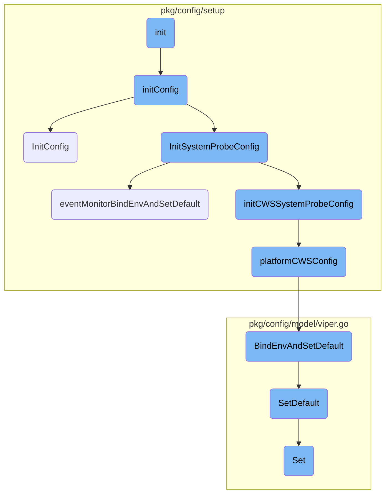
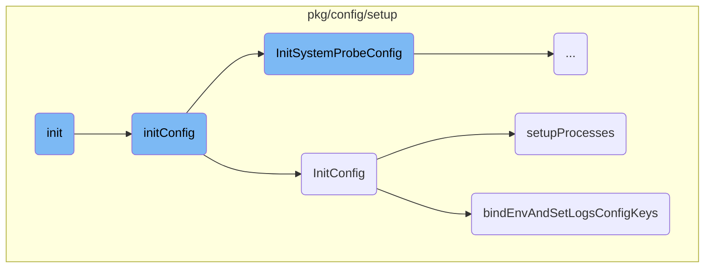
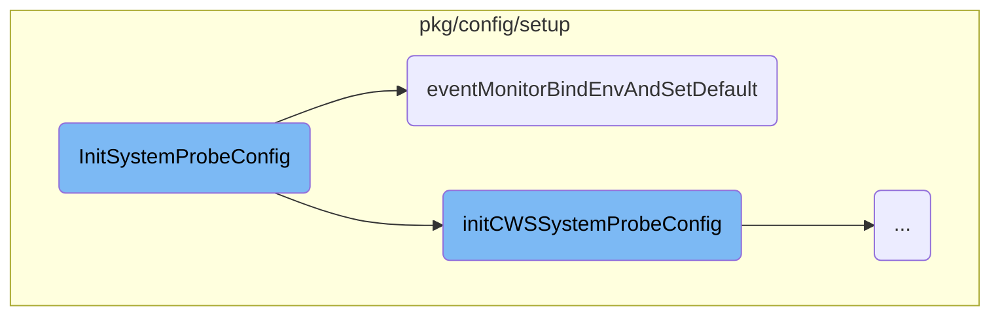
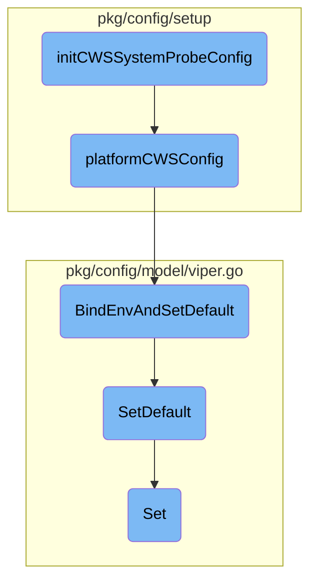

This document explains the initialization process for the Datadog Agent's configuration settings. The initialization process involves setting up the global configuration for both Datadog and the System Probe, ensuring that all necessary defaults and environment variables are properly configured.

The initialization process starts by setting up the global configuration for Datadog and the System Probe. This involves creating new configuration objects and setting default values for various settings. The process continues by initializing specific configurations for different components, such as the System Probe and Cloud Workload Security (CWS) system probe. Each of these components has its own set of default values and environment variables that need to be configured. The flow ensures that all necessary settings are properly initialized and ready for use.

Here is a high level diagram of the flow, showing only the most important functions:



# Flow drill down

First, we'll zoom into this section of the flow:



<SwmSnippet path="/pkg/config/setup/config.go" line="238">

---

## Initialization of Configuration Settings

The <SwmToken path="pkg/config/setup/config.go" pos="238:2:2" line-data="func init() {">`init`</SwmToken> function is responsible for initializing the Datadog global configuration. It sets up the configuration for both Datadog and the System Probe by calling <SwmToken path="pkg/config/setup/config.go" pos="245:1:1" line-data="	initConfig()">`initConfig`</SwmToken>.

```go
func init() {
	osinit()
	// Configure Datadog global configuration
	datadog = pkgconfigmodel.NewConfig("datadog", "DD", strings.NewReplacer(".", "_"))
	SystemProbe = pkgconfigmodel.NewConfig("system-probe", "DD", strings.NewReplacer(".", "_"))

	// Configuration defaults
	initConfig()
}
```

---

</SwmSnippet>

<SwmSnippet path="/pkg/config/setup/config_init.go" line="10">

---

### Initializing Configuration Defaults

The <SwmToken path="pkg/config/setup/config_init.go" pos="10:2:2" line-data="func initConfig() {">`initConfig`</SwmToken> function initializes the configuration for Datadog and the System Probe by calling <SwmToken path="pkg/config/setup/config_init.go" pos="10:2:2" line-data="func initConfig() {">`initConfig`</SwmToken> and <SwmToken path="pkg/config/setup/config_init.go" pos="12:1:1" line-data="	InitSystemProbeConfig(SystemProbe)">`InitSystemProbeConfig`</SwmToken> respectively.

```go
func initConfig() {
	InitConfig(Datadog())
	InitSystemProbeConfig(SystemProbe)
}
```

---

</SwmSnippet>

<SwmSnippet path="/pkg/config/setup/config.go" line="256">

---

### Setting Configuration Defaults

The <SwmToken path="pkg/config/setup/config.go" pos="256:2:2" line-data="// InitConfig initializes the config defaults on a config used by all agents">`InitConfig`</SwmToken> function sets various default configuration values using <SwmToken path="pkg/config/setup/config.go" pos="262:3:3" line-data="	config.BindEnvAndSetDefault(&quot;auto_exit.validation_period&quot;, 60)">`BindEnvAndSetDefault`</SwmToken>. This ensures that the configuration is properly initialized with sensible defaults.

```go
// InitConfig initializes the config defaults on a config used by all agents
// (in particular more than just the serverless agent).
func InitConfig(config pkgconfigmodel.Config) {
	initCommonWithServerless(config)

	// Auto exit configuration
	config.BindEnvAndSetDefault("auto_exit.validation_period", 60)
	config.BindEnvAndSetDefault("auto_exit.noprocess.enabled", false)
	config.BindEnvAndSetDefault("auto_exit.noprocess.excluded_processes", []string{})

	// The number of commits before expiring a context. The value is 2 to handle
	// the case where a check miss to send a metric.
	config.BindEnvAndSetDefault("check_sampler_bucket_commits_count_expiry", 2)
	// The number of seconds before removing stateful metric data after expiring a
	// context. Default is 25h, to minimise problems for checks that emit metircs
	// only occasionally.
	config.BindEnvAndSetDefault("check_sampler_stateful_metric_expiration_time", 25*time.Hour)
	config.BindEnvAndSetDefault("check_sampler_expire_metrics", true)
	config.BindEnvAndSetDefault("check_sampler_context_metrics", false)
	config.BindEnvAndSetDefault("host_aliases", []string{})
```

---

</SwmSnippet>

<SwmSnippet path="/pkg/config/setup/process.go" line="110">

---

### Setting Up Process Configuration

The <SwmToken path="pkg/config/setup/process.go" pos="110:2:2" line-data="func setupProcesses(config pkgconfigmodel.Config) {">`setupProcesses`</SwmToken> function configures the process-related settings. It binds environment variables and sets default values for various process configuration options.

```go
func setupProcesses(config pkgconfigmodel.Config) {
	// "process_config.enabled" is deprecated. We must still be able to detect if it is present, to know if we should use it
	// or container_collection.enabled and process_collection.enabled.
	procBindEnv(config, "process_config.enabled")
	config.SetEnvKeyTransformer("process_config.enabled", func(val string) interface{} {
		// DD_PROCESS_AGENT_ENABLED: true - Process + Container checks enabled
		//                           false - No checks enabled
		//                           (unset) - Defaults are used, only container check is enabled
		if enabled, _ := strconv.ParseBool(val); enabled {
			return "true"
		}
		return "disabled"
	})
	procBindEnvAndSetDefault(config, "process_config.container_collection.enabled", true)
	procBindEnvAndSetDefault(config, "process_config.process_collection.enabled", false)

```

---

</SwmSnippet>

<SwmSnippet path="/pkg/config/setup/config.go" line="2261">

---

### Binding Environment Variables for Logs

The <SwmToken path="pkg/config/setup/config.go" pos="2261:2:2" line-data="func bindEnvAndSetLogsConfigKeys(config pkgconfigmodel.Setup, prefix string) {">`bindEnvAndSetLogsConfigKeys`</SwmToken> function binds environment variables related to logs and sets default values for log configuration settings.

```go
func bindEnvAndSetLogsConfigKeys(config pkgconfigmodel.Setup, prefix string) {
	config.BindEnv(prefix + "logs_dd_url") // Send the logs to a proxy. Must respect format '<HOST>:<PORT>' and '<PORT>' to be an integer
	config.BindEnv(prefix + "dd_url")
	config.BindEnv(prefix + "additional_endpoints")
	config.BindEnvAndSetDefault(prefix+"use_compression", true)
	config.BindEnvAndSetDefault(prefix+"compression_level", 6) // Default level for the gzip/deflate algorithm
	config.BindEnvAndSetDefault(prefix+"batch_wait", DefaultBatchWait)
	config.BindEnvAndSetDefault(prefix+"connection_reset_interval", 0) // in seconds, 0 means disabled
	config.BindEnvAndSetDefault(prefix+"logs_no_ssl", false)
	config.BindEnvAndSetDefault(prefix+"batch_max_concurrent_send", DefaultBatchMaxConcurrentSend)
	config.BindEnvAndSetDefault(prefix+"batch_max_content_size", DefaultBatchMaxContentSize)
	config.BindEnvAndSetDefault(prefix+"batch_max_size", DefaultBatchMaxSize)
	config.BindEnvAndSetDefault(prefix+"input_chan_size", DefaultInputChanSize) // Only used by EP Forwarder for now, not used by logs
	config.BindEnvAndSetDefault(prefix+"sender_backoff_factor", DefaultLogsSenderBackoffFactor)
	config.BindEnvAndSetDefault(prefix+"sender_backoff_base", DefaultLogsSenderBackoffBase)
	config.BindEnvAndSetDefault(prefix+"sender_backoff_max", DefaultLogsSenderBackoffMax)
	config.BindEnvAndSetDefault(prefix+"sender_recovery_interval", DefaultForwarderRecoveryInterval)
	config.BindEnvAndSetDefault(prefix+"sender_recovery_reset", false)
	config.BindEnvAndSetDefault(prefix+"use_v2_api", true)
	config.SetKnown(prefix + "dev_mode_no_ssl")
}
```

---

</SwmSnippet>

Now, lets zoom into this section of the flow:



<SwmSnippet path="/pkg/config/setup/system_probe.go" line="66">

---

## Setting up system probe configuration

The <SwmToken path="pkg/config/setup/config_init.go" pos="12:1:1" line-data="	InitSystemProbeConfig(SystemProbe)">`InitSystemProbeConfig`</SwmToken> function initializes various configuration settings for the system probe. It binds environment variables and sets default values for different features such as SBOM (Software Bill of Materials) and auto exit configurations.

```go
	cfg.BindEnvAndSetDefault("ignore_host_etc", false)
	cfg.BindEnvAndSetDefault("go_core_dump", false)

	// SBOM configuration
	cfg.BindEnvAndSetDefault("sbom.host.enabled", false)
	cfg.BindEnvAndSetDefault("sbom.host.analyzers", []string{"os"})
	cfg.BindEnvAndSetDefault("sbom.cache_directory", filepath.Join(defaultRunPath, "sbom-sysprobe"))
	cfg.BindEnvAndSetDefault("sbom.clear_cache_on_exit", false)
	cfg.BindEnvAndSetDefault("sbom.cache.max_disk_size", 1000*1000*100) // used by custom cache: max disk space used by cached objects. Not equal to max disk usage
	cfg.BindEnvAndSetDefault("sbom.cache.clean_interval", "30m")        // used by custom cache.
	cfg.BindEnvAndSetDefault("sbom.scan_queue.base_backoff", "5m")
	cfg.BindEnvAndSetDefault("sbom.scan_queue.max_backoff", "1h")

```

---

</SwmSnippet>

<SwmSnippet path="/pkg/config/setup/system_probe.go" line="334">

---

### Event Monitor Configuration

The <SwmToken path="pkg/config/setup/system_probe.go" pos="337:1:1" line-data="	eventMonitorBindEnvAndSetDefault(cfg, join(evNS, &quot;enable_all_probes&quot;), false)">`eventMonitorBindEnvAndSetDefault`</SwmToken> function is used within <SwmToken path="pkg/config/setup/config_init.go" pos="12:1:1" line-data="	InitSystemProbeConfig(SystemProbe)">`InitSystemProbeConfig`</SwmToken> to set up environment bindings and default values for event monitoring configurations. This includes enabling or disabling specific probes and setting various parameters for event monitoring.

```go
	// event monitoring
	cfg.BindEnvAndSetDefault(join(evNS, "process", "enabled"), false, "DD_SYSTEM_PROBE_EVENT_MONITORING_PROCESS_ENABLED")
	cfg.BindEnvAndSetDefault(join(evNS, "network_process", "enabled"), true, "DD_SYSTEM_PROBE_EVENT_MONITORING_NETWORK_PROCESS_ENABLED")
	eventMonitorBindEnvAndSetDefault(cfg, join(evNS, "enable_all_probes"), false)
	eventMonitorBindEnvAndSetDefault(cfg, join(evNS, "enable_kernel_filters"), true)
	eventMonitorBindEnv(cfg, join(evNS, "enable_approvers"))
	eventMonitorBindEnv(cfg, join(evNS, "enable_discarders"))
	eventMonitorBindEnvAndSetDefault(cfg, join(evNS, "flush_discarder_window"), 3)
	eventMonitorBindEnvAndSetDefault(cfg, join(evNS, "pid_cache_size"), 10000)
	eventMonitorBindEnvAndSetDefault(cfg, join(evNS, "events_stats.tags_cardinality"), "high")
	eventMonitorBindEnvAndSetDefault(cfg, join(evNS, "custom_sensitive_words"), []string{})
	eventMonitorBindEnvAndSetDefault(cfg, join(evNS, "erpc_dentry_resolution_enabled"), true)
	eventMonitorBindEnvAndSetDefault(cfg, join(evNS, "map_dentry_resolution_enabled"), true)
	eventMonitorBindEnvAndSetDefault(cfg, join(evNS, "dentry_cache_size"), 1024)
	eventMonitorBindEnvAndSetDefault(cfg, join(evNS, "remote_tagger"), true)
	eventMonitorBindEnvAndSetDefault(cfg, join(evNS, "runtime_monitor.enabled"), false)
	eventMonitorBindEnvAndSetDefault(cfg, join(evNS, "network.lazy_interface_prefixes"), []string{})
	eventMonitorBindEnvAndSetDefault(cfg, join(evNS, "network.classifier_priority"), 10)
	eventMonitorBindEnvAndSetDefault(cfg, join(evNS, "network.classifier_handle"), 0)
	eventMonitorBindEnvAndSetDefault(cfg, join(evNS, "event_stream.use_ring_buffer"), true)
	eventMonitorBindEnvAndSetDefault(cfg, join(evNS, "event_stream.use_fentry"), false)
```

---

</SwmSnippet>

<SwmSnippet path="/pkg/config/setup/system_probe.go" line="400">

---

## Helper Function for Event Monitor

The <SwmToken path="pkg/config/setup/system_probe.go" pos="400:2:2" line-data="// eventMonitorBindEnvAndSetDefault is a helper function that generates both &quot;DD_RUNTIME_SECURITY_CONFIG_&quot; and &quot;DD_EVENT_MONITORING_CONFIG_&quot;">`eventMonitorBindEnvAndSetDefault`</SwmToken> helper function generates environment variable prefixes for both <SwmToken path="pkg/config/setup/system_probe.go" pos="400:19:19" line-data="// eventMonitorBindEnvAndSetDefault is a helper function that generates both &quot;DD_RUNTIME_SECURITY_CONFIG_&quot; and &quot;DD_EVENT_MONITORING_CONFIG_&quot;">`DD_RUNTIME_SECURITY_CONFIG_`</SwmToken> and <SwmToken path="pkg/config/setup/system_probe.go" pos="400:25:25" line-data="// eventMonitorBindEnvAndSetDefault is a helper function that generates both &quot;DD_RUNTIME_SECURITY_CONFIG_&quot; and &quot;DD_EVENT_MONITORING_CONFIG_&quot;">`DD_EVENT_MONITORING_CONFIG_`</SwmToken>. This ensures backward compatibility while setting default values for event monitoring configurations.

```go
// eventMonitorBindEnvAndSetDefault is a helper function that generates both "DD_RUNTIME_SECURITY_CONFIG_" and "DD_EVENT_MONITORING_CONFIG_"
// prefixes from a key. We need this helper function because the standard BindEnvAndSetDefault can only generate one prefix, but we want to
// support both for backwards compatibility.
func eventMonitorBindEnvAndSetDefault(config pkgconfigmodel.Config, key string, val interface{}) {
	// Uppercase, replace "." with "_" and add "DD_" prefix to key so that we follow the same environment
	// variable convention as the core agent.
	emConfigKey := "DD_" + strings.Replace(strings.ToUpper(key), ".", "_", -1)
	runtimeSecKey := strings.Replace(emConfigKey, "EVENT_MONITORING_CONFIG", "RUNTIME_SECURITY_CONFIG", 1)

	envs := []string{emConfigKey, runtimeSecKey}
	config.BindEnvAndSetDefault(key, val, envs...)
}
```

---

</SwmSnippet>

Now, lets zoom into this section of the flow:



<SwmSnippet path="/pkg/config/setup/system_probe_cws.go" line="13">

---

## Initializing CWS System Probe Configuration

The function <SwmToken path="pkg/config/setup/system_probe_cws.go" pos="13:2:2" line-data="func initCWSSystemProbeConfig(cfg pkgconfigmodel.Config) {">`initCWSSystemProbeConfig`</SwmToken> initializes the configuration for the CWS (Cloud Workload Security) system probe. It starts by calling <SwmToken path="pkg/config/setup/system_probe_cws.go" pos="18:1:1" line-data="	platformCWSConfig(cfg)">`platformCWSConfig`</SwmToken> to set platform-specific configurations.

```go
func initCWSSystemProbeConfig(cfg pkgconfigmodel.Config) {
	// CWS - general config
	// the following entries are platform specific
	// - runtime_security_config.policies.dir
	// - runtime_security_config.socket
	platformCWSConfig(cfg)
```

---

</SwmSnippet>

<SwmSnippet path="/pkg/config/setup/system_probe_cws_notwin.go" line="16">

---

## Platform-Specific Configuration

The function <SwmToken path="pkg/config/setup/system_probe_cws_notwin.go" pos="16:2:2" line-data="func platformCWSConfig(cfg pkgconfigmodel.Config) {">`platformCWSConfig`</SwmToken> sets platform-specific configurations for the CWS system probe, such as the directory for runtime security policies and the socket path.

```go
func platformCWSConfig(cfg pkgconfigmodel.Config) {
	cfg.BindEnvAndSetDefault("runtime_security_config.policies.dir", DefaultRuntimePoliciesDir)
	cfg.BindEnvAndSetDefault("runtime_security_config.socket", filepath.Join(InstallPath, "run/runtime-security.sock"))
}
```

---

</SwmSnippet>

<SwmSnippet path="/pkg/config/setup/system_probe_cws.go" line="21">

---

## Binding Environment Variables and Setting Defaults

After setting platform-specific configurations, <SwmToken path="pkg/config/setup/system_probe_cws.go" pos="13:2:2" line-data="func initCWSSystemProbeConfig(cfg pkgconfigmodel.Config) {">`initCWSSystemProbeConfig`</SwmToken> binds various environment variables and sets their default values. This includes configurations for runtime security, activity dumps, SBOM (Software Bill of Materials), security profiles, auto suppression, anomaly detection, hash algorithms, user sessions, eBPF-less mode, IMDS (Instance Metadata Service), and enforcement capabilities.

```go
	cfg.BindEnvAndSetDefault("runtime_security_config.enabled", false)
	cfg.BindEnv("runtime_security_config.fim_enabled")
	cfg.BindEnvAndSetDefault("runtime_security_config.policies.watch_dir", false)
	cfg.BindEnvAndSetDefault("runtime_security_config.policies.monitor.enabled", false)
	cfg.BindEnvAndSetDefault("runtime_security_config.policies.monitor.per_rule_enabled", false)
	cfg.BindEnvAndSetDefault("runtime_security_config.policies.monitor.report_internal_policies", false)
	cfg.BindEnvAndSetDefault("runtime_security_config.event_server.burst", 40)
	cfg.BindEnvAndSetDefault("runtime_security_config.event_server.retention", "6s")
	cfg.BindEnvAndSetDefault("runtime_security_config.event_server.rate", 10)
	cfg.BindEnvAndSetDefault("runtime_security_config.cookie_cache_size", 100)
	cfg.BindEnvAndSetDefault("runtime_security_config.internal_monitoring.enabled", false)
	cfg.BindEnvAndSetDefault("runtime_security_config.log_patterns", []string{})
	cfg.BindEnvAndSetDefault("runtime_security_config.log_tags", []string{})
	cfg.BindEnvAndSetDefault("runtime_security_config.self_test.enabled", true)
	cfg.BindEnvAndSetDefault("runtime_security_config.self_test.send_report", true)
	cfg.BindEnvAndSetDefault("runtime_security_config.remote_configuration.enabled", true)
	cfg.BindEnvAndSetDefault("runtime_security_config.remote_configuration.dump_policies", false)
	cfg.BindEnvAndSetDefault("runtime_security_config.direct_send_from_system_probe", false)
	cfg.BindEnvAndSetDefault("runtime_security_config.use_secruntime_track", true)
	cfg.BindEnvAndSetDefault("runtime_security_config.compliance_module.enabled", false)
	cfg.BindEnvAndSetDefault("runtime_security_config.on_demand.enabled", false)
```

---

</SwmSnippet>

<SwmSnippet path="/pkg/config/model/viper.go" line="761">

---

### Binding Environment Variables and Setting Defaults

The method <SwmToken path="pkg/config/model/viper.go" pos="761:2:2" line-data="// BindEnvAndSetDefault implements the Config interface">`BindEnvAndSetDefault`</SwmToken> binds an environment variable and sets its default value. This method is used extensively in <SwmToken path="pkg/config/setup/system_probe_cws.go" pos="13:2:2" line-data="func initCWSSystemProbeConfig(cfg pkgconfigmodel.Config) {">`initCWSSystemProbeConfig`</SwmToken> to configure various settings.

```go
// BindEnvAndSetDefault implements the Config interface
func (c *safeConfig) BindEnvAndSetDefault(key string, val interface{}, env ...string) {
	c.SetDefault(key, val)
	c.BindEnv(append([]string{key}, env...)...) //nolint:errcheck
}
```

---

</SwmSnippet>

<SwmSnippet path="/pkg/config/model/viper.go" line="153">

---

### Setting Default Values

The method <SwmToken path="pkg/config/model/viper.go" pos="153:2:2" line-data="// SetDefault wraps Viper for concurrent access">`SetDefault`</SwmToken> sets a default value for a given configuration key. This method is called by <SwmToken path="pkg/config/setup/config.go" pos="262:3:3" line-data="	config.BindEnvAndSetDefault(&quot;auto_exit.validation_period&quot;, 60)">`BindEnvAndSetDefault`</SwmToken> to ensure that each configuration has a default value.

```go
// SetDefault wraps Viper for concurrent access
func (c *safeConfig) SetDefault(key string, value interface{}) {
	c.Lock()
	defer c.Unlock()
	c.configSources[SourceDefault].Set(key, value)
	c.Viper.SetDefault(key, value)
}
```

---

</SwmSnippet>

<SwmSnippet path="/pkg/config/model/viper.go" line="123">

---

### Setting Configuration Values

The method <SwmToken path="pkg/config/model/viper.go" pos="123:2:2" line-data="// Set wraps Viper for concurrent access">`Set`</SwmToken> sets a new value for a given configuration key and notifies all registered receivers about the updated setting. This method ensures that configuration changes are propagated throughout the system.

```go
// Set wraps Viper for concurrent access
func (c *safeConfig) Set(key string, newValue interface{}, source Source) {
	if source == SourceDefault {
		c.SetDefault(key, newValue)
		return
	}

	// modify the config then release the lock to avoid deadlocks while notifying
	var receivers []NotificationReceiver
	c.Lock()
	previousValue := c.Viper.Get(key)
	c.configSources[source].Set(key, newValue)
	c.mergeViperInstances(key)
	if !reflect.DeepEqual(previousValue, newValue) {
		// if the value has not changed, do not duplicate the slice so that no callback is called
		receivers = slices.Clone(c.notificationReceivers)
	}
	c.Unlock()

	// notifying all receiver about the updated setting
	for _, receiver := range receivers {
```

---

</SwmSnippet>

&nbsp;

*This is an auto-generated document by Swimm AI 🌊 and has not yet been verified by a human*

<SwmMeta version="3.0.0" repo-id="Z2l0aHViJTNBJTNBZGF0YWRvZy1hZ2VudCUzQSUzQVN3aW1tLURlbW8=" repo-name="datadog-agent"><sup>Powered by [Swimm](/)</sup></SwmMeta>
