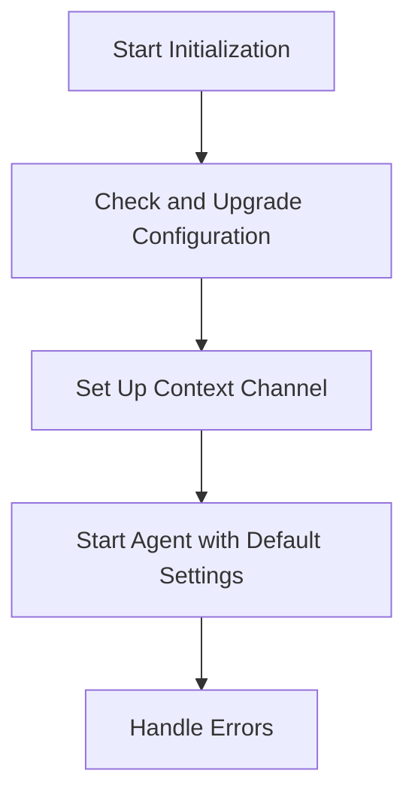

This document will cover the Initialization Process of the Datadog Agent, which includes:

1. Checking and Upgrading Configuration
2. Setting Up a Context Channel
3. Starting the Agent with Default Settings

Technical document: <SwmLink doc-title="Initialization Process">[Initialization Process](/.swm/initialization-process.cdhyrt40.sw.md)</SwmLink>

# [Checking and Upgrading Configuration](https://app.swimm.io/repos/Z2l0aHViJTNBJTNBZGF0YWRvZy1hZ2VudCUzQSUzQVN3aW1tLURlbW8=/docs/cdhyrt40#configuration-upgrade)

The initialization process begins by ensuring that the configuration file is up-to-date. If an old configuration file is detected, it is upgraded to the new format. This step ensures that the agent operates with the latest settings and configurations. The system checks for the presence of an old <SwmPath>[cmd/agent/common/tests/a5_conf/datadog.conf](cmd/agent/common/tests/a5_conf/datadog.conf)</SwmPath> file. If found, it is upgraded to <SwmPath>[pkg/util/scrubber/test/datadog.yaml](pkg/util/scrubber/test/datadog.yaml)</SwmPath>. This upgrade process includes verifying that the new configuration file contains an API key, which is essential for the agent to communicate with the Datadog platform. If the API key is missing, the upgrade process is halted, and an error is logged.

# [Setting Up a Context Channel](https://app.swimm.io/repos/Z2l0aHViJTNBJTNBZGF0YWRvZy1hZ2VudCUzQSUzQVN3aW1tLURlbW8=/docs/cdhyrt40#initialization)

After ensuring the configuration is up-to-date, a context channel is set up. This channel is crucial for managing the lifecycle of the agent. It allows the agent to handle various states and transitions smoothly. The context channel acts as a communication pathway, enabling different parts of the agent to coordinate and manage tasks effectively. This setup ensures that the agent can respond to changes and commands in real-time, providing a seamless user experience.

# [Starting the Agent with Default Settings](https://app.swimm.io/repos/Z2l0aHViJTNBJTNBZGF0YWRvZy1hZ2VudCUzQSUzQVN3aW1tLURlbW8=/docs/cdhyrt40#initialization)

Once the context channel is established, the agent is started with default settings. This step involves initializing various components and services that the agent relies on to function correctly. Starting the agent with default settings ensures that it operates in a known and stable state, providing consistent performance and reliability. If any errors occur during this process, they are handled appropriately to prevent the agent from crashing or becoming unresponsive. This error handling mechanism ensures that the agent can recover from issues and continue to operate, minimizing downtime and disruptions for the end user.

&nbsp;

*This is an auto-generated document by Swimm AI 🌊 and has not yet been verified by a human*

<SwmMeta version="3.0.0" repo-id="Z2l0aHViJTNBJTNBZGF0YWRvZy1hZ2VudCUzQSUzQVN3aW1tLURlbW8=" repo-name="datadog-agent">Powered by [Swimm](/)</SwmMeta>
