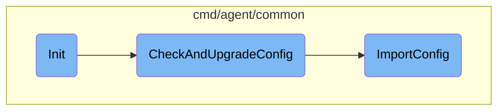

In this document, we will explain the initialization process of the Datadog Agent service. The process involves checking and upgrading the configuration, setting up a context channel, and starting the agent with default settings.

The initialization process starts by checking if the configuration file is up-to-date. If an old configuration file is found, it is upgraded to the new format. Next, a context channel is set up to manage the agent's lifecycle. Finally, the agent is started with default settings, and any errors encountered during this process are handled appropriately.

# Flow drill down



<SwmSnippet path="/cmd/agent/windows/service/service.go" line="35">

---

## Initialization

The <SwmToken path="tasks/kmt.py" pos="304:2:2" line-data="def init(ctx: Context, lite=False, images: str | None = None):">`init`</SwmToken> function initializes the service by first calling <SwmToken path="cmd/agent/windows/service/service.go" pos="35:7:7" line-data="	_ = common.CheckAndUpgradeConfig()">`CheckAndUpgradeConfig`</SwmToken> to ensure the configuration is up-to-date. It then sets up a context channel and starts the agent with default settings. If any errors occur during the startup, they are returned.

```go
	_ = common.CheckAndUpgradeConfig()
	// ignore config upgrade error, continue running with what we have.

	s.ctxChan = make(chan context.Context)

	errChan, err := runcmd.StartAgentWithDefaults(s.ctxChan)
	if err != nil {
		return err
	}

	s.errChan = errChan

	return nil
```

---

</SwmSnippet>

<SwmSnippet path="/cmd/agent/common/common_windows.go" line="45">

---

## Configuration Upgrade

The <SwmToken path="cmd/agent/common/common_windows.go" pos="45:2:2" line-data="func CheckAndUpgradeConfig() error {">`CheckAndUpgradeConfig`</SwmToken> function checks for an old <SwmPath>[cmd/agent/common/tests/a5_conf/datadog.conf](cmd/agent/common/tests/a5_conf/datadog.conf)</SwmPath> file and upgrades it to <SwmPath>[pkg/util/scrubber/test/datadog.yaml](pkg/util/scrubber/test/datadog.yaml)</SwmPath> if necessary. It ensures that the new configuration file contains an API key and calls <SwmToken path="cmd/agent/common/common_windows.go" pos="60:5:5" line-data="	err = ImportConfig(path.DefaultConfPath, path.DefaultConfPath, false)">`ImportConfig`</SwmToken> to handle the actual upgrade process.

```go
func CheckAndUpgradeConfig() error {
	datadogConfPath := filepath.Join(path.DefaultConfPath, "datadog.conf")
	if _, err := os.Stat(datadogConfPath); os.IsNotExist(err) {
		log.Debug("Previous config file not found, not upgrading")
		return nil
	}
	config.Datadog().AddConfigPath(path.DefaultConfPath)
	_, err := config.LoadWithoutSecret()
	if err == nil {
		// was able to read config, check for api key
		if config.Datadog().GetString("api_key") != "" {
			log.Debug("Datadog.yaml found, and API key present.  Not upgrading config")
			return nil
		}
	}
	err = ImportConfig(path.DefaultConfPath, path.DefaultConfPath, false)
	if err != nil {
		winutil.LogEventViewer(ServiceName, messagestrings.MSG_WARN_CONFIGUPGRADE_FAILED, err.Error())
		return err
	}
	return nil
```

---

</SwmSnippet>

<SwmSnippet path="/cmd/agent/common/import.go" line="29">

---

### Importing Configuration

The <SwmToken path="cmd/agent/common/import.go" pos="29:2:2" line-data="func ImportConfig(oldConfigDir string, newConfigDir string, force bool) error {">`ImportConfig`</SwmToken> function handles the migration of configuration settings from the old <SwmPath>[cmd/agent/common/tests/a5_conf/datadog.conf](cmd/agent/common/tests/a5_conf/datadog.conf)</SwmPath> to the new <SwmPath>[pkg/util/scrubber/test/datadog.yaml](pkg/util/scrubber/test/datadog.yaml)</SwmPath>. It reads the old configuration, creates the new configuration file if it doesn't exist, and merges the settings. It also handles the migration of specific configuration files and templates, ensuring that the new setup is complete and functional.

```go
func ImportConfig(oldConfigDir string, newConfigDir string, force bool) error {
	datadogConfPath := filepath.Join(oldConfigDir, "datadog.conf")
	datadogYamlPath := filepath.Join(newConfigDir, "datadog.yaml")
	traceAgentConfPath := filepath.Join(newConfigDir, "trace-agent.conf")
	configConverter := config.NewConfigConverter()
	const cfgExt = ".yaml"
	const dirExt = ".d"

	// read the old configuration in memory
	agentConfig, err := legacy.GetAgentConfig(datadogConfPath)
	if err != nil {
		return fmt.Errorf("unable to read data from %s: %v", datadogConfPath, err)
	}

	// the new config file might not exist, create it
	created := false
	if _, err := os.Stat(datadogYamlPath); os.IsNotExist(err) {
		f, err := os.Create(datadogYamlPath)
		if err != nil {
			return fmt.Errorf("error creating %s: %v", datadogYamlPath, err)
		}
```

---

</SwmSnippet>

&nbsp;

*This is an auto-generated document by Swimm AI 🌊 and has not yet been verified by a human*

<SwmMeta version="3.0.0" repo-id="Z2l0aHViJTNBJTNBZGF0YWRvZy1hZ2VudCUzQSUzQVN3aW1tLURlbW8=" repo-name="datadog-agent"><sup>Powered by [Swimm](/)</sup></SwmMeta>
