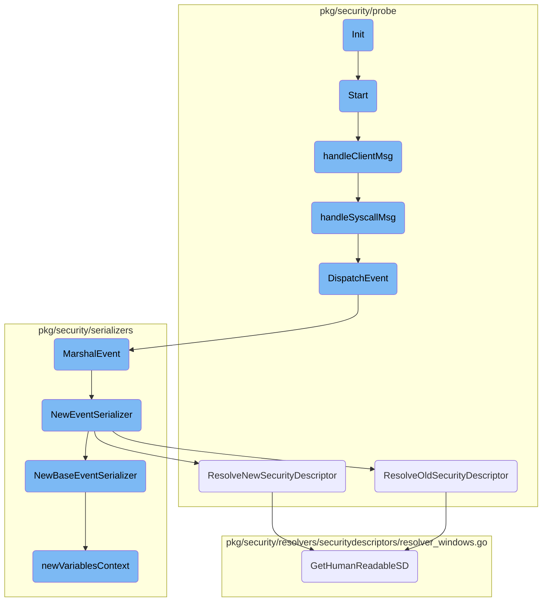

This document explains the initialization process of the security probe. The initialization is a crucial step that sets up the necessary context and dependencies required for the probe to function correctly.

The initialization process starts by setting up the resolvers, which are essential components that help the probe understand and manage various security-related data. Once the resolvers are started, the probe is ready to handle incoming connections and process messages. This setup ensures that the probe can effectively monitor and analyze security events.

# Flow drill down



<SwmSnippet path="/pkg/security/probe/probe_ebpfless.go" line="352">

---

## Initialization

The <SwmToken path="pkg/security/probe/probe_ebpfless.go" pos="352:2:2" line-data="// Init the probe">`Init`</SwmToken> function initializes the probe by starting the resolvers. This is a crucial step as it sets up the necessary context and dependencies required for the probe to function correctly.

```go
// Init the probe
func (p *EBPFLessProbe) Init() error {
	if err := p.Resolvers.Start(p.ctx); err != nil {
		return err
	}

	return nil
}
```

---

</SwmSnippet>

<SwmSnippet path="/pkg/security/probe/probe_ebpfless.go" line="473">

---

## Starting the Probe

The <SwmToken path="pkg/security/probe/probe_ebpfless.go" pos="473:2:2" line-data="// Start the probe">`Start`</SwmToken> function begins the probe's operation by setting up a TCP listener for incoming connections. It handles new client connections and processes messages from clients, ensuring the probe can receive and handle events.

```go
// Start the probe
func (p *EBPFLessProbe) Start() error {
	family, address := config.GetFamilyAddress(p.config.RuntimeSecurity.EBPFLessSocket)
	_ = family

	tcpAddr, err := net.ResolveTCPAddr("tcp4", address)
	if err != nil {
		return err
	}

	// Start listening for TCP connections on the given address
	listener, err := net.ListenTCP("tcp", tcpAddr)
	if err != nil {
		return err
	}

	ch := make(chan clientMsg, 100)

	p.wg.Add(1)
	go func() {
		defer p.wg.Done()
```

---

</SwmSnippet>

<SwmSnippet path="/pkg/security/probe/probe_ebpfless.go" line="89">

---

### Handling Client Messages

The <SwmToken path="pkg/security/probe/probe_ebpfless.go" pos="89:9:9" line-data="func (p *EBPFLessProbe) handleClientMsg(cl *client, msg *ebpfless.Message) {">`handleClientMsg`</SwmToken> function processes messages received from clients. It distinguishes between different message types, such as 'Hello' and 'Syscall', and takes appropriate actions based on the message type.

```go
func (p *EBPFLessProbe) handleClientMsg(cl *client, msg *ebpfless.Message) {
	switch msg.Type {
	case ebpfless.MessageTypeHello:
		if cl.nsID == 0 {
			p.probe.DispatchCustomEvent(
				NewEBPFLessHelloMsgEvent(msg.Hello, p.probe.scrubber),
			)

			cl.nsID = msg.Hello.NSID
			if msg.Hello.ContainerContext != nil {
				cl.containerID = msg.Hello.ContainerContext.ID
				cl.containerName = msg.Hello.ContainerContext.Name
				p.containerContexts[msg.Hello.ContainerContext.ID] = msg.Hello.ContainerContext
				seclog.Infof("tracing started for container ID [%s] (Name: [%s]) with entrypoint %q", msg.Hello.ContainerContext.ID, msg.Hello.ContainerContext.Name, msg.Hello.EntrypointArgs)
			}
		}
	case ebpfless.MessageTypeSyscall:
		p.handleSyscallMsg(cl, msg.Syscall)
	default:
		seclog.Errorf("unknown message type: %d", msg.Type)
	}
```

---

</SwmSnippet>

<SwmSnippet path="/pkg/security/probe/probe_ebpfless.go" line="132">

---

### Handling Syscall Messages

The <SwmToken path="pkg/security/probe/probe_ebpfless.go" pos="132:9:9" line-data="func (p *EBPFLessProbe) handleSyscallMsg(cl *client, syscallMsg *ebpfless.SyscallMsg) {">`handleSyscallMsg`</SwmToken> function processes syscall messages by creating events based on the syscall type. It updates process and container contexts and dispatches the event for further handling.

```go
func (p *EBPFLessProbe) handleSyscallMsg(cl *client, syscallMsg *ebpfless.SyscallMsg) {
	event := p.zeroEvent()
	event.NSID = cl.nsID

	switch syscallMsg.Type {
	case ebpfless.SyscallTypeExec:
		event.Type = uint32(model.ExecEventType)

		var entry *model.ProcessCacheEntry
		if syscallMsg.Exec.FromProcFS {
			entry = p.Resolvers.ProcessResolver.AddProcFSEntry(
				process.CacheResolverKey{Pid: syscallMsg.PID, NSID: cl.nsID}, syscallMsg.Exec.PPID, syscallMsg.Exec.File.Filename,
				syscallMsg.Exec.Args, syscallMsg.Exec.ArgsTruncated, syscallMsg.Exec.Envs, syscallMsg.Exec.EnvsTruncated,
				syscallMsg.ContainerID, syscallMsg.Timestamp, syscallMsg.Exec.TTY)
		} else {
			entry = p.Resolvers.ProcessResolver.AddExecEntry(
				process.CacheResolverKey{Pid: syscallMsg.PID, NSID: cl.nsID}, syscallMsg.Exec.PPID, syscallMsg.Exec.File.Filename,
				syscallMsg.Exec.Args, syscallMsg.Exec.ArgsTruncated, syscallMsg.Exec.Envs, syscallMsg.Exec.EnvsTruncated,
				syscallMsg.ContainerID, syscallMsg.Timestamp, syscallMsg.Exec.TTY)
		}

```

---

</SwmSnippet>

<SwmSnippet path="/pkg/security/probe/probe_ebpfless.go" line="338">

---

### Dispatching Events

The <SwmToken path="pkg/security/probe/probe_ebpfless.go" pos="338:2:2" line-data="// DispatchEvent sends an event to the probe event handler">`DispatchEvent`</SwmToken> function sends the processed event to the probe's event handler. It ensures that the event is handled by both wildcard handlers and specific event handlers.

```go
// DispatchEvent sends an event to the probe event handler
func (p *EBPFLessProbe) DispatchEvent(event *model.Event) {
	traceEvent("Dispatching event %s", func() ([]byte, model.EventType, error) {
		eventJSON, err := serializers.MarshalEvent(event, nil)
		return eventJSON, event.GetEventType(), err
	})

	// send event to wildcard handlers, like the CWS rule engine, first
	p.probe.sendEventToHandlers(event)

	// send event to specific event handlers, like the event monitor consumers, subsequently
	p.probe.sendEventToConsumers(event)
}
```

---

</SwmSnippet>

<SwmSnippet path="/pkg/security/serializers/serializers_windows.go" line="211">

---

### Marshaling Events

The <SwmToken path="pkg/security/serializers/serializers_windows.go" pos="211:2:2" line-data="// MarshalEvent marshal the event">`MarshalEvent`</SwmToken> function converts the event into a JSON format for serialization. This is essential for transmitting the event data in a structured format.

```go
// MarshalEvent marshal the event
func MarshalEvent(event *model.Event, opts *eval.Opts) ([]byte, error) {
	s := NewEventSerializer(event, opts)
	return json.Marshal(s)
}
```

---

</SwmSnippet>

<SwmSnippet path="/pkg/security/serializers/serializers_windows.go" line="222">

---

### Creating Event Serializer

The <SwmToken path="pkg/security/serializers/serializers_windows.go" pos="222:2:2" line-data="// NewEventSerializer creates a new event serializer based on the event type">`NewEventSerializer`</SwmToken> function creates a new event serializer based on the event type. It initializes various serializers depending on the specific event, ensuring that all relevant data is captured.

```go
// NewEventSerializer creates a new event serializer based on the event type
func NewEventSerializer(event *model.Event, opts *eval.Opts) *EventSerializer {
	s := &EventSerializer{
		BaseEventSerializer:   NewBaseEventSerializer(event, opts),
		UserContextSerializer: newUserContextSerializer(event),
	}
	eventType := model.EventType(event.Type)

	switch eventType {
	case model.CreateNewFileEventType:
		s.FileEventSerializer = &FileEventSerializer{
			FileSerializer: *newFimFileSerializer(&event.CreateNewFile.File, event),
		}
	case model.FileRenameEventType:
		s.FileEventSerializer = &FileEventSerializer{
			FileSerializer: *newFimFileSerializer(&event.RenameFile.Old, event),
			Destination:    newFimFileSerializer(&event.RenameFile.New, event),
		}
	case model.DeleteFileEventType:
		s.FileEventSerializer = &FileEventSerializer{
			FileSerializer: *newFimFileSerializer(&event.DeleteFile.File, event),
```

---

</SwmSnippet>

<SwmSnippet path="/pkg/security/probe/field_handlers_windows.go" line="149">

---

### Resolving Old Security Descriptor

The <SwmToken path="pkg/security/probe/field_handlers_windows.go" pos="149:2:2" line-data="// ResolveOldSecurityDescriptor resolves the old security descriptor">`ResolveOldSecurityDescriptor`</SwmToken> function resolves the old security descriptor to a <SwmToken path="pkg/security/resolvers/securitydescriptors/resolver_windows.go" pos="35:16:18" line-data="// Map of access masks initials to their human-readable names">`human-readable`</SwmToken> format. This is useful for understanding changes in security permissions.

```go
// ResolveOldSecurityDescriptor resolves the old security descriptor
func (fh *FieldHandlers) ResolveOldSecurityDescriptor(_ *model.Event, cp *model.ChangePermissionEvent) string {
	hrsd, err := fh.resolvers.SecurityDescriptorResolver.GetHumanReadableSD(cp.OldSd)
	if err != nil {
		return cp.OldSd
	}
	return hrsd
}
```

---

</SwmSnippet>

<SwmSnippet path="/pkg/security/probe/field_handlers_windows.go" line="158">

---

### Resolving New Security Descriptor

The <SwmToken path="pkg/security/probe/field_handlers_windows.go" pos="158:2:2" line-data="// ResolveNewSecurityDescriptor resolves the old security descriptor">`ResolveNewSecurityDescriptor`</SwmToken> function resolves the new security descriptor to a <SwmToken path="pkg/security/resolvers/securitydescriptors/resolver_windows.go" pos="35:16:18" line-data="// Map of access masks initials to their human-readable names">`human-readable`</SwmToken> format, similar to the old security descriptor resolution.

```go
// ResolveNewSecurityDescriptor resolves the old security descriptor
func (fh *FieldHandlers) ResolveNewSecurityDescriptor(_ *model.Event, cp *model.ChangePermissionEvent) string {
	hrsd, err := fh.resolvers.SecurityDescriptorResolver.GetHumanReadableSD(cp.NewSd)
	if err != nil {
		return cp.NewSd
	}
	return hrsd
}
```

---

</SwmSnippet>

<SwmSnippet path="/pkg/security/serializers/serializers_base.go" line="314">

---

### Creating Base Event Serializer

The <SwmToken path="pkg/security/serializers/serializers_base.go" pos="314:2:2" line-data="// NewBaseEventSerializer creates a new event serializer based on the event type">`NewBaseEventSerializer`</SwmToken> function creates a base event serializer that includes context and process information. This forms the foundation for more specific event serializers.

```go
// NewBaseEventSerializer creates a new event serializer based on the event type
func NewBaseEventSerializer(event *model.Event, opts *eval.Opts) *BaseEventSerializer {
	pc := event.ProcessContext

	eventType := model.EventType(event.Type)

	s := &BaseEventSerializer{
		EventContextSerializer: EventContextSerializer{
			Name:      eventType.String(),
			Variables: newVariablesContext(event, opts, ""),
		},
		ProcessContextSerializer: newProcessContextSerializer(pc, event),
		Date:                     utils.NewEasyjsonTime(event.ResolveEventTime()),
	}
	if s.ProcessContextSerializer != nil {
		s.ProcessContextSerializer.Variables = newVariablesContext(event, opts, "process.")
	}

	if event.IsAnomalyDetectionEvent() && len(event.Rules) > 0 {
		s.EventContextSerializer.MatchedRules = make([]MatchedRuleSerializer, 0, len(event.Rules))
		for _, r := range event.Rules {
```

---

</SwmSnippet>

<SwmSnippet path="/pkg/security/serializers/serializers_base.go" line="353">

---

### Creating Variables Context

The <SwmToken path="pkg/security/serializers/serializers_base.go" pos="353:2:2" line-data="func newVariablesContext(e *model.Event, opts *eval.Opts, prefix string) (variables Variables) {">`newVariablesContext`</SwmToken> function creates a context for variables used in the event. It filters and scrubs variables to ensure they are safe and relevant for the event.

```go
func newVariablesContext(e *model.Event, opts *eval.Opts, prefix string) (variables Variables) {
	if opts != nil && opts.VariableStore != nil {
		store := opts.VariableStore
		for name, variable := range store.Variables {
			if _, found := model.SECLVariables[name]; found {
				continue
			}

			if slices.Contains(bundled.InternalVariables[:], name) {
				continue
			}

			if (prefix != "" && !strings.HasPrefix(name, prefix)) ||
				(prefix == "" && strings.Contains(name, ".")) {
				continue
			}

			evaluator := variable.GetEvaluator()
			if evaluator, ok := evaluator.(eval.Evaluator); ok {
				value := evaluator.Eval(eval.NewContext(e))
				if variables == nil {
```

---

</SwmSnippet>

<SwmSnippet path="/pkg/security/resolvers/securitydescriptors/resolver_windows.go" line="98">

---

### Getting <SwmToken path="pkg/security/resolvers/securitydescriptors/resolver_windows.go" pos="35:16:18" line-data="// Map of access masks initials to their human-readable names">`human-readable`</SwmToken> Security Descriptor

The <SwmToken path="pkg/security/resolvers/securitydescriptors/resolver_windows.go" pos="98:2:2" line-data="// GetHumanReadableSD parse SDDL string to extract and translate the owner, group, and DACL">`GetHumanReadableSD`</SwmToken> function parses the SDDL string to extract and translate the owner, group, and DACL into a <SwmToken path="pkg/security/resolvers/securitydescriptors/resolver_windows.go" pos="35:16:18" line-data="// Map of access masks initials to their human-readable names">`human-readable`</SwmToken> format. This aids in understanding the security settings of an object.

```go
// GetHumanReadableSD parse SDDL string to extract and translate the owner, group, and DACL
func (resolver *Resolver) GetHumanReadableSD(sddl string) (string, error) {
	var builder strings.Builder

	// Extract the owner and group SIDs
	owner, group := extractOwnerGroup(sddl)
	if owner != "" {
		ownerName := resolver.userGroupResolver.GetUser(owner)
		if ownerName == "" {
			ownerName = owner // Fallback to SID string if account lookup fails
		}
		builder.WriteString(fmt.Sprintf("Owner: %s\n", ownerName))
	}
	if group != "" {
		groupName := resolver.userGroupResolver.GetUser(group)
		if groupName == "" {
			groupName = group // Fallback to SID string if account lookup fails
		}
		builder.WriteString(fmt.Sprintf("Group: %s\n", groupName))
	}

```

---

</SwmSnippet>

&nbsp;

*This is an auto-generated document by Swimm AI 🌊 and has not yet been verified by a human*

<SwmMeta version="3.0.0" repo-id="Z2l0aHViJTNBJTNBZGF0YWRvZy1hZ2VudCUzQSUzQVN3aW1tLURlbW8=" repo-name="datadog-agent"><sup>Powered by [Swimm](/)</sup></SwmMeta>
