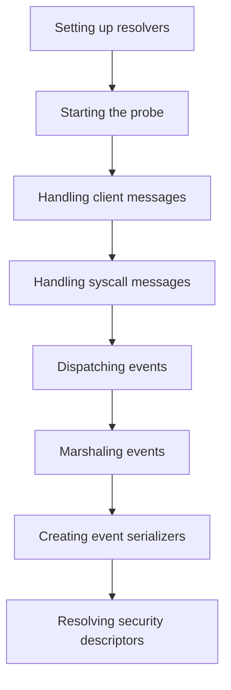

This document will cover the Initialization Process of the security probe, which includes:

1. Setting up resolvers
2. Starting the probe
3. Handling client messages
4. Handling syscall messages
5. Dispatching events
6. Marshaling events
7. Creating event serializers
8. Resolving security descriptors

Technical document: <SwmLink doc-title="Initialization Process">[Initialization Process](/.swm/initialization-process.jyz5llsx.sw.md)</SwmLink>

# [Setting up resolvers](https://app.swimm.io/repos/Z2l0aHViJTNBJTNBZGF0YWRvZy1hZ2VudCUzQSUzQVN3aW1tLURlbW8=/docs/jyz5llsx#initialization)

The initialization process begins by setting up the resolvers. Resolvers are essential components that help the probe understand and manage various security-related data. This step ensures that the necessary context and dependencies are in place for the probe to function correctly.

# [Starting the probe](https://app.swimm.io/repos/Z2l0aHViJTNBJTNBZGF0YWRvZy1hZ2VudCUzQSUzQVN3aW1tLURlbW8=/docs/jyz5llsx#starting-the-probe)

Once the resolvers are set up, the probe starts its operation by setting up a TCP listener for incoming connections. This allows the probe to handle new client connections and process messages from clients, ensuring it can receive and handle events effectively.

# [Handling client messages](https://app.swimm.io/repos/Z2l0aHViJTNBJTNBZGF0YWRvZy1hZ2VudCUzQSUzQVN3aW1tLURlbW8=/docs/jyz5llsx#handling-client-messages)

The probe processes messages received from clients. It distinguishes between different message types, such as 'Hello' and 'Syscall', and takes appropriate actions based on the message type. For example, 'Hello' messages might initiate a new session, while 'Syscall' messages might trigger specific security checks.

# [Handling syscall messages](https://app.swimm.io/repos/Z2l0aHViJTNBJTNBZGF0YWRvZy1hZ2VudCUzQSUzQVN3aW1tLURlbW8=/docs/jyz5llsx#handling-syscall-messages)

Syscall messages are processed by creating events based on the syscall type. This involves updating process and container contexts and dispatching the event for further handling. This step ensures that all relevant security events are captured and processed.

# [Dispatching events](https://app.swimm.io/repos/Z2l0aHViJTNBJTNBZGF0YWRvZy1hZ2VudCUzQSUzQVN3aW1tLURlbW8=/docs/jyz5llsx#dispatching-events)

Processed events are sent to the probe's event handler. This ensures that the event is handled by both wildcard handlers and specific event handlers, allowing for comprehensive monitoring and analysis of security events.

# [Marshaling events](https://app.swimm.io/repos/Z2l0aHViJTNBJTNBZGF0YWRvZy1hZ2VudCUzQSUzQVN3aW1tLURlbW8=/docs/jyz5llsx#marshaling-events)

Events are converted into a JSON format for serialization. This is essential for transmitting the event data in a structured format, making it easier to analyze and store.

# [Creating event serializers](https://app.swimm.io/repos/Z2l0aHViJTNBJTNBZGF0YWRvZy1hZ2VudCUzQSUzQVN3aW1tLURlbW8=/docs/jyz5llsx#creating-event-serializer)

Event serializers are created based on the event type. This step initializes various serializers depending on the specific event, ensuring that all relevant data is captured and formatted correctly.

# [Resolving security descriptors](https://app.swimm.io/repos/Z2l0aHViJTNBJTNBZGF0YWRvZy1hZ2VudCUzQSUzQVN3aW1tLURlbW8=/docs/jyz5llsx#resolving-old-security-descriptor)

Security descriptors are resolved to a human-readable format. This is useful for understanding changes in security permissions and ensuring that security settings are correctly interpreted.

&nbsp;

*This is an auto-generated document by Swimm AI 🌊 and has not yet been verified by a human*

<SwmMeta version="3.0.0" repo-id="Z2l0aHViJTNBJTNBZGF0YWRvZy1hZ2VudCUzQSUzQVN3aW1tLURlbW8=" repo-name="datadog-agent">Powered by [Swimm](/)</SwmMeta>
