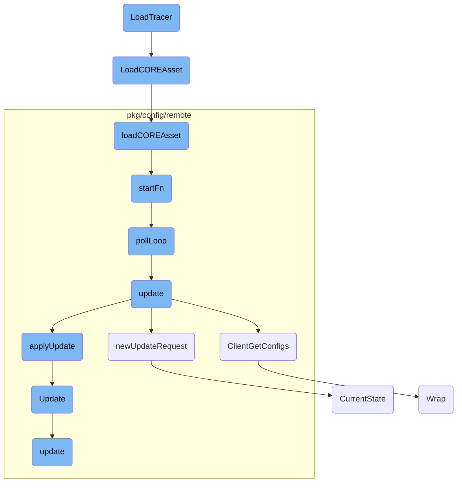

In this document, we will explain the process of initializing and configuring a new tracer using the <SwmToken path="pkg/network/tracer/connection/fentry/tracer.go" pos="32:2:2" line-data="// LoadTracer loads a new tracer">`LoadTracer`</SwmToken> function. This involves checking the instance type, setting up the manager, loading <SwmToken path="pkg/ebpf/co_re.go" pos="34:19:21" line-data="// LoadCOREAsset attempts to find kernel BTF, reads the CO-RE object file, and then calls the callback function with the">`CO-RE`</SwmToken> assets, and configuring kernel probes.

The process starts by checking if the instance is a Fargate instance. If it is, the manager is set up with default options. Next, the <SwmToken path="pkg/ebpf/co_re.go" pos="34:19:21" line-data="// LoadCOREAsset attempts to find kernel BTF, reads the CO-RE object file, and then calls the callback function with the">`CO-RE`</SwmToken> asset is loaded, which involves finding kernel BTF, reading the <SwmToken path="pkg/ebpf/co_re.go" pos="34:19:21" line-data="// LoadCOREAsset attempts to find kernel BTF, reads the CO-RE object file, and then calls the callback function with the">`CO-RE`</SwmToken> object file, and initializing it with the provided options. The kernel probes and constant editors are then configured based on the system's configuration. Finally, the polling loop is started, which periodically fetches and applies configuration updates.

# Flow drill down



<SwmSnippet path="/pkg/network/tracer/connection/fentry/tracer.go" line="32">

---

## <SwmToken path="pkg/network/tracer/connection/fentry/tracer.go" pos="32:2:2" line-data="// LoadTracer loads a new tracer">`LoadTracer`</SwmToken>

The <SwmToken path="pkg/network/tracer/connection/fentry/tracer.go" pos="32:2:2" line-data="// LoadTracer loads a new tracer">`LoadTracer`</SwmToken> function initializes and configures a new tracer. It checks if the instance is a Fargate instance, sets up the manager with default options, and loads the <SwmToken path="pkg/ebpf/co_re.go" pos="34:19:21" line-data="// LoadCOREAsset attempts to find kernel BTF, reads the CO-RE object file, and then calls the callback function with the">`CO-RE`</SwmToken> asset using <SwmToken path="pkg/network/tracer/connection/fentry/tracer.go" pos="39:7:7" line-data="	err := ddebpf.LoadCOREAsset(netebpf.ModuleFileName(&quot;tracer-fentry&quot;, config.BPFDebug), func(ar bytecode.AssetReader, o manager.Options) error {">`LoadCOREAsset`</SwmToken>. It also configures kernel probes and constant editors based on the system's configuration.

```go
// LoadTracer loads a new tracer
func LoadTracer(config *config.Config, mgrOpts manager.Options, connCloseEventHandler ddebpf.EventHandler) (*manager.Manager, func(), error) {
	if !fargate.IsFargateInstance() {
		return nil, nil, ErrorNotSupported
	}

	m := ddebpf.NewManagerWithDefault(&manager.Manager{}, &ebpftelemetry.ErrorsTelemetryModifier{})
	err := ddebpf.LoadCOREAsset(netebpf.ModuleFileName("tracer-fentry", config.BPFDebug), func(ar bytecode.AssetReader, o manager.Options) error {
		o.RLimit = mgrOpts.RLimit
		o.MapSpecEditors = mgrOpts.MapSpecEditors
		o.ConstantEditors = mgrOpts.ConstantEditors

		// Use the config to determine what kernel probes should be enabled
		enabledProbes, err := enabledPrograms(config)
		if err != nil {
			return fmt.Errorf("invalid probe configuration: %v", err)
		}

		initManager(m, connCloseEventHandler, config)

		file, err := os.Stat("/proc/self/ns/pid")
```

---

</SwmSnippet>

<SwmSnippet path="/pkg/ebpf/co_re.go" line="34">

---

## <SwmToken path="pkg/ebpf/co_re.go" pos="34:2:2" line-data="// LoadCOREAsset attempts to find kernel BTF, reads the CO-RE object file, and then calls the callback function with the">`LoadCOREAsset`</SwmToken>

The <SwmToken path="pkg/ebpf/co_re.go" pos="34:2:2" line-data="// LoadCOREAsset attempts to find kernel BTF, reads the CO-RE object file, and then calls the callback function with the">`LoadCOREAsset`</SwmToken> function attempts to find kernel BTF, reads the <SwmToken path="pkg/ebpf/co_re.go" pos="34:19:21" line-data="// LoadCOREAsset attempts to find kernel BTF, reads the CO-RE object file, and then calls the callback function with the">`CO-RE`</SwmToken> object file, and calls the provided callback function with the asset and BTF options <SwmToken path="pkg/ebpf/co_re.go" pos="35:10:12" line-data="// asset and BTF options pre-filled. You should attempt to load the CO-RE program in the startFn func for telemetry to">`pre-filled`</SwmToken>. This function is crucial for loading <SwmToken path="pkg/ebpf/co_re.go" pos="34:19:21" line-data="// LoadCOREAsset attempts to find kernel BTF, reads the CO-RE object file, and then calls the callback function with the">`CO-RE`</SwmToken> programs correctly.

```go
// LoadCOREAsset attempts to find kernel BTF, reads the CO-RE object file, and then calls the callback function with the
// asset and BTF options pre-filled. You should attempt to load the CO-RE program in the startFn func for telemetry to
// be correctly recorded.
func LoadCOREAsset(filename string, startFn func(bytecode.AssetReader, manager.Options) error) error {
	loader, err := coreLoader(NewConfig())
	if err != nil {
		return err
	}
	return loader.loadCOREAsset(filename, startFn)
```

---

</SwmSnippet>

<SwmSnippet path="/pkg/ebpf/co_re.go" line="45">

---

## <SwmToken path="pkg/ebpf/co_re.go" pos="45:9:9" line-data="func (c *coreAssetLoader) loadCOREAsset(filename string, startFn func(bytecode.AssetReader, manager.Options) error) error {">`loadCOREAsset`</SwmToken>

The <SwmToken path="pkg/ebpf/co_re.go" pos="45:9:9" line-data="func (c *coreAssetLoader) loadCOREAsset(filename string, startFn func(bytecode.AssetReader, manager.Options) error) error {">`loadCOREAsset`</SwmToken> method of <SwmToken path="pkg/ebpf/co_re.go" pos="45:6:6" line-data="func (c *coreAssetLoader) loadCOREAsset(filename string, startFn func(bytecode.AssetReader, manager.Options) error) error {">`coreAssetLoader`</SwmToken> reads the <SwmToken path="pkg/ebpf/co_re.go" pos="34:19:21" line-data="// LoadCOREAsset attempts to find kernel BTF, reads the CO-RE object file, and then calls the callback function with the">`CO-RE`</SwmToken> object file and initializes it with the provided options. It handles telemetry reporting and ensures that BTF data is available before proceeding.

```go
func (c *coreAssetLoader) loadCOREAsset(filename string, startFn func(bytecode.AssetReader, manager.Options) error) error {
	var result ebpftelemetry.COREResult
	base := strings.TrimSuffix(filename, path.Ext(filename))
	defer func() {
		c.reportTelemetry(base, result)
	}()

	ret, result, err := c.btfLoader.Get()
	if err != nil {
		return fmt.Errorf("BTF load: %w", err)
	}
	if ret == nil {
		return fmt.Errorf("no BTF data")
	}

	buf, err := bytecode.GetReader(c.coreDir, filename)
	if err != nil {
		result = ebpftelemetry.AssetReadError
		return fmt.Errorf("error reading %s: %s", filename, err)
	}
	defer buf.Close()
```

---

</SwmSnippet>

<SwmSnippet path="/pkg/config/remote/client/client.go" line="364">

---

## <SwmToken path="pkg/config/remote/client/client.go" pos="364:9:9" line-data="func (c *Client) startFn() {">`startFn`</SwmToken>

The <SwmToken path="pkg/config/remote/client/client.go" pos="364:9:9" line-data="func (c *Client) startFn() {">`startFn`</SwmToken> function starts the polling loop by invoking <SwmToken path="pkg/config/remote/client/client.go" pos="365:5:5" line-data="	go c.pollLoop()">`pollLoop`</SwmToken> in a separate goroutine. This function is essential for initiating the client's main polling mechanism.

```go
func (c *Client) startFn() {
	go c.pollLoop()
```

---

</SwmSnippet>

<SwmSnippet path="/pkg/config/remote/client/client.go" line="368">

---

## <SwmToken path="pkg/config/remote/client/client.go" pos="368:2:2" line-data="// pollLoop is the main polling loop of the client.">`pollLoop`</SwmToken>

The <SwmToken path="pkg/config/remote/client/client.go" pos="368:2:2" line-data="// pollLoop is the main polling loop of the client.">`pollLoop`</SwmToken> function is the main polling loop of the client. It periodically calls the <SwmToken path="pkg/config/remote/client/client.go" pos="375:7:7" line-data="	err := c.update()">`update`</SwmToken> function to fetch and apply configuration updates. It also handles backoff policies and ensures that the client stops polling if remote configuration is disabled.

```go
// pollLoop is the main polling loop of the client.
//
// pollLoop should never be called manually and only be called via the client's `sync.Once`
// structure in startFn.
func (c *Client) pollLoop() {
	successfulFirstRun := false
	// First run
	err := c.update()
	if err != nil {
		if status.Code(err) == codes.Unimplemented {
			// Remote Configuration is disabled as the server isn't initialized
			//
			// As this is not a transient error (that would be codes.Unavailable),
			// stop the client: it shouldn't keep contacting a server that doesn't
			// exist.
			log.Debugf("remote configuration isn't enabled, disabling client")
			return
		}

		// As some clients may start before the core-agent server is up, we log the first error
		// as an Info log as the race is expected. If the error persists, we log with error logs
```

---

</SwmSnippet>

<SwmSnippet path="/pkg/config/remote/client/client.go" line="439">

---

## update

The <SwmToken path="pkg/config/remote/client/client.go" pos="439:2:2" line-data="// update requests a config updates from the agent via the secure grpc channel and">`update`</SwmToken> function requests configuration updates from the agent via a secure <SwmToken path="pkg/config/remote/client/client.go" pos="439:24:24" line-data="// update requests a config updates from the agent via the secure grpc channel and">`grpc`</SwmToken> channel and applies those updates. It informs registered listeners of any configuration state changes that occurred.

```go
// update requests a config updates from the agent via the secure grpc channel and
// applies that update, informing any registered listeners of any config state changes
// that occurred.
func (c *Client) update() error {
	req, err := c.newUpdateRequest()
	if err != nil {
		return err
	}

	response, err := c.configFetcher.ClientGetConfigs(c.ctx, req)
	if err != nil {
		return err
	}

	changedProducts, err := c.applyUpdate(response)
	if err != nil {
		return err
	}
	// We don't want to force the products to reload config if nothing changed
	// in the latest update.
	if len(changedProducts) == 0 {
```

---

</SwmSnippet>

<SwmSnippet path="/pkg/config/remote/client/client.go" line="485">

---

## <SwmToken path="pkg/config/remote/client/client.go" pos="485:9:9" line-data="func (c *Client) applyUpdate(pbUpdate *pbgo.ClientGetConfigsResponse) ([]string, error) {">`applyUpdate`</SwmToken>

The <SwmToken path="pkg/config/remote/client/client.go" pos="485:9:9" line-data="func (c *Client) applyUpdate(pbUpdate *pbgo.ClientGetConfigsResponse) ([]string, error) {">`applyUpdate`</SwmToken> function processes the configuration updates received from the agent. It updates the client's state with the new configuration data and returns a list of changed products.

```go
func (c *Client) applyUpdate(pbUpdate *pbgo.ClientGetConfigsResponse) ([]string, error) {
	fileMap := make(map[string][]byte, len(pbUpdate.TargetFiles))
	for _, f := range pbUpdate.TargetFiles {
		fileMap[f.Path] = f.Raw
	}

	update := state.Update{
		TUFRoots:      pbUpdate.Roots,
		TUFTargets:    pbUpdate.Targets,
		TargetFiles:   fileMap,
		ClientConfigs: pbUpdate.ClientConfigs,
	}

	return c.state.Update(update)
}
```

---

</SwmSnippet>

&nbsp;

*This is an auto-generated document by Swimm AI 🌊 and has not yet been verified by a human*

<SwmMeta version="3.0.0" repo-id="Z2l0aHViJTNBJTNBZGF0YWRvZy1hZ2VudCUzQSUzQVN3aW1tLURlbW8=" repo-name="datadog-agent"><sup>Powered by [Swimm](/)</sup></SwmMeta>
