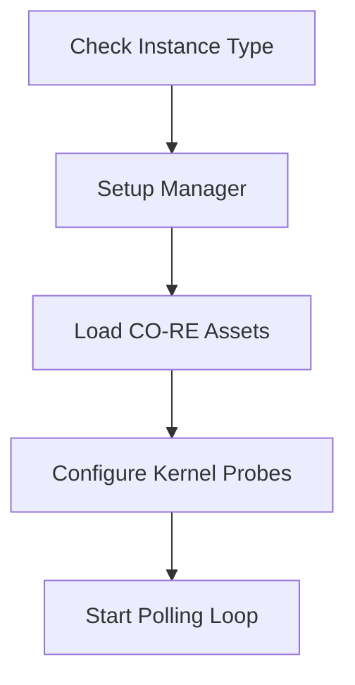

This document will cover the process of initializing and configuring a new tracer. We'll cover:

1. Checking the instance type
2. Setting up the manager
3. Loading CO-RE assets
4. Configuring kernel probes
5. Starting the polling loop

Technical document: <SwmLink doc-title="Initializing and Configuring a New Tracer">[Initializing and Configuring a New Tracer](/.swm/initializing-and-configuring-a-new-tracer.hu1svgcv.sw.md)</SwmLink>

# [Checking the instance type](https://app.swimm.io/repos/Z2l0aHViJTNBJTNBZGF0YWRvZy1hZ2VudCUzQSUzQVN3aW1tLURlbW8=/docs/hu1svgcv#loadtracer)

The process begins by determining if the instance is a Fargate instance. Fargate is a serverless compute engine for containers that works with both Amazon ECS and EKS. If the instance is not a Fargate instance, the tracer initialization process is halted because the specific configurations required for non-Fargate instances are not supported in this flow.

# [Setting up the manager](https://app.swimm.io/repos/Z2l0aHViJTNBJTNBZGF0YWRvZy1hZ2VudCUzQSUzQVN3aW1tLURlbW8=/docs/hu1svgcv#loadtracer)

If the instance is a Fargate instance, the next step is to set up the manager with default options. The manager is responsible for handling various tasks related to the tracer, such as managing kernel probes and telemetry. Setting up the manager with default options ensures that it is configured correctly for the Fargate environment.

# [Loading CO-RE assets](https://app.swimm.io/repos/Z2l0aHViJTNBJTNBZGF0YWRvZy1hZ2VudCUzQSUzQVN3aW1tLURlbW8=/docs/hu1svgcv#loadcoreasset)

The CO-RE (Compile Once - Run Everywhere) asset is then loaded. This involves finding the kernel BTF (BPF Type Format) data, reading the CO-RE object file, and initializing it with the provided options. The BTF data is essential for ensuring that the CO-RE programs can run correctly on different kernel versions without needing recompilation.

# [Configuring kernel probes](https://app.swimm.io/repos/Z2l0aHViJTNBJTNBZGF0YWRvZy1hZ2VudCUzQSUzQVN3aW1tLURlbW8=/docs/hu1svgcv#loadtracer)

Kernel probes are configured based on the system's configuration. This step involves determining which kernel probes should be enabled and setting up constant editors. Kernel probes are used to monitor various events in the kernel, and configuring them correctly is crucial for the tracer to function as expected.

# [Starting the polling loop](https://app.swimm.io/repos/Z2l0aHViJTNBJTNBZGF0YWRvZy1hZ2VudCUzQSUzQVN3aW1tLURlbW8=/docs/hu1svgcv#startfn)

Finally, the polling loop is started. This loop periodically fetches and applies configuration updates. It ensures that the tracer remains up-to-date with the latest configurations and can adapt to changes in the environment. The polling loop runs in a separate goroutine to avoid blocking the main execution flow.

&nbsp;

*This is an auto-generated document by Swimm AI 🌊 and has not yet been verified by a human*

<SwmMeta version="3.0.0" repo-id="Z2l0aHViJTNBJTNBZGF0YWRvZy1hZ2VudCUzQSUzQVN3aW1tLURlbW8=" repo-name="datadog-agent">Powered by [Swimm](/)</SwmMeta>
