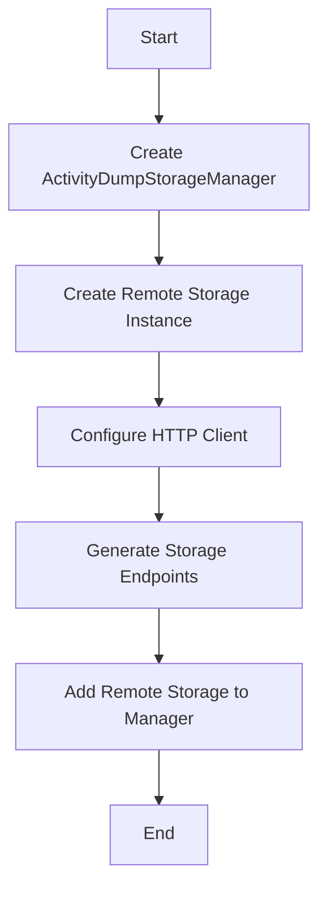

This document will cover the process of initializing and configuring the NewAgentStorageManager, which includes:

1. Setting up the ActivityDumpStorageManager
2. Creating and configuring a remote storage instance.

Technical document: <SwmLink doc-title="Initializing NewAgentStorageManager">[Initializing NewAgentStorageManager](/.swm/initializing-newagentstoragemanager.bg3dioyl.sw.md)</SwmLink>

# [Setting up the ActivityDumpStorageManager](https://app.swimm.io/repos/Z2l0aHViJTNBJTNBZGF0YWRvZy1hZ2VudCUzQSUzQVN3aW1tLURlbW8=/docs/bg3dioyl#creating-and-configuring-storage-managers)

The process begins with setting up the ActivityDumpStorageManager. This manager is responsible for holding different storage types. It creates a map to organize and manage these storage types effectively. This setup ensures that the system can handle various storage needs efficiently, providing a structured way to manage storage resources.

# [Creating and Configuring a Remote Storage Instance](https://app.swimm.io/repos/Z2l0aHViJTNBJTNBZGF0YWRvZy1hZ2VudCUzQSUzQVN3aW1tLURlbW8=/docs/bg3dioyl#initializing-remote-storage)

Next, a remote storage instance is created. This involves setting up an HTTP client for communication, which allows the system to interact with remote servers securely and efficiently. The remote storage instance also generates storage endpoints, which are URLs used to store and retrieve data. Each endpoint is associated with an API key to ensure secure access. This configuration is crucial for enabling remote data storage and retrieval, providing flexibility and scalability to the storage system.

&nbsp;

*This is an auto-generated document by Swimm AI 🌊 and has not yet been verified by a human*

<SwmMeta version="3.0.0" repo-id="Z2l0aHViJTNBJTNBZGF0YWRvZy1hZ2VudCUzQSUzQVN3aW1tLURlbW8=" repo-name="datadog-agent">Powered by [Swimm](/)</SwmMeta>
