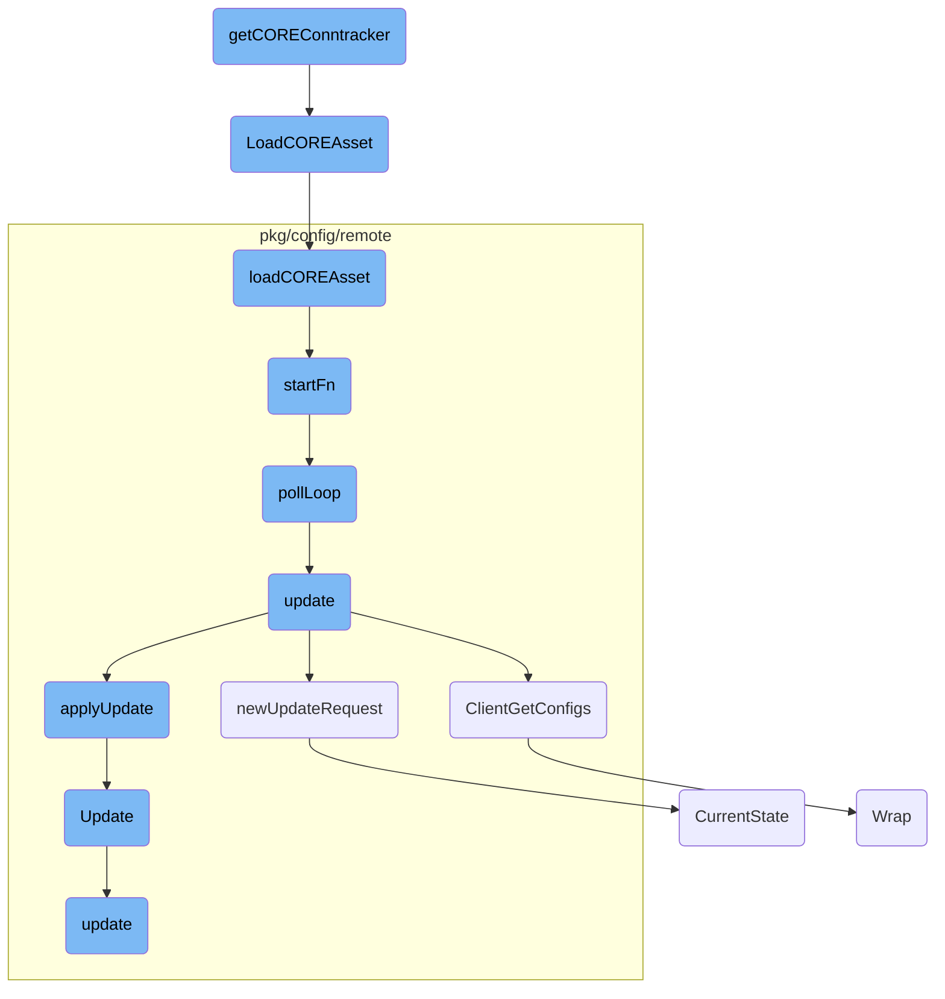

In this document, we will explain the process of initializing and managing the CORE conntracker. The process involves checking kernel support, loading the CORE asset, and continuously polling for updates.

The flow starts by checking if the kernel supports the <SwmToken path="pkg/network/tracer/ebpf_conntracker.go" pos="532:19:21" line-data="		return nil, fmt.Errorf(&quot;could not check if CO-RE ebpf conntracker is supported on kernel: %w&quot;, err)">`CO-RE`</SwmToken> <SwmToken path="pkg/network/tracer/ebpf_conntracker.go" pos="532:23:23" line-data="		return nil, fmt.Errorf(&quot;could not check if CO-RE ebpf conntracker is supported on kernel: %w&quot;, err)">`ebpf`</SwmToken> conntracker. If supported, it proceeds to load the CORE asset. This involves finding kernel BTF, reading the <SwmToken path="pkg/network/tracer/ebpf_conntracker.go" pos="532:19:21" line-data="		return nil, fmt.Errorf(&quot;could not check if CO-RE ebpf conntracker is supported on kernel: %w&quot;, err)">`CO-RE`</SwmToken> object file, and calling a callback function with the asset and BTF options. Once the asset is loaded, the system starts a polling loop in a separate thread to continuously check for updates. The polling loop periodically fetches and applies configuration updates, ensuring the system stays up-to-date.

# Flow drill down



<SwmSnippet path="/pkg/network/tracer/ebpf_conntracker.go" line="529">

---

## Loading the CORE Conntracker

The function <SwmToken path="pkg/network/tracer/ebpf_conntracker.go" pos="529:2:2" line-data="func getCOREConntracker(cfg *config.Config) (*manager.Manager, error) {">`getCOREConntracker`</SwmToken> is responsible for initializing the CORE conntracker. It first checks if the <SwmToken path="pkg/network/tracer/ebpf_conntracker.go" pos="532:19:21" line-data="		return nil, fmt.Errorf(&quot;could not check if CO-RE ebpf conntracker is supported on kernel: %w&quot;, err)">`CO-RE`</SwmToken> <SwmToken path="pkg/network/tracer/ebpf_conntracker.go" pos="532:23:23" line-data="		return nil, fmt.Errorf(&quot;could not check if CO-RE ebpf conntracker is supported on kernel: %w&quot;, err)">`ebpf`</SwmToken> conntracker is supported on the kernel. If supported, it proceeds to load the CORE asset using the <SwmToken path="pkg/network/tracer/ebpf_conntracker.go" pos="539:7:7" line-data="	err = ddebpf.LoadCOREAsset(netebpf.ModuleFileName(&quot;conntrack&quot;, cfg.BPFDebug), func(ar bytecode.AssetReader, o manager.Options) error {">`LoadCOREAsset`</SwmToken> function.

```go
func getCOREConntracker(cfg *config.Config) (*manager.Manager, error) {
	supportedOnKernel, err := ebpfCOREConntrackerSupportedOnKernel()
	if err != nil {
		return nil, fmt.Errorf("could not check if CO-RE ebpf conntracker is supported on kernel: %w", err)
	}
	if !supportedOnKernel {
		return nil, errCOREConntrackerUnsupported
	}

	var m *manager.Manager
	err = ddebpf.LoadCOREAsset(netebpf.ModuleFileName("conntrack", cfg.BPFDebug), func(ar bytecode.AssetReader, o manager.Options) error {
		o.ConstantEditors = append(o.ConstantEditors,
			boolConst("tcpv6_enabled", cfg.CollectTCPv6Conns),
			boolConst("udpv6_enabled", cfg.CollectUDPv6Conns),
		)
		m, err = getManager(cfg, ar, o)
		return err
	})
	return m, err
}
```

---

</SwmSnippet>

<SwmSnippet path="/pkg/ebpf/co_re.go" line="34">

---

## Loading CORE Asset

The function <SwmToken path="pkg/ebpf/co_re.go" pos="34:2:2" line-data="// LoadCOREAsset attempts to find kernel BTF, reads the CO-RE object file, and then calls the callback function with the">`LoadCOREAsset`</SwmToken> attempts to find kernel BTF, reads the <SwmToken path="pkg/ebpf/co_re.go" pos="34:19:21" line-data="// LoadCOREAsset attempts to find kernel BTF, reads the CO-RE object file, and then calls the callback function with the">`CO-RE`</SwmToken> object file, and then calls the callback function with the asset and BTF options <SwmToken path="pkg/ebpf/co_re.go" pos="35:10:12" line-data="// asset and BTF options pre-filled. You should attempt to load the CO-RE program in the startFn func for telemetry to">`pre-filled`</SwmToken>. This is crucial for loading the <SwmToken path="pkg/ebpf/co_re.go" pos="34:19:21" line-data="// LoadCOREAsset attempts to find kernel BTF, reads the CO-RE object file, and then calls the callback function with the">`CO-RE`</SwmToken> program correctly.

```go
// LoadCOREAsset attempts to find kernel BTF, reads the CO-RE object file, and then calls the callback function with the
// asset and BTF options pre-filled. You should attempt to load the CO-RE program in the startFn func for telemetry to
// be correctly recorded.
func LoadCOREAsset(filename string, startFn func(bytecode.AssetReader, manager.Options) error) error {
	loader, err := coreLoader(NewConfig())
	if err != nil {
		return err
	}
	return loader.loadCOREAsset(filename, startFn)
}
```

---

</SwmSnippet>

<SwmSnippet path="/pkg/ebpf/co_re.go" line="45">

---

### Loading CORE Asset Internally

The method <SwmToken path="pkg/ebpf/co_re.go" pos="45:9:9" line-data="func (c *coreAssetLoader) loadCOREAsset(filename string, startFn func(bytecode.AssetReader, manager.Options) error) error {">`loadCOREAsset`</SwmToken> is called within <SwmToken path="pkg/ebpf/co_re.go" pos="45:9:9" line-data="func (c *coreAssetLoader) loadCOREAsset(filename string, startFn func(bytecode.AssetReader, manager.Options) error) error {">`loadCOREAsset`</SwmToken> to handle the actual loading process. It reads the BTF data, retrieves the <SwmToken path="pkg/network/tracer/ebpf_conntracker.go" pos="532:19:21" line-data="		return nil, fmt.Errorf(&quot;could not check if CO-RE ebpf conntracker is supported on kernel: %w&quot;, err)">`CO-RE`</SwmToken> object file, and invokes the start function with the appropriate options.

```go
func (c *coreAssetLoader) loadCOREAsset(filename string, startFn func(bytecode.AssetReader, manager.Options) error) error {
	var result ebpftelemetry.COREResult
	base := strings.TrimSuffix(filename, path.Ext(filename))
	defer func() {
		c.reportTelemetry(base, result)
	}()

	ret, result, err := c.btfLoader.Get()
	if err != nil {
		return fmt.Errorf("BTF load: %w", err)
	}
	if ret == nil {
		return fmt.Errorf("no BTF data")
	}

	buf, err := bytecode.GetReader(c.coreDir, filename)
	if err != nil {
		result = ebpftelemetry.AssetReadError
		return fmt.Errorf("error reading %s: %s", filename, err)
	}
	defer buf.Close()
```

---

</SwmSnippet>

<SwmSnippet path="/pkg/config/remote/client/client.go" line="364">

---

## Starting the Poll Loop

The method <SwmToken path="pkg/config/remote/client/client.go" pos="364:9:9" line-data="func (c *Client) startFn() {">`startFn`</SwmToken> initiates the polling loop by calling <SwmToken path="pkg/config/remote/client/client.go" pos="365:5:5" line-data="	go c.pollLoop()">`pollLoop`</SwmToken> in a separate goroutine. This ensures that the client continuously checks for updates.

```go
func (c *Client) startFn() {
	go c.pollLoop()
}
```

---

</SwmSnippet>

<SwmSnippet path="/pkg/config/remote/client/client.go" line="368">

---

### Polling for Updates

The method <SwmToken path="pkg/config/remote/client/client.go" pos="368:2:2" line-data="// pollLoop is the main polling loop of the client.">`pollLoop`</SwmToken> is the main polling loop of the client. It periodically calls the <SwmToken path="pkg/config/remote/client/client.go" pos="375:7:7" line-data="	err := c.update()">`update`</SwmToken> method to fetch and apply configuration updates. If the remote configuration service is not available, it handles the error and retries.

```go
// pollLoop is the main polling loop of the client.
//
// pollLoop should never be called manually and only be called via the client's `sync.Once`
// structure in startFn.
func (c *Client) pollLoop() {
	successfulFirstRun := false
	// First run
	err := c.update()
	if err != nil {
		if status.Code(err) == codes.Unimplemented {
			// Remote Configuration is disabled as the server isn't initialized
			//
			// As this is not a transient error (that would be codes.Unavailable),
			// stop the client: it shouldn't keep contacting a server that doesn't
			// exist.
			log.Debugf("remote configuration isn't enabled, disabling client")
			return
		}

		// As some clients may start before the core-agent server is up, we log the first error
		// as an Info log as the race is expected. If the error persists, we log with error logs
```

---

</SwmSnippet>

<SwmSnippet path="/pkg/config/remote/client/client.go" line="439">

---

## Updating Configurations

The method <SwmToken path="pkg/config/remote/client/client.go" pos="439:2:2" line-data="// update requests a config updates from the agent via the secure grpc channel and">`update`</SwmToken> requests configuration updates from the agent via a secure <SwmToken path="pkg/config/remote/client/client.go" pos="439:24:24" line-data="// update requests a config updates from the agent via the secure grpc channel and">`grpc`</SwmToken> channel and applies those updates. It informs any registered listeners of any configuration state changes that occurred.

```go
// update requests a config updates from the agent via the secure grpc channel and
// applies that update, informing any registered listeners of any config state changes
// that occurred.
func (c *Client) update() error {
	req, err := c.newUpdateRequest()
	if err != nil {
		return err
	}

	response, err := c.configFetcher.ClientGetConfigs(c.ctx, req)
	if err != nil {
		return err
	}

	changedProducts, err := c.applyUpdate(response)
	if err != nil {
		return err
	}
	// We don't want to force the products to reload config if nothing changed
	// in the latest update.
	if len(changedProducts) == 0 {
```

---

</SwmSnippet>

<SwmSnippet path="/pkg/config/remote/client/client.go" line="144">

---

### Fetching Configurations

The method <SwmToken path="pkg/config/remote/client/client.go" pos="144:2:2" line-data="// ClientGetConfigs implements the ConfigFetcher interface for agentGRPCConfigFetcher">`ClientGetConfigs`</SwmToken> implements the <SwmToken path="pkg/config/remote/client/client.go" pos="144:8:8" line-data="// ClientGetConfigs implements the ConfigFetcher interface for agentGRPCConfigFetcher">`ConfigFetcher`</SwmToken> interface. It handles the authentication token and fetches the configurations from the core service via <SwmToken path="pkg/config/remote/client/client.go" pos="146:17:17" line-data="	// When communicating with the core service via grpc, the auth token is handled">`grpc`</SwmToken>.

```go
// ClientGetConfigs implements the ConfigFetcher interface for agentGRPCConfigFetcher
func (g *agentGRPCConfigFetcher) ClientGetConfigs(ctx context.Context, request *pbgo.ClientGetConfigsRequest) (*pbgo.ClientGetConfigsResponse, error) {
	// When communicating with the core service via grpc, the auth token is handled
	// by the core-agent, which runs independently. It's not guaranteed it starts before us,
	// or that if it restarts that the auth token remains the same. Thus we need to do this every request.
	token, err := g.authTokenFetcher()
	if err != nil {
		return nil, errors.Wrap(err, "could not acquire agent auth token")
	}

	md := metadata.MD{
		"authorization": []string{fmt.Sprintf("Bearer %s", token)},
	}

	ctx = metadata.NewOutgoingContext(ctx, md)

	return g.fetchConfigs(ctx, request)
}
```

---

</SwmSnippet>

<SwmSnippet path="/pkg/config/remote/client/client.go" line="501">

---

### Creating Update Request

The method <SwmToken path="pkg/config/remote/client/client.go" pos="503:9:9" line-data="func (c *Client) newUpdateRequest() (*pbgo.ClientGetConfigsRequest, error) {">`newUpdateRequest`</SwmToken> builds a new request for the agent based on the current state of the remote config repository. It includes details like cached files, configuration states, and client information.

```go
// newUpdateRequests builds a new request for the agent based on the current state of the
// remote config repository.
func (c *Client) newUpdateRequest() (*pbgo.ClientGetConfigsRequest, error) {
	state, err := c.state.CurrentState()
	if err != nil {
		return nil, err
	}

	pbCachedFiles := make([]*pbgo.TargetFileMeta, 0, len(state.CachedFiles))
	for _, f := range state.CachedFiles {
		pbHashes := make([]*pbgo.TargetFileHash, 0, len(f.Hashes))
		for alg, hash := range f.Hashes {
			pbHashes = append(pbHashes, &pbgo.TargetFileHash{
				Algorithm: alg,
				Hash:      hex.EncodeToString(hash),
			})
		}
		pbCachedFiles = append(pbCachedFiles, &pbgo.TargetFileMeta{
			Path:   f.Path,
			Length: int64(f.Length),
			Hashes: pbHashes,
```

---

</SwmSnippet>

<SwmSnippet path="/pkg/config/remote/client/client.go" line="485">

---

### Applying Updates

The method <SwmToken path="pkg/config/remote/client/client.go" pos="485:9:9" line-data="func (c *Client) applyUpdate(pbUpdate *pbgo.ClientGetConfigsResponse) ([]string, error) {">`applyUpdate`</SwmToken> processes the update response from the server. It updates the state with new configuration data and returns the list of changed products.

```go
func (c *Client) applyUpdate(pbUpdate *pbgo.ClientGetConfigsResponse) ([]string, error) {
	fileMap := make(map[string][]byte, len(pbUpdate.TargetFiles))
	for _, f := range pbUpdate.TargetFiles {
		fileMap[f.Path] = f.Raw
	}

	update := state.Update{
		TUFRoots:      pbUpdate.Roots,
		TUFTargets:    pbUpdate.Targets,
		TargetFiles:   fileMap,
		ClientConfigs: pbUpdate.ClientConfigs,
	}

	return c.state.Update(update)
}
```

---

</SwmSnippet>

<SwmSnippet path="/pkg/config/remote/uptane/client.go" line="115">

---

## Finalizing the Update

The method <SwmToken path="pkg/config/remote/uptane/client.go" pos="115:2:2" line-data="// Update updates the uptane client and rollbacks in case of error">`Update`</SwmToken> in the uptane client finalizes the update process. It ensures that the update is committed or rolled back in case of an error.

```go
// Update updates the uptane client and rollbacks in case of error
func (c *Client) Update(response *pbgo.LatestConfigsResponse) error {
	c.Lock()
	defer c.Unlock()
	c.cachedVerify = false

	// in case the commit is successful it is a no-op.
	// the defer is present to be sure a transaction is never left behind.
	defer c.transactionalStore.rollback()

	err := c.update(response)
	if err != nil {
		c.configRemoteStore = newRemoteStoreConfig(c.targetStore)
		c.directorRemoteStore = newRemoteStoreDirector(c.targetStore)
		c.configTUFClient = client.NewClient(c.configLocalStore, c.configRemoteStore)
		c.directorTUFClient = client.NewClient(c.directorLocalStore, c.directorRemoteStore)
		return err
	}
	return c.transactionalStore.commit()
}
```

---

</SwmSnippet>

&nbsp;

*This is an auto-generated document by Swimm AI 🌊 and has not yet been verified by a human*

<SwmMeta version="3.0.0" repo-id="Z2l0aHViJTNBJTNBZGF0YWRvZy1hZ2VudCUzQSUzQVN3aW1tLURlbW8=" repo-name="datadog-agent"><sup>Powered by [Swimm](/)</sup></SwmMeta>
