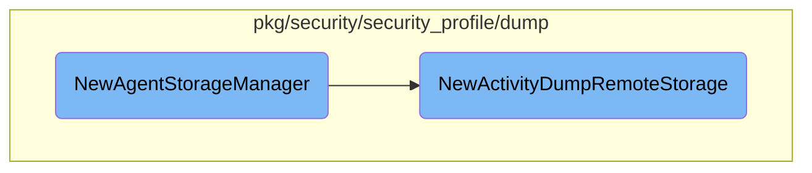

In this document, we will explain the process of initializing and configuring the <SwmToken path="pkg/security/security_profile/dump/storage_manager.go" pos="38:2:2" line-data="// NewAgentStorageManager returns a new instance of ActivityDumpStorageManager">`NewAgentStorageManager`</SwmToken>. This involves setting up the storage manager and creating a remote storage instance.

The flow starts with creating a new instance of the <SwmToken path="pkg/security/security_profile/dump/storage_manager.go" pos="38:14:14" line-data="// NewAgentStorageManager returns a new instance of ActivityDumpStorageManager">`ActivityDumpStorageManager`</SwmToken>. This manager is responsible for holding different storage types. Next, a remote storage instance is created using the <SwmToken path="pkg/security/security_profile/dump/storage_manager.go" pos="45:8:8" line-data="	remote, err := NewActivityDumpRemoteStorage()">`NewActivityDumpRemoteStorage`</SwmToken> function. This remote storage is then added to the storage manager's map. The remote storage setup includes configuring an HTTP client for communication and generating storage endpoints with their corresponding API keys.

# Flow drill down



<SwmSnippet path="/pkg/security/security_profile/dump/storage_manager.go" line="38">

---

## Creating and Configuring Storage Managers

The function <SwmToken path="pkg/security/security_profile/dump/storage_manager.go" pos="38:2:2" line-data="// NewAgentStorageManager returns a new instance of ActivityDumpStorageManager">`NewAgentStorageManager`</SwmToken> initializes a new instance of <SwmToken path="pkg/security/security_profile/dump/storage_manager.go" pos="38:14:14" line-data="// NewAgentStorageManager returns a new instance of ActivityDumpStorageManager">`ActivityDumpStorageManager`</SwmToken>. It sets up the storage manager by creating a map to hold different storage types. The function then creates a remote storage instance using <SwmToken path="pkg/security/security_profile/dump/storage_manager.go" pos="45:8:8" line-data="	remote, err := NewActivityDumpRemoteStorage()">`NewActivityDumpRemoteStorage`</SwmToken> and adds it to the storage manager's map.

```go
// NewAgentStorageManager returns a new instance of ActivityDumpStorageManager
func NewAgentStorageManager() (*ActivityDumpStorageManager, error) {
	manager := &ActivityDumpStorageManager{
		storages: make(map[config.StorageType]ActivityDumpStorage),
	}

	// create remote storage
	remote, err := NewActivityDumpRemoteStorage()
	if err != nil {
		return nil, fmt.Errorf("couldn't instantiate remote storage: %w", err)
	}
	manager.storages[remote.GetStorageType()] = remote

	return manager, nil
}
```

---

</SwmSnippet>

<SwmSnippet path="/pkg/security/security_profile/dump/remote_storage.go" line="47">

---

### Initializing Remote Storage

The function <SwmToken path="pkg/security/security_profile/dump/remote_storage.go" pos="47:2:2" line-data="// NewActivityDumpRemoteStorage returns a new instance of ActivityDumpRemoteStorage">`NewActivityDumpRemoteStorage`</SwmToken> initializes a new instance of <SwmToken path="pkg/security/security_profile/dump/remote_storage.go" pos="47:14:14" line-data="// NewActivityDumpRemoteStorage returns a new instance of ActivityDumpRemoteStorage">`ActivityDumpRemoteStorage`</SwmToken>. It sets up the storage with a map to track entities that are too large and configures an HTTP client for communication. The function also generates storage endpoints and appends them to the storage's URL list, along with their corresponding API keys.

```go
// NewActivityDumpRemoteStorage returns a new instance of ActivityDumpRemoteStorage
func NewActivityDumpRemoteStorage() (ActivityDumpStorage, error) {
	storage := &ActivityDumpRemoteStorage{
		tooLargeEntities: make(map[tooLargeEntityStatsEntry]*atomic.Uint64),
		client: &http.Client{
			Transport: ddhttputil.CreateHTTPTransport(pkgconfig.Datadog()),
		},
	}

	for _, format := range config.AllStorageFormats() {
		for _, compression := range []bool{true, false} {
			entry := tooLargeEntityStatsEntry{
				storageFormat: format,
				compression:   compression,
			}
			storage.tooLargeEntities[entry] = atomic.NewUint64(0)
		}
	}

	endpoints, err := config.ActivityDumpRemoteStorageEndpoints("cws-intake.", "secdump", logsconfig.DefaultIntakeProtocol, "cloud-workload-security")
	if err != nil {
```

---

</SwmSnippet>

&nbsp;

*This is an auto-generated document by Swimm AI 🌊 and has not yet been verified by a human*

<SwmMeta version="3.0.0" repo-id="Z2l0aHViJTNBJTNBZGF0YWRvZy1hZ2VudCUzQSUzQVN3aW1tLURlbW8=" repo-name="datadog-agent"><sup>Powered by [Swimm](/)</sup></SwmMeta>
