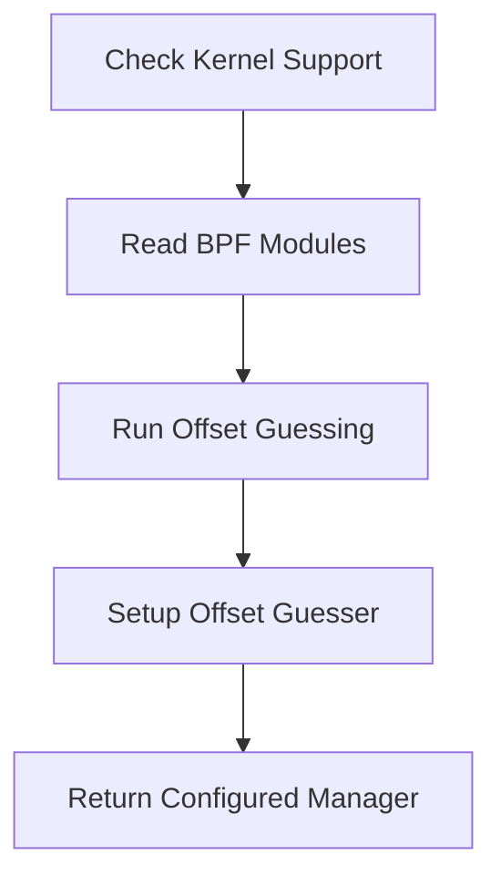

This document will cover the process of initializing a prebuilt conntracker, which includes:

1. Checking kernel support
2. Reading BPF modules
3. Running offset guessing
4. Setting up the offset guesser
5. Returning the configured manager.

Technical document: <SwmLink doc-title="Initializing Prebuilt Conntracker">[Initializing Prebuilt Conntracker](/.swm/initializing-prebuilt-conntracker.mi23ngfb.sw.md)</SwmLink>

# [Checking Kernel Support](https://app.swimm.io/repos/Z2l0aHViJTNBJTNBZGF0YWRvZy1hZ2VudCUzQSUzQVN3aW1tLURlbW8=/docs/mi23ngfb#getprebuiltconntracker)

The first step in initializing the prebuilt conntracker is to check if the current kernel supports it. This is important because the conntracker relies on specific kernel features to function correctly. If the kernel does not support these features, the initialization process cannot proceed. This ensures that the system is compatible and can handle the conntracker's operations.

# [Reading BPF Modules](https://app.swimm.io/repos/Z2l0aHViJTNBJTNBZGF0YWRvZy1hZ2VudCUzQSUzQVN3aW1tLURlbW8=/docs/mi23ngfb#getprebuiltconntracker)

Once kernel support is confirmed, the next step is to read the necessary BPF (Berkeley Packet Filter) modules. These modules contain the code that the conntracker will use to monitor network connections. Reading these modules is essential to load the required functionalities into the system. This step ensures that the conntracker has all the necessary components to operate.

# [Running Offset Guessing](https://app.swimm.io/repos/Z2l0aHViJTNBJTNBZGF0YWRvZy1hZ2VudCUzQSUzQVN3aW1tLURlbW8=/docs/mi23ngfb#runoffsetguessing)

Offset guessing is a process that determines the correct memory offsets for the conntracker to function. This step involves running a series of tests to guess these offsets accurately. The process may retry several times to ensure accuracy. Accurate offset guessing is crucial for the conntracker to correctly interpret network data and avoid errors.

# [Setting Up the Offset Guesser](https://app.swimm.io/repos/Z2l0aHViJTNBJTNBZGF0YWRvZy1hZ2VudCUzQSUzQVN3aW1tLURlbW8=/docs/mi23ngfb#setupoffsetguesser)

Setting up the offset guesser involves configuring it with the necessary kernel probes and initializing the offset manager. This setup is essential for the offset guessing process to work correctly. It ensures that the guesser has all the required information and tools to perform its task. Proper setup leads to accurate offset guessing, which is vital for the conntracker's functionality.

# [Returning the Configured Manager](https://app.swimm.io/repos/Z2l0aHViJTNBJTNBZGF0YWRvZy1hZ2VudCUzQSUzQVN3aW1tLURlbW8=/docs/mi23ngfb#getprebuiltconntracker)

After successfully setting up the offset guesser and completing the offset guessing process, the final step is to return the configured manager. This manager is now ready to handle network connections using the prebuilt conntracker. Returning the configured manager signifies the completion of the initialization process, making the conntracker operational and ready for use.

&nbsp;

*This is an auto-generated document by Swimm AI 🌊 and has not yet been verified by a human*

<SwmMeta version="3.0.0" repo-id="Z2l0aHViJTNBJTNBZGF0YWRvZy1hZ2VudCUzQSUzQVN3aW1tLURlbW8=" repo-name="datadog-agent">Powered by [Swimm](/)</SwmMeta>
