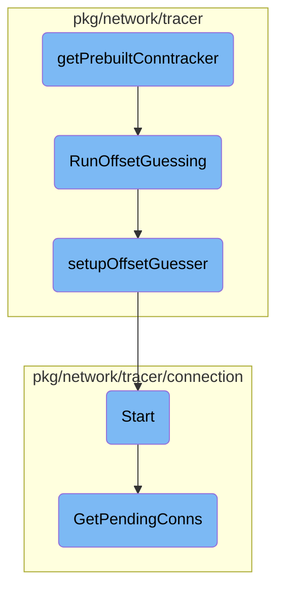

This document explains the process of initializing and returning a prebuilt <SwmToken path="pkg/network/tracer/ebpf_conntracker.go" pos="466:21:21" line-data="		return nil, fmt.Errorf(&quot;could not check if prebuilt ebpf conntracker is supported on kernel: %w&quot;, err)">`ebpf`</SwmToken> conntracker manager. The process involves checking kernel support, reading BPF modules, running offset guessing, and setting up the offset guesser.

The flow starts by checking if the current kernel supports the prebuilt <SwmToken path="pkg/network/tracer/ebpf_conntracker.go" pos="466:21:21" line-data="		return nil, fmt.Errorf(&quot;could not check if prebuilt ebpf conntracker is supported on kernel: %w&quot;, err)">`ebpf`</SwmToken> conntracker. If supported, it reads the necessary BPF modules. Then, it runs a process to guess the required offsets for the <SwmToken path="pkg/network/tracer/ebpf_conntracker.go" pos="466:21:21" line-data="		return nil, fmt.Errorf(&quot;could not check if prebuilt ebpf conntracker is supported on kernel: %w&quot;, err)">`ebpf`</SwmToken> conntracker. Finally, it sets up the offset guesser and returns the configured manager.

# Flow drill down



<SwmSnippet path="/pkg/network/tracer/ebpf_conntracker.go" line="463">

---

## <SwmToken path="pkg/network/tracer/ebpf_conntracker.go" pos="463:2:2" line-data="func getPrebuiltConntracker(cfg *config.Config) (*manager.Manager, error) {">`getPrebuiltConntracker`</SwmToken>

The <SwmToken path="pkg/network/tracer/ebpf_conntracker.go" pos="463:2:2" line-data="func getPrebuiltConntracker(cfg *config.Config) (*manager.Manager, error) {">`getPrebuiltConntracker`</SwmToken> function is responsible for initializing and returning a prebuilt <SwmToken path="pkg/network/tracer/ebpf_conntracker.go" pos="466:21:21" line-data="		return nil, fmt.Errorf(&quot;could not check if prebuilt ebpf conntracker is supported on kernel: %w&quot;, err)">`ebpf`</SwmToken> conntracker manager. It first checks if the prebuilt <SwmToken path="pkg/network/tracer/ebpf_conntracker.go" pos="466:21:21" line-data="		return nil, fmt.Errorf(&quot;could not check if prebuilt ebpf conntracker is supported on kernel: %w&quot;, err)">`ebpf`</SwmToken> conntracker is supported on the current kernel. If supported, it reads the BPF module and offset guessing module. It then runs the offset guessing process to determine the necessary offsets for the <SwmToken path="pkg/network/tracer/ebpf_conntracker.go" pos="466:21:21" line-data="		return nil, fmt.Errorf(&quot;could not check if prebuilt ebpf conntracker is supported on kernel: %w&quot;, err)">`ebpf`</SwmToken> conntracker and finally returns the manager configured with these offsets.

```go
func getPrebuiltConntracker(cfg *config.Config) (*manager.Manager, error) {
	supportedOnKernel, err := ebpfPrebuiltConntrackerSupportedOnKernel()
	if err != nil {
		return nil, fmt.Errorf("could not check if prebuilt ebpf conntracker is supported on kernel: %w", err)
	}
	if !supportedOnKernel {
		return nil, errPrebuiltConntrackerUnsupported
	}

	buf, err := netebpf.ReadConntrackBPFModule(cfg.BPFDir, cfg.BPFDebug)
	if err != nil {
		return nil, fmt.Errorf("could not read bpf module: %s", err)
	}
	defer buf.Close()

	offsetBuf, err := netebpf.ReadOffsetBPFModule(cfg.BPFDir, cfg.BPFDebug)
	if err != nil {
		return nil, fmt.Errorf("could not load offset guessing module: %w", err)
	}
	defer offsetBuf.Close()

```

---

</SwmSnippet>

<SwmSnippet path="/pkg/network/tracer/offsetguess/offsetguess.go" line="196">

---

## <SwmToken path="pkg/network/tracer/offsetguess/offsetguess.go" pos="197:2:2" line-data="func RunOffsetGuessing(cfg *config.Config, buf bytecode.AssetReader, newGuesser func() (OffsetGuesser, error)) (editors []manager.ConstantEditor, err error) {">`RunOffsetGuessing`</SwmToken>

The <SwmToken path="pkg/network/tracer/offsetguess/offsetguess.go" pos="197:2:2" line-data="func RunOffsetGuessing(cfg *config.Config, buf bytecode.AssetReader, newGuesser func() (OffsetGuesser, error)) (editors []manager.ConstantEditor, err error) {">`RunOffsetGuessing`</SwmToken> function attempts to guess the necessary offsets for the <SwmToken path="pkg/network/tracer/ebpf_conntracker.go" pos="466:21:21" line-data="		return nil, fmt.Errorf(&quot;could not check if prebuilt ebpf conntracker is supported on kernel: %w&quot;, err)">`ebpf`</SwmToken> conntracker. It retries the guessing process up to five times if it fails. The function initializes a new offset guesser, sets it up, and then runs the guessing process. If successful, it returns the constant editors required for the <SwmToken path="pkg/network/tracer/ebpf_conntracker.go" pos="466:21:21" line-data="		return nil, fmt.Errorf(&quot;could not check if prebuilt ebpf conntracker is supported on kernel: %w&quot;, err)">`ebpf`</SwmToken> manager.

```go
//nolint:revive // TODO(NET) Fix revive linter
func RunOffsetGuessing(cfg *config.Config, buf bytecode.AssetReader, newGuesser func() (OffsetGuesser, error)) (editors []manager.ConstantEditor, err error) {
	// Offset guessing has been flaky for some customers, so if it fails we'll retry it up to 5 times
	start := time.Now()
	for i := 0; i < 5; i++ {
		err = func() error {
			guesser, err := newGuesser()
			if err != nil {
				return err
			}

			if err = setupOffsetGuesser(guesser, cfg, buf); err != nil {
				return err
			}

			editors, err = guesser.Guess(cfg)
			guesser.Close()
			return err
		}()

		if err == nil {
```

---

</SwmSnippet>

<SwmSnippet path="/pkg/network/tracer/offsetguess/offsetguess.go" line="156">

---

### <SwmToken path="pkg/network/tracer/offsetguess/offsetguess.go" pos="156:2:2" line-data="func setupOffsetGuesser(guesser OffsetGuesser, config *config.Config, buf bytecode.AssetReader) error {">`setupOffsetGuesser`</SwmToken>

The <SwmToken path="pkg/network/tracer/offsetguess/offsetguess.go" pos="156:2:2" line-data="func setupOffsetGuesser(guesser OffsetGuesser, config *config.Config, buf bytecode.AssetReader) error {">`setupOffsetGuesser`</SwmToken> function configures the offset guesser by enabling the necessary kernel probes. It initializes the offset manager with the BPF module and starts it. This setup is crucial for the offset guessing process to function correctly.

```go
func setupOffsetGuesser(guesser OffsetGuesser, config *config.Config, buf bytecode.AssetReader) error {
	// Enable kernel probes used for offset guessing.
	offsetMgr := guesser.Manager()
	offsetOptions := manager.Options{
		RLimit: &unix.Rlimit{
			Cur: math.MaxUint64,
			Max: math.MaxUint64,
		},
	}
	enabledProbes, err := guesser.Probes(config)
	if err != nil {
		return fmt.Errorf("unable to configure offset guessing probes: %w", err)
	}

	for _, p := range offsetMgr.Probes {
		if _, enabled := enabledProbes[p.EBPFFuncName]; !enabled {
			offsetOptions.ExcludedFunctions = append(offsetOptions.ExcludedFunctions, p.EBPFFuncName)
		}
	}
	for funcName := range enabledProbes {
		offsetOptions.ActivatedProbes = append(
```

---

</SwmSnippet>

<SwmSnippet path="/pkg/network/tracer/connection/tcp_close_consumer.go" line="91">

---

## Start

The <SwmToken path="pkg/network/tracer/connection/tcp_close_consumer.go" pos="91:9:9" line-data="func (c *tcpCloseConsumer) Start(callback func([]network.ConnectionStats)) {">`Start`</SwmToken> method in <SwmToken path="pkg/network/tracer/connection/tcp_close_consumer.go" pos="91:6:6" line-data="func (c *tcpCloseConsumer) Start(callback func([]network.ConnectionStats)) {">`tcpCloseConsumer`</SwmToken> begins the process of consuming TCP close events. It registers a health check and starts a goroutine that listens for events on data and lost channels. When data is received, it processes the batch or connection data and invokes the callback with the extracted connections.

```go
func (c *tcpCloseConsumer) Start(callback func([]network.ConnectionStats)) {
	if c == nil {
		return
	}
	health := health.RegisterLiveness("network-tracer")

	var (
		then             = time.Now()
		closedCount      uint64
		lostSamplesCount uint64
	)

	go func() {
		defer func() {
			err := health.Deregister()
			if err != nil {
				log.Warnf("error de-registering health check: %s", err)
			}
		}()

		dataChannel := c.eventHandler.DataChannel()
```

---

</SwmSnippet>

<SwmSnippet path="/pkg/network/tracer/connection/perf_batching.go" line="93">

---

## <SwmToken path="pkg/network/tracer/connection/perf_batching.go" pos="93:2:2" line-data="// GetPendingConns return all connections that are in batches that are not yet full.">`GetPendingConns`</SwmToken>

The <SwmToken path="pkg/network/tracer/connection/perf_batching.go" pos="93:2:2" line-data="// GetPendingConns return all connections that are in batches that are not yet full.">`GetPendingConns`</SwmToken> method retrieves all connections that are in batches but not yet full. It ensures that connections are not double-processed by tracking processed batches. This method is essential for maintaining the integrity of connection data between different processing stages.

```go
// GetPendingConns return all connections that are in batches that are not yet full.
// It tracks which connections have been processed by this call, by batch id.
// This prevents double-processing of connections between GetPendingConns and Extract.
func (p *perfBatchManager) GetPendingConns(buffer *network.ConnectionBuffer) {
	b := new(netebpf.Batch)
	for cpu := uint32(0); cpu < uint32(len(p.stateByCPU)); cpu++ {
		cpuState := &p.stateByCPU[cpu]

		err := p.batchMap.Lookup(&cpu, b)
		if err != nil {
			continue
		}

		batchLen := b.Len
		if batchLen == 0 {
			continue
		}

		// have we already processed these messages?
		start := uint16(0)
		batchID := b.Id
```

---

</SwmSnippet>

&nbsp;

*This is an auto-generated document by Swimm AI 🌊 and has not yet been verified by a human*

<SwmMeta version="3.0.0" repo-id="Z2l0aHViJTNBJTNBZGF0YWRvZy1hZ2VudCUzQSUzQVN3aW1tLURlbW8=" repo-name="datadog-agent"><sup>Powered by [Swimm](/)</sup></SwmMeta>
