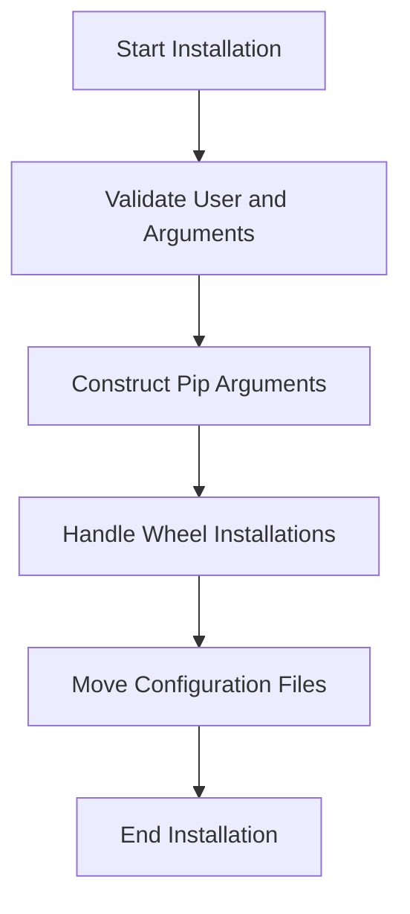

This document will cover the Integration Installation Process, which includes:

1. Validating the user and arguments
2. Constructing pip arguments
3. Handling wheel installations
4. Moving configuration files to the appropriate locations.

Technical document: <SwmLink doc-title="Integration Installation Process">[Integration Installation Process](/.swm/integration-installation-process.b3ppkxp1.sw.md)</SwmLink>

# [Validating the user and arguments](https://app.swimm.io/repos/Z2l0aHViJTNBJTNBZGF0YWRvZy1hZ2VudCUzQSUzQVN3aW1tLURlbW8=/docs/b3ppkxp1#install-function)

The installation process begins by validating the user and the provided arguments. This step ensures that the user has the necessary permissions to perform the installation and that all required arguments are correctly provided. If the user does not have the appropriate permissions or if the arguments are incorrect, the installation process will halt, and an error message will be displayed to the user.

# [Constructing pip arguments](https://app.swimm.io/repos/Z2l0aHViJTNBJTNBZGF0YWRvZy1hZ2VudCUzQSUzQVN3aW1tLURlbW8=/docs/b3ppkxp1#install-function)

After validating the user and arguments, the next step is to construct the necessary pip arguments for the installation. Pip is a package manager for Python packages, and the arguments specify how the installation should be carried out. This includes setting constraints to ensure compatibility with the Datadog checks base package and disabling the use of any index or cache to avoid downloading unnecessary files.

# [Handling wheel installations](https://app.swimm.io/repos/Z2l0aHViJTNBJTNBZGF0YWRvZy1hZ2VudCUzQSUzQVN3aW1tLURlbW8=/docs/b3ppkxp1#install-function)

The installation process handles both local and remote wheel installations. A wheel is a built package format for Python, and this step ensures that the correct version of the integration is installed. The process checks for compatibility with the Datadog checks base package and downloads the necessary wheel file if it is not available locally.

# [Moving configuration files to the appropriate locations](https://app.swimm.io/repos/Z2l0aHViJTNBJTNBZGF0YWRvZy1hZ2VudCUzQSUzQVN3aW1tLURlbW8=/docs/b3ppkxp1#move-configuration-files)

The final step in the installation process is to move the configuration files of the installed integration to the correct directory. This ensures that the integration is properly configured and ready to use. The configuration files are moved to a specific directory where the Datadog Agent can access them, ensuring that the integration functions correctly.

&nbsp;

*This is an auto-generated document by Swimm AI 🌊 and has not yet been verified by a human*

<SwmMeta version="3.0.0" repo-id="Z2l0aHViJTNBJTNBZGF0YWRvZy1hZ2VudCUzQSUzQVN3aW1tLURlbW8=" repo-name="datadog-agent">Powered by [Swimm](/)</SwmMeta>
