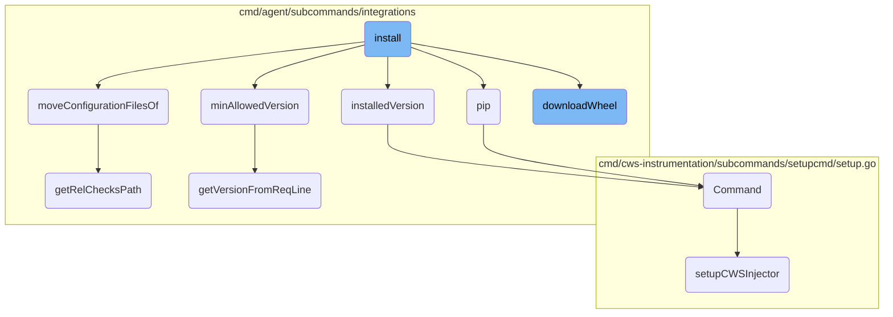

This document explains the installation process for Datadog integrations. The installation involves several steps, including validating the user and arguments, constructing pip arguments, handling wheel installations, and moving configuration files to the appropriate locations.

The installation process starts by validating the user and the provided arguments. Then, it constructs the necessary pip arguments for the installation. The process handles both local and remote wheel installations, ensuring compatibility with the Datadog checks base package. Finally, it moves the configuration files of the installed integration to the correct directory to ensure everything is set up properly.

# Flow drill down



<SwmSnippet path="/cmd/agent/subcommands/integrations/command.go" line="371">

---

## Install Function

The <SwmToken path="cmd/agent/subcommands/integrations/command.go" pos="371:2:2" line-data="func install(config config.Component, cliParams *cliParams, _ log.Component) error {">`install`</SwmToken> function orchestrates the installation process of a Datadog integration. It validates the user and arguments, constructs pip arguments, and handles both local and remote wheel installations. It ensures compatibility with the <SwmToken path="cmd/agent/subcommands/integrations/command.go" pos="215:4:8" line-data="	case &quot;datadog-checks-base&quot;:">`datadog-checks-base`</SwmToken> package and moves configuration files to the appropriate locations.

```go
func install(config config.Component, cliParams *cliParams, _ log.Component) error {
	if err := loadPythonInfo(config, cliParams); err != nil {
		return err
	}

	err := validateUser(cliParams.allowRoot)
	if err != nil {
		return err
	}

	if err := validateArgs(cliParams.args, cliParams.localWheel); err != nil {
		return err
	}

	pipArgs := []string{
		"install",
		"--constraint", constraintsPath,
		// We don't use pip to download wheels, so we don't need a cache
		"--no-cache-dir",
		// Specify to not use any index since we won't/shouldn't download anything with pip anyway
		"--no-index",
```

---

</SwmSnippet>

<SwmSnippet path="/cmd/agent/subcommands/integrations/command.go" line="716">

---

## Minimum Allowed Version

The <SwmToken path="cmd/agent/subcommands/integrations/command.go" pos="716:2:2" line-data="func minAllowedVersion(integration string) (*semver.Version, bool, error) {">`minAllowedVersion`</SwmToken> function retrieves the minimum allowed version of an integration from the requirements file. This ensures that the installed version is compatible with the agent.

```go
func minAllowedVersion(integration string) (*semver.Version, bool, error) {
	lines, err := os.ReadFile(reqAgentReleasePath)
	if err != nil {
		return nil, false, err
	}
	version, found, err := getVersionFromReqLine(integration, string(lines))
	if err != nil {
		return nil, false, err
	}

	return version, found, nil
}
```

---

</SwmSnippet>

<SwmSnippet path="/cmd/agent/subcommands/integrations/command.go" line="319">

---

## Pip Function

The <SwmToken path="cmd/agent/subcommands/integrations/command.go" pos="319:2:2" line-data="func pip(cliParams *cliParams, args []string, stdout io.Writer, stderr io.Writer) error {">`pip`</SwmToken> function executes the pip command with the specified arguments. It sets up the Python environment and forwards the standard output and error to the provided writers.

```go
func pip(cliParams *cliParams, args []string, stdout io.Writer, stderr io.Writer) error {
	pythonPath, err := getCommandPython(cliParams.pythonMajorVersion, cliParams.useSysPython)
	if err != nil {
		return err
	}

	cmd := args[0]
	implicitFlags := args[1:]
	implicitFlags = append(implicitFlags, "--disable-pip-version-check")
	args = append([]string{"-mpip"}, cmd)

	if cliParams.verbose > 0 {
		args = append(args, fmt.Sprintf("-%s", strings.Repeat("v", cliParams.verbose)))
	}

	// Append implicit flags to the *pip* command
	args = append(args, implicitFlags...)

	pipCmd := exec.Command(pythonPath, args...)

	// forward the standard output to stdout
```

---

</SwmSnippet>

<SwmSnippet path="/cmd/agent/subcommands/integrations/command.go" line="800">

---

## Move Configuration Files

The <SwmToken path="cmd/agent/subcommands/integrations/command.go" pos="800:2:2" line-data="func moveConfigurationFilesOf(cliParams *cliParams, integration string) error {">`moveConfigurationFilesOf`</SwmToken> function moves the configuration files of the installed integration to the appropriate directory. This ensures that the integration's configuration is correctly set up.

```go
func moveConfigurationFilesOf(cliParams *cliParams, integration string) error {
	confFolder := pkgconfig.Datadog().GetString("confd_path")
	check := getIntegrationName(integration)
	confFileDest := filepath.Join(confFolder, fmt.Sprintf("%s.d", check))
	if err := os.MkdirAll(confFileDest, os.ModeDir|0755); err != nil {
		return err
	}

	relChecksPath, err := getRelChecksPath(cliParams)
	if err != nil {
		return err
	}
	confFileSrc := filepath.Join(rootDir, relChecksPath, check, "data")

	return moveConfigurationFiles(confFileSrc, confFileDest)
}
```

---

</SwmSnippet>

<SwmSnippet path="/cmd/agent/subcommands/integrations/command.go" line="729">

---

## Installed Version

The <SwmToken path="cmd/agent/subcommands/integrations/command.go" pos="730:2:2" line-data="func installedVersion(cliParams *cliParams, integration string) (*semver.Version, bool, error) {">`installedVersion`</SwmToken> function retrieves the currently installed version of an integration. This helps in determining if an update or installation is necessary.

```go
// Return the version of an installed integration and whether or not it was found
func installedVersion(cliParams *cliParams, integration string) (*semver.Version, bool, error) {
	pythonPath, err := getCommandPython(cliParams.pythonMajorVersion, cliParams.useSysPython)
	if err != nil {
		return nil, false, err
	}

	validName, err := regexp.MatchString("^[0-9a-z_-]+$", integration)
	if err != nil {
		return nil, false, fmt.Errorf("Error validating integration name: %s", err)
	}
	if !validName {
		return nil, false, fmt.Errorf("Cannot get installed version of %s: invalid integration name", integration)
	}

	integrationVersionScript := integrationVersionScriptPy3
	if cliParams.pythonMajorVersion == "2" {
		integrationVersionScript = integrationVersionScriptPy2
	}

	pythonCmd := exec.Command(pythonPath, "-c", fmt.Sprintf(integrationVersionScript, integration))
```

---

</SwmSnippet>

<SwmSnippet path="/cmd/agent/subcommands/integrations/command.go" line="511">

---

## Download Wheel

The <SwmToken path="cmd/agent/subcommands/integrations/command.go" pos="511:2:2" line-data="func downloadWheel(cliParams *cliParams, integration, version, rootLayoutType string) (string, error) {">`downloadWheel`</SwmToken> function downloads the wheel file for the specified integration and version. It ensures that the correct version of the integration is obtained for installation.

```go
func downloadWheel(cliParams *cliParams, integration, version, rootLayoutType string) (string, error) {
	// We use python 3 to invoke the downloader regardless of config
	pyPath, err := getCommandPython("3", cliParams.useSysPython)
	if err != nil {
		return "", err
	}

	args := []string{
		"-m", downloaderModule,
		integration,
		"--version", version,
		"--type", rootLayoutType,
	}
	if cliParams.verbose > 0 {
		args = append(args, fmt.Sprintf("-%s", strings.Repeat("v", cliParams.verbose)))
	}

	if cliParams.unsafeDisableVerification {
		args = append(args, "--unsafe-disable-verification")
	}

```

---

</SwmSnippet>

<SwmSnippet path="/cmd/cws-instrumentation/subcommands/setupcmd/setup.go" line="26">

---

## Command Function

The <SwmToken path="cmd/cws-instrumentation/subcommands/setupcmd/setup.go" pos="26:2:2" line-data="// Command returns the commands for the setup subcommand">`Command`</SwmToken> function returns the setup subcommand for the <SwmToken path="cmd/cws-instrumentation/subcommands/setupcmd/setup.go" pos="32:9:11" line-data="		Short: &quot;Copies the cws-instrumentation binary to the CWS volume mount&quot;,">`cws-instrumentation`</SwmToken>. It sets up the necessary flags and parameters for the command.

```go
// Command returns the commands for the setup subcommand
func Command() []*cobra.Command {
	var params setupCliParams

	setupCmd := &cobra.Command{
		Use:   "setup",
		Short: "Copies the cws-instrumentation binary to the CWS volume mount",
		RunE: func(cmd *cobra.Command, args []string) error {
			return setupCWSInjector(&params)
		},
	}

	setupCmd.Flags().StringVar(&params.cwsVolumeMount, flags.CWSVolumeMount, "", "Path to the CWS volume mount")
	_ = setupCmd.MarkFlagRequired(flags.CWSVolumeMount)

	return []*cobra.Command{setupCmd}
}
```

---

</SwmSnippet>

<SwmSnippet path="/cmd/cws-instrumentation/subcommands/setupcmd/setup.go" line="44">

---

## Setup CWS Injector

The <SwmToken path="cmd/cws-instrumentation/subcommands/setupcmd/setup.go" pos="44:2:2" line-data="// setupCWSInjector copies the cws-instrumentation binary to the provided target directory">`setupCWSInjector`</SwmToken> function copies the <SwmToken path="cmd/cws-instrumentation/subcommands/setupcmd/setup.go" pos="44:8:10" line-data="// setupCWSInjector copies the cws-instrumentation binary to the provided target directory">`cws-instrumentation`</SwmToken> binary to the specified target directory. It ensures that the binary is correctly placed and has the necessary execution permissions.

```go
// setupCWSInjector copies the cws-instrumentation binary to the provided target directory
func setupCWSInjector(params *setupCliParams) error {
	// check if the target directory exists
	targetFileInfo, err := os.Stat(params.cwsVolumeMount)
	if err != nil {
		return fmt.Errorf("couldn't stat target directory: %w", err)
	}
	if !targetFileInfo.IsDir() {
		return fmt.Errorf("\"%s\" must be a directory: %s isn't a valid directory", flags.CWSVolumeMount, params.cwsVolumeMount)
	}

	// fetch the path to the current binary file
	path, err := os.Readlink("/proc/self/exe")
	if err != nil {
		return fmt.Errorf("couldn't resolve the path to the current binary: %w", err)
	}

	// copy the binary to the destination directory
	source, err := os.Open(path)
	if err != nil {
		return fmt.Errorf("couldn't open cws-instrumentation's binary file: %w", err)
```

---

</SwmSnippet>

<SwmSnippet path="/cmd/agent/subcommands/integrations/integrations_nix_helpers.go" line="30">

---

## Get Relative Checks Path

The <SwmToken path="cmd/agent/subcommands/integrations/integrations_nix_helpers.go" pos="30:2:2" line-data="func getRelChecksPath(cliParams *cliParams) (string, error) {">`getRelChecksPath`</SwmToken> function constructs the relative path to the checks directory based on the Python version. This path is used to locate the integration's configuration files.

```go
func getRelChecksPath(cliParams *cliParams) (string, error) {
	err := detectPythonMinorVersion(cliParams)
	if err != nil {
		return "", err
	}

	pythonDir := fmt.Sprintf("%s%s.%s", pythonBin, cliParams.pythonMajorVersion, pythonMinorVersion)
	return filepath.Join("embedded", "lib", pythonDir, "site-packages", "datadog_checks"), nil
}
```

---

</SwmSnippet>

<SwmSnippet path="/cmd/agent/subcommands/integrations/command.go" line="776">

---

## Get Version From Requirement Line

The <SwmToken path="cmd/agent/subcommands/integrations/command.go" pos="778:2:2" line-data="func getVersionFromReqLine(integration string, lines string) (*semver.Version, bool, error) {">`getVersionFromReqLine`</SwmToken> function parses the requirements file to extract the version of the specified integration. This helps in determining the minimum allowed version for installation.

```go
// Parse requirements lines to get a package version.
// Returns the version and whether or not it was found
func getVersionFromReqLine(integration string, lines string) (*semver.Version, bool, error) {
	exp, err := regexp.Compile(fmt.Sprintf(reqLinePattern, integration))
	if err != nil {
		return nil, false, fmt.Errorf("internal error: %v", err)
	}

	groups := exp.FindAllStringSubmatch(lines, 2)
	if groups == nil {
		return nil, false, nil
	}

	if len(groups) > 1 {
		return nil, true, fmt.Errorf("Found several matches for %s version in %s\nAborting", integration, lines)
	}

	version, err := semver.NewVersion(groups[0][1])
	if err != nil {
		return nil, true, err
	}
```

---

</SwmSnippet>

&nbsp;

*This is an auto-generated document by Swimm AI 🌊 and has not yet been verified by a human*

<SwmMeta version="3.0.0" repo-id="Z2l0aHViJTNBJTNBZGF0YWRvZy1hZ2VudCUzQSUzQVN3aW1tLURlbW8=" repo-name="datadog-agent"><sup>Powered by [Swimm](/)</sup></SwmMeta>
