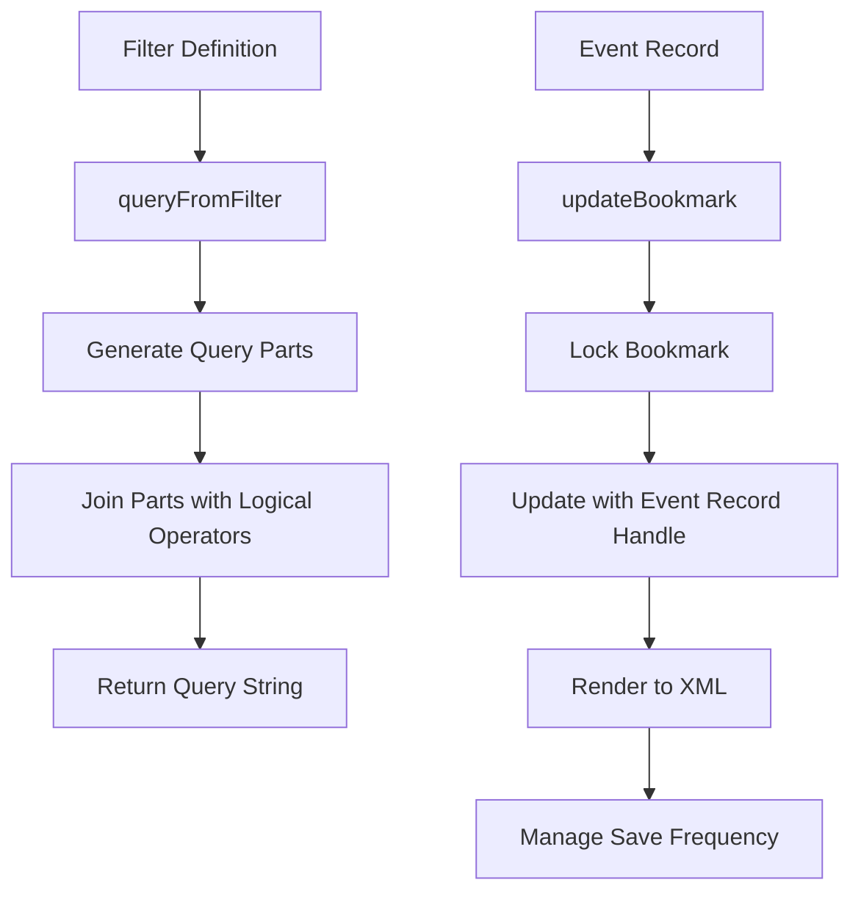

# Introduction to Agent Checks

Agent checks are components responsible for collecting metrics, logs, and traces from various sources. They are implemented as Python classes that inherit from `AgentCheck` and define a `check` method. Each check instance can have its own configuration, which includes parameters like `server_url`, `user`, `password`, and `interval`. These configurations are defined in YAML format and are independent of each other.

<SwmSnippet path="/comp/checks/windowseventlog/windowseventlogimpl/check/check.go" line="42">

---

# Check Type Definition

The `Check` type defines a check that reads the Windows Event Log and submits events. It includes configurations, event metrics, security profiles, and methods for managing event logs.

```go
// Check defines a check that reads the Windows Event Log and submits Events
type Check struct {
	// check
	core.CheckBase
	config *Config

	logsAgent   optional.Option[logsAgent.Component]
	agentConfig configComponent.Component

	fetchEventsLoopWaiter sync.WaitGroup
	fetchEventsLoopStop   chan struct{}

	includedMessages []*regexp.Regexp
	excludedMessages []*regexp.Regexp

	// event metrics
	eventPriority agentEvent.Priority

	// security profile
	ddSecurityEventsFilter eventdatafilter.Filter
```

---

</SwmSnippet>

<SwmSnippet path="/comp/checks/windowseventlog/windowseventlogimpl/check/check.go" line="72">

---

# Running a Check

The `Run` method updates sender stats, restarts the subscription if it failed, and saves the bookmark. The main event collection logic runs continuously in the background.

```go
// Run updates sender stats, restarts the subscription if it failed, and saves the bookmark.
// The main event collection logic runs continuously in the background, not during Run().
func (c *Check) Run() error {
	sender, err := c.GetSender()
	if err != nil {
		return err
	}
	// Necessary for check stats to be calculated (number of events collected, etc)
	// Since events are collected in the background, this will update stats with the
	// count of events collected since the last Run() call.
	defer sender.Commit()

	// Start/Restart the subscription if it is not running
	if !c.sub.Running() {
		// starts the event collection in the background.
		err := c.startSubscription()
		if err != nil {
			err = fmt.Errorf("subscription is not running, failed to start: %w", err)
			if c.sub.Error() != nil {
				err = fmt.Errorf("%w, last stop reason: %w", err, c.sub.Error())
			}
```

---

</SwmSnippet>

# Endpoints of Checks

Endpoints of checks are specific functions that handle various tasks related to the check's operation. Two important endpoints are `queryFromFilter` and `updateBookmark`.

<SwmSnippet path="/comp/checks/windowseventlog/windowseventlogimpl/check/filters.go" line="40">

---

## queryFromFilter

The `queryFromFilter` function converts a filter definition from the configuration into a structured XML query. This function checks if the filter is empty and generates query parts for sources, types, and event IDs. It then joins these parts using logical operators to form a complete query string.

```go
func queryFromFilter(f filterDefinition) (string, error) {
	if filterIsEmpty(f) {
		return "*", nil
	}
	sourcePart, err := genQueryPart(f.Sources(), formatSourcePart)
	if err != nil {
		return "", err
	}
	if len(sourcePart) > 0 {
		sourcePart = fmt.Sprintf("Provider[%s]", sourcePart)
	}
	typePart, err := genQueryPart(f.Types(), formatTypePart)
	if err != nil {
		return "", err
	}
	eventIDPart, err := genQueryPart(f.IDs(), formatEventIDPart)
	if err != nil {
		return "", err
	}
	systemValsQuery := logicJoinParts([]string{
		sourcePart,
```

---

</SwmSnippet>

<SwmSnippet path="/comp/checks/windowseventlog/windowseventlogimpl/check/bookmark.go" line="34">

---

## updateBookmark

The `updateBookmark` method in the `bookmarkSaver` struct updates the bookmark with the latest event record. It locks the bookmark for thread safety, updates it with the event record handle, and renders it to XML. The method also manages the frequency of saving the bookmark based on the configured `bookmarkFrequency`.

```go
func (b *bookmarkSaver) updateBookmark(event *evtapi.EventRecord) error {
	b.mu.Lock()
	defer b.mu.Unlock()

	// Updating and rendering the bookmark is fast, and it makes the "update bookmark at end of check"
	// logic easier by avoiding having to conditionally track/save/close the event handle, so just do it every time.
	// DuplicateHandle() does not support event log handles, so we can't use it to separate the event
	// from the subscription.
	err := b.bookmark.Update(event.EventRecordHandle)
	if err != nil {
		return fmt.Errorf("failed to update bookmark: %w", err)
	}

	bookmarkXML, err := b.bookmark.Render()
	if err != nil {
		return fmt.Errorf("failed to render bookmark XML: %w", err)
	}
	b.lastBookmark = bookmarkXML

	// The bookmark is only saved/persisted according to the bookmarkFrequency
	b.eventsSinceLastBookmark++
```

---

</SwmSnippet>

&nbsp;

*This is an auto-generated document by Swimm AI 🌊 and has not yet been verified by a human*

<SwmMeta version="3.0.0" repo-id="Z2l0aHViJTNBJTNBZGF0YWRvZy1hZ2VudCUzQSUzQVN3aW1tLURlbW8=" repo-name="datadog-agent"><sup>Powered by [Swimm](https://app.swimm.io/)</sup></SwmMeta>
