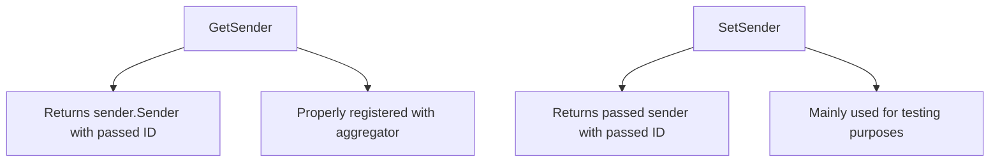

# Introduction

The Aggregator module is a critical component of the Datadog Agent, responsible for collecting and processing metrics, events, and service checks from various sources. This module is intended for internal use and should never be imported directly. Instead, checks should use the methods exposed by the <SwmToken path="rtloader/test/python/datadog_checks/base/checks/__init__.py" pos="2:2:2" line-data="class AgentCheck(object):  # noqa: UP004">`AgentCheck`</SwmToken> class.

# Aggregator Usage

The Aggregator module allows a Python check to send metrics, events, and service checks to the aggregator component of the Datadog Agent. The `submit_metric` function in the Aggregator module is used to submit a metric to the aggregator. This function handles encoding and raises a `UnicodeError` if encoding fails.

# Main Functions

The Aggregator module includes several key functions that facilitate its operation. Below are the main functions and their purposes.

<SwmSnippet path="/pkg/aggregator/aggregator.go" line="268">

---

## <SwmToken path="pkg/aggregator/aggregator.go" pos="268:2:2" line-data="// NewBufferedAggregator instantiates a BufferedAggregator">`NewBufferedAggregator`</SwmToken>

The <SwmToken path="pkg/aggregator/aggregator.go" pos="268:2:2" line-data="// NewBufferedAggregator instantiates a BufferedAggregator">`NewBufferedAggregator`</SwmToken> function instantiates a <SwmToken path="pkg/aggregator/aggregator.go" pos="268:8:8" line-data="// NewBufferedAggregator instantiates a BufferedAggregator">`BufferedAggregator`</SwmToken>. It initializes various channels and configurations needed for the aggregator to function. This function is essential for setting up the aggregator with the necessary parameters and dependencies.

```go
// NewBufferedAggregator instantiates a BufferedAggregator
func NewBufferedAggregator(s serializer.MetricSerializer, eventPlatformForwarder eventplatform.Component, hostname string, flushInterval time.Duration) *BufferedAggregator {
	bufferSize := config.Datadog().GetInt("aggregator_buffer_size")

	agentName := flavor.GetFlavor()
	if agentName == flavor.IotAgent && !config.Datadog().GetBool("iot_host") {
		agentName = flavor.DefaultAgent
	} else if config.Datadog().GetBool("iot_host") {
		// Override the agentName if this Agent is configured to report as IotAgent
		agentName = flavor.IotAgent
	}
	if config.Datadog().GetBool("heroku_dyno") {
		// Override the agentName if this Agent is configured to report as Heroku Dyno
		agentName = flavor.HerokuAgent
	}

	if config.Datadog().GetBool("djm_config.enabled") {
		AddRecurrentSeries(&metrics.Serie{
			Name:   "datadog.djm.agent_host",
			Points: []metrics.Point{{Value: 1.0}},
			MType:  metrics.APIGaugeType,
```

---

</SwmSnippet>

<SwmSnippet path="/pkg/aggregator/demultiplexer_agent.go" line="381">

---

## <SwmToken path="pkg/aggregator/demultiplexer_agent.go" pos="381:2:2" line-data="// flushToSerializer flushes all data from the aggregator and time samplers">`flushToSerializer`</SwmToken>

The <SwmToken path="pkg/aggregator/demultiplexer_agent.go" pos="381:2:2" line-data="// flushToSerializer flushes all data from the aggregator and time samplers">`flushToSerializer`</SwmToken> function flushes all data from the aggregator and time samplers to the serializer. It ensures that metrics are serialized and sent to the appropriate destinations. This function is crucial for the periodic flushing of metrics data.

```go
// flushToSerializer flushes all data from the aggregator and time samplers
// to the serializer.
//
// Best practice is that this method is *only* called by the flushLoop routine.
// It technically works if called from outside of this routine, but beware of
// deadlocks with the parallel stream series implementation.
//
// This implementation is not flushing the TimeSampler and the BufferedAggregator
// concurrently because the IterableSeries is not thread safe / supporting concurrent usage.
// If one day a better (faster?) solution is needed, we could either consider:
// - to have an implementation of SendIterableSeries listening on multiple sinks in parallel, or,
// - to have a thread-safe implementation of the underlying `util.BufferedChan`.
func (d *AgentDemultiplexer) flushToSerializer(start time.Time, waitForSerializer bool) {
	d.m.RLock()
	defer d.m.RUnlock()

	if d.aggregator == nil {
		// NOTE(remy): we could consider flushing only the time samplers
		return
	}
```

---

</SwmSnippet>

<SwmSnippet path="/pkg/aggregator/aggregator.go" line="737">

---

## run

The <SwmToken path="pkg/aggregator/aggregator.go" pos="737:9:9" line-data="func (agg *BufferedAggregator) run() {">`run`</SwmToken> function is the main loop of the <SwmToken path="pkg/aggregator/aggregator.go" pos="737:6:6" line-data="func (agg *BufferedAggregator) run() {">`BufferedAggregator`</SwmToken>. It handles various channels for events, service checks, and orchestrator metadata. This function ensures that the aggregator processes incoming data and triggers flushes at the appropriate times.

```go
func (agg *BufferedAggregator) run() {
	// ensures event platform errors are logged at most once per flush
	aggregatorEventPlatformErrorLogged := false

	for {
		select {
		case <-agg.stopChan:
			log.Info("Stopping aggregator")
			return
		case trigger := <-agg.flushChan:
			agg.Flush(trigger)

			// Do this here, rather than in the Flush():
			// - make sure Shrink doesn't happen concurrently with sample processing.
			// - we don't need to Shrink() on stop
			agg.tagsStore.Shrink()

			aggregatorEventPlatformErrorLogged = false
		case <-agg.health.C:
		case checkItem := <-agg.checkItems:
			checkItem.handle(agg)
```

---

</SwmSnippet>

# Aggregator Endpoints

The Aggregator module provides several endpoints for interacting with the aggregator. These endpoints are essential for managing senders and their interactions with the aggregator.

<SwmSnippet path="/pkg/aggregator/demultiplexer_senders.go" line="44">

---

## <SwmToken path="pkg/aggregator/demultiplexer_senders.go" pos="44:2:2" line-data="// GetSender returns a sender.Sender with passed ID, properly registered with the aggregator">`GetSender`</SwmToken>

The <SwmToken path="pkg/aggregator/demultiplexer_senders.go" pos="44:2:2" line-data="// GetSender returns a sender.Sender with passed ID, properly registered with the aggregator">`GetSender`</SwmToken> function returns a <SwmToken path="pkg/aggregator/demultiplexer_senders.go" pos="44:8:10" line-data="// GetSender returns a sender.Sender with passed ID, properly registered with the aggregator">`sender.Sender`</SwmToken> with the passed ID, properly registered with the aggregator. If no error is returned, <SwmToken path="pkg/aggregator/demultiplexer_senders.go" pos="45:15:15" line-data="// If no error is returned here, DestroySender must be called with the same ID">`DestroySender`</SwmToken> must be called with the same ID once the sender is no longer used.

```go
// GetSender returns a sender.Sender with passed ID, properly registered with the aggregator
// If no error is returned here, DestroySender must be called with the same ID
// once the sender is not used anymore
func (s *senders) GetSender(cid checkid.ID) (sender.Sender, error) {
	sender, err := s.senderPool.getSender(cid)
	if err != nil {
		sender, err = s.senderPool.mkSender(cid)
	}
	return sender, err
}
```

---

</SwmSnippet>

<SwmSnippet path="/pkg/aggregator/demultiplexer_senders.go" line="35">

---

## <SwmToken path="pkg/aggregator/demultiplexer_senders.go" pos="35:2:2" line-data="// SetSender returns the passed sender with the passed ID.">`SetSender`</SwmToken>

The <SwmToken path="pkg/aggregator/demultiplexer_senders.go" pos="35:2:2" line-data="// SetSender returns the passed sender with the passed ID.">`SetSender`</SwmToken> function returns the passed sender with the passed ID. This function is mainly used for testing purposes.

```go
// SetSender returns the passed sender with the passed ID.
// This is largely for testing purposes
func (s *senders) SetSender(sender sender.Sender, id checkid.ID) error {
	if s == nil {
		return errors.New("Demultiplexer was not initialized")
	}
	return s.senderPool.setSender(sender, id)
}
```

---

</SwmSnippet>

&nbsp;

*This is an auto-generated document by Swimm AI 🌊 and has not yet been verified by a human*

<SwmMeta version="3.0.0" repo-id="Z2l0aHViJTNBJTNBZGF0YWRvZy1hZ2VudCUzQSUzQVN3aW1tLURlbW8=" repo-name="datadog-agent"><sup>Powered by [Swimm](/)</sup></SwmMeta>
