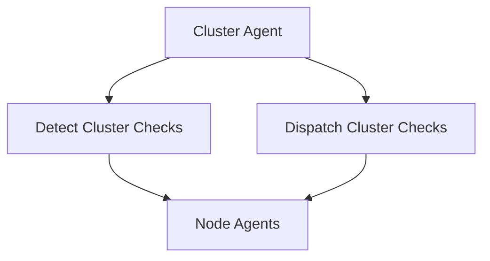

# Introduction to Cluster Agent

The Cluster Agent is a component responsible for running checks that need to be executed only once per cluster. It ensures that these checks are not redundantly run by multiple agents within the same cluster.

The Cluster Agent exposes an API that provides other Datadog agents with cluster-level metadata for their metrics. This helps in aggregating and analyzing data at the cluster level.

The Cluster Agent is configured and managed through various commands defined in the <SwmPath>[cmd/cluster-agent/](cmd/cluster-agent/)</SwmPath> directory. These commands include functionalities like starting the agent, running diagnostics, and checking the status.

<SwmSnippet path="/cmd/cluster-agent/subcommands/start/command.go" line="117">

---

## Commands Function

The <SwmToken path="cmd/cluster-agent/subcommands/start/command.go" pos="117:2:2" line-data="// Commands returns a slice of subcommands for the &#39;cluster-agent&#39; command.">`Commands`</SwmToken> function returns a slice of subcommands for the <SwmToken path="cmd/cluster-agent/subcommands/start/command.go" pos="117:19:21" line-data="// Commands returns a slice of subcommands for the &#39;cluster-agent&#39; command.">`cluster-agent`</SwmToken> command. This function is essential for initializing and managing the Cluster Agent's operations.

```go
// Commands returns a slice of subcommands for the 'cluster-agent' command.
func Commands(globalParams *command.GlobalParams) []*cobra.Command {
	startCmd := &cobra.Command{
		Use:   "start",
		Short: "Start the Cluster Agent",
		Long:  `Runs Datadog Cluster agent in the foreground`,
		RunE: func(cmd *cobra.Command, args []string) error {
			// TODO: once the cluster-agent is represented as a component, and
			// not a function (start), this will use `fxutil.Run` instead of
			// `fxutil.OneShot`.
			return fxutil.OneShot(start,
				fx.Supply(globalParams),
				fx.Supply(core.BundleParams{
					ConfigParams: config.NewClusterAgentParams(globalParams.ConfFilePath),
					SecretParams: secrets.NewEnabledParams(),
					LogParams:    log.ForDaemon(command.LoggerName, "log_file", path.DefaultDCALogFile),
				}),
				core.Bundle(),
				forwarder.Bundle(),
				fx.Provide(func(config config.Component, log log.Component) defaultforwarder.Params {
					params := defaultforwarder.NewParamsWithResolvers(config, log)
```

---

</SwmSnippet>

## Cluster Check Package

The Cluster Check Package holds the logic to detect and dispatch cluster checks on node-agents that report to it. The <SwmToken path="cmd/cluster-agent/subcommands/start/command.go" pos="117:19:21" line-data="// Commands returns a slice of subcommands for the &#39;cluster-agent&#39; command.">`cluster-agent`</SwmToken> is responsible for spreading the load across available nodes.

## Kubernetes Manifests

The Kubernetes manifests in this directory are generated from the helm chart <SwmPath>[pkg/proto/datadog/](pkg/proto/datadog/)</SwmPath>. They enable various features including cluster checks and the cluster agent.

## Cluster Agent Endpoints

The Cluster Agent exposes several endpoints to interact with its functionalities. Two of the key endpoints are <SwmPath>[cmd/agent/subcommands/version/](cmd/agent/subcommands/version/)</SwmPath> and <SwmPath>[cmd/agent/subcommands/hostname/](cmd/agent/subcommands/hostname/)</SwmPath>.

<SwmSnippet path="/cmd/cluster-agent/api/agent/agent.go" line="98">

---

### <SwmToken path="cmd/cluster-agent/api/agent/agent.go" pos="98:2:2" line-data="func getVersion(w http.ResponseWriter, _ *http.Request) {">`getVersion`</SwmToken>

The <SwmToken path="cmd/cluster-agent/api/agent/agent.go" pos="98:2:2" line-data="func getVersion(w http.ResponseWriter, _ *http.Request) {">`getVersion`</SwmToken> function handles the <SwmPath>[cmd/agent/subcommands/version/](cmd/agent/subcommands/version/)</SwmPath> endpoint. It retrieves the current version of the Datadog Agent and returns it as a JSON response. This endpoint is useful for verifying the version of the agent running in the cluster.

```go
func getVersion(w http.ResponseWriter, _ *http.Request) {
	w.Header().Set("Content-Type", "application/json")
	av, err := version.Agent()
	if err != nil {
		httputils.SetJSONError(w, err, 500)
		return
	}
	j, err := json.Marshal(av)
	if err != nil {
		httputils.SetJSONError(w, err, 500)
		return
	}
	w.Write(j)
}
```

---

</SwmSnippet>

<SwmSnippet path="/cmd/cluster-agent/api/agent/agent.go" line="113">

---

### <SwmToken path="cmd/cluster-agent/api/agent/agent.go" pos="113:2:2" line-data="func getHostname(w http.ResponseWriter, r *http.Request) {">`getHostname`</SwmToken>

The <SwmToken path="cmd/cluster-agent/api/agent/agent.go" pos="113:2:2" line-data="func getHostname(w http.ResponseWriter, r *http.Request) {">`getHostname`</SwmToken> function handles the <SwmPath>[cmd/agent/subcommands/hostname/](cmd/agent/subcommands/hostname/)</SwmPath> endpoint. It retrieves the hostname of the machine where the Datadog Agent is running and returns it as a JSON response. This endpoint is useful for identifying the specific node in the cluster.

```go
func getHostname(w http.ResponseWriter, r *http.Request) {
	w.Header().Set("Content-Type", "application/json")
	hname, err := hostname.Get(r.Context())
	if err != nil {
		log.Warnf("Error getting hostname: %s", err)
		hname = ""
	}
	j, err := json.Marshal(hname)
	if err != nil {
		httputils.SetJSONError(w, err, 500)
		return
	}
	w.Write(j)
}
```

---

</SwmSnippet>

&nbsp;

*This is an auto-generated document by Swimm AI 🌊 and has not yet been verified by a human*

<SwmMeta version="3.0.0" repo-id="Z2l0aHViJTNBJTNBZGF0YWRvZy1hZ2VudCUzQSUzQVN3aW1tLURlbW8=" repo-name="datadog-agent"><sup>Powered by [Swimm](/)</sup></SwmMeta>
