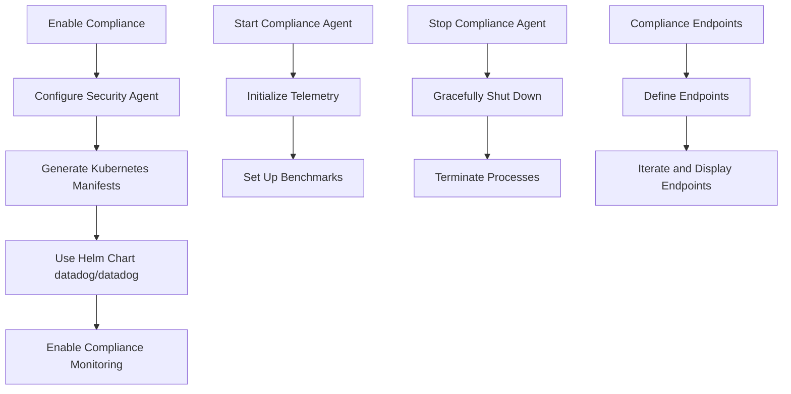

# Introduction to Compliance in Packages

Compliance ensures the Datadog Agent adheres to various security and operational standards. It is essential for maintaining the integrity and security of the systems monitored by the agent.

# Enabling Compliance

Compliance is enabled through the security agent, which is configured via Kubernetes manifests. These manifests are generated from the Helm chart <SwmPath>[pkg/proto/datadog/](pkg/proto/datadog/)</SwmPath> and include settings to enable compliance monitoring.

# Compliance Package

The compliance package includes various utilities and functions to handle compliance-related tasks. For example, it defines the `packageInfo` struct, which holds information about installed packages, such as name, version, and architecture.

# Starting the Compliance Agent

The <SwmToken path="pkg/compliance/agent.go" pos="201:2:2" line-data="// Start starts the compliance agent.">`Start`</SwmToken> function initializes and starts the compliance agent, setting up necessary telemetry and benchmarks.

<SwmSnippet path="/pkg/compliance/agent.go" line="201">

---

The <SwmToken path="pkg/compliance/agent.go" pos="201:2:2" line-data="// Start starts the compliance agent.">`Start`</SwmToken> function initializes and starts the compliance agent, setting up necessary telemetry and benchmarks.

```go
// Start starts the compliance agent.
func (a *Agent) Start() error {
	telemetry, err := telemetry.NewContainersTelemetry(a.telemetrySender, a.wmeta)
	if err != nil {
		log.Errorf("could not start containers telemetry: %v", err)
		return err
	}

	ctx, cancel := context.WithCancel(context.Background())
	a.telemetry = telemetry
	a.cancel = cancel
	a.finish = make(chan struct{})

	status.Set(
		"Checks",
		expvar.Func(func() interface{} {
			return a.getChecksStatus()
		}),
	)

	_, k8sResourceData := k8sconfig.LoadConfiguration(ctx, a.opts.HostRoot)
```

---

</SwmSnippet>

# Stopping the Compliance Agent

The <SwmToken path="pkg/compliance/agent.go" pos="281:2:2" line-data="// Stop stops the compliance agent.">`Stop`</SwmToken> function gracefully shuts down the compliance agent, ensuring all processes are properly terminated.

<SwmSnippet path="/pkg/compliance/agent.go" line="281">

---

The <SwmToken path="pkg/compliance/agent.go" pos="281:2:2" line-data="// Stop stops the compliance agent.">`Stop`</SwmToken> function gracefully shuts down the compliance agent, ensuring all processes are properly terminated.

```go
// Stop stops the compliance agent.
func (a *Agent) Stop() {
	log.Tracef("shutting down compliance agent")
	a.cancel()
	select {
	case <-time.After(20 * time.Second):
	case <-a.finish:
	}
	a.opts.Reporter.Stop()
	log.Infof("compliance agent shut down")
}
```

---

</SwmSnippet>

# Compliance Endpoints

The compliance endpoints are defined within the compliance status template. These endpoints are iterated over and displayed if they exist within the compliance status.

<SwmSnippet path="/pkg/compliance/status_templates/compliance.tmpl" line="5">

---

The compliance endpoints are defined within the compliance status template. These endpoints are iterated over and displayed if they exist within the compliance status.

```tmpl
  {{ if .endpoints }}
  {{- range $endpoint := .endpoints }}
  {{ $endpoint }}
  {{- end }}
  {{- end }}
```

---

</SwmSnippet>

&nbsp;

*This is an auto-generated document by Swimm AI 🌊 and has not yet been verified by a human*

<SwmMeta version="3.0.0" repo-id="Z2l0aHViJTNBJTNBZGF0YWRvZy1hZ2VudCUzQSUzQVN3aW1tLURlbW8=" repo-name="datadog-agent"><sup>Powered by [Swimm](/)</sup></SwmMeta>
