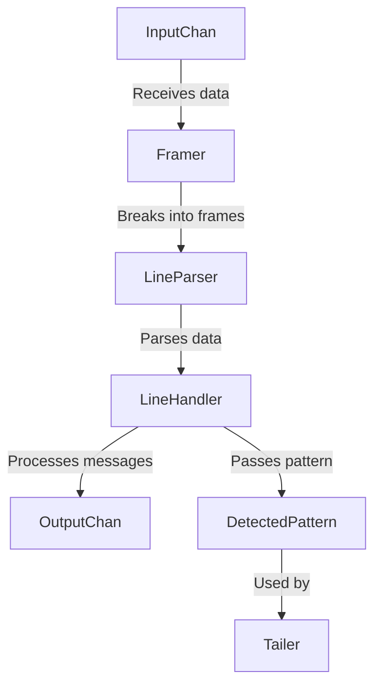

# Introduction to Decoder

The Decoder translates a sequence of byte buffers, such as from a file or a network socket, into log messages. It is structured as an actor receiving messages on <SwmToken path="pkg/logs/internal/decoder/decoder.go" pos="84:1:1" line-data="	inputChan := make(chan *message.Message)">`inputChan`</SwmToken> and writing its output in <SwmToken path="pkg/logs/internal/decoder/decoder.go" pos="85:1:1" line-data="	outputChan := make(chan *message.Message)">`outputChan`</SwmToken>.

## Decoder Workflow

The Decoder's <SwmToken path="pkg/logs/internal/decoder/decoder.go" pos="188:5:5" line-data="	go d.run()">`run`</SwmToken> method takes data from <SwmToken path="pkg/logs/internal/decoder/decoder.go" pos="84:1:1" line-data="	inputChan := make(chan *message.Message)">`inputChan`</SwmToken>, uses a Framer to break it into frames, and then passes that data to a <SwmToken path="pkg/logs/internal/decoder/decoder.go" pos="202:3:3" line-data="		d.lineParser.flush()">`lineParser`</SwmToken>. The <SwmToken path="pkg/logs/internal/decoder/decoder.go" pos="202:3:3" line-data="		d.lineParser.flush()">`lineParser`</SwmToken> uses a Parser to parse the data and passes it to the <SwmToken path="pkg/logs/internal/decoder/decoder.go" pos="91:7:7" line-data="	// construct the lineHandler">`lineHandler`</SwmToken>. The <SwmToken path="pkg/logs/internal/decoder/decoder.go" pos="91:7:7" line-data="	// construct the lineHandler">`lineHandler`</SwmToken> processes the messages as necessary (as single lines, multiple lines, or <SwmToken path="pkg/logs/internal/decoder/decoder.go" pos="43:9:11" line-data="// multiple lines, or auto-detecting the two), and sends the result to the">`auto-detecting`</SwmToken> the two) and sends the result to the Decoder's output channel. The Decoder holds an instance of <SwmToken path="pkg/logs/internal/decoder/decoder.go" pos="87:1:1" line-data="	detectedPattern := &amp;DetectedPattern{}">`detectedPattern`</SwmToken>, a thread-safe container used to pass a multiline pattern up from the line handler to the tailer. The tailer uses the <SwmToken path="pkg/logs/internal/decoder/decoder.go" pos="87:1:1" line-data="	detectedPattern := &amp;DetectedPattern{}">`detectedPattern`</SwmToken> to determine if a pattern should be reused when a file rotates.

## Initializing the Decoder

The function <SwmToken path="pkg/logs/internal/decoder/decoder.go" pos="59:2:2" line-data="// InitializeDecoder returns a properly initialized Decoder">`InitializeDecoder`</SwmToken> returns a properly initialized Decoder. It sets up the necessary channels and components for the Decoder to function.

<SwmSnippet path="/pkg/logs/internal/decoder/decoder.go" line="59">

---

The <SwmToken path="pkg/logs/internal/decoder/decoder.go" pos="59:2:2" line-data="// InitializeDecoder returns a properly initialized Decoder">`InitializeDecoder`</SwmToken> function sets up the decoder with the necessary components like the source, parser, and tailer information.

```go
// InitializeDecoder returns a properly initialized Decoder
func InitializeDecoder(source *sources.ReplaceableSource, parser parsers.Parser, tailerInfo *status.InfoRegistry) *Decoder {
	return NewDecoderWithFraming(source, parser, framer.UTF8Newline, nil, tailerInfo)
}
```

---

</SwmSnippet>

## Starting the Decoder

The method <SwmToken path="pkg/logs/internal/decoder/decoder.go" pos="186:2:2" line-data="// Start starts the Decoder">`Start`</SwmToken> begins the Decoder's operation by calling its <SwmToken path="pkg/logs/internal/decoder/decoder.go" pos="188:5:5" line-data="	go d.run()">`run`</SwmToken> method in a new goroutine. This allows the Decoder to start processing incoming messages asynchronously.

<SwmSnippet path="/pkg/logs/internal/decoder/decoder.go" line="186">

---

The <SwmToken path="pkg/logs/internal/decoder/decoder.go" pos="186:2:2" line-data="// Start starts the Decoder">`Start`</SwmToken> method launches the <SwmToken path="pkg/logs/internal/decoder/decoder.go" pos="188:5:5" line-data="	go d.run()">`run`</SwmToken> method in a new goroutine, allowing the Decoder to begin processing messages from the input channel.

```go
// Start starts the Decoder
func (d *Decoder) Start() {
	go d.run()
}
```

---

</SwmSnippet>

## Stopping the Decoder

The method <SwmToken path="pkg/logs/internal/decoder/decoder.go" pos="191:2:2" line-data="// Stop stops the Decoder">`Stop`</SwmToken> stops the Decoder by closing the input channel. This action propagates through the components and eventually causes the <SwmToken path="pkg/logs/internal/decoder/decoder.go" pos="188:5:5" line-data="	go d.run()">`run`</SwmToken> method to finish, closing the output channel.

<SwmSnippet path="/pkg/logs/internal/decoder/decoder.go" line="191">

---

The <SwmToken path="pkg/logs/internal/decoder/decoder.go" pos="191:2:2" line-data="// Stop stops the Decoder">`Stop`</SwmToken> method closes the input channel, which propagates through the components and eventually causes the <SwmToken path="pkg/logs/internal/decoder/decoder.go" pos="194:11:11" line-data="	// components and eventually cause run() to finish, closing OutputChan.">`run`</SwmToken> method to finish, closing the output channel.

```go
// Stop stops the Decoder
func (d *Decoder) Stop() {
	// stop the entire decoder by closing the input.  This will "bubble" through the
	// components and eventually cause run() to finish, closing OutputChan.
	close(d.InputChan)
}
```

---

</SwmSnippet>

## Processing Messages

The <SwmToken path="pkg/logs/internal/decoder/decoder.go" pos="188:5:5" line-data="	go d.run()">`run`</SwmToken> method processes incoming messages from the <SwmToken path="pkg/logs/internal/decoder/decoder.go" pos="84:1:1" line-data="	inputChan := make(chan *message.Message)">`inputChan`</SwmToken>. It uses a Framer to break the data into frames, which are then parsed by the <SwmToken path="pkg/logs/internal/decoder/decoder.go" pos="202:3:3" line-data="		d.lineParser.flush()">`lineParser`</SwmToken> and processed by the <SwmToken path="pkg/logs/internal/decoder/decoder.go" pos="91:7:7" line-data="	// construct the lineHandler">`lineHandler`</SwmToken>. The processed messages are sent to the <SwmToken path="pkg/logs/internal/decoder/decoder.go" pos="85:1:1" line-data="	outputChan := make(chan *message.Message)">`outputChan`</SwmToken>.

<SwmSnippet path="/pkg/logs/internal/decoder/decoder.go" line="198">

---

The <SwmToken path="pkg/logs/internal/decoder/decoder.go" pos="198:9:9" line-data="func (d *Decoder) run() {">`run`</SwmToken> method is the core of the Decoder's functionality. It processes messages from the input channel, uses the framer to break them into frames, and passes the data to the line parser and line handler. It also handles flushing the line parser and line handler when necessary.

```go
func (d *Decoder) run() {
	defer func() {
		// flush any remaining output in component order, and then close the
		// output channel
		d.lineParser.flush()
		d.lineHandler.flush()
		close(d.OutputChan)
	}()
	for {
		select {
		case msg, isOpen := <-d.InputChan:
			if !isOpen {
				// InputChan has been closed, no more lines are expected
				return
			}

			d.framer.Process(msg)

		case <-d.lineParser.flushChan():
			log.Debug("Flushing line parser because the flush timeout has been reached.")
			d.lineParser.flush()
```

---

</SwmSnippet>

## Main Functions

There are several main functions in this folder. Some of them are <SwmToken path="pkg/logs/internal/decoder/decoder.go" pos="23:2:2" line-data="// NewInput returns a new decoder input.">`NewInput`</SwmToken>, <SwmToken path="pkg/logs/internal/decoder/decoder.go" pos="59:2:2" line-data="// InitializeDecoder returns a properly initialized Decoder">`InitializeDecoder`</SwmToken>, <SwmToken path="pkg/logs/internal/decoder/decoder.go" pos="61:3:3" line-data="	return NewDecoderWithFraming(source, parser, framer.UTF8Newline, nil, tailerInfo)">`NewDecoderWithFraming`</SwmToken>, Start, Stop, and run. We will dive a little into <SwmToken path="pkg/logs/internal/decoder/decoder.go" pos="23:2:2" line-data="// NewInput returns a new decoder input.">`NewInput`</SwmToken>, <SwmToken path="pkg/logs/internal/decoder/decoder.go" pos="59:2:2" line-data="// InitializeDecoder returns a properly initialized Decoder">`InitializeDecoder`</SwmToken>, <SwmToken path="pkg/logs/internal/decoder/decoder.go" pos="61:3:3" line-data="	return NewDecoderWithFraming(source, parser, framer.UTF8Newline, nil, tailerInfo)">`NewDecoderWithFraming`</SwmToken>, Start, Stop, and run.

### <SwmToken path="pkg/logs/internal/decoder/decoder.go" pos="23:2:2" line-data="// NewInput returns a new decoder input.">`NewInput`</SwmToken>

The <SwmToken path="pkg/logs/internal/decoder/decoder.go" pos="23:2:2" line-data="// NewInput returns a new decoder input.">`NewInput`</SwmToken> function returns a new decoder input. It creates an unstructured message of raw bytes as the content, which is used by file tailers and socket tailers.

<SwmSnippet path="/pkg/logs/internal/decoder/decoder.go" line="23">

---

The <SwmToken path="pkg/logs/internal/decoder/decoder.go" pos="23:2:2" line-data="// NewInput returns a new decoder input.">`NewInput`</SwmToken> function creates an unstructured message of raw bytes, used by file tailers and socket tailers.

```go
// NewInput returns a new decoder input.
// A decoder input is an unstructured message of raw bytes as the content.
// Some of the tailers using this are the file tailers and socket tailers
// as these logs don't have any structure, they're just raw bytes log.
// See message.Message / message.MessageContent comment for more information.
func NewInput(content []byte) *message.Message {
	return message.NewMessage(content, nil, "", time.Now().UnixNano())
}
```

---

</SwmSnippet>

### <SwmToken path="pkg/logs/internal/decoder/decoder.go" pos="59:2:2" line-data="// InitializeDecoder returns a properly initialized Decoder">`InitializeDecoder`</SwmToken>

The <SwmToken path="pkg/logs/internal/decoder/decoder.go" pos="59:2:2" line-data="// InitializeDecoder returns a properly initialized Decoder">`InitializeDecoder`</SwmToken> function returns a properly initialized Decoder. It sets up the decoder with the necessary components like the source, parser, and tailer information.

### <SwmToken path="pkg/logs/internal/decoder/decoder.go" pos="61:3:3" line-data="	return NewDecoderWithFraming(source, parser, framer.UTF8Newline, nil, tailerInfo)">`NewDecoderWithFraming`</SwmToken>

The <SwmToken path="pkg/logs/internal/decoder/decoder.go" pos="61:3:3" line-data="	return NewDecoderWithFraming(source, parser, framer.UTF8Newline, nil, tailerInfo)">`NewDecoderWithFraming`</SwmToken> function initializes a decoder with a given endline strategy. It sets up the input and output channels, constructs the line handler, line parser, and framer, and returns a new Decoder instance.

<SwmSnippet path="/pkg/logs/internal/decoder/decoder.go" line="82">

---

The <SwmToken path="pkg/logs/internal/decoder/decoder.go" pos="82:2:2" line-data="// NewDecoderWithFraming initialize a decoder with given endline strategy.">`NewDecoderWithFraming`</SwmToken> function initializes a decoder with a given endline strategy, setting up the input and output channels, and constructing the line handler, line parser, and framer.

```go
// NewDecoderWithFraming initialize a decoder with given endline strategy.
func NewDecoderWithFraming(source *sources.ReplaceableSource, parser parsers.Parser, framing framer.Framing, multiLinePattern *regexp.Regexp, tailerInfo *status.InfoRegistry) *Decoder {
	inputChan := make(chan *message.Message)
	outputChan := make(chan *message.Message)
	maxContentSize := config.MaxMessageSizeBytes(pkgConfig.Datadog())
	detectedPattern := &DetectedPattern{}

	outputFn := func(m *message.Message) { outputChan <- m }

	// construct the lineHandler
	var lineHandler LineHandler
	for _, rule := range source.Config().ProcessingRules {
		if rule.Type == config.MultiLine {
			lh := NewMultiLineHandler(outputFn, rule.Regex, config.AggregationTimeout(pkgConfig.Datadog()), maxContentSize, false, tailerInfo)
			syncSourceInfo(source, lh)
			lineHandler = lh
		}
	}
	if lineHandler == nil {
		if pkgConfig.Datadog().GetBool("logs_config.experimental_auto_multi_line_detection") {
			lineHandler = NewAutoMultilineHandler(outputFn, maxContentSize, config.AggregationTimeout(pkgConfig.Datadog()))
```

---

</SwmSnippet>

### Start

The <SwmToken path="pkg/logs/internal/decoder/decoder.go" pos="186:2:2" line-data="// Start starts the Decoder">`Start`</SwmToken> method starts the Decoder by launching the <SwmToken path="pkg/logs/internal/decoder/decoder.go" pos="188:5:5" line-data="	go d.run()">`run`</SwmToken> method in a new goroutine. This allows the Decoder to begin processing messages from the input channel.

<SwmSnippet path="/pkg/logs/internal/decoder/decoder.go" line="186">

---

The <SwmToken path="pkg/logs/internal/decoder/decoder.go" pos="186:2:2" line-data="// Start starts the Decoder">`Start`</SwmToken> method launches the <SwmToken path="pkg/logs/internal/decoder/decoder.go" pos="188:5:5" line-data="	go d.run()">`run`</SwmToken> method in a new goroutine, allowing the Decoder to begin processing messages from the input channel.

```go
// Start starts the Decoder
func (d *Decoder) Start() {
	go d.run()
}
```

---

</SwmSnippet>

### Stop

The <SwmToken path="pkg/logs/internal/decoder/decoder.go" pos="191:2:2" line-data="// Stop stops the Decoder">`Stop`</SwmToken> method stops the Decoder by closing the input channel. This action propagates through the components and eventually causes the <SwmToken path="pkg/logs/internal/decoder/decoder.go" pos="188:5:5" line-data="	go d.run()">`run`</SwmToken> method to finish, closing the output channel.

<SwmSnippet path="/pkg/logs/internal/decoder/decoder.go" line="191">

---

The <SwmToken path="pkg/logs/internal/decoder/decoder.go" pos="191:2:2" line-data="// Stop stops the Decoder">`Stop`</SwmToken> method closes the input channel, which propagates through the components and eventually causes the <SwmToken path="pkg/logs/internal/decoder/decoder.go" pos="194:11:11" line-data="	// components and eventually cause run() to finish, closing OutputChan.">`run`</SwmToken> method to finish, closing the output channel.

```go
// Stop stops the Decoder
func (d *Decoder) Stop() {
	// stop the entire decoder by closing the input.  This will "bubble" through the
	// components and eventually cause run() to finish, closing OutputChan.
	close(d.InputChan)
}
```

---

</SwmSnippet>

### run

The <SwmToken path="pkg/logs/internal/decoder/decoder.go" pos="188:5:5" line-data="	go d.run()">`run`</SwmToken> method is the core of the Decoder's functionality. It processes messages from the input channel, uses the framer to break them into frames, and passes the data to the line parser and line handler. It also handles flushing the line parser and line handler when necessary.

<SwmSnippet path="/pkg/logs/internal/decoder/decoder.go" line="198">

---

The <SwmToken path="pkg/logs/internal/decoder/decoder.go" pos="198:9:9" line-data="func (d *Decoder) run() {">`run`</SwmToken> method is the core of the Decoder's functionality. It processes messages from the input channel, uses the framer to break them into frames, and passes the data to the line parser and line handler. It also handles flushing the line parser and line handler when necessary.

```go
func (d *Decoder) run() {
	defer func() {
		// flush any remaining output in component order, and then close the
		// output channel
		d.lineParser.flush()
		d.lineHandler.flush()
		close(d.OutputChan)
	}()
	for {
		select {
		case msg, isOpen := <-d.InputChan:
			if !isOpen {
				// InputChan has been closed, no more lines are expected
				return
			}

			d.framer.Process(msg)

		case <-d.lineParser.flushChan():
			log.Debug("Flushing line parser because the flush timeout has been reached.")
			d.lineParser.flush()
```

---

</SwmSnippet>

&nbsp;

*This is an auto-generated document by Swimm AI 🌊 and has not yet been verified by a human*

<SwmMeta version="3.0.0" repo-id="Z2l0aHViJTNBJTNBZGF0YWRvZy1hZ2VudCUzQSUzQVN3aW1tLURlbW8=" repo-name="datadog-agent"><sup>Powered by [Swimm](/)</sup></SwmMeta>
