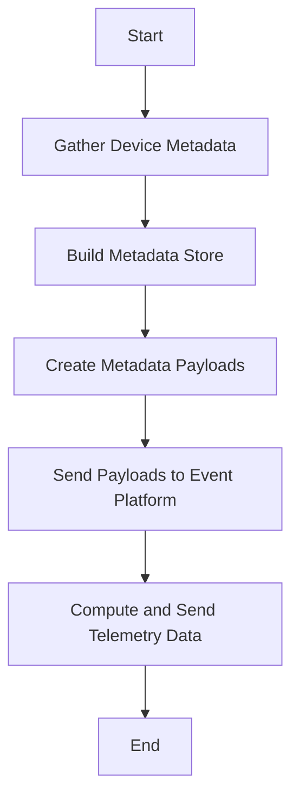

# Introduction to Device Metadata Reporting

Device metadata reporting involves collecting and sending detailed information about network devices. This process is essential for monitoring and analyzing the status and performance of these devices.

# <SwmToken path="pkg/collector/corechecks/snmp/internal/report/report_device_metadata.go" pos="53:2:2" line-data="// ReportNetworkDeviceMetadata reports device metadata">`ReportNetworkDeviceMetadata`</SwmToken> Function

The <SwmToken path="pkg/collector/corechecks/snmp/internal/report/report_device_metadata.go" pos="53:2:2" line-data="// ReportNetworkDeviceMetadata reports device metadata">`ReportNetworkDeviceMetadata`</SwmToken> function is responsible for gathering various metadata elements such as device status, interface details, IP addresses, and topology links. It then packages this data into payloads, which are serialized into JSON format and sent to the event platform for further processing and analysis. This helps in maintaining an up-to-date view of the network's health and performance. Additionally, the function computes and sends telemetry data for each network interface, including administrative and operational statuses, which are tagged with relevant metadata.

<SwmSnippet path="/pkg/collector/corechecks/snmp/internal/report/report_device_metadata.go" line="53">

---

The <SwmToken path="pkg/collector/corechecks/snmp/internal/report/report_device_metadata.go" pos="53:2:2" line-data="// ReportNetworkDeviceMetadata reports device metadata">`ReportNetworkDeviceMetadata`</SwmToken> function collects metadata from various sources, builds the metadata payloads, and sends them to the event platform.

```go
// ReportNetworkDeviceMetadata reports device metadata
func (ms *MetricSender) ReportNetworkDeviceMetadata(config *checkconfig.CheckConfig, store *valuestore.ResultValueStore, origTags []string, collectTime time.Time, deviceStatus devicemetadata.DeviceStatus, pingStatus devicemetadata.DeviceStatus, diagnoses []devicemetadata.DiagnosisMetadata) {
	tags := utils.CopyStrings(origTags)
	tags = util.SortUniqInPlace(tags)

	metadataStore := buildMetadataStore(config.Metadata, store)

	devices := []devicemetadata.DeviceMetadata{buildNetworkDeviceMetadata(config.DeviceID, config.DeviceIDTags, config, metadataStore, tags, deviceStatus, pingStatus)}

	interfaces := buildNetworkInterfacesMetadata(config.DeviceID, metadataStore)
	ipAddresses := buildNetworkIPAddressesMetadata(config.DeviceID, metadataStore)
	topologyLinks := buildNetworkTopologyMetadata(config.DeviceID, metadataStore, interfaces)

	metadataPayloads := devicemetadata.BatchPayloads(config.Namespace, config.ResolvedSubnetName, collectTime, devicemetadata.PayloadMetadataBatchSize, devices, interfaces, ipAddresses, topologyLinks, nil, diagnoses)

	for _, payload := range metadataPayloads {
		payloadBytes, err := json.Marshal(payload)
		if err != nil {
			log.Errorf("Error marshalling device metadata: %s", err)
			return
		}
```

---

</SwmSnippet>

# Building the Metadata Store

The <SwmToken path="pkg/collector/corechecks/snmp/internal/report/report_device_metadata.go" pos="58:5:5" line-data="	metadataStore := buildMetadataStore(config.Metadata, store)">`buildMetadataStore`</SwmToken> function creates a metadata store from the provided metadata configurations and value store. It iterates through the metadata configurations, extracting scalar and column values, and populates the metadata store with these values. This store is then used to build detailed metadata for network devices.

<SwmSnippet path="/pkg/collector/corechecks/snmp/internal/report/report_device_metadata.go" line="134">

---

The <SwmToken path="pkg/collector/corechecks/snmp/internal/report/report_device_metadata.go" pos="134:2:2" line-data="func buildMetadataStore(metadataConfigs profiledefinition.MetadataConfig, values *valuestore.ResultValueStore) *metadata.Store {">`buildMetadataStore`</SwmToken> function is used to create a metadata store from the configuration and value store.

```go
func buildMetadataStore(metadataConfigs profiledefinition.MetadataConfig, values *valuestore.ResultValueStore) *metadata.Store {
	metadataStore := metadata.NewMetadataStore()
	if values == nil {
		return metadataStore
	}

	for resourceName, metadataConfig := range metadataConfigs {
		for fieldName, field := range metadataConfig.Fields {
			fieldFullName := resourceName + "." + fieldName

			var symbols []profiledefinition.SymbolConfig
			if field.Symbol.OID != "" {
				symbols = append(symbols, field.Symbol)
			}
			symbols = append(symbols, field.Symbols...)

			if profiledefinition.IsMetadataResourceWithScalarOids(resourceName) {
				for _, symbol := range symbols {
					if metadataStore.ScalarFieldHasValue(fieldFullName) {
						break
					}
```

---

</SwmSnippet>

# Constructing Device Metadata

The <SwmToken path="pkg/collector/corechecks/snmp/internal/report/report_device_metadata.go" pos="60:11:11" line-data="	devices := []devicemetadata.DeviceMetadata{buildNetworkDeviceMetadata(config.DeviceID, config.DeviceIDTags, config, metadataStore, tags, deviceStatus, pingStatus)}">`buildNetworkDeviceMetadata`</SwmToken> function constructs the metadata for a network device. It gathers various attributes such as the device's name, description, vendor, location, serial number, version, and more from the metadata store. This detailed metadata is then used to provide a comprehensive view of the device's characteristics.

<SwmSnippet path="/pkg/collector/corechecks/snmp/internal/report/report_device_metadata.go" line="194">

---

The <SwmToken path="pkg/collector/corechecks/snmp/internal/report/report_device_metadata.go" pos="194:2:2" line-data="func buildNetworkDeviceMetadata(deviceID string, idTags []string, config *checkconfig.CheckConfig, store *metadata.Store, tags []string, deviceStatus devicemetadata.DeviceStatus, pingStatus devicemetadata.DeviceStatus) devicemetadata.DeviceMetadata {">`buildNetworkDeviceMetadata`</SwmToken> function constructs the device metadata object using the collected data.

```go
func buildNetworkDeviceMetadata(deviceID string, idTags []string, config *checkconfig.CheckConfig, store *metadata.Store, tags []string, deviceStatus devicemetadata.DeviceStatus, pingStatus devicemetadata.DeviceStatus) devicemetadata.DeviceMetadata {
	var vendor, sysName, sysDescr, sysObjectID, location, serialNumber, version, productName, model, osName, osVersion, osHostname, deviceType string
	if store != nil {
		sysName = store.GetScalarAsString("device.name")
		sysDescr = store.GetScalarAsString("device.description")
		sysObjectID = store.GetScalarAsString("device.sys_object_id")
		vendor = store.GetScalarAsString("device.vendor")
		location = store.GetScalarAsString("device.location")
		serialNumber = store.GetScalarAsString("device.serial_number")
		version = store.GetScalarAsString("device.version")
		productName = store.GetScalarAsString("device.product_name")
		model = store.GetScalarAsString("device.model")
		osName = store.GetScalarAsString("device.os_name")
		osVersion = store.GetScalarAsString("device.os_version")
		osHostname = store.GetScalarAsString("device.os_hostname")
		deviceType = getDeviceType(store)
	}

	// fallback to Device.Vendor for backward compatibility
	if config.ProfileDef != nil && vendor == "" {
		vendor = config.ProfileDef.Device.Vendor
```

---

</SwmSnippet>

# Gathering Interface Metadata

The <SwmToken path="pkg/collector/corechecks/snmp/internal/report/report_device_metadata.go" pos="62:5:5" line-data="	interfaces := buildNetworkInterfacesMetadata(config.DeviceID, metadataStore)">`buildNetworkInterfacesMetadata`</SwmToken> function constructs metadata for the network interfaces of a device. It retrieves interface details such as name, alias, description, MAC address, and status from the metadata store and compiles them into a list of interface metadata objects.

<SwmSnippet path="/pkg/collector/corechecks/snmp/internal/report/report_device_metadata.go" line="265">

---

The <SwmToken path="pkg/collector/corechecks/snmp/internal/report/report_device_metadata.go" pos="265:2:2" line-data="func buildNetworkInterfacesMetadata(deviceID string, store *metadata.Store) []devicemetadata.InterfaceMetadata {">`buildNetworkInterfacesMetadata`</SwmToken> function gathers metadata for network interfaces.

```go
func buildNetworkInterfacesMetadata(deviceID string, store *metadata.Store) []devicemetadata.InterfaceMetadata {
	if store == nil {
		// it's expected that the value store is nil if we can't reach the device
		// in that case, we just return a nil slice.
		return nil
	}
	indexes := store.GetColumnIndexes("interface.name")
	if len(indexes) == 0 {
		log.Debugf("Unable to build interfaces metadata: no interface indexes found")
		return nil
	}
	sort.Strings(indexes)
	var interfaces []devicemetadata.InterfaceMetadata
	for _, strIndex := range indexes {
		index, err := strconv.ParseInt(strIndex, 10, 32)
		if err != nil {
			log.Warnf("interface metadata: invalid index: %d", index)
			continue
		}

		ifIDTags := store.GetIDTags("interface", strIndex)
```

---

</SwmSnippet>

# Collecting IP Address Metadata

The <SwmToken path="pkg/collector/corechecks/snmp/internal/report/report_device_metadata.go" pos="63:5:5" line-data="	ipAddresses := buildNetworkIPAddressesMetadata(config.DeviceID, metadataStore)">`buildNetworkIPAddressesMetadata`</SwmToken> function constructs metadata for the IP addresses associated with a device's interfaces. It retrieves IP address details and netmask information from the metadata store and compiles them into a list of IP address metadata objects.

<SwmSnippet path="/pkg/collector/corechecks/snmp/internal/report/report_device_metadata.go" line="304">

---

The <SwmToken path="pkg/collector/corechecks/snmp/internal/report/report_device_metadata.go" pos="304:2:2" line-data="func buildNetworkIPAddressesMetadata(deviceID string, store *metadata.Store) []devicemetadata.IPAddressMetadata {">`buildNetworkIPAddressesMetadata`</SwmToken> function collects metadata for IP addresses associated with the device.

```go
func buildNetworkIPAddressesMetadata(deviceID string, store *metadata.Store) []devicemetadata.IPAddressMetadata {
	if store == nil {
		// it's expected that the value store is nil if we can't reach the device
		// in that case, we just return a nil slice.
		return nil
	}
	indexes := store.GetColumnIndexes("ip_addresses.if_index")
	if len(indexes) == 0 {
		log.Debugf("Unable to build ip addresses metadata: no ip_addresses.if_index found")
		return nil
	}
	sort.Strings(indexes)
	var ipAddresses []devicemetadata.IPAddressMetadata
	for _, strIndex := range indexes {
		index := store.GetColumnAsString("ip_addresses.if_index", strIndex)
		Netmask := store.GetColumnAsString("ip_addresses.netmask", strIndex)
		ipAddress := devicemetadata.IPAddressMetadata{
			InterfaceID: deviceID + ":" + index,
			IPAddress:   strIndex,
			Prefixlen:   int32(netmaskToPrefixlen(Netmask)),
		}
```

---

</SwmSnippet>

# Building Network Topology Metadata

The <SwmToken path="pkg/collector/corechecks/snmp/internal/report/report_device_metadata.go" pos="64:5:5" line-data="	topologyLinks := buildNetworkTopologyMetadata(config.DeviceID, metadataStore, interfaces)">`buildNetworkTopologyMetadata`</SwmToken> function constructs metadata for the network topology links of a device. It attempts to build topology links using LLDP (Link Layer Discovery Protocol) and CDP (Cisco Discovery Protocol) data from the metadata store. This metadata provides insights into the network's structure and connectivity.

<SwmSnippet path="/pkg/collector/corechecks/snmp/internal/report/report_device_metadata.go" line="330">

---

The <SwmToken path="pkg/collector/corechecks/snmp/internal/report/report_device_metadata.go" pos="330:2:2" line-data="func buildNetworkTopologyMetadata(deviceID string, store *metadata.Store, interfaces []devicemetadata.InterfaceMetadata) []devicemetadata.TopologyLinkMetadata {">`buildNetworkTopologyMetadata`</SwmToken> function gathers metadata for the network topology links.

```go
func buildNetworkTopologyMetadata(deviceID string, store *metadata.Store, interfaces []devicemetadata.InterfaceMetadata) []devicemetadata.TopologyLinkMetadata {
	if store == nil {
		// it's expected that the value store is nil if we can't reach the device
		// in that case, we just return a nil slice.
		return nil
	}

	links := buildNetworkTopologyMetadataWithLLDP(deviceID, store, interfaces)
	if len(links) == 0 {
		links = buildNetworkTopologyMetadataWithCDP(deviceID, store, interfaces)
	}
	return links
}
```

---

</SwmSnippet>

&nbsp;

*This is an auto-generated document by Swimm AI 🌊 and has not yet been verified by a human*

<SwmMeta version="3.0.0" repo-id="Z2l0aHViJTNBJTNBZGF0YWRvZy1hZ2VudCUzQSUzQVN3aW1tLURlbW8=" repo-name="datadog-agent"><sup>Powered by [Swimm](/)</sup></SwmMeta>
