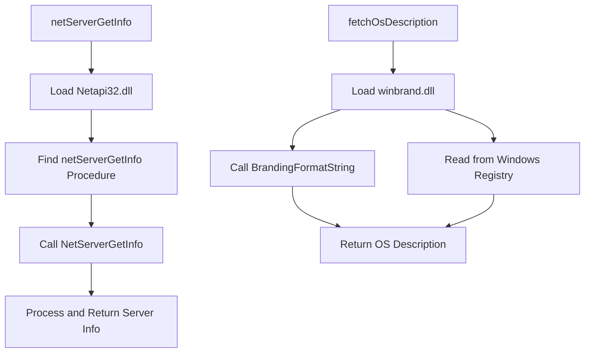

# Introduction to Gohai

Gohai is a tool that collects an inventory of system information. It aims to implement some parts of features from facter and ohai. It's forked from Kentaro Kuribayashi's verity.

# Gohai Package

<SwmSnippet path="/pkg/gohai/gohai.go" line="6">

---

The package <SwmToken path="pkg/gohai/gohai.go" pos="6:4:4" line-data="// Package gohai encapsulate all the metadata collected by it&#39;s subpackage into a single payload ready to be ingested by the">`gohai`</SwmToken> encapsulates all the metadata collected by its subpackages into a single payload ready to be ingested by the backend.

```go
// Package gohai encapsulate all the metadata collected by it's subpackage into a single payload ready to be ingested by the
// backend.
package gohai
```

---

</SwmSnippet>

# Gohai Struct

The <SwmToken path="pkg/gohai/gohai.go" pos="6:4:4" line-data="// Package gohai encapsulate all the metadata collected by it&#39;s subpackage into a single payload ready to be ingested by the">`gohai`</SwmToken> struct defines the various types of metadata that Gohai collects, such as CPU, filesystem, memory, network, platform, and processes.

<SwmSnippet path="/pkg/gohai/gohai.go" line="40">

---

The type <SwmToken path="pkg/gohai/gohai.go" pos="40:2:2" line-data="type gohai struct {">`gohai`</SwmToken> defines the structure for storing collected system information, including CPU, <SwmToken path="pkg/gohai/gohai.go" pos="42:1:1" line-data="	FileSystem interface{} `json:&quot;filesystem&quot;`">`FileSystem`</SwmToken>, Memory, Network, Platform, and optionally Processes.

```go
type gohai struct {
	CPU        interface{} `json:"cpu"`
	FileSystem interface{} `json:"filesystem"`
	Memory     interface{} `json:"memory"`
	Network    interface{} `json:"network"`
	Platform   interface{} `json:"platform"`
	Processes  interface{} `json:"processes,omitempty"`
}
```

---

</SwmSnippet>

# Main Functions

There are several main functions in Gohai. Some of them are <SwmToken path="pkg/gohai/gohai.go" pos="54:2:2" line-data="// GetPayload builds a payload of every metadata collected with gohai except processes metadata.">`GetPayload`</SwmToken>, <SwmToken path="pkg/gohai/gohai.go" pos="61:2:2" line-data="// GetPayloadWithProcesses builds a pyaload of all metdata including processes">`GetPayloadWithProcesses`</SwmToken>, <SwmToken path="pkg/gohai/gohai.go" pos="68:2:2" line-data="// GetPayloadAsString marshals the gohai struct twice (to a string). This allows the gohai payload to be embedded as a">`GetPayloadAsString`</SwmToken>, and <SwmToken path="pkg/gohai/gohai.go" pos="57:4:4" line-data="		Gohai: getGohaiInfo(isContainerized, false),">`getGohaiInfo`</SwmToken>. We will dive a little into <SwmToken path="pkg/gohai/gohai.go" pos="54:2:2" line-data="// GetPayload builds a payload of every metadata collected with gohai except processes metadata.">`GetPayload`</SwmToken> and <SwmToken path="pkg/gohai/gohai.go" pos="61:2:2" line-data="// GetPayloadWithProcesses builds a pyaload of all metdata including processes">`GetPayloadWithProcesses`</SwmToken>.

## <SwmToken path="pkg/gohai/gohai.go" pos="54:2:2" line-data="// GetPayload builds a payload of every metadata collected with gohai except processes metadata.">`GetPayload`</SwmToken>

The <SwmToken path="pkg/gohai/gohai.go" pos="54:2:2" line-data="// GetPayload builds a payload of every metadata collected with gohai except processes metadata.">`GetPayload`</SwmToken> function builds a payload of every metadata collected with Gohai except processes metadata. It calls the <SwmToken path="pkg/gohai/gohai.go" pos="57:4:4" line-data="		Gohai: getGohaiInfo(isContainerized, false),">`getGohaiInfo`</SwmToken> function with the <SwmToken path="pkg/gohai/gohai.go" pos="55:4:4" line-data="func GetPayload(isContainerized bool) *Payload {">`isContainerized`</SwmToken> parameter set to false.

<SwmSnippet path="/pkg/gohai/gohai.go" line="54">

---

The <SwmToken path="pkg/gohai/gohai.go" pos="54:2:2" line-data="// GetPayload builds a payload of every metadata collected with gohai except processes metadata.">`GetPayload`</SwmToken> function builds a payload of every metadata collected with Gohai except processes metadata.

```go
// GetPayload builds a payload of every metadata collected with gohai except processes metadata.
func GetPayload(isContainerized bool) *Payload {
	return &Payload{
		Gohai: getGohaiInfo(isContainerized, false),
	}
}
```

---

</SwmSnippet>

## <SwmToken path="pkg/gohai/gohai.go" pos="61:2:2" line-data="// GetPayloadWithProcesses builds a pyaload of all metdata including processes">`GetPayloadWithProcesses`</SwmToken>

The <SwmToken path="pkg/gohai/gohai.go" pos="61:2:2" line-data="// GetPayloadWithProcesses builds a pyaload of all metdata including processes">`GetPayloadWithProcesses`</SwmToken> function builds a payload of all metadata including processes. It calls the <SwmToken path="pkg/gohai/gohai.go" pos="57:4:4" line-data="		Gohai: getGohaiInfo(isContainerized, false),">`getGohaiInfo`</SwmToken> function with the <SwmToken path="pkg/gohai/gohai.go" pos="55:4:4" line-data="func GetPayload(isContainerized bool) *Payload {">`isContainerized`</SwmToken> parameter set to true.

<SwmSnippet path="/pkg/gohai/gohai.go" line="61">

---

The <SwmToken path="pkg/gohai/gohai.go" pos="61:2:2" line-data="// GetPayloadWithProcesses builds a pyaload of all metdata including processes">`GetPayloadWithProcesses`</SwmToken> function builds a payload of all metadata including processes.

```go
// GetPayloadWithProcesses builds a pyaload of all metdata including processes
func GetPayloadWithProcesses(isContainerized bool) *Payload {
	return &Payload{
		Gohai: getGohaiInfo(isContainerized, true),
	}
}
```

---

</SwmSnippet>

## <SwmToken path="pkg/gohai/gohai.go" pos="68:2:2" line-data="// GetPayloadAsString marshals the gohai struct twice (to a string). This allows the gohai payload to be embedded as a">`GetPayloadAsString`</SwmToken>

The <SwmToken path="pkg/gohai/gohai.go" pos="68:2:2" line-data="// GetPayloadAsString marshals the gohai struct twice (to a string). This allows the gohai payload to be embedded as a">`GetPayloadAsString`</SwmToken> function marshals the Gohai struct twice to a string, allowing the Gohai payload to be embedded as a string in a JSON.

<SwmSnippet path="/pkg/gohai/gohai.go" line="68">

---

The <SwmToken path="pkg/gohai/gohai.go" pos="68:2:2" line-data="// GetPayloadAsString marshals the gohai struct twice (to a string). This allows the gohai payload to be embedded as a">`GetPayloadAsString`</SwmToken> function marshals the Gohai struct twice to a string, allowing the Gohai payload to be embedded as a string in a JSON.

```go
// GetPayloadAsString marshals the gohai struct twice (to a string). This allows the gohai payload to be embedded as a
// string in a JSON. This is required to mimic the metadata format inherited from Agent v5.
func GetPayloadAsString(IsContainerized bool) (string, error) {
	marshalledPayload, err := json.Marshal(getGohaiInfo(IsContainerized, false))
	if err != nil {
		return "", err
```

---

</SwmSnippet>

## <SwmToken path="pkg/gohai/gohai.go" pos="57:4:4" line-data="		Gohai: getGohaiInfo(isContainerized, false),">`getGohaiInfo`</SwmToken>

The <SwmToken path="pkg/gohai/gohai.go" pos="57:4:4" line-data="		Gohai: getGohaiInfo(isContainerized, false),">`getGohaiInfo`</SwmToken> function collects various system metadata and returns it as a <SwmToken path="pkg/gohai/gohai.go" pos="6:4:4" line-data="// Package gohai encapsulate all the metadata collected by it&#39;s subpackage into a single payload ready to be ingested by the">`gohai`</SwmToken> struct. It gathers information about the CPU, filesystem, memory, network, platform, and processes.

<SwmSnippet path="/pkg/gohai/gohai.go" line="78">

---

The <SwmToken path="pkg/gohai/gohai.go" pos="78:2:2" line-data="func getGohaiInfo(isContainerized, withProcesses bool) *gohai {">`getGohaiInfo`</SwmToken> function collects system information such as CPU, <SwmToken path="pkg/gohai/gohai.go" pos="92:8:8" line-data="	fileSystemInfo, err := filesystem.CollectInfo()">`filesystem`</SwmToken>, Memory, Network, Platform, and optionally Processes, and stores it in a <SwmToken path="pkg/gohai/gohai.go" pos="78:13:13" line-data="func getGohaiInfo(isContainerized, withProcesses bool) *gohai {">`gohai`</SwmToken> struct.

```go
func getGohaiInfo(isContainerized, withProcesses bool) *gohai {
	res := new(gohai)

	cpuPayload, warns, err := cpu.CollectInfo().AsJSON()
	if err == nil {
		res.CPU = cpuPayload
	} else {
		for _, warn := range warns {
			log.Debug(warn)
		}
		log.Warnf("Failed to retrieve cpu metadata: %s", err)
	}

	var fileSystemPayload interface{}
	fileSystemInfo, err := filesystem.CollectInfo()
	warns = nil
	if err == nil {
		fileSystemPayload, warns, err = fileSystemInfo.AsJSON()
	}
	if err == nil {
		res.FileSystem = fileSystemPayload
```

---

</SwmSnippet>

# Gohai Endpoints

Gohai provides several endpoints to retrieve system information. Two notable functions are <SwmToken path="pkg/gohai/platform/platform_windows.go" pos="77:2:2" line-data="func netServerGetInfo() (si SERVER_INFO_101, err error) {">`netServerGetInfo`</SwmToken> and <SwmToken path="pkg/gohai/platform/platform_windows.go" pos="97:2:2" line-data="func fetchOsDescription() (string, error) {">`fetchOsDescription`</SwmToken>.

## <SwmToken path="pkg/gohai/platform/platform_windows.go" pos="77:2:2" line-data="func netServerGetInfo() (si SERVER_INFO_101, err error) {">`netServerGetInfo`</SwmToken>

The <SwmToken path="pkg/gohai/platform/platform_windows.go" pos="77:2:2" line-data="func netServerGetInfo() (si SERVER_INFO_101, err error) {">`netServerGetInfo`</SwmToken> function retrieves <SwmToken path="pkg/gohai/platform/platform_windows.go" pos="21:6:8" line-data="// SERVER_INFO_101 contains server-specific information">`server-specific`</SwmToken> information using the <SwmToken path="pkg/gohai/platform/platform_windows.go" pos="77:2:2" line-data="func netServerGetInfo() (si SERVER_INFO_101, err error) {">`netServerGetInfo`</SwmToken> API from the <SwmToken path="pkg/gohai/platform/platform_windows.go" pos="37:10:12" line-data="	modNetapi32          = windows.NewLazyDLL(&quot;Netapi32.dll&quot;)">`Netapi32.dll`</SwmToken> library. It loads the library, finds the procedure, and calls it to get the server information. The result is then processed and returned.

<SwmSnippet path="/pkg/gohai/platform/platform_windows.go" line="77">

---

The <SwmToken path="pkg/gohai/platform/platform_windows.go" pos="77:2:2" line-data="func netServerGetInfo() (si SERVER_INFO_101, err error) {">`netServerGetInfo`</SwmToken> function retrieves <SwmToken path="pkg/gohai/platform/platform_windows.go" pos="21:6:8" line-data="// SERVER_INFO_101 contains server-specific information">`server-specific`</SwmToken> information using the <SwmToken path="pkg/gohai/platform/platform_windows.go" pos="77:2:2" line-data="func netServerGetInfo() (si SERVER_INFO_101, err error) {">`netServerGetInfo`</SwmToken> API from the <SwmToken path="pkg/gohai/platform/platform_windows.go" pos="37:10:12" line-data="	modNetapi32          = windows.NewLazyDLL(&quot;Netapi32.dll&quot;)">`Netapi32.dll`</SwmToken> library.

```go
func netServerGetInfo() (si SERVER_INFO_101, err error) {
	var outdata *byte
	// do additional work so that we don't panic() when the library's
	// not there (like in a container)
	if err = modNetapi32.Load(); err != nil {
		return
	}
	if err = procNetServerGetInfo.Find(); err != nil {
		return
	}
	status, _, err := procNetServerGetInfo.Call(uintptr(0), uintptr(101), uintptr(unsafe.Pointer(&outdata)))
	if status != uintptr(0) {
		return
	}
	// ignore free errors
	//nolint:errcheck
	defer procNetAPIBufferFree.Call(uintptr(unsafe.Pointer(outdata)))
	return platGetServerInfo(outdata), nil
```

---

</SwmSnippet>

## <SwmToken path="pkg/gohai/platform/platform_windows.go" pos="97:2:2" line-data="func fetchOsDescription() (string, error) {">`fetchOsDescription`</SwmToken>

The <SwmToken path="pkg/gohai/platform/platform_windows.go" pos="97:2:2" line-data="func fetchOsDescription() (string, error) {">`fetchOsDescription`</SwmToken> function retrieves the operating system description. It attempts to load the <SwmToken path="pkg/gohai/platform/platform_windows.go" pos="42:10:12" line-data="	winbrand             = windows.NewLazyDLL(&quot;winbrand.dll&quot;)">`winbrand.dll`</SwmToken> library and call the <SwmToken path="pkg/gohai/platform/platform_windows.go" pos="101:10:10" line-data="		procBrandingFormatString := winbrand.NewProc(&quot;BrandingFormatString&quot;)">`BrandingFormatString`</SwmToken> procedure to get the OS description. If this fails, it falls back to reading from the Windows registry to determine the OS version.

<SwmSnippet path="/pkg/gohai/platform/platform_windows.go" line="97">

---

The <SwmToken path="pkg/gohai/platform/platform_windows.go" pos="97:2:2" line-data="func fetchOsDescription() (string, error) {">`fetchOsDescription`</SwmToken> function retrieves the operating system description by attempting to load the <SwmToken path="pkg/gohai/platform/platform_windows.go" pos="42:10:12" line-data="	winbrand             = windows.NewLazyDLL(&quot;winbrand.dll&quot;)">`winbrand.dll`</SwmToken> library and calling the <SwmToken path="pkg/gohai/platform/platform_windows.go" pos="101:10:10" line-data="		procBrandingFormatString := winbrand.NewProc(&quot;BrandingFormatString&quot;)">`BrandingFormatString`</SwmToken> procedure.

```go
func fetchOsDescription() (string, error) {
	err := winbrand.Load()
	if err == nil {
		// From https://stackoverflow.com/a/69462683
		procBrandingFormatString := winbrand.NewProc("BrandingFormatString")
		if procBrandingFormatString.Find() == nil {
			// Encode the string "%WINDOWS_LONG%" to UTF-16 and append a null byte for the Windows API
			magicString := utf16.Encode([]rune("%WINDOWS_LONG%" + "\x00"))
			// Don't check for err, as this API doesn't return an error but just a formatted string.
			os, _, _ := procBrandingFormatString.Call(uintptr(unsafe.Pointer(&magicString[0])))
			if os != 0 {
				// ignore free errors
				//nolint:errcheck
				defer windows.LocalFree(windows.Handle(os))
				// govet complains about possible misuse of unsafe.Pointer here
				//nolint:govet
				return windows.UTF16PtrToString((*uint16)(unsafe.Pointer(os))), nil
			}
		}
	}
```

---

</SwmSnippet>

&nbsp;

*This is an auto-generated document by Swimm AI 🌊 and has not yet been verified by a human*

<SwmMeta version="3.0.0" repo-id="Z2l0aHViJTNBJTNBZGF0YWRvZy1hZ2VudCUzQSUzQVN3aW1tLURlbW8=" repo-name="datadog-agent"><sup>Powered by [Swimm](https://staging.swimm.cloud/)</sup></SwmMeta>
