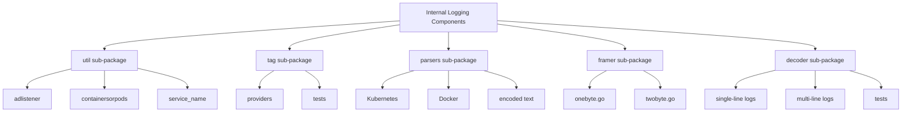

# Overview

The `internal` directory in the <SwmToken path="test/e2e/containers/fake_datadog/app/api.py" pos="241:2:2" line-data="def logs():">`logs`</SwmToken> package contains various sub-packages and files that are essential for the internal workings of the logging system. These components are not intended to be accessed directly by external packages.

# Utility Functions and Helpers

The `util` sub-package includes utility functions and helpers such as `adlistener`, `containersorpods`, and `service_name`. These utilities assist in various logging operations and are used internally by other components.

# Tagging Logs

The <SwmToken path="tasks/modules.py" pos="83:3:3" line-data="    def tag(self, agent_version):">`tag`</SwmToken> sub-package provides functionality related to tagging logs. It includes providers and tests to ensure that logs are correctly tagged with relevant metadata.

# Parsing Log Formats

The `parsers` sub-package contains different parsers for various log formats, including Kubernetes, Docker, and encoded text. These parsers are responsible for interpreting and structuring raw log data.

# Framing Log Lines

The `framer` sub-package includes implementations for framing log lines. For example, <SwmPath>[pkg/logs/internal/framer/onebyte.go](pkg/logs/internal/framer/onebyte.go)</SwmPath> and <SwmPath>[pkg/logs/internal/framer/twobyte.go](pkg/logs/internal/framer/twobyte.go)</SwmPath> handle single-byte and two-byte newline sequences, respectively, ensuring that log lines are correctly identified and processed.

# Decoding Raw Log Data

The <SwmToken path="tasks/unit_tests/libs/json_tests.py" pos="8:3:3" line-data="        self.decoder = JSONWithCommentsDecoder()">`decoder`</SwmToken> sub-package is responsible for decoding raw log data into structured messages. It includes handlers for single-line and multi-line logs, as well as tests to validate the decoding process.

# How to Use `internal` Folders

Since Go 1.4, Go supports the use of internal folders to control the public API of a Go module. A package A can only be imported from packages whose path shares the prefix up until the last internal in A's path. For example, a package with path `a/b/internal/c/d` can only be imported by packages within the <SwmPath>[pkg/collector/corechecks/servicediscovery/apm/testdata/b/](pkg/collector/corechecks/servicediscovery/apm/testdata/b/)</SwmPath> folder. The compiler will enforce this and fail to build any code that breaks this rule.

# Guidelines for Adding New Code

When adding new code, carefully consider what API is exported, both by taking care of what symbols are uppercase and by making judicious use of internal folders.

&nbsp;

*This is an auto-generated document by Swimm AI 🌊 and has not yet been verified by a human*

<SwmMeta version="3.0.0" repo-id="Z2l0aHViJTNBJTNBZGF0YWRvZy1hZ2VudCUzQSUzQVN3aW1tLURlbW8=" repo-name="datadog-agent">Powered by [Swimm](/)</SwmMeta>
