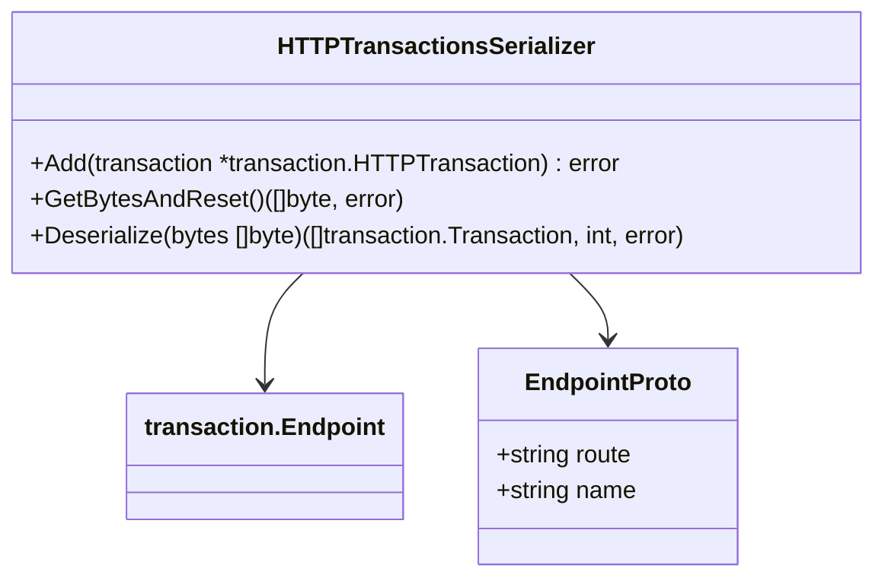

# Overview

The internal package structure within the Forwarder component is designed to encapsulate and organize code that is not intended to be accessed directly by other packages or components. This helps maintain a clean and modular codebase by restricting access to certain packages and ensuring that only the Forwarder component can use the retry mechanisms directly.

# Retry Package

The internal directory contains the retry package, which provides mechanisms for retrying failed transactions. This includes various files and tests related to retry logic, such as transaction queues, serializers, and telemetry.

<SwmSnippet path="/comp/forwarder/defaultforwarder/internal/retry/queue_duration_capacity.go" line="15">

---

The <SwmPath>[comp/forwarder/defaultforwarder/internal/retry/queue_duration_capacity.go](comp/forwarder/defaultforwarder/internal/retry/queue_duration_capacity.go)</SwmPath> file defines the <SwmToken path="comp/forwarder/defaultforwarder/internal/retry/queue_duration_capacity.go" pos="15:2:2" line-data="// QueueDurationCapacity provides a method to know how much data (express as a duration)">`QueueDurationCapacity`</SwmToken> struct, which provides a method to know how much data (expressed as a duration) the <SwmToken path="comp/forwarder/defaultforwarder/internal/retry/queue_duration_capacity.go" pos="16:4:6" line-data="// the in-memory retry queue and the disk storage retry queue can store.">`in-memory`</SwmToken> retry queue and the disk storage retry queue can store. This struct includes fields for accumulators, optional disk space, maximum memory size in bytes, history duration, and bucket duration.

```go
// QueueDurationCapacity provides a method to know how much data (express as a duration)
// the in-memory retry queue and the disk storage retry queue can store.
// For each domain, the capacity in bytes is the sum of:
// - the in-memory retry queue capacity. We assume there is enough memory for all in-memory retry queues (one by domain)
// - the available disk storage * `domain relative speed` where `domain relative speed` is the number of
// bytes per second for this domain, divided by the total number of bytes per second for all domains. If a domain receives
// twice the traffic compared to anoter one, twice disk storage capacity is allocated to this domain. Disk storage is shared
// across domain.
// If there is no traffic during the time period for a domain, no statistic is reported.
type QueueDurationCapacity struct {
	accumulators      map[string]*timeIntervalAccumulator
	optionalDiskSpace diskSpace
	maxMemSizeInBytes int
	historyDuration   time.Duration
	bucketDuration    time.Duration
}

type diskSpace interface {
	computeAvailableSpace(extraSize int64) (int64, error)
}
```

---

</SwmSnippet>

# How to Use Internal Folders

Since Go 1.4, Go supports the use of `internal` folders to control the public API of a Go module. A package A can only be imported from packages whose path shares the prefix up until the last `internal` in A's path. For example, a package with path `a/b/internal/c/d` can only be imported by packages within the <SwmPath>[pkg/collector/corechecks/servicediscovery/apm/testdata/b/](pkg/collector/corechecks/servicediscovery/apm/testdata/b/)</SwmPath> folder. The compiler will enforce this and fail to build any code that breaks this rule.

# Endpoints of Internal

The <SwmToken path="comp/forwarder/defaultforwarder/internal/retry/http_transactions_serializer.go" pos="83:5:7" line-data="	endpoint := transaction.Endpoint">`transaction.Endpoint`</SwmToken> is used within the <SwmToken path="tasks/diff.py" pos="171:1:1" line-data="                        add, remove = patch_summary(targetdiffs)">`add`</SwmToken> method of the <SwmToken path="comp/forwarder/defaultforwarder/internal/retry/http_transactions_serializer.go" pos="31:2:2" line-data="// HTTPTransactionsSerializer serializes Transaction instances.">`HTTPTransactionsSerializer`</SwmToken> to ensure that the domain of the transaction matches the resolved domain. This is a critical step for maintaining the integrity and security of the transactions being processed.

<SwmSnippet path="/comp/forwarder/defaultforwarder/internal/retry/http_transactions_serializer.go" line="83">

---

The <SwmToken path="tasks/diff.py" pos="171:1:1" line-data="                        add, remove = patch_summary(targetdiffs)">`add`</SwmToken> method of the <SwmToken path="comp/forwarder/defaultforwarder/internal/retry/http_transactions_serializer.go" pos="31:2:2" line-data="// HTTPTransactionsSerializer serializes Transaction instances.">`HTTPTransactionsSerializer`</SwmToken> ensures that the domain of the transaction matches the resolved domain. This is done to prevent security issues where a user could update the domain for some serialized transactions and replace it with a local address.

```go
	endpoint := transaction.Endpoint
	transactionProto := HttpTransactionProto{
		// The domain is not stored on the disk for security reasons.
		// If a user can update the domain for some serialized transactions, they can replace the domain
		// by a local address like http://127.0.0.1:1234. The Agent would send the HTTP transactions to the url
		// http://127.0.0.1:1234/intake/?api_key=API_KEY which contains the API_KEY.
		Domain:      "",
		Endpoint:    &EndpointProto{Route: s.replaceAPIKeys(endpoint.Route), Name: endpoint.Name},
		Headers:     s.toHeaderProto(transaction.Headers),
		Payload:     payload,
		ErrorCount:  int64(transaction.ErrorCount),
		CreatedAt:   transaction.CreatedAt.Unix(),
		Retryable:   transaction.Retryable,
		Priority:    priority,
		PointCount:  pointCount,
		Destination: destination,
	}
```

---

</SwmSnippet>

# <SwmToken path="comp/forwarder/defaultforwarder/internal/retry/http_transactions_serializer.go" pos="90:5:5" line-data="		Endpoint:    &amp;EndpointProto{Route: s.replaceAPIKeys(endpoint.Route), Name: endpoint.Name},">`EndpointProto`</SwmToken>

The <SwmToken path="comp/forwarder/defaultforwarder/internal/retry/http_transactions_serializer.go" pos="90:5:5" line-data="		Endpoint:    &amp;EndpointProto{Route: s.replaceAPIKeys(endpoint.Route), Name: endpoint.Name},">`EndpointProto`</SwmToken> message defines the structure of an endpoint, including its route and name. This is used in the serialization and deserialization processes to handle HTTP transactions.

<SwmSnippet path="/comp/forwarder/defaultforwarder/internal/retry/HttpTransactionProto.proto" line="11">

---

The <SwmToken path="comp/forwarder/defaultforwarder/internal/retry/HttpTransactionProto.proto" pos="11:2:2" line-data="message EndpointProto  {">`EndpointProto`</SwmToken> message in the <SwmPath>[comp/forwarder/defaultforwarder/internal/retry/HttpTransactionProto.proto](comp/forwarder/defaultforwarder/internal/retry/HttpTransactionProto.proto)</SwmPath> file defines the structure of an endpoint, including its route and name. This is used in the serialization and deserialization processes to handle HTTP transactions.

```protocol buffer
message EndpointProto  {
    string route = 1;
    string name = 2;
}
```

---

</SwmSnippet>

&nbsp;

*This is an auto-generated document by Swimm AI 🌊 and has not yet been verified by a human*

<SwmMeta version="3.0.0" repo-id="Z2l0aHViJTNBJTNBZGF0YWRvZy1hZ2VudCUzQSUzQVN3aW1tLURlbW8=" repo-name="datadog-agent"><sup>Powered by [Swimm](/)</sup></SwmMeta>
