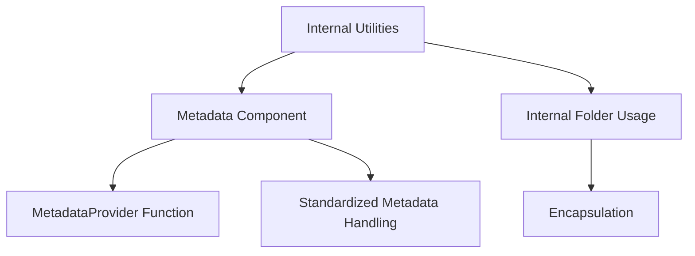

# Overview

Internal Utilities refers to a set of utility functions and methods that are used internally within the metadata component of the Datadog Agent. These utilities are not intended to be imported directly by other parts of the codebase; instead, they provide low-level functionalities that support higher-level operations.

# Purpose and Functionality

The utilities in this directory help streamline and standardize the way metadata is handled across different parts of the Datadog Agent. For example, the <SwmToken path="comp/metadata/internal/util/inventory_payload.go" pos="46:7:7" line-data="//			Provider:      cp.MetadataProvider(),">`MetadataProvider`</SwmToken> function in <SwmPath>[comp/metadata/internal/util/inventory_payload.go](comp/metadata/internal/util/inventory_payload.go)</SwmPath> returns a metadata <SwmToken path="comp/metadata/internal/util/inventory_payload.go" pos="29:4:6" line-data="//		Provider      runner.Provider">`runner.Provider`</SwmToken> based on whether the inventory is enabled or not. This function is used in various parts of the metadata component to provide metadata-related functionalities.

<SwmSnippet path="/comp/metadata/internal/util/inventory_payload.go" line="1">

---

The <SwmToken path="comp/metadata/internal/util/inventory_payload.go" pos="46:7:7" line-data="//			Provider:      cp.MetadataProvider(),">`MetadataProvider`</SwmToken> function in <SwmPath>[comp/metadata/internal/util/inventory_payload.go](comp/metadata/internal/util/inventory_payload.go)</SwmPath> returns a metadata <SwmToken path="comp/metadata/internal/util/inventory_payload.go" pos="29:4:6" line-data="//		Provider      runner.Provider">`runner.Provider`</SwmToken> based on whether the inventory is enabled or not. This function is used in various parts of the metadata component to provide metadata-related functionalities.

```go
// Unless explicitly stated otherwise all files in this repository are licensed
// under the Apache License Version 2.0.
// This product includes software developed at Datadog (https://www.datadoghq.com/).
// Copyright 2016-present Datadog, Inc.

// Package util offers helpers and building blocks to easily generate payloads for the inventory product.
//
// Usage: When creating a new payload for the inventory product, one should only embed the 'InventoryPayload' struct and
// provide it with a callback to generate a payload.
//
```

---

</SwmSnippet>

# How to Use `internal` Folders

Go supports the use of `internal` folders to control the public API of a Go module. A package within an `internal` folder can only be imported by packages whose path shares the prefix up until the last `internal` in the path. This ensures that the utilities remain encapsulated and are only used within the intended scope.

## Example: <SwmPath>[comp/metadata/internal/util/inventory_payload.go](comp/metadata/internal/util/inventory_payload.go)</SwmPath>

The <SwmPath>[comp/metadata/internal/util/inventory_payload.go](comp/metadata/internal/util/inventory_payload.go)</SwmPath> file provides helpers and building blocks to easily generate payloads for the inventory product. When creating a new payload for the inventory product, one should only embed the <SwmToken path="comp/metadata/internal/util/inventory_payload.go" pos="8:35:35" line-data="// Usage: When creating a new payload for the inventory product, one should only embed the &#39;InventoryPayload&#39; struct and">`InventoryPayload`</SwmToken> struct and provide it with a callback to generate a payload.

&nbsp;

*This is an auto-generated document by Swimm AI 🌊 and has not yet been verified by a human*

<SwmMeta version="3.0.0" repo-id="Z2l0aHViJTNBJTNBZGF0YWRvZy1hZ2VudCUzQSUzQVN3aW1tLURlbW8=" repo-name="datadog-agent"><sup>Powered by [Swimm](/)</sup></SwmMeta>
