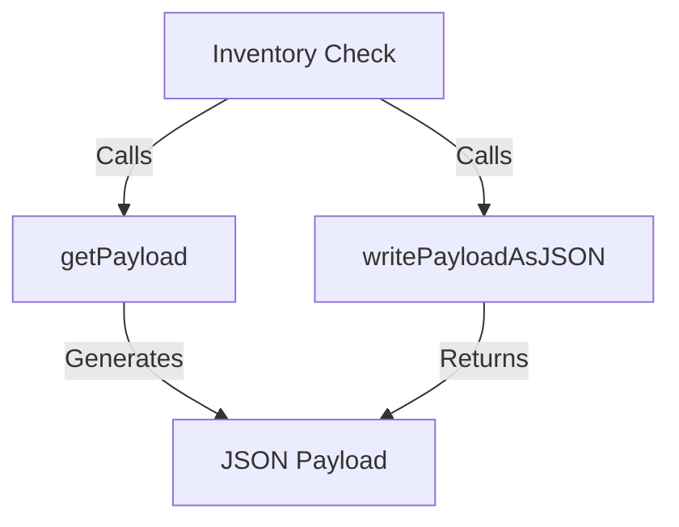

# Introduction to Inventory Checks in Metadata

Inventory Checks refer to the process of populating checks-related fields in the <SwmToken path="comp/metadata/inventorychecks/inventorychecksimpl/inventorychecks.go" pos="71:17:17" line-data="	return nil, fmt.Errorf(&quot;could not split inventories host payload any more, payload is too big for intake&quot;)">`inventories`</SwmToken> product in <SwmToken path="comp/metadata/inventorychecks/inventorychecksimpl/inventorychecks.go" pos="3:14:14" line-data="// This product includes software developed at Datadog (https://www.datadoghq.com/).">`Datadog`</SwmToken>. This functionality is enabled by default but can be turned off using the `inventories_enabled` configuration.

# Inventory Checks Payload

The payload for Inventory Checks is sent every 10 minutes or whenever it is updated, with a maximum of one update every minute. This ensures that the inventory data remains current and accurate.

# Adding Metadata

The <SwmToken path="comp/metadata/inventorychecks/inventorychecksimpl/inventorychecks.go" pos="134:5:5" line-data="		ic.sources.Set(logAgent.GetSources())">`Set`</SwmToken> method allows the rest of the codebase to add any Metadata to a check running in the collector. Metadata can include the check version, the version of the monitored software, and other relevant information.

# Sending Check Configurations

For every running check, regardless of whether it registered extra metadata, the system sends the name, ID, configuration, and configuration provider. Sending checks configuration can be disabled using the <SwmToken path="comp/metadata/inventorychecks/inventorychecksimpl/inventorychecks.go" pos="199:12:12" line-data="	invChecksEnabled := ic.conf.GetBool(&quot;inventories_checks_configuration_enabled&quot;)">`inventories_checks_configuration_enabled`</SwmToken> setting.

# Inventory Checks Endpoints

The <SwmToken path="comp/metadata/inventorychecks/inventorychecksimpl/inventorychecks.go" pos="273:9:9" line-data="func (ic *inventorychecksImpl) writePayloadAsJSON(w http.ResponseWriter, _ *http.Request) {">`writePayloadAsJSON`</SwmToken> function is an HTTP handler that writes the inventory check payload as JSON to the response writer. This endpoint is used to retrieve the current inventory check data in JSON format.

<SwmSnippet path="/comp/metadata/inventorychecks/inventorychecksimpl/inventorychecks.go" line="273">

---

The <SwmToken path="comp/metadata/inventorychecks/inventorychecksimpl/inventorychecks.go" pos="273:9:9" line-data="func (ic *inventorychecksImpl) writePayloadAsJSON(w http.ResponseWriter, _ *http.Request) {">`writePayloadAsJSON`</SwmToken> function handles HTTP requests and writes the inventory check payload as JSON to the response writer. This is useful for retrieving the current inventory check data in JSON format.

```go
func (ic *inventorychecksImpl) writePayloadAsJSON(w http.ResponseWriter, _ *http.Request) {
	// GetAsJSON already return scrubbed data
	scrubbed, err := ic.GetAsJSON()
	if err != nil {
		httputils.SetJSONError(w, err, 500)
		return
	}
	w.Write(scrubbed)
}
```

---

</SwmSnippet>

# Generating the Payload

The <SwmToken path="comp/metadata/inventorychecks/inventorychecksimpl/inventorychecks.go" pos="194:9:9" line-data="func (ic *inventorychecksImpl) getPayload() marshaler.JSONMarshaler {">`getPayload`</SwmToken> function generates the payload for inventory checks. It collects metadata from various sources and compiles it into a JSON marshaler. This payload is then used by the <SwmToken path="comp/metadata/inventorychecks/inventorychecksimpl/inventorychecks.go" pos="273:9:9" line-data="func (ic *inventorychecksImpl) writePayloadAsJSON(w http.ResponseWriter, _ *http.Request) {">`writePayloadAsJSON`</SwmToken> endpoint to provide the data to clients.

<SwmSnippet path="/comp/metadata/inventorychecks/inventorychecksimpl/inventorychecks.go" line="194">

---

The <SwmToken path="comp/metadata/inventorychecks/inventorychecksimpl/inventorychecks.go" pos="194:9:9" line-data="func (ic *inventorychecksImpl) getPayload() marshaler.JSONMarshaler {">`getPayload`</SwmToken> function collects metadata from various sources and compiles it into a JSON marshaler. This payload is then used by the <SwmToken path="comp/metadata/inventorychecks/inventorychecksimpl/inventorychecks.go" pos="273:9:9" line-data="func (ic *inventorychecksImpl) writePayloadAsJSON(w http.ResponseWriter, _ *http.Request) {">`writePayloadAsJSON`</SwmToken> endpoint.

```go
func (ic *inventorychecksImpl) getPayload() marshaler.JSONMarshaler {
	ic.m.Lock()
	defer ic.m.Unlock()

	payloadData := make(checksMetadata)
	invChecksEnabled := ic.conf.GetBool("inventories_checks_configuration_enabled")

	if coll, isSet := ic.coll.Get(); isSet {
		foundInCollector := map[string]struct{}{}

		coll.MapOverChecks(func(checks []check.Info) {
			for _, c := range checks {
				cm := check.GetMetadata(c, invChecksEnabled)

				if checkData, found := ic.data[string(c.ID())]; found {
					for key, val := range checkData.metadata {
						cm[key] = val
					}
				}

				checkName := c.String()
```

---

</SwmSnippet>

&nbsp;

*This is an auto-generated document by Swimm AI 🌊 and has not yet been verified by a human*

<SwmMeta version="3.0.0" repo-id="Z2l0aHViJTNBJTNBZGF0YWRvZy1hZ2VudCUzQSUzQVN3aW1tLURlbW8=" repo-name="datadog-agent"><sup>Powered by [Swimm](/)</sup></SwmMeta>
