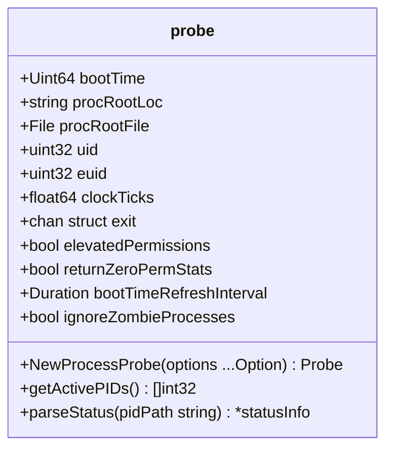

# Overview

Linux process handling involves managing and collecting information about processes running on a Linux system. This document will cover the key components and methods used in the <SwmToken path="pkg/process/procutil/process_linux.go" pos="8:2:2" line-data="package procutil">`procutil`</SwmToken> package for handling Linux processes.

<SwmSnippet path="/pkg/process/procutil/process_linux.go" line="125">

---

# The <SwmToken path="pkg/process/procutil/process_linux.go" pos="125:2:2" line-data="// probe is a service that fetches process related info on current host">`probe`</SwmToken> Struct

The <SwmToken path="pkg/process/procutil/process_linux.go" pos="125:2:2" line-data="// probe is a service that fetches process related info on current host">`probe`</SwmToken> struct is central to the functionality of handling Linux processes. It contains configurations and methods to fetch and manage process data.

```go
// probe is a service that fetches process related info on current host
type probe struct {
	bootTime     *atomic.Uint64
	procRootLoc  string // ProcFS
	procRootFile *os.File
	uid          uint32 // UID
	euid         uint32 // Effective UID
	clockTicks   float64
	exit         chan struct{}

	// configurations
	elevatedPermissions     bool
	returnZeroPermStats     bool
	bootTimeRefreshInterval time.Duration
	ignoreZombieProcesses   bool
}
```

---

</SwmSnippet>

<SwmSnippet path="/pkg/process/procutil/process_linux.go" line="142">

---

# Initializing a Probe

The <SwmToken path="pkg/process/procutil/process_linux.go" pos="142:2:2" line-data="// NewProcessProbe initializes a new Probe object">`NewProcessProbe`</SwmToken> function initializes a new <SwmToken path="pkg/process/procutil/process_linux.go" pos="142:10:10" line-data="// NewProcessProbe initializes a new Probe object">`Probe`</SwmToken> object, setting up necessary configurations such as <SwmToken path="pkg/process/procutil/process_linux.go" pos="151:1:1" line-data="		procRootLoc:             hostProc,">`procRootLoc`</SwmToken>, <SwmToken path="pkg/process/procutil/process_linux.go" pos="152:1:1" line-data="		uid:                     uint32(os.Getuid()),">`uid`</SwmToken>, <SwmToken path="pkg/process/procutil/process_linux.go" pos="153:1:1" line-data="		euid:                    uint32(os.Geteuid()),">`euid`</SwmToken>, and <SwmToken path="pkg/process/procutil/process_linux.go" pos="154:1:1" line-data="		clockTicks:              getClockTicks(),">`clockTicks`</SwmToken>.

```go
// NewProcessProbe initializes a new Probe object
func NewProcessProbe(options ...Option) Probe {
	hostProc := kernel.ProcFSRoot()
	bootTime, err := bootTime(hostProc)
	if err != nil {
		log.Errorf("could not parse boot time: %s", err)
	}

	p := &probe{
		procRootLoc:             hostProc,
		uid:                     uint32(os.Getuid()),
		euid:                    uint32(os.Geteuid()),
		clockTicks:              getClockTicks(),
		exit:                    make(chan struct{}),
		bootTime:                atomic.NewUint64(0),
		bootTimeRefreshInterval: time.Minute,
	}
	p.bootTime.Store(bootTime)

	for _, o := range options {
		o(p)
```

---

</SwmSnippet>

<SwmSnippet path="/pkg/process/procutil/process_linux.go" line="359">

---

# Retrieving Active <SwmToken path="pkg/process/procutil/process_linux.go" pos="359:12:12" line-data="// getActivePIDs retrieves a list of PIDs representing actively running processes.">`PIDs`</SwmToken>

The <SwmToken path="pkg/process/procutil/process_linux.go" pos="359:2:2" line-data="// getActivePIDs retrieves a list of PIDs representing actively running processes.">`getActivePIDs`</SwmToken> method retrieves a list of active process <SwmToken path="tasks/gitlab_helpers.py" pos="90:10:10" line-data="def print_gitlab_object(get_object, ctx, ids, repo=&#39;DataDog/datadog-agent&#39;, jq: str | None = None, jq_colors=True):">`ids`</SwmToken>, which is essential for monitoring running processes.

```go
// getActivePIDs retrieves a list of PIDs representing actively running processes.
func (p *probe) getActivePIDs() ([]int32, error) {
	procFile, err := p.getRootProcFile()
	if err != nil {
		return nil, err
	}

	fnames, err := procFile.Readdirnames(-1)
	if err != nil {
		return nil, err
	}

	// reset read offset to 0, so next time we could read the whole directory again
	_, err = procFile.Seek(0, 0)
	if err != nil {
		return nil, err
	}

	pids := make([]int32, 0, len(fnames))
	for _, fname := range fnames {
		pid, err := strconv.ParseInt(fname, 10, 32)
```

---

</SwmSnippet>

<SwmSnippet path="/pkg/process/procutil/process_linux.go" line="487">

---

# Parsing Process Status

The <SwmToken path="pkg/process/procutil/process_linux.go" pos="487:2:2" line-data="// parseStatus retrieves status info from &quot;status&quot; file for a process in procfs">`parseStatus`</SwmToken> method extracts status information from the procfs, providing detailed insights into each process's state.

```go
// parseStatus retrieves status info from "status" file for a process in procfs
func (p *probe) parseStatus(pidPath string) *statusInfo {
	path := filepath.Join(pidPath, "status")
	var err error

	sInfo := &statusInfo{
		uids:        []int32{},
		gids:        []int32{},
		memInfo:     &MemoryInfoStat{},
		ctxSwitches: &NumCtxSwitchesStat{},
	}

	content, err := os.ReadFile(path)

	if err != nil {
		return sInfo
	}

	lineStart := 0
	for i, r := range content {
		if r == '\n' {
```

---

</SwmSnippet>

<SwmSnippet path="/pkg/process/procutil/process_linux.go" line="88">

---

# Configuration Options

Configurations like <SwmToken path="pkg/process/procutil/process_linux.go" pos="88:2:2" line-data="// WithProcFSRoot confiugres the procfs directory that the probe reads from">`WithProcFSRoot`</SwmToken> and <SwmToken path="pkg/process/procutil/process_linux.go" pos="107:2:2" line-data="// WithIgnoreZombieProcesses configures if process collection should ignore zombie processes or not">`WithIgnoreZombieProcesses`</SwmToken> allow customization of the <SwmToken path="pkg/process/procutil/process_linux.go" pos="88:16:16" line-data="// WithProcFSRoot confiugres the procfs directory that the probe reads from">`probe`</SwmToken> behavior, such as setting the procfs directory or ignoring zombie processes.

```go
// WithProcFSRoot confiugres the procfs directory that the probe reads from
func WithProcFSRoot(path string) Option {
	return func(p Probe) {
		if linuxProbe, ok := p.(*probe); ok {
			linuxProbe.procRootLoc = path
		}
	}
}

// WithPermission configures if process collection should fetch fields
// that require elevated permission or not
func WithPermission(elevatedPermissions bool) Option {
	return func(p Probe) {
		if linuxProbe, ok := p.(*probe); ok {
			linuxProbe.elevatedPermissions = elevatedPermissions
		}
	}
}

// WithIgnoreZombieProcesses configures if process collection should ignore zombie processes or not
func WithIgnoreZombieProcesses(ignoreZombieProcesses bool) Option {
```

---

</SwmSnippet>

&nbsp;

*This is an auto-generated document by Swimm AI 🌊 and has not yet been verified by a human*

<SwmMeta version="3.0.0" repo-id="Z2l0aHViJTNBJTNBZGF0YWRvZy1hZ2VudCUzQSUzQVN3aW1tLURlbW8=" repo-name="datadog-agent"><sup>Powered by [Swimm](/)</sup></SwmMeta>
