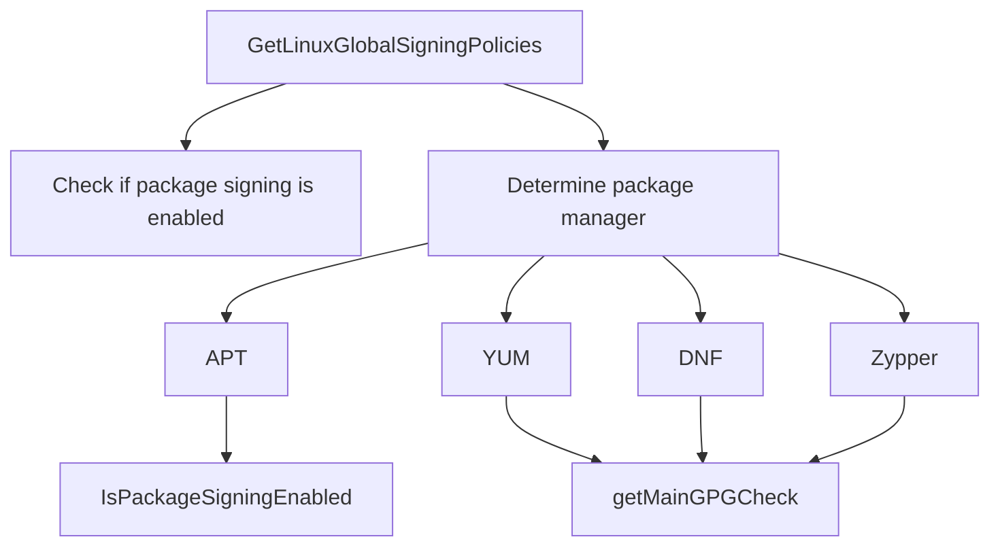

# Introduction to Linux in Utils

This document provides an overview of the Linux-related utilities used in the Datadog Agent. These utilities are essential for building the Datadog Agent and ensuring that the necessary development files for Python are available in the development environment.

## <SwmToken path="comp/metadata/packagesigning/utils/linux.go" pos="16:2:2" line-data="// GetLinuxGlobalSigningPolicies returns:">`GetLinuxGlobalSigningPolicies`</SwmToken> Function

The <SwmToken path="comp/metadata/packagesigning/utils/linux.go" pos="16:2:2" line-data="// GetLinuxGlobalSigningPolicies returns:">`GetLinuxGlobalSigningPolicies`</SwmToken> function checks if package signing is enabled on the host and determines the package manager being used, such as APT, YUM, DNF, or Zypper. It returns two boolean values indicating the status of package signing and repository signing.

## <SwmToken path="comp/metadata/packagesigning/utils/linux.go" pos="49:2:2" line-data="// GetPackageManager is a lazy implementation to detect if we use APT or YUM (RH or SUSE)">`GetPackageManager`</SwmToken> Function

The <SwmToken path="comp/metadata/packagesigning/utils/linux.go" pos="49:2:2" line-data="// GetPackageManager is a lazy implementation to detect if we use APT or YUM (RH or SUSE)">`GetPackageManager`</SwmToken> function identifies the package manager by checking the existence of specific paths like <SwmToken path="comp/metadata/packagesigning/utils/linux.go" pos="43:6:9" line-data="	aptPath  = &quot;/etc/apt&quot;">`/etc/apt`</SwmToken>, <SwmToken path="comp/metadata/packagesigning/utils/linux.go" pos="44:6:9" line-data="	yumPath  = &quot;/etc/yum&quot;">`/etc/yum`</SwmToken>, <SwmToken path="comp/metadata/packagesigning/utils/linux.go" pos="45:6:9" line-data="	dnfPath  = &quot;/etc/dnf&quot;">`/etc/dnf`</SwmToken>, and <SwmToken path="comp/metadata/packagesigning/utils/linux.go" pos="46:6:9" line-data="	zyppPath = &quot;/etc/zypp&quot;">`/etc/zypp`</SwmToken>. It returns a string representing the detected package manager.

<SwmSnippet path="/comp/metadata/packagesigning/utils/linux.go" line="49">

---

The <SwmToken path="comp/metadata/packagesigning/utils/linux.go" pos="49:2:2" line-data="// GetPackageManager is a lazy implementation to detect if we use APT or YUM (RH or SUSE)">`GetPackageManager`</SwmToken> function identifies the package manager by checking the existence of specific paths like <SwmToken path="comp/metadata/packagesigning/utils/linux.go" pos="43:6:9" line-data="	aptPath  = &quot;/etc/apt&quot;">`/etc/apt`</SwmToken>, <SwmToken path="comp/metadata/packagesigning/utils/linux.go" pos="44:6:9" line-data="	yumPath  = &quot;/etc/yum&quot;">`/etc/yum`</SwmToken>, <SwmToken path="comp/metadata/packagesigning/utils/linux.go" pos="45:6:9" line-data="	dnfPath  = &quot;/etc/dnf&quot;">`/etc/dnf`</SwmToken>, and <SwmToken path="comp/metadata/packagesigning/utils/linux.go" pos="46:6:9" line-data="	zyppPath = &quot;/etc/zypp&quot;">`/etc/zypp`</SwmToken>. It returns a string representing the detected package manager.

```go
// GetPackageManager is a lazy implementation to detect if we use APT or YUM (RH or SUSE)
func GetPackageManager() string {
	if _, err := os.Stat(aptPath); err == nil {
		return "apt"
	} else if _, err := os.Stat(yumPath); err == nil {
		return "yum"
	} else if _, err := os.Stat(dnfPath); err == nil {
		return "dnf"
	} else if _, err := os.Stat(zyppPath); err == nil {
		return "zypper"
	}
	return ""
}
```

---

</SwmSnippet>

## Constants for Package Manager Paths

Constants like <SwmToken path="comp/metadata/packagesigning/utils/linux.go" pos="43:1:1" line-data="	aptPath  = &quot;/etc/apt&quot;">`aptPath`</SwmToken>, <SwmToken path="comp/metadata/packagesigning/utils/linux.go" pos="44:1:1" line-data="	yumPath  = &quot;/etc/yum&quot;">`yumPath`</SwmToken>, <SwmToken path="comp/metadata/packagesigning/utils/linux.go" pos="45:1:1" line-data="	dnfPath  = &quot;/etc/dnf&quot;">`dnfPath`</SwmToken>, and <SwmToken path="comp/metadata/packagesigning/utils/linux.go" pos="46:1:1" line-data="	zyppPath = &quot;/etc/zypp&quot;">`zyppPath`</SwmToken> are defined to store the paths used to detect the package manager.

<SwmSnippet path="/comp/metadata/packagesigning/utils/linux.go" line="42">

---

Constants like <SwmToken path="comp/metadata/packagesigning/utils/linux.go" pos="43:1:1" line-data="	aptPath  = &quot;/etc/apt&quot;">`aptPath`</SwmToken>, <SwmToken path="comp/metadata/packagesigning/utils/linux.go" pos="44:1:1" line-data="	yumPath  = &quot;/etc/yum&quot;">`yumPath`</SwmToken>, <SwmToken path="comp/metadata/packagesigning/utils/linux.go" pos="45:1:1" line-data="	dnfPath  = &quot;/etc/dnf&quot;">`dnfPath`</SwmToken>, and <SwmToken path="comp/metadata/packagesigning/utils/linux.go" pos="46:1:1" line-data="	zyppPath = &quot;/etc/zypp&quot;">`zyppPath`</SwmToken> are defined to store the paths used to detect the package manager.

```go
const (
	aptPath  = "/etc/apt"
	yumPath  = "/etc/yum"
	dnfPath  = "/etc/dnf"
	zyppPath = "/etc/zypp"
)
```

---

</SwmSnippet>

&nbsp;

*This is an auto-generated document by Swimm AI 🌊 and has not yet been verified by a human*

<SwmMeta version="3.0.0" repo-id="Z2l0aHViJTNBJTNBZGF0YWRvZy1hZ2VudCUzQSUzQVN3aW1tLURlbW8=" repo-name="datadog-agent"><sup>Powered by [Swimm](/)</sup></SwmMeta>
