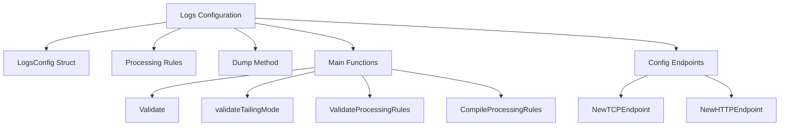

# Introduction to Logs Configuration

Logs configuration in the Datadog Agent involves setting up how logs are collected, processed, and managed. This includes defining the source, type, and processing rules for the logs. The <SwmToken path="comp/logs/agent/config/integration_config.go" pos="98:6:6" line-data="func (c *LogsConfig) Dump(multiline bool) string {">`LogsConfig`</SwmToken> struct is central to this configuration, representing various log sources such as files, network ports, Docker containers, and Windows Event logs.

## <SwmToken path="comp/logs/agent/config/integration_config.go" pos="98:6:6" line-data="func (c *LogsConfig) Dump(multiline bool) string {">`LogsConfig`</SwmToken> Struct

The <SwmToken path="comp/logs/agent/config/integration_config.go" pos="98:6:6" line-data="func (c *LogsConfig) Dump(multiline bool) string {">`LogsConfig`</SwmToken> struct includes fields like <SwmToken path="comp/logs/agent/config/integration_config.go" pos="246:5:5" line-data="	case c.Type == &quot;&quot;:">`Type`</SwmToken>, <SwmToken path="comp/logs/agent/config/integration_config.go" pos="259:15:15" line-data="	case c.Type == TCPType &amp;&amp; c.Port == 0:">`Port`</SwmToken>, <SwmToken path="comp/logs/agent/config/integration_config.go" pos="252:5:5" line-data="		if c.Path == &quot;&quot; {">`Path`</SwmToken>, <SwmToken path="comp/logs/agent/config/integration_config.go" pos="9:2:2" line-data="	&quot;encoding/json&quot;">`encoding`</SwmToken>, <SwmToken path="comp/logs/agent/config/integration_config.go" pos="84:1:1" line-data="	Service         string">`Service`</SwmToken>, <SwmToken path="comp/logs/agent/config/integration_config.go" pos="253:10:10" line-data="			return fmt.Errorf(&quot;file source must have a path&quot;)">`source`</SwmToken>, <SwmToken path="comp/logs/agent/config/integration_config.go" pos="86:1:1" line-data="	SourceCategory  string">`SourceCategory`</SwmToken>, and <SwmToken path="tasks/agent.py" pos="464:1:1" line-data="        tags = requests.get(&quot;https://gcr.io/v2/datadoghq/agent/tags/list&quot;)">`tags`</SwmToken>. These fields specify details about the log source, such as the file path for file logs, the port number for network logs, and the service name associated with the logs.

## Processing Rules

Processing rules in the <SwmToken path="comp/logs/agent/config/integration_config.go" pos="98:6:6" line-data="func (c *LogsConfig) Dump(multiline bool) string {">`LogsConfig`</SwmToken> struct define how logs should be processed before being sent to the Datadog platform. This can include rules for excluding certain paths, setting the tailing mode, and enabling or disabling multi-line log detection.

<SwmSnippet path="/comp/logs/agent/config/integration_config.go" line="88">

---

The <SwmToken path="comp/logs/agent/config/integration_config.go" pos="88:1:1" line-data="	ProcessingRules []*ProcessingRule `mapstructure:&quot;log_processing_rules&quot; json:&quot;log_processing_rules&quot;`">`ProcessingRules`</SwmToken> field in the <SwmToken path="comp/logs/agent/config/integration_config.go" pos="98:6:6" line-data="func (c *LogsConfig) Dump(multiline bool) string {">`LogsConfig`</SwmToken> struct specifies the rules for processing logs. These rules can include excluding paths, setting the tailing mode, and enabling multi-line log detection.

```go
	ProcessingRules []*ProcessingRule `mapstructure:"log_processing_rules" json:"log_processing_rules"`
	// ProcessRawMessage is used to process the raw message instead of only the content part of the message.
	ProcessRawMessage *bool `mapstructure:"process_raw_message" json:"process_raw_message"`
```

---

</SwmSnippet>

## Dump Method

The <SwmToken path="comp/logs/agent/config/integration_config.go" pos="97:2:2" line-data="// Dump dumps the contents of this struct to a string, for debugging purposes.">`Dump`</SwmToken> method in the <SwmToken path="comp/logs/agent/config/integration_config.go" pos="98:6:6" line-data="func (c *LogsConfig) Dump(multiline bool) string {">`LogsConfig`</SwmToken> struct is used for debugging purposes. It outputs the contents of the <SwmToken path="comp/logs/agent/config/integration_config.go" pos="98:6:6" line-data="func (c *LogsConfig) Dump(multiline bool) string {">`LogsConfig`</SwmToken> struct as a string, which can be useful for verifying the configuration settings during development and troubleshooting.

<SwmSnippet path="/comp/logs/agent/config/integration_config.go" line="97">

---

The <SwmToken path="comp/logs/agent/config/integration_config.go" pos="97:2:2" line-data="// Dump dumps the contents of this struct to a string, for debugging purposes.">`Dump`</SwmToken> method outputs the contents of the <SwmToken path="comp/logs/agent/config/integration_config.go" pos="98:6:6" line-data="func (c *LogsConfig) Dump(multiline bool) string {">`LogsConfig`</SwmToken> struct as a string for debugging purposes. This helps in verifying the configuration settings.

```go
// Dump dumps the contents of this struct to a string, for debugging purposes.
func (c *LogsConfig) Dump(multiline bool) string {
	if c == nil {
		return "&LogsConfig(nil)"
	}

	var b strings.Builder
	ws := func(fmt string) string {
		if multiline {
			return "\n\t" + fmt
		}
```

---

</SwmSnippet>

## Main Functions

Several main functions are related to the configuration of logs, including <SwmToken path="comp/logs/agent/config/integration_config.go" pos="243:2:2" line-data="// Validate returns an error if the config is misconfigured">`Validate`</SwmToken>, <SwmToken path="comp/logs/agent/config/integration_config.go" pos="255:7:7" line-data="		err := c.validateTailingMode()">`validateTailingMode`</SwmToken>, <SwmToken path="comp/logs/agent/config/processing_rules.go" pos="33:2:2" line-data="// ValidateProcessingRules validates the rules and raises an error if one is misconfigured.">`ValidateProcessingRules`</SwmToken>, and <SwmToken path="comp/logs/agent/config/processing_rules.go" pos="64:2:2" line-data="// CompileProcessingRules compiles all processing rule regular expressions.">`CompileProcessingRules`</SwmToken>.

### Validate

The <SwmToken path="comp/logs/agent/config/integration_config.go" pos="243:2:2" line-data="// Validate returns an error if the config is misconfigured">`Validate`</SwmToken> function checks if the log configuration is correctly set up. It ensures that required fields like <SwmToken path="comp/logs/agent/config/integration_config.go" pos="246:5:5" line-data="	case c.Type == &quot;&quot;:">`Type`</SwmToken>, <SwmToken path="comp/logs/agent/config/integration_config.go" pos="252:5:5" line-data="		if c.Path == &quot;&quot; {">`Path`</SwmToken>, and <SwmToken path="comp/logs/agent/config/integration_config.go" pos="259:15:15" line-data="	case c.Type == TCPType &amp;&amp; c.Port == 0:">`Port`</SwmToken> are properly defined and calls other validation functions like <SwmToken path="comp/logs/agent/config/integration_config.go" pos="255:7:7" line-data="		err := c.validateTailingMode()">`validateTailingMode`</SwmToken> and <SwmToken path="comp/logs/agent/config/processing_rules.go" pos="33:2:2" line-data="// ValidateProcessingRules validates the rules and raises an error if one is misconfigured.">`ValidateProcessingRules`</SwmToken>.

<SwmSnippet path="/comp/logs/agent/config/integration_config.go" line="243">

---

The <SwmToken path="comp/logs/agent/config/integration_config.go" pos="243:2:2" line-data="// Validate returns an error if the config is misconfigured">`Validate`</SwmToken> function ensures that the log configuration is correctly set up by checking required fields and calling other validation functions.

```go
// Validate returns an error if the config is misconfigured
func (c *LogsConfig) Validate() error {
	switch {
	case c.Type == "":
		// user don't have to specify a logs-config type when defining
		// an autodiscovery label because so we must override it at some point,
		// this check is mostly used for sanity purposed to detect an override miss.
		return fmt.Errorf("a config must have a type")
	case c.Type == FileType:
		if c.Path == "" {
			return fmt.Errorf("file source must have a path")
		}
		err := c.validateTailingMode()
		if err != nil {
			return err
		}
	case c.Type == TCPType && c.Port == 0:
		return fmt.Errorf("tcp source must have a port")
	case c.Type == UDPType && c.Port == 0:
		return fmt.Errorf("udp source must have a port")
	}
```

---

</SwmSnippet>

### <SwmToken path="comp/logs/agent/config/integration_config.go" pos="255:7:7" line-data="		err := c.validateTailingMode()">`validateTailingMode`</SwmToken>

The <SwmToken path="comp/logs/agent/config/integration_config.go" pos="255:7:7" line-data="		err := c.validateTailingMode()">`validateTailingMode`</SwmToken> function validates the tailing mode of the log configuration. It checks if the specified tailing mode is valid and ensures that tailing from the beginning is not used with wildcard paths.

<SwmSnippet path="/comp/logs/agent/config/integration_config.go" line="271">

---

The <SwmToken path="comp/logs/agent/config/integration_config.go" pos="271:9:9" line-data="func (c *LogsConfig) validateTailingMode() error {">`validateTailingMode`</SwmToken> function checks if the specified tailing mode is valid and ensures that tailing from the beginning is not used with wildcard paths.

```go
func (c *LogsConfig) validateTailingMode() error {
	mode, found := TailingModeFromString(c.TailingMode)
	if !found && c.TailingMode != "" {
		return fmt.Errorf("invalid tailing mode '%v' for %v", c.TailingMode, c.Path)
	}
	if ContainsWildcard(c.Path) && (mode == Beginning || mode == ForceBeginning) {
		return fmt.Errorf("tailing from the beginning is not supported for wildcard path %v", c.Path)
	}
	return nil
}
```

---

</SwmSnippet>

### <SwmToken path="comp/logs/agent/config/processing_rules.go" pos="33:2:2" line-data="// ValidateProcessingRules validates the rules and raises an error if one is misconfigured.">`ValidateProcessingRules`</SwmToken>

The <SwmToken path="comp/logs/agent/config/processing_rules.go" pos="33:2:2" line-data="// ValidateProcessingRules validates the rules and raises an error if one is misconfigured.">`ValidateProcessingRules`</SwmToken> function validates the processing rules defined in the log configuration. It ensures that each rule has a valid name, type, and pattern that compiles correctly.

<SwmSnippet path="/comp/logs/agent/config/processing_rules.go" line="33">

---

The <SwmToken path="comp/logs/agent/config/processing_rules.go" pos="33:2:2" line-data="// ValidateProcessingRules validates the rules and raises an error if one is misconfigured.">`ValidateProcessingRules`</SwmToken> function ensures that each processing rule has a valid name, type, and pattern that compiles correctly.

```go
// ValidateProcessingRules validates the rules and raises an error if one is misconfigured.
// Each processing rule must have:
// - a valid name
// - a valid type
// - a valid pattern that compiles
func ValidateProcessingRules(rules []*ProcessingRule) error {
	for _, rule := range rules {
		if rule.Name == "" {
			return fmt.Errorf("all processing rules must have a name")
		}

		switch rule.Type {
		case ExcludeAtMatch, IncludeAtMatch, MaskSequences, MultiLine:
			break
		case "":
			return fmt.Errorf("type must be set for processing rule `%s`", rule.Name)
		default:
			return fmt.Errorf("type %s is not supported for processing rule `%s`", rule.Type, rule.Name)
		}

		if rule.Pattern == "" {
```

---

</SwmSnippet>

### <SwmToken path="comp/logs/agent/config/processing_rules.go" pos="64:2:2" line-data="// CompileProcessingRules compiles all processing rule regular expressions.">`CompileProcessingRules`</SwmToken>

The <SwmToken path="comp/logs/agent/config/processing_rules.go" pos="64:2:2" line-data="// CompileProcessingRules compiles all processing rule regular expressions.">`CompileProcessingRules`</SwmToken> function compiles the regular expressions for all processing rules. It prepares the rules for execution by compiling their patterns and setting up any necessary placeholders.

<SwmSnippet path="/comp/logs/agent/config/processing_rules.go" line="64">

---

The <SwmToken path="comp/logs/agent/config/processing_rules.go" pos="64:2:2" line-data="// CompileProcessingRules compiles all processing rule regular expressions.">`CompileProcessingRules`</SwmToken> function compiles the regular expressions for all processing rules, preparing them for execution.

```go
// CompileProcessingRules compiles all processing rule regular expressions.
func CompileProcessingRules(rules []*ProcessingRule) error {
	for _, rule := range rules {
		re, err := regexp.Compile(rule.Pattern)
		if err != nil {
			return err
		}
		switch rule.Type {
		case ExcludeAtMatch, IncludeAtMatch:
			rule.Regex = re
		case MaskSequences:
			rule.Regex = re
			rule.Placeholder = []byte(rule.ReplacePlaceholder)
		case MultiLine:
			rule.Regex, err = regexp.Compile("^" + rule.Pattern)
			if err != nil {
				return err
			}
		}
	}
	return nil
```

---

</SwmSnippet>

## Config Endpoints

Config endpoints are used to define how logs are sent to the Datadog platform. There are two main functions for creating endpoints: <SwmToken path="comp/logs/agent/config/endpoints.go" pos="84:2:2" line-data="// NewTCPEndpoint returns a new TCP Endpoint based on LogsConfigKeys. The endpoint is by default reliable and will use">`NewTCPEndpoint`</SwmToken> and <SwmToken path="comp/logs/agent/config/endpoints.go" pos="96:2:2" line-data="// NewHTTPEndpoint returns a new HTTP Endpoint based on LogsConfigKeys The endpoint is by default reliable and will use">`NewHTTPEndpoint`</SwmToken>.

### <SwmToken path="comp/logs/agent/config/endpoints.go" pos="84:2:2" line-data="// NewTCPEndpoint returns a new TCP Endpoint based on LogsConfigKeys. The endpoint is by default reliable and will use">`NewTCPEndpoint`</SwmToken>

The <SwmToken path="comp/logs/agent/config/endpoints.go" pos="84:2:2" line-data="// NewTCPEndpoint returns a new TCP Endpoint based on LogsConfigKeys. The endpoint is by default reliable and will use">`NewTCPEndpoint`</SwmToken> function returns a new TCP Endpoint based on <SwmToken path="comp/logs/agent/config/endpoints.go" pos="84:18:18" line-data="// NewTCPEndpoint returns a new TCP Endpoint based on LogsConfigKeys. The endpoint is by default reliable and will use">`LogsConfigKeys`</SwmToken>. The endpoint is by default reliable and will use socks proxy and SSL settings from the configuration.

<SwmSnippet path="/comp/logs/agent/config/endpoints.go" line="84">

---

The <SwmToken path="comp/logs/agent/config/endpoints.go" pos="84:2:2" line-data="// NewTCPEndpoint returns a new TCP Endpoint based on LogsConfigKeys. The endpoint is by default reliable and will use">`NewTCPEndpoint`</SwmToken> function creates a new TCP Endpoint using the settings from <SwmToken path="comp/logs/agent/config/endpoints.go" pos="84:18:18" line-data="// NewTCPEndpoint returns a new TCP Endpoint based on LogsConfigKeys. The endpoint is by default reliable and will use">`LogsConfigKeys`</SwmToken>, including socks proxy and SSL settings.

```go
// NewTCPEndpoint returns a new TCP Endpoint based on LogsConfigKeys. The endpoint is by default reliable and will use
// socks proxy and SSL settings from the configuration.
func NewTCPEndpoint(logsConfig *LogsConfigKeys) Endpoint {
	return Endpoint{
		apiKeyGetter:            logsConfig.getAPIKeyGetter(),
		ProxyAddress:            logsConfig.socks5ProxyAddress(),
		ConnectionResetInterval: logsConfig.connectionResetInterval(),
		useSSL:                  logsConfig.logsNoSSL(),
		isReliable:              true, // by default endpoints are reliable
	}
```

---

</SwmSnippet>

### <SwmToken path="comp/logs/agent/config/endpoints.go" pos="96:2:2" line-data="// NewHTTPEndpoint returns a new HTTP Endpoint based on LogsConfigKeys The endpoint is by default reliable and will use">`NewHTTPEndpoint`</SwmToken>

The <SwmToken path="comp/logs/agent/config/endpoints.go" pos="96:2:2" line-data="// NewHTTPEndpoint returns a new HTTP Endpoint based on LogsConfigKeys The endpoint is by default reliable and will use">`NewHTTPEndpoint`</SwmToken> function returns a new HTTP Endpoint based on <SwmToken path="comp/logs/agent/config/endpoints.go" pos="84:18:18" line-data="// NewTCPEndpoint returns a new TCP Endpoint based on LogsConfigKeys. The endpoint is by default reliable and will use">`LogsConfigKeys`</SwmToken>. The endpoint is by default reliable and will use the settings related to HTTP from the configuration (compression, Backoff, recovery, etc.).

<SwmSnippet path="/comp/logs/agent/config/endpoints.go" line="96">

---

The <SwmToken path="comp/logs/agent/config/endpoints.go" pos="96:2:2" line-data="// NewHTTPEndpoint returns a new HTTP Endpoint based on LogsConfigKeys The endpoint is by default reliable and will use">`NewHTTPEndpoint`</SwmToken> function creates a new HTTP Endpoint using the settings from <SwmToken path="comp/logs/agent/config/endpoints.go" pos="96:18:18" line-data="// NewHTTPEndpoint returns a new HTTP Endpoint based on LogsConfigKeys The endpoint is by default reliable and will use">`LogsConfigKeys`</SwmToken>, including compression, Backoff, and recovery settings.

```go
// NewHTTPEndpoint returns a new HTTP Endpoint based on LogsConfigKeys The endpoint is by default reliable and will use
// the settings related to HTTP from the configuration (compression, Backoff, recovery, ...).
func NewHTTPEndpoint(logsConfig *LogsConfigKeys) Endpoint {
	return Endpoint{
		apiKeyGetter:            logsConfig.getAPIKeyGetter(),
		UseCompression:          logsConfig.useCompression(),
		CompressionLevel:        logsConfig.compressionLevel(),
		ConnectionResetInterval: logsConfig.connectionResetInterval(),
		BackoffBase:             logsConfig.senderBackoffBase(),
		BackoffMax:              logsConfig.senderBackoffMax(),
		BackoffFactor:           logsConfig.senderBackoffFactor(),
		RecoveryInterval:        logsConfig.senderRecoveryInterval(),
		RecoveryReset:           logsConfig.senderRecoveryReset(),
		useSSL:                  logsConfig.logsNoSSL(),
		isReliable:              true, // by default endpoints are reliable
	}
```

---

</SwmSnippet>

&nbsp;

*This is an auto-generated document by Swimm AI 🌊 and has not yet been verified by a human*

<SwmMeta version="3.0.0" repo-id="Z2l0aHViJTNBJTNBZGF0YWRvZy1hZ2VudCUzQSUzQVN3aW1tLURlbW8=" repo-name="datadog-agent"><sup>Powered by [Swimm](/)</sup></SwmMeta>
