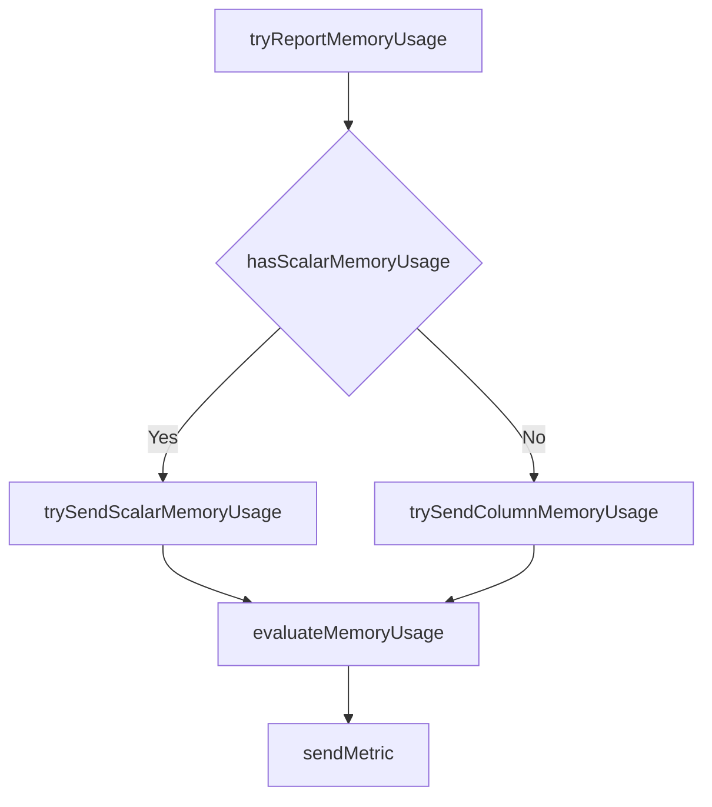

# Introduction to Memory Usage Reporting

Memory usage reporting involves collecting and sending metrics related to memory consumption. This includes metrics such as memory usage, memory used, memory total, and memory free.

# Collecting Memory Metrics

The function <SwmToken path="pkg/collector/corechecks/snmp/internal/report/report_memory_usage.go" pos="27:9:9" line-data="func (ms *MetricSender) tryReportMemoryUsage(scalarSamples map[string]MetricSample, columnSamples map[string]map[string]MetricSample) error {">`tryReportMemoryUsage`</SwmToken> determines whether to report scalar or column memory usage metrics. It first checks if scalar memory usage metrics are available and attempts to send them using the <SwmToken path="pkg/collector/corechecks/snmp/internal/report/report_memory_usage.go" pos="29:5:5" line-data="		return ms.trySendScalarMemoryUsage(scalarSamples)">`trySendScalarMemoryUsage`</SwmToken> function. If scalar memory usage metrics are not available, it then attempts to send column memory usage metrics using the <SwmToken path="pkg/collector/corechecks/snmp/internal/report/report_memory_usage.go" pos="32:5:5" line-data="	return ms.trySendColumnMemoryUsage(columnSamples)">`trySendColumnMemoryUsage`</SwmToken> function.

<SwmSnippet path="/pkg/collector/corechecks/snmp/internal/report/report_memory_usage.go" line="27">

---

The function <SwmToken path="pkg/collector/corechecks/snmp/internal/report/report_memory_usage.go" pos="27:9:9" line-data="func (ms *MetricSender) tryReportMemoryUsage(scalarSamples map[string]MetricSample, columnSamples map[string]map[string]MetricSample) error {">`tryReportMemoryUsage`</SwmToken> is responsible for determining whether to report scalar or column memory usage metrics. It first checks if scalar memory usage metrics are available and attempts to send them using the <SwmToken path="pkg/collector/corechecks/snmp/internal/report/report_memory_usage.go" pos="29:5:5" line-data="		return ms.trySendScalarMemoryUsage(scalarSamples)">`trySendScalarMemoryUsage`</SwmToken> function. If scalar memory usage metrics are not available, the function then attempts to send column memory usage metrics using the <SwmToken path="pkg/collector/corechecks/snmp/internal/report/report_memory_usage.go" pos="32:5:5" line-data="	return ms.trySendColumnMemoryUsage(columnSamples)">`trySendColumnMemoryUsage`</SwmToken> function.

```go
func (ms *MetricSender) tryReportMemoryUsage(scalarSamples map[string]MetricSample, columnSamples map[string]map[string]MetricSample) error {
	if ms.hasScalarMemoryUsage(scalarSamples) {
		return ms.trySendScalarMemoryUsage(scalarSamples)
	}

	return ms.trySendColumnMemoryUsage(columnSamples)
}
```

---

</SwmSnippet>

# Sending Scalar Memory Usage Metrics

The <SwmToken path="pkg/collector/corechecks/snmp/internal/report/report_memory_usage.go" pos="29:5:5" line-data="		return ms.trySendScalarMemoryUsage(scalarSamples)">`trySendScalarMemoryUsage`</SwmToken> function checks for the presence of specific memory metrics such as memory used, memory total, and memory free. If these metrics are available, it calculates the memory usage percentage and sends the metric.

<SwmSnippet path="/pkg/collector/corechecks/snmp/internal/report/report_memory_usage.go" line="45">

---

The <SwmToken path="pkg/collector/corechecks/snmp/internal/report/report_memory_usage.go" pos="45:9:9" line-data="func (ms *MetricSender) trySendScalarMemoryUsage(scalarSamples map[string]MetricSample) error {">`trySendScalarMemoryUsage`</SwmToken> function checks for the presence of specific memory metrics such as memory used, memory total, and memory free. If these metrics are available, it calculates the memory usage percentage and sends the metric.

```go
func (ms *MetricSender) trySendScalarMemoryUsage(scalarSamples map[string]MetricSample) error {
	_, scalarMemoryUsageOk := scalarSamples["memory.usage"]
	if scalarMemoryUsageOk {
		// memory usage is already sent through collected metrics
		return nil
	}

	scalarMemoryUsed, scalarMemoryUsedOk := scalarSamples["memory.used"]
	scalarMemoryTotal, scalarMemoryTotalOk := scalarSamples["memory.total"]
	scalarMemoryFree, scalarMemoryFreeOk := scalarSamples["memory.free"]

	if scalarMemoryUsedOk {
		floatMemoryUsed, err := scalarMemoryUsed.value.ToFloat64()
		if err != nil {
			return fmt.Errorf("metric `%s`: failed to convert to float64: %s", "memory.used", err)
		}

		if scalarMemoryTotalOk {
			// memory total and memory used
			floatMemoryTotal, err := scalarMemoryTotal.value.ToFloat64()
			if err != nil {
```

---

</SwmSnippet>

# Sending Column Memory Usage Metrics

The <SwmToken path="pkg/collector/corechecks/snmp/internal/report/report_memory_usage.go" pos="32:5:5" line-data="	return ms.trySendColumnMemoryUsage(columnSamples)">`trySendColumnMemoryUsage`</SwmToken> function processes column-based memory metrics. It iterates through the rows of memory used, memory total, and memory free metrics, calculates the memory usage percentage for each row, and sends the metrics.

<SwmSnippet path="/pkg/collector/corechecks/snmp/internal/report/report_memory_usage.go" line="164">

---

The <SwmToken path="pkg/collector/corechecks/snmp/internal/report/report_memory_usage.go" pos="164:9:9" line-data="func (ms *MetricSender) trySendColumnMemoryUsage(columnSamples map[string]map[string]MetricSample) error {">`trySendColumnMemoryUsage`</SwmToken> function processes column-based memory metrics. It iterates through the rows of memory used, memory total, and memory free metrics, calculates the memory usage percentage for each row, and sends the metrics.

```go
func (ms *MetricSender) trySendColumnMemoryUsage(columnSamples map[string]map[string]MetricSample) error {
	_, memoryUsageOk := columnSamples["memory.usage"]
	if memoryUsageOk {
		// memory usage is already sent through collected metrics
		return nil
	}

	memoryUsedRows, memoryUsedOk := columnSamples["memory.used"]
	memoryTotalRows, memoryTotalOk := columnSamples["memory.total"]
	memoryFreeRows, memoryFreeOk := columnSamples["memory.free"]

	if memoryUsedOk {
		if memoryTotalOk {
			for rowIndex, memoryUsedSample := range memoryUsedRows {
				memoryTotalSample, memoryTotalSampleOk := memoryTotalRows[rowIndex]
				if !memoryTotalSampleOk {
					return fmt.Errorf("missing memory total sample at row %s, skipping memory usage evaluation", rowIndex)
				}
				floatMemoryTotal, err := memoryTotalSample.value.ToFloat64()
				if err != nil {
					return fmt.Errorf("metric `%s[%s]`: failed to convert to float64: %s", "memory.total", rowIndex, err)
```

---

</SwmSnippet>

# Calculating Memory Usage Percentage

Both functions rely on the <SwmToken path="pkg/collector/corechecks/snmp/internal/report/report_memory_usage.go" pos="294:2:2" line-data="func evaluateMemoryUsage(memoryUsed float64, memoryTotal float64) (float64, error) {">`evaluateMemoryUsage`</SwmToken> function to calculate the memory usage percentage. This function takes the used and total memory values, performs the calculation, and returns the result.

<SwmSnippet path="/pkg/collector/corechecks/snmp/internal/report/report_memory_usage.go" line="294">

---

The <SwmToken path="pkg/collector/corechecks/snmp/internal/report/report_memory_usage.go" pos="294:2:2" line-data="func evaluateMemoryUsage(memoryUsed float64, memoryTotal float64) (float64, error) {">`evaluateMemoryUsage`</SwmToken> function calculates the memory usage percentage. This function takes the used and total memory values, performs the calculation, and returns the result.

```go
func evaluateMemoryUsage(memoryUsed float64, memoryTotal float64) (float64, error) {
	if memoryTotal == 0 {
		return 0, fmt.Errorf("cannot evaluate memory usage, total memory is 0")
	}
	if memoryUsed < 0 {
		return 0, fmt.Errorf("cannot evaluate memory usage, memory used is < 0")
	}
	return (memoryUsed / memoryTotal) * 100, nil
}
```

---

</SwmSnippet>

# Sending the Calculated Metrics

The <SwmToken path="pkg/collector/corechecks/snmp/internal/report/report_metrics.go" pos="178:9:9" line-data="func (ms *MetricSender) sendMetric(metricSample MetricSample) {">`sendMetric`</SwmToken> function is used to send the calculated memory usage metrics. It constructs the full metric name, determines the metric type, and sends the metric to the appropriate destination.

<SwmSnippet path="/pkg/collector/corechecks/snmp/internal/report/report_metrics.go" line="178">

---

The <SwmToken path="pkg/collector/corechecks/snmp/internal/report/report_metrics.go" pos="178:9:9" line-data="func (ms *MetricSender) sendMetric(metricSample MetricSample) {">`sendMetric`</SwmToken> function is used to send the calculated memory usage metrics. It constructs the full metric name, determines the metric type, and sends the metric to the appropriate destination.

```go
func (ms *MetricSender) sendMetric(metricSample MetricSample) {
	metricFullName := "snmp." + metricSample.symbol.Name
	forcedType := metricSample.forcedType
	if metricSample.symbol.MetricType != "" {
		forcedType = metricSample.symbol.MetricType
	}
	if forcedType == "" {
		if metricSample.value.SubmissionType != "" {
			forcedType = metricSample.value.SubmissionType
		} else {
			forcedType = profiledefinition.ProfileMetricTypeGauge
		}
	} else if forcedType == "flag_stream" {
		strValue, err := metricSample.value.ToString()
		if err != nil {
			log.Debugf("error converting value (%#v) to string : %v", metricSample.value, err)
			return
		}
		options := metricSample.options
		floatValue, err := getFlagStreamValue(options.Placement, strValue)
		if err != nil {
```

---

</SwmSnippet>

&nbsp;

*This is an auto-generated document by Swimm AI 🌊 and has not yet been verified by a human*

<SwmMeta version="3.0.0" repo-id="Z2l0aHViJTNBJTNBZGF0YWRvZy1hZ2VudCUzQSUzQVN3aW1tLURlbW8=" repo-name="datadog-agent"><sup>Powered by [Swimm](/)</sup></SwmMeta>
