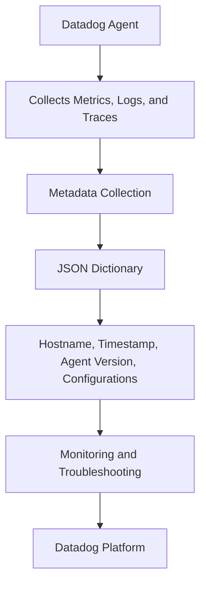

# Introduction

Metadata refers to the additional information collected by the Datadog Agent about the system and its configuration. This information includes details such as the hostname, timestamp, agent version, and various configurations like <SwmToken path="comp/metadata/systemprobe/impl/system_probe.go" pos="105:17:19" line-data="		Endpoint:         api.NewAgentEndpointProvider(sb.writePayloadAsJSON, &quot;/metadata/system-probe&quot;, &quot;GET&quot;),">`system-probe`</SwmToken>, file, environment variable, agent runtime, remote, and CLI configurations.

# Usage of Metadata in Components

Components within the Datadog Agent, such as the <SwmToken path="comp/metadata/systemprobe/impl/system_probe.go" pos="105:17:19" line-data="		Endpoint:         api.NewAgentEndpointProvider(sb.writePayloadAsJSON, &quot;/metadata/system-probe&quot;, &quot;GET&quot;),">`system-probe`</SwmToken>, use metadata to report their configuration and status back to the Datadog platform. This helps in ensuring that the collected data is accurate and relevant.

# Metadata Endpoints

The Datadog Agent provides several endpoints to access metadata. These endpoints return metadata in JSON format, which can be used for various purposes such as monitoring and troubleshooting.

<SwmSnippet path="/comp/metadata/packagesigning/packagesigningimpl/packagesigning.go" line="132">

---

## <SwmPath>[test/new-e2e/tests/agent-platform/package-signing/](test/new-e2e/tests/agent-platform/package-signing/)</SwmPath>

The endpoint <SwmPath>[test/new-e2e/tests/agent-platform/package-signing/](test/new-e2e/tests/agent-platform/package-signing/)</SwmPath> is defined to provide package signing metadata. It uses the <SwmToken path="comp/metadata/packagesigning/packagesigningimpl/packagesigning.go" pos="132:10:10" line-data="		Endpoint:      api.NewAgentEndpointProvider(is.writePayloadAsJSON, &quot;/metadata/package-signing&quot;, &quot;GET&quot;),">`writePayloadAsJSON`</SwmToken> function to handle GET requests and return the metadata in JSON format.

```go
		Endpoint:      api.NewAgentEndpointProvider(is.writePayloadAsJSON, "/metadata/package-signing", "GET"),
	}
```

---

</SwmSnippet>

<SwmSnippet path="/comp/metadata/systemprobe/impl/system_probe.go" line="105">

---

## <SwmPath>[cmd/system-probe/](cmd/system-probe/)</SwmPath>

The endpoint <SwmPath>[cmd/system-probe/](cmd/system-probe/)</SwmPath> is defined to provide system probe metadata. It uses the <SwmToken path="comp/metadata/systemprobe/impl/system_probe.go" pos="105:10:10" line-data="		Endpoint:         api.NewAgentEndpointProvider(sb.writePayloadAsJSON, &quot;/metadata/system-probe&quot;, &quot;GET&quot;),">`writePayloadAsJSON`</SwmToken> function to handle GET requests and return the metadata in JSON format.

```go
		Endpoint:         api.NewAgentEndpointProvider(sb.writePayloadAsJSON, "/metadata/system-probe", "GET"),
	}
```

---

</SwmSnippet>

&nbsp;

*This is an auto-generated document by Swimm AI 🌊 and has not yet been verified by a human*

<SwmMeta version="3.0.0" repo-id="Z2l0aHViJTNBJTNBZGF0YWRvZy1hZ2VudCUzQSUzQVN3aW1tLURlbW8=" repo-name="datadog-agent"><sup>Powered by [Swimm](/)</sup></SwmMeta>
