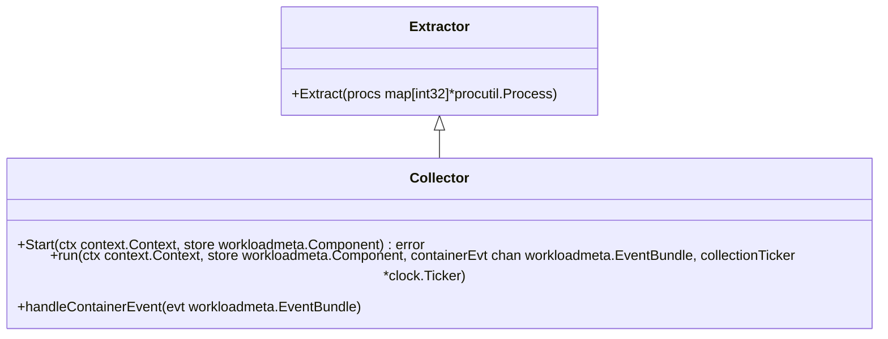

# Introduction to Process Metadata

Process metadata refers to the additional information collected about processes to enhance the understanding and monitoring of the processes running on a system. This metadata includes details such as the hostname, timestamp, agent version, and various configurations of the <SwmToken path="pkg/process/checks/process.go" pos="641:12:14" line-data="			log.Warnf(&quot;could not initialize system-probe connection in process check: %v (will only log every 10 minutes)&quot;, err)">`system-probe`</SwmToken>. These configurations can be specified by different sources like the configuration file, environment variables, CLI, and remote configuration.

# Metadata Details

The metadata includes details such as the hostname, timestamp, agent version, and various configurations of the <SwmToken path="pkg/process/checks/process.go" pos="641:12:14" line-data="			log.Warnf(&quot;could not initialize system-probe connection in process check: %v (will only log every 10 minutes)&quot;, err)">`system-probe`</SwmToken>. These configurations can be specified by different sources like the configuration file, environment variables, CLI, and remote configuration.

# Extracting Metadata

The <SwmToken path="pkg/process/metadata/metadata.go" pos="11:2:2" line-data="// Extractor is common interface for extracting metadata from processes">`Extractor`</SwmToken> interface defines a method <SwmToken path="pkg/process/metadata/metadata.go" pos="13:1:1" line-data="	Extract(procs map[int32]*procutil.Process)">`Extract`</SwmToken> for extracting metadata from processes. This interface is implemented by various components to gather specific metadata.

<SwmSnippet path="/pkg/process/metadata/metadata.go" line="11">

---

The <SwmToken path="pkg/process/metadata/metadata.go" pos="11:2:2" line-data="// Extractor is common interface for extracting metadata from processes">`Extractor`</SwmToken> interface is defined here, which is responsible for extracting metadata from processes.

```go
// Extractor is common interface for extracting metadata from processes
type Extractor interface {
	Extract(procs map[int32]*procutil.Process)
}
```

---

</SwmSnippet>

# Using Extracted Metadata

The extracted metadata is then used by different parts of the system to provide insights and monitoring capabilities. For example, the `Collector` class collects processes and sends them to the remote process collector in the core agent.

<SwmSnippet path="/pkg/process/checks/process.go" line="280">

---

The `Collector` class uses the <SwmToken path="pkg/process/checks/process.go" pos="280:6:6" line-data="	for _, extractor := range p.extractors {">`extractor`</SwmToken> interface to extract metadata from processes.

```go
	for _, extractor := range p.extractors {
		extractor.Extract(procs)
	}
```

---

</SwmSnippet>

# Main Functions

There are several main functions related to metadata. Some of them are <SwmToken path="pkg/process/metadata/metadata.go" pos="13:1:1" line-data="	Extract(procs map[int32]*procutil.Process)">`Extract`</SwmToken>, <SwmToken path="pkg/process/metadata/parser/service.go" pos="111:7:7" line-data="		meta := d.extractServiceMetadata(proc)">`extractServiceMetadata`</SwmToken>, and <SwmToken path="pkg/process/metadata/parser/service.go" pos="163:8:8" line-data="		svc, ok := chooseServiceNameFromEnvs(envs)">`chooseServiceNameFromEnvs`</SwmToken>. We will dive a little into <SwmToken path="pkg/process/metadata/metadata.go" pos="13:1:1" line-data="	Extract(procs map[int32]*procutil.Process)">`Extract`</SwmToken> and <SwmToken path="pkg/process/metadata/parser/service.go" pos="111:7:7" line-data="		meta := d.extractServiceMetadata(proc)">`extractServiceMetadata`</SwmToken>.

## Extract

The <SwmToken path="pkg/process/metadata/metadata.go" pos="13:1:1" line-data="	Extract(procs map[int32]*procutil.Process)">`Extract`</SwmToken> function is responsible for extracting metadata from processes. It iterates over the processes and calls <SwmToken path="pkg/process/metadata/parser/service.go" pos="111:7:7" line-data="		meta := d.extractServiceMetadata(proc)">`extractServiceMetadata`</SwmToken> to gather metadata for each process.

<SwmSnippet path="/pkg/process/metadata/parser/service.go" line="94">

---

The <SwmToken path="pkg/process/metadata/parser/service.go" pos="94:9:9" line-data="func (d *ServiceExtractor) Extract(processes map[int32]*procutil.Process) {">`Extract`</SwmToken> function implementation, which iterates over processes and calls <SwmToken path="pkg/process/metadata/parser/service.go" pos="111:7:7" line-data="		meta := d.extractServiceMetadata(proc)">`extractServiceMetadata`</SwmToken>.

```go
func (d *ServiceExtractor) Extract(processes map[int32]*procutil.Process) {
	if !d.enabled {
		return
	}

	serviceByPID := make(map[int32]*serviceMetadata)

	for _, proc := range processes {
		if meta, seen := d.serviceByPID[proc.Pid]; seen {
			// check the service metadata is for the same process
			if len(proc.Cmdline) == len(meta.cmdline) {
				if len(proc.Cmdline) == 0 || proc.Cmdline[0] == meta.cmdline[0] {
					serviceByPID[proc.Pid] = meta
					continue
				}
			}
		}
		meta := d.extractServiceMetadata(proc)
		if meta != nil && log.ShouldLog(seelog.TraceLvl) {
			log.Tracef("detected service metadata: %v", meta)
		}
```

---

</SwmSnippet>

## <SwmToken path="pkg/process/metadata/parser/service.go" pos="111:7:7" line-data="		meta := d.extractServiceMetadata(proc)">`extractServiceMetadata`</SwmToken>

The <SwmToken path="pkg/process/metadata/parser/service.go" pos="111:7:7" line-data="		meta := d.extractServiceMetadata(proc)">`extractServiceMetadata`</SwmToken> function extracts specific metadata from a given process. It processes the command line arguments and environment variables to determine the service context and other relevant metadata.

<SwmSnippet path="/pkg/process/metadata/parser/service.go" line="148">

---

The <SwmToken path="pkg/process/metadata/parser/service.go" pos="148:9:9" line-data="func (d *ServiceExtractor) extractServiceMetadata(process *procutil.Process) *serviceMetadata {">`extractServiceMetadata`</SwmToken> function processes command line arguments and environment variables to extract metadata.

```go
func (d *ServiceExtractor) extractServiceMetadata(process *procutil.Process) *serviceMetadata {
	cmd := process.Cmdline
	if len(cmd) == 0 || len(cmd[0]) == 0 {
		return &serviceMetadata{
			cmdline: cmd,
		}
	}

	// check if all args are packed into the first argument
	if len(cmd) == 1 {
		cmd = strings.Split(cmd[0], " ")
	}
	cmdOrig := cmd
	envs, cmd := extractEnvsFromCommand(cmd)
	if len(envs) > 0 { // evaluate and skip the envs
		svc, ok := chooseServiceNameFromEnvs(envs)
		if ok {
			return &serviceMetadata{
				cmdline:        cmdOrig,
				serviceContext: "process_context:" + svc,
			}
```

---

</SwmSnippet>

# Metadata Endpoints

Metadata Endpoints provide interfaces to stream and manage process metadata.

## <SwmToken path="pkg/process/metadata/workloadmeta/grpc.go" pos="129:2:2" line-data="// StreamEntities streams Process Entities collected through the WorkloadMetaExtractor">`StreamEntities`</SwmToken>

The <SwmToken path="pkg/process/metadata/workloadmeta/grpc.go" pos="129:2:2" line-data="// StreamEntities streams Process Entities collected through the WorkloadMetaExtractor">`StreamEntities`</SwmToken> function streams Process Entities collected through the <SwmToken path="pkg/process/metadata/workloadmeta/grpc.go" pos="129:16:16" line-data="// StreamEntities streams Process Entities collected through the WorkloadMetaExtractor">`WorkloadMetaExtractor`</SwmToken>. It sends a snapshot of all processes detected on the host as 'SET' events when a connection is created. After the connection is established, only diffs (process <SwmToken path="pkg/process/metadata/workloadmeta/grpc.go" pos="152:19:21" line-data="	// Once connection is established, only diffs (process creations/deletions) are sent to the client">`creations/deletions`</SwmToken>) are sent to the client.

<SwmSnippet path="/pkg/process/metadata/workloadmeta/grpc.go" line="129">

---

The <SwmToken path="pkg/process/metadata/workloadmeta/grpc.go" pos="129:2:2" line-data="// StreamEntities streams Process Entities collected through the WorkloadMetaExtractor">`StreamEntities`</SwmToken> function streams Process Entities collected through the <SwmToken path="pkg/process/metadata/workloadmeta/grpc.go" pos="129:16:16" line-data="// StreamEntities streams Process Entities collected through the WorkloadMetaExtractor">`WorkloadMetaExtractor`</SwmToken>.

```go
// StreamEntities streams Process Entities collected through the WorkloadMetaExtractor
func (l *GRPCServer) StreamEntities(_ *pbgo.ProcessStreamEntitiesRequest, out pbgo.ProcessEntityStream_StreamEntitiesServer) error {
	streamCtx := l.acquireStreamCtx()

	// When connection is created, send a snapshot of all processes detected on the host so far as "SET" events
	procs, snapshotVersion := l.extractor.GetAllProcessEntities()
	setEvents := make([]*pbgo.ProcessEventSet, 0, len(procs))
	for _, proc := range procs {
		setEvents = append(setEvents, processEntityToEventSet(proc))
	}

	syncMessage := &pbgo.ProcessStreamResponse{
		EventID:   snapshotVersion,
		SetEvents: setEvents,
	}
	err := sendMsg(out, syncMessage)
	if err != nil {
		streamServerError.Inc()
		log.Warnf("error sending process entity event: %s", err)
		return err
	}
```

---

</SwmSnippet>

&nbsp;

*This is an auto-generated document by Swimm AI 🌊 and has not yet been verified by a human*

<SwmMeta version="3.0.0" repo-id="Z2l0aHViJTNBJTNBZGF0YWRvZy1hZ2VudCUzQSUzQVN3aW1tLURlbW8=" repo-name="datadog-agent"><sup>Powered by [Swimm](/)</sup></SwmMeta>
