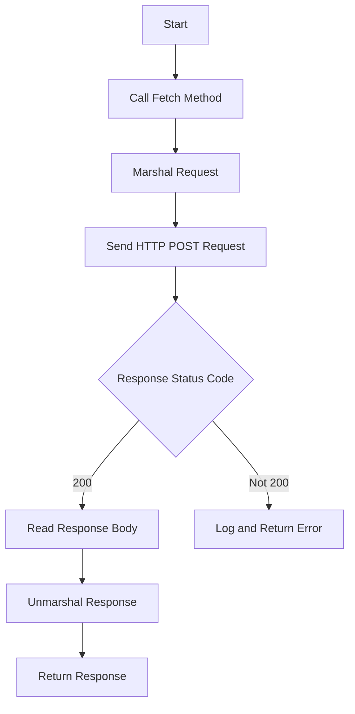

# Introduction to Remote Configuration

Remote configuration allows the Datadog Agent to fetch and manage configurations from a remote server. This functionality is essential for dynamically updating the agent's behavior without requiring manual intervention or redeployment.

<SwmSnippet path="/pkg/config/remote/api/http.go" line="94">

---

# Fetch Method

The <SwmToken path="pkg/config/remote/api/http.go" pos="94:2:2" line-data="// Fetch remote configuration">`Fetch`</SwmToken> method is responsible for fetching the latest configurations from the remote server. It serializes the request using <SwmToken path="pkg/config/remote/api/http.go" pos="96:8:10" line-data="	body, err := proto.Marshal(request)">`proto.Marshal`</SwmToken>, sends an HTTP POST request, and deserializes the response using <SwmToken path="pkg/config/remote/api/http.go" pos="136:5:7" line-data="	err = proto.Unmarshal(body, response)">`proto.Unmarshal`</SwmToken>.

```go
// Fetch remote configuration
func (c *HTTPClient) Fetch(ctx context.Context, request *pbgo.LatestConfigsRequest) (*pbgo.LatestConfigsResponse, error) {
	body, err := proto.Marshal(request)
	if err != nil {
		return nil, err
	}

	url := c.baseURL + pollEndpoint
	log.Debugf("fetching configurations at %s", url)
	req, err := http.NewRequestWithContext(ctx, http.MethodPost, url, bytes.NewBuffer(body))
	if err != nil {
		return nil, fmt.Errorf("failed to create org data request: %w", err)
	}
	req.Header = c.header

	resp, err := c.client.Do(req)
	if err != nil {
		return nil, fmt.Errorf("failed to issue request: %w", err)
	}
	defer resp.Body.Close()
```

---

</SwmSnippet>

# CreateRemotePaths

Using the result of `FindTestPrograms()`, this stage makes a duplicate directory structure on the <SwmPath>[cmd/trace-agent/test/](cmd/trace-agent/test/)</SwmPath> host. This stage is intended to be able to be replicated on more than one host.

# Main Functions

Several main functions are involved in remote configuration management. These include <SwmToken path="pkg/config/remote/uptane/remote_store.go" pos="34:2:2" line-data="func newRemoteStore(targetStore *targetStore) remoteStore {">`newRemoteStore`</SwmToken>, <SwmToken path="pkg/config/remote/uptane/remote_store.go" pos="60:2:2" line-data="// GetMeta implements go-tuf&#39;s RemoteStore.GetMeta">`GetMeta`</SwmToken>, <SwmToken path="pkg/config/remote/service/service.go" pos="288:2:2" line-data="// NewService instantiates a new remote configuration management service">`NewService`</SwmToken>, and <SwmToken path="pkg/config/remote/service/service.go" pos="395:2:2" line-data="// Start the remote configuration management service">`Start`</SwmToken>.

<SwmSnippet path="/pkg/config/remote/uptane/remote_store.go" line="34">

---

## <SwmToken path="pkg/config/remote/uptane/remote_store.go" pos="34:2:2" line-data="func newRemoteStore(targetStore *targetStore) remoteStore {">`newRemoteStore`</SwmToken>

The <SwmToken path="pkg/config/remote/uptane/remote_store.go" pos="34:2:2" line-data="func newRemoteStore(targetStore *targetStore) remoteStore {">`newRemoteStore`</SwmToken> function initializes a new <SwmToken path="pkg/config/remote/uptane/remote_store.go" pos="34:10:10" line-data="func newRemoteStore(targetStore *targetStore) remoteStore {">`remoteStore`</SwmToken> struct. It sets up the <SwmToken path="pkg/config/remote/uptane/remote_store.go" pos="36:1:1" line-data="		metas: map[role]map[uint64][]byte{">`metas`</SwmToken> map with roles and their corresponding metadata versions and assigns the provided <SwmToken path="pkg/config/remote/uptane/remote_store.go" pos="34:4:4" line-data="func newRemoteStore(targetStore *targetStore) remoteStore {">`targetStore`</SwmToken> to the <SwmToken path="pkg/config/remote/uptane/remote_store.go" pos="34:10:10" line-data="func newRemoteStore(targetStore *targetStore) remoteStore {">`remoteStore`</SwmToken>.

```go
func newRemoteStore(targetStore *targetStore) remoteStore {
	return remoteStore{
		metas: map[role]map[uint64][]byte{
			roleRoot:      make(map[uint64][]byte),
			roleTargets:   make(map[uint64][]byte),
			roleSnapshot:  make(map[uint64][]byte),
			roleTimestamp: make(map[uint64][]byte),
		},
		targetStore: targetStore,
	}
}
```

---

</SwmSnippet>

<SwmSnippet path="/pkg/config/remote/uptane/remote_store.go" line="60">

---

## <SwmToken path="pkg/config/remote/uptane/remote_store.go" pos="60:2:2" line-data="// GetMeta implements go-tuf&#39;s RemoteStore.GetMeta">`GetMeta`</SwmToken>

The <SwmToken path="pkg/config/remote/uptane/remote_store.go" pos="60:2:2" line-data="// GetMeta implements go-tuf&#39;s RemoteStore.GetMeta">`GetMeta`</SwmToken> method retrieves metadata for a given path. It parses the path to determine the role and version, then fetches the corresponding metadata from the <SwmToken path="pkg/config/remote/uptane/remote_store.go" pos="67:10:10" line-data="	roleVersions, roleFound := s.metas[metaPath.role]">`metas`</SwmToken> map. If the metadata is found, it returns an <SwmToken path="pkg/config/remote/uptane/remote_store.go" pos="62:17:19" line-data="func (s *remoteStore) GetMeta(path string) (io.ReadCloser, int64, error) {">`io.ReadCloser`</SwmToken> for the metadata content.

```go
// GetMeta implements go-tuf's RemoteStore.GetMeta
// See https://pkg.go.dev/github.com/DataDog/go-tuf/client#RemoteStore
func (s *remoteStore) GetMeta(path string) (io.ReadCloser, int64, error) {
	metaPath, err := parseMetaPath(path)
	if err != nil {
		return nil, 0, err
	}
	roleVersions, roleFound := s.metas[metaPath.role]
	if !roleFound {
		return nil, 0, client.ErrNotFound{File: path}
	}
	version := metaPath.version
	if !metaPath.versionSet {
		if metaPath.role != roleTimestamp {
			return nil, 0, client.ErrNotFound{File: path}
		}
		version = s.latestVersion(metaPath.role)
	}
	requestedVersion, versionFound := roleVersions[version]
	if !versionFound {
		return nil, 0, client.ErrNotFound{File: path}
```

---

</SwmSnippet>

<SwmSnippet path="/pkg/config/remote/service/service.go" line="288">

---

## <SwmToken path="pkg/config/remote/service/service.go" pos="288:2:2" line-data="// NewService instantiates a new remote configuration management service">`NewService`</SwmToken>

The <SwmToken path="pkg/config/remote/service/service.go" pos="288:2:2" line-data="// NewService instantiates a new remote configuration management service">`NewService`</SwmToken> function creates a new remote configuration management service. It sets up the necessary configurations, initializes the HTTP client, and prepares the Uptane client for fetching and applying remote configurations.

```go
// NewService instantiates a new remote configuration management service
func NewService(cfg model.Reader, rcType, baseRawURL, hostname string, tags []string, telemetryReporter RcTelemetryReporter, agentVersion string, opts ...Option) (*Service, error) {
	options := defaultOptions
	for _, opt := range opts {
		opt(&options)
	}

	// A backoff is calculated as a range from which a random value will be selected. The formula is as follows.
	//
	// min = baseBackoffTime * 2^<NumErrors> / minBackoffFactor
	// max = min(maxBackoffTime, baseBackoffTime * 2 ^<NumErrors>)
	//
	// The following values mean each range will always be [30*2^<NumErrors-1>, min(maxBackoffTime, 30*2^<NumErrors>)].
	// Every success will cause numErrors to shrink by 2.
	// This is a sensible default backoff pattern, and there isn't really any need to
	// let clients configure this at this time.
	minBackoffFactor := 2.0
	baseBackoffTime := 30.0
	recoveryInterval := 2
	recoveryReset := false
```

---

</SwmSnippet>

<SwmSnippet path="/pkg/config/remote/service/service.go" line="395">

---

## Start

The <SwmToken path="pkg/config/remote/service/service.go" pos="395:2:2" line-data="// Start the remote configuration management service">`Start`</SwmToken> method begins the remote configuration management service. It starts two goroutines: one for polling the organization status and another for refreshing the configuration at regular intervals.

```go
// Start the remote configuration management service
func (s *Service) Start() {
	go func() {
		s.pollOrgStatus()
		for {
			select {
			case <-s.clock.After(orgStatusPollInterval):
				s.pollOrgStatus()
			case <-s.stopOrgPoller:
				log.Infof("[%s] Stopping Remote Config org status poller", s.rcType)
				return
			}
		}
	}()
	go func() {
		defer func() {
			close(s.stopOrgPoller)
		}()

		err := s.refresh()
		if err != nil {
```

---

</SwmSnippet>

# Remote Configuration Endpoints

Remote configuration endpoints are crucial for fetching the latest configurations and organization status.

<SwmSnippet path="/pkg/config/remote/api/http.go" line="29">

---

## <SwmToken path="pkg/config/remote/api/http.go" pos="29:1:1" line-data="	orgStatusEndpoint = &quot;/api/v0.1/status&quot;">`orgStatusEndpoint`</SwmToken>

The <SwmToken path="pkg/config/remote/api/http.go" pos="29:1:1" line-data="	orgStatusEndpoint = &quot;/api/v0.1/status&quot;">`orgStatusEndpoint`</SwmToken> is defined as <SwmPath>[cmd/agent/subcommands/status/](cmd/agent/subcommands/status/)</SwmPath>. This endpoint is used to fetch the organization and key status. The <SwmToken path="pkg/config/remote/api/http.go" pos="48:1:1" line-data="	FetchOrgStatus(context.Context) (*pbgo.OrgStatusResponse, error)">`FetchOrgStatus`</SwmToken> method sends an HTTP GET request to this endpoint and processes the response to retrieve the organization status.

```go
	orgStatusEndpoint = "/api/v0.1/status"
)
```

---

</SwmSnippet>

&nbsp;

*This is an auto-generated document by Swimm AI 🌊 and has not yet been verified by a human*

<SwmMeta version="3.0.0" repo-id="Z2l0aHViJTNBJTNBZGF0YWRvZy1hZ2VudCUzQSUzQVN3aW1tLURlbW8=" repo-name="datadog-agent"><sup>Powered by [Swimm](/)</sup></SwmMeta>
