```mermaid
graph TD;
 A[Seclwin] --> B[SECLLegacyFields];
 A --> C[SECLConstants];
 C --> D[initConstants];
 D --> E[initBoolConstants];
 D --> F[initErrorConstants];
 D --> G[initOpenConstants];
 D --> H[initFileModeConstants];
 D --> I[initInodeModeConstants];
 D --> J[initUnlinkConstanst];
 D --> K[initKernelCapabilityConstants];
 D --> L[initBPFCmdConstants];
 D --> M[initBPFHelperFuncConstants];
 D --> N[initBPFMapTypeConstants];
 D --> O[initBPFProgramTypeConstants];
 D --> P[initBPFAttachTypeConstants];
 D --> Q[initPtraceConstants];
 D --> R[initVMConstants];
 D --> S[initProtConstansts];
 D --> T[initMMapFlagsConstants];
 D --> U[initSignalConstants];
 D --> V[initPipeBufFlagConstants];
 D --> W[initDNSQClassConstants];
 D --> X[initDNSQTypeConstants];
 D --> Y[initL3ProtocolConstants];
 D --> Z[initL4ProtocolConstants];
 D --> AA[initAddressFamilyConstants];
 D --> AB[initExitCauseConstants];
 D --> AC[initBPFMapNamesConstants];
```

# Introduction to Seclwin in Security

Seclwin is a component within the Security package that deals with security-related functionalities specific to Windows environments. It includes various models and constants that are essential for the runtime security agent rules.

<SwmSnippet path="/pkg/security/seclwin/model/legacy_secl.go" line="11">

---

## <SwmToken path="pkg/security/seclwin/model/legacy_secl.go" pos="11:2:2" line-data="// SECLLegacyFields contains the list of the legacy attributes we need to support">`SECLLegacyFields`</SwmToken>

The <SwmToken path="pkg/security/seclwin/model/legacy_secl.go" pos="11:2:2" line-data="// SECLLegacyFields contains the list of the legacy attributes we need to support">`SECLLegacyFields`</SwmToken> map contains the list of legacy attributes that need to be supported. This ensures backward compatibility with older security rules and attributes.

```go
// SECLLegacyFields contains the list of the legacy attributes we need to support
var SECLLegacyFields = map[eval.Field]eval.Field{
	// event
	"async": "event.async",

	// chmod
	"chmod.filename": "chmod.file.path",
	"chmod.basename": "chmod.file.name",
	"chmod.mode":     "chmod.file.destination.mode",

	// chown
	"chown.filename": "chown.file.path",
	"chown.basename": "chown.file.name",
	"chown.uid":      "chown.file.destination.uid",
	"chown.user":     "chown.file.destination.user",
	"chown.gid":      "chown.file.destination.gid",
	"chown.group":    "chown.file.destination.group",

	// open
	"open.filename": "open.file.path",
	"open.basename": "open.file.name",
```

---

</SwmSnippet>

<SwmSnippet path="/pkg/security/seclwin/model/consts_common.go" line="444">

---

## <SwmToken path="pkg/security/seclwin/model/consts_common.go" pos="444:2:2" line-data="// SECLConstants returns the constants supported in runtime security agent rules,">`SECLConstants`</SwmToken>

The <SwmToken path="pkg/security/seclwin/model/consts_common.go" pos="444:2:2" line-data="// SECLConstants returns the constants supported in runtime security agent rules,">`SECLConstants`</SwmToken> function initializes and returns the constants supported in runtime security agent rules. It ensures that all necessary constants are available for security rule evaluation.

```go
// SECLConstants returns the constants supported in runtime security agent rules,
// initializing these constants during the first call
func SECLConstants() map[string]interface{} {
	constantsInitialized.Do(func() {
		initConstants()
	})
	return seclConstants
}
```

---

</SwmSnippet>

<SwmSnippet path="/pkg/security/seclwin/model/consts_common.go" line="402">

---

## <SwmToken path="pkg/security/seclwin/model/consts_common.go" pos="402:2:2" line-data="func initConstants() {">`initConstants`</SwmToken>

The <SwmToken path="pkg/security/seclwin/model/consts_common.go" pos="402:2:2" line-data="func initConstants() {">`initConstants`</SwmToken> function is called within <SwmToken path="pkg/security/seclwin/model/consts_common.go" pos="444:2:2" line-data="// SECLConstants returns the constants supported in runtime security agent rules,">`SECLConstants`</SwmToken> to initialize various constants required for security rule evaluation. This includes constants for file modes, kernel capabilities, BPF commands, and more.

```go
func initConstants() {
	initBoolConstants()
	initErrorConstants()
	initOpenConstants()
	initFileModeConstants()
	initInodeModeConstants()
	initUnlinkConstanst()
	initKernelCapabilityConstants()
	initBPFCmdConstants()
	initBPFHelperFuncConstants()
	initBPFMapTypeConstants()
	initBPFProgramTypeConstants()
	initBPFAttachTypeConstants()
	initPtraceConstants()
	initVMConstants()
	initProtConstansts()
	initMMapFlagsConstants()
	initSignalConstants()
	initPipeBufFlagConstants()
	initDNSQClassConstants()
	initDNSQTypeConstants()
```

---

</SwmSnippet>

<SwmSnippet path="/pkg/security/seclwin/model/model.go" line="79">

---

## <SwmToken path="pkg/security/seclwin/model/model.go" pos="79:2:2" line-data="// SecurityProfileContext holds the security context of the profile">`SecurityProfileContext`</SwmToken>

The <SwmToken path="pkg/security/seclwin/model/model.go" pos="79:2:2" line-data="// SecurityProfileContext holds the security context of the profile">`SecurityProfileContext`</SwmToken> type holds the security context of a profile, including its name, version, tags, and event types. This is essential for defining the security profile's characteristics and the types of events it handles.

```go
// SecurityProfileContext holds the security context of the profile
type SecurityProfileContext struct {
	Name           string                     `field:"name"`        // SECLDoc[name] Definition:`Name of the security profile`
	Version        string                     `field:"version"`     // SECLDoc[version] Definition:`Version of the security profile`
	Tags           []string                   `field:"tags"`        // SECLDoc[tags] Definition:`Tags of the security profile`
	EventTypes     []EventType                `field:"event_types"` // SECLDoc[event_types] Definition:`Event types enabled for the security profile`
	EventTypeState EventFilteringProfileState `field:"-"`           // State of the event type in this profile
}
```

---

</SwmSnippet>

<SwmSnippet path="/pkg/security/seclwin/model/model.go" line="111">

---

## <SwmToken path="pkg/security/seclwin/model/model.go" pos="111:2:2" line-data="// BaseEvent represents an event sent from the kernel">`BaseEvent`</SwmToken>

The <SwmToken path="pkg/security/seclwin/model/model.go" pos="111:2:2" line-data="// BaseEvent represents an event sent from the kernel">`BaseEvent`</SwmToken> type represents an event sent from the kernel. It includes various fields such as ID, type, flags, timestamp, and context information related to the process, container, and security profile. This type is crucial for handling and processing kernel events.

```go
// BaseEvent represents an event sent from the kernel
type BaseEvent struct {
	ID            string         `field:"-" event:"*"`
	Type          uint32         `field:"-"`
	Flags         uint32         `field:"-"`
	TimestampRaw  uint64         `field:"event.timestamp,handler:ResolveEventTimestamp" event:"*"` // SECLDoc[event.timestamp] Definition:`Timestamp of the event`
	Timestamp     time.Time      `field:"timestamp,opts:getters_only,handler:ResolveEventTime" event:"*"`
	Rules         []*MatchedRule `field:"-"`
	ActionReports []ActionReport `field:"-"`
	Os            string         `field:"event.os" event:"*"`                               // SECLDoc[event.os] Definition:`Operating system of the event`
	Origin        string         `field:"event.origin" event:"*"`                           // SECLDoc[event.origin] Definition:`Origin of the event`
	Service       string         `field:"event.service,handler:ResolveService" event:"*"`   // SECLDoc[event.service] Definition:`Service associated with the event`
	Hostname      string         `field:"event.hostname,handler:ResolveHostname" event:"*"` // SECLDoc[event.hostname] Definition:`Hostname associated with the event`

	// context shared with all events
	ProcessContext         *ProcessContext        `field:"process" event:"*"`
	ContainerContext       *ContainerContext      `field:"container" event:"*"`
	SecurityProfileContext SecurityProfileContext `field:"-"`

	// internal usage
	PIDContext        PIDContext         `field:"-"`
```

---

</SwmSnippet>

&nbsp;

*This is an auto-generated document by Swimm AI 🌊 and has not yet been verified by a human*

<SwmMeta version="3.0.0" repo-id="Z2l0aHViJTNBJTNBZGF0YWRvZy1hZ2VudCUzQSUzQVN3aW1tLURlbW8=" repo-name="datadog-agent"><sup>Powered by [Swimm](/)</sup></SwmMeta>
