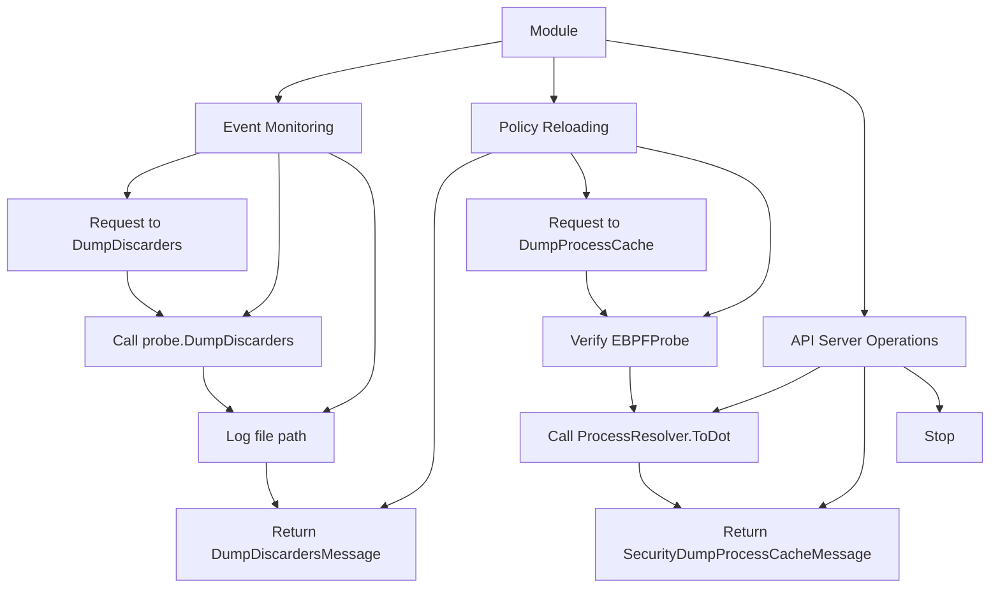

# Introduction to Security Module

A module in the Security context refers to a self-contained unit of code that encapsulates specific functionalities related to security operations. Modules are used to organize and manage different aspects of security, such as event monitoring, policy reloading, and API server operations.

## Module Structure

The <SwmPath>[pkg/security/module/](pkg/security/module/)</SwmPath> directory contains various modules that handle tasks like starting and stopping servers, managing <SwmToken path="pkg/security/module/cws.go" pos="193:11:11" line-data="func (c *CWSConsumer) RunSelfTest(gRPC bool) (bool, error) {">`gRPC`</SwmToken> connections, and processing security events. Each module typically includes functions to initialize, start, and stop its operations, ensuring that security processes are correctly managed and executed. Modules also interact with other components, such as the rule engine and reloader, to maintain the overall security infrastructure.

## Go Module

Go modules are not mandatory, but if you want to allow your component to be used outside the <SwmToken path="pkg/security/module/cws.go" pos="18:8:10" line-data="	&quot;github.com/DataDog/datadog-agent/pkg/eventmonitor&quot;">`datadog-agent`</SwmToken> repository, create Go modules in the following places: in the `impl`/`impl-*` folder to expose implementations, in the `def` folder to expose the interface, and in the <SwmToken path="tasks/unit_tests/commands/docker_tests.py" pos="13:8:8" line-data="    def test_run_command(self, mock):">`mock`</SwmToken> folder to expose the mock.

## Go Nested Modules Tooling

Go nested modules interdependencies are automatically updated when creating a release candidate or a final version, with the same tasks that update the <SwmPath>[release.json](release.json)</SwmPath>. For Agent version `7.X.Y` the module will have version `v0.X.Y`. Go nested modules are tagged automatically by the `release.tag-version` invoke task, on the same commit as the main module, with a tag of the form `path/to/module/v0.X.Y`.

## Main Functions

There are several main functions in this module. Some of them are <SwmToken path="pkg/security/module/cws.go" pos="54:2:2" line-data="// NewCWSConsumer initializes the module with options">`NewCWSConsumer`</SwmToken>, <SwmToken path="tasks/kernel_matrix_testing/compiler.py" pos="104:3:3" line-data="    def start(self) -&gt; None:">`start`</SwmToken>, <SwmToken path="tasks/kernel_matrix_testing/compiler.py" pos="100:3:3" line-data="    def stop(self) -&gt; Result:">`stop`</SwmToken>, and <SwmToken path="tasks/kmt.py" pos="304:2:2" line-data="def init(ctx: Context, lite=False, images: str | None = None):">`init`</SwmToken>. We will dive a little into <SwmToken path="pkg/security/module/cws.go" pos="54:2:2" line-data="// NewCWSConsumer initializes the module with options">`NewCWSConsumer`</SwmToken> and <SwmToken path="tasks/kernel_matrix_testing/compiler.py" pos="104:3:3" line-data="    def start(self) -&gt; None:">`start`</SwmToken>.

### <SwmToken path="pkg/security/module/cws.go" pos="54:2:2" line-data="// NewCWSConsumer initializes the module with options">`NewCWSConsumer`</SwmToken>

The <SwmToken path="pkg/security/module/cws.go" pos="54:2:2" line-data="// NewCWSConsumer initializes the module with options">`NewCWSConsumer`</SwmToken> function initializes the module with options. It sets up various components like the API server, rate limiter, and rule engine, ensuring that the module is ready to handle security events.

<SwmSnippet path="/pkg/security/module/cws.go" line="54">

---

The <SwmToken path="pkg/security/module/cws.go" pos="54:2:2" line-data="// NewCWSConsumer initializes the module with options">`NewCWSConsumer`</SwmToken> function initializes the module with options, setting up various components like the API server, rate limiter, and rule engine.

```go
// NewCWSConsumer initializes the module with options
func NewCWSConsumer(evm *eventmonitor.EventMonitor, cfg *config.RuntimeSecurityConfig, opts Opts) (*CWSConsumer, error) {
	ctx, cancelFnc := context.WithCancel(context.Background())

	var (
		selfTester *selftests.SelfTester
		err        error
	)

	if cfg.SelfTestEnabled {
		selfTester, err = selftests.NewSelfTester(cfg, evm.Probe)
		if err != nil {
			seclog.Errorf("unable to instantiate self tests: %s", err)
		}
	}

	family, address := config.GetFamilyAddress(cfg.SocketPath)

	c := &CWSConsumer{
		config:       cfg,
		probe:        evm.Probe,
```

---

</SwmSnippet>

### Start

The <SwmToken path="tasks/kernel_matrix_testing/compiler.py" pos="104:3:3" line-data="    def start(self) -&gt; None:">`start`</SwmToken> function begins the module's operations. It starts the <SwmToken path="pkg/security/module/cws.go" pos="193:11:11" line-data="func (c *CWSConsumer) RunSelfTest(gRPC bool) (bool, error) {">`gRPC`</SwmToken> server, API server, and rule engine, and also initiates the process of sending statistics. This function ensures that all necessary components are running and ready to process security events.

## Module Endpoints

Module endpoints handle specific requests related to security operations. Two key endpoints are <SwmToken path="pkg/security/module/server_linux.go" pos="21:2:2" line-data="// DumpDiscarders handles discarder dump requests">`DumpDiscarders`</SwmToken> and <SwmToken path="pkg/security/module/server_linux.go" pos="32:2:2" line-data="// DumpProcessCache handles process cache dump requests">`DumpProcessCache`</SwmToken>.

### <SwmToken path="pkg/security/module/server_linux.go" pos="21:2:2" line-data="// DumpDiscarders handles discarder dump requests">`DumpDiscarders`</SwmToken>

The <SwmToken path="pkg/security/module/server_linux.go" pos="21:2:2" line-data="// DumpDiscarders handles discarder dump requests">`DumpDiscarders`</SwmToken> endpoint handles requests to dump discarders. It calls the <SwmToken path="pkg/security/module/server_linux.go" pos="21:2:2" line-data="// DumpDiscarders handles discarder dump requests">`DumpDiscarders`</SwmToken> method of the <SwmToken path="pkg/security/module/cws.go" pos="64:17:17" line-data="		selfTester, err = selftests.NewSelfTester(cfg, evm.Probe)">`Probe`</SwmToken> and logs the file path of the dump. If successful, it returns a <SwmToken path="pkg/security/module/server_linux.go" pos="22:30:30" line-data="func (a *APIServer) DumpDiscarders(_ context.Context, _ *api.DumpDiscardersParams) (*api.DumpDiscardersMessage, error) {">`DumpDiscardersMessage`</SwmToken> containing the dump file path.

<SwmSnippet path="/pkg/security/module/server_linux.go" line="21">

---

The <SwmToken path="pkg/security/module/server_linux.go" pos="21:2:2" line-data="// DumpDiscarders handles discarder dump requests">`DumpDiscarders`</SwmToken> endpoint handles requests to dump discarders, calling the <SwmToken path="pkg/security/module/server_linux.go" pos="21:2:2" line-data="// DumpDiscarders handles discarder dump requests">`DumpDiscarders`</SwmToken> method of the <SwmToken path="pkg/security/module/server_linux.go" pos="23:10:10" line-data="	filePath, err := a.probe.DumpDiscarders()">`probe`</SwmToken> and logging the file path of the dump.

```go
// DumpDiscarders handles discarder dump requests
func (a *APIServer) DumpDiscarders(_ context.Context, _ *api.DumpDiscardersParams) (*api.DumpDiscardersMessage, error) {
	filePath, err := a.probe.DumpDiscarders()
	if err != nil {
		return nil, err
	}
	seclog.Infof("Discarder dump file path: %s", filePath)

	return &api.DumpDiscardersMessage{DumpFilename: filePath}, nil
}
```

---

</SwmSnippet>

### <SwmToken path="pkg/security/module/server_linux.go" pos="32:2:2" line-data="// DumpProcessCache handles process cache dump requests">`DumpProcessCache`</SwmToken>

The <SwmToken path="pkg/security/module/server_linux.go" pos="32:2:2" line-data="// DumpProcessCache handles process cache dump requests">`DumpProcessCache`</SwmToken> endpoint handles requests to dump the process cache. It verifies if the platform probe is of type <SwmToken path="pkg/security/module/server_linux.go" pos="34:18:18" line-data="	p, ok := a.probe.PlatformProbe.(*probe.EBPFProbe)">`EBPFProbe`</SwmToken> and then calls the <SwmToken path="pkg/security/module/server_linux.go" pos="39:14:14" line-data="	filename, err := p.Resolvers.ProcessResolver.ToDot(params.WithArgs)">`ToDot`</SwmToken> method of the <SwmToken path="pkg/security/module/server_linux.go" pos="39:12:12" line-data="	filename, err := p.Resolvers.ProcessResolver.ToDot(params.WithArgs)">`ProcessResolver`</SwmToken> to generate the dump file. If successful, it returns a <SwmToken path="pkg/security/module/server_linux.go" pos="33:30:30" line-data="func (a *APIServer) DumpProcessCache(_ context.Context, params *api.DumpProcessCacheParams) (*api.SecurityDumpProcessCacheMessage, error) {">`SecurityDumpProcessCacheMessage`</SwmToken> containing the dump file name.

<SwmSnippet path="/pkg/security/module/server_linux.go" line="32">

---

The <SwmToken path="pkg/security/module/server_linux.go" pos="32:2:2" line-data="// DumpProcessCache handles process cache dump requests">`DumpProcessCache`</SwmToken> endpoint handles requests to dump the process cache, verifying if the platform probe is of type <SwmToken path="pkg/security/module/server_linux.go" pos="34:18:18" line-data="	p, ok := a.probe.PlatformProbe.(*probe.EBPFProbe)">`EBPFProbe`</SwmToken> and calling the <SwmToken path="pkg/security/module/server_linux.go" pos="39:14:14" line-data="	filename, err := p.Resolvers.ProcessResolver.ToDot(params.WithArgs)">`ToDot`</SwmToken> method of the <SwmToken path="pkg/security/module/server_linux.go" pos="39:12:12" line-data="	filename, err := p.Resolvers.ProcessResolver.ToDot(params.WithArgs)">`ProcessResolver`</SwmToken> to generate the dump file.

```go
// DumpProcessCache handles process cache dump requests
func (a *APIServer) DumpProcessCache(_ context.Context, params *api.DumpProcessCacheParams) (*api.SecurityDumpProcessCacheMessage, error) {
	p, ok := a.probe.PlatformProbe.(*probe.EBPFProbe)
	if !ok {
		return nil, fmt.Errorf("not supported")
	}

	filename, err := p.Resolvers.ProcessResolver.ToDot(params.WithArgs)
	if err != nil {
		return nil, err
	}

	return &api.SecurityDumpProcessCacheMessage{
		Filename: filename,
	}, nil
}
```

---

</SwmSnippet>

&nbsp;

*This is an auto-generated document by Swimm AI 🌊 and has not yet been verified by a human*

<SwmMeta version="3.0.0" repo-id="Z2l0aHViJTNBJTNBZGF0YWRvZy1hZ2VudCUzQSUzQVN3aW1tLURlbW8=" repo-name="datadog-agent"><sup>Powered by [Swimm](/)</sup></SwmMeta>
