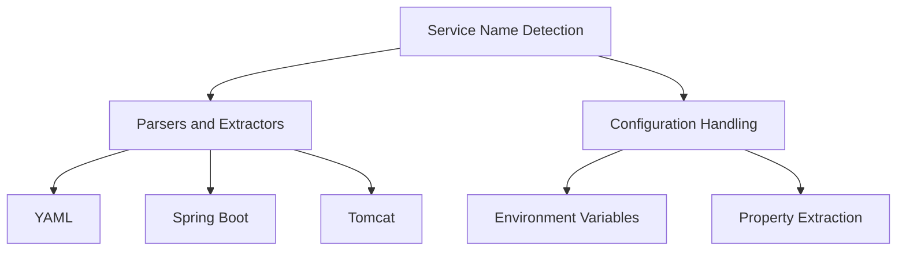

# Introduction

Service name detection is a critical feature provided by the <SwmToken path="pkg/collector/corechecks/servicediscovery/usm/yaml.go" pos="6:2:2" line-data="package usm">`usm`</SwmToken> package. It ensures that the most appropriate service name is identified for a given process, which is essential for accurate monitoring and logging.

# Parsers and Extractors

The <SwmToken path="pkg/collector/corechecks/servicediscovery/usm/yaml.go" pos="6:2:2" line-data="package usm">`usm`</SwmToken> package includes various parsers and extractors to handle different types of configuration files and environments. This allows it to adapt to a wide range of setups and accurately determine service names.

<SwmSnippet path="/pkg/collector/corechecks/servicediscovery/usm/yaml.go" line="4">

---

The package contains specific implementations for handling YAML configurations.

```go
// Copyright 2016-present Datadog, Inc.

package usm

import (
```

---

</SwmSnippet>

# Configuration Handling

The <SwmToken path="pkg/collector/corechecks/servicediscovery/usm/yaml.go" pos="6:2:2" line-data="package usm">`usm`</SwmToken> package also includes utilities for normalizing environment variables and extracting properties from different sources. This ensures that service names are consistently and accurately detected across various environments.

# Main Functions

Several main functions in the <SwmToken path="pkg/collector/corechecks/servicediscovery/usm/yaml.go" pos="6:2:2" line-data="package usm">`usm`</SwmToken> package play a crucial role in service name detection. These include <SwmToken path="pkg/collector/corechecks/servicediscovery/usm/jee.go" pos="105:2:2" line-data="// extractContextRootFromApplicationXML parses a standard application.xml file extracting">`extractContextRootFromApplicationXML`</SwmToken>, <SwmToken path="pkg/collector/corechecks/servicediscovery/usm/service.go" pos="39:2:2" line-data="// NewServiceMetadata initializes ServiceMetadata.">`NewServiceMetadata`</SwmToken>, and <SwmToken path="pkg/collector/corechecks/servicediscovery/usm/service.go" pos="48:2:2" line-data="// GetServiceKey returns the key for the service.">`GetServiceKey`</SwmToken>.

## <SwmToken path="pkg/collector/corechecks/servicediscovery/usm/jee.go" pos="105:2:2" line-data="// extractContextRootFromApplicationXML parses a standard application.xml file extracting">`extractContextRootFromApplicationXML`</SwmToken>

The <SwmToken path="pkg/collector/corechecks/servicediscovery/usm/jee.go" pos="105:2:2" line-data="// extractContextRootFromApplicationXML parses a standard application.xml file extracting">`extractContextRootFromApplicationXML`</SwmToken> function parses a standard <SwmPath>[pkg/collector/corechecks/servicediscovery/testdata/b/test.ear/META-INF/application.xml](pkg/collector/corechecks/servicediscovery/testdata/b/test.ear/META-INF/application.xml)</SwmPath> file to extract mount points for web applications, also known as context roots.

<SwmSnippet path="/pkg/collector/corechecks/servicediscovery/usm/jee.go" line="105">

---

This function reads the <SwmPath>[pkg/collector/corechecks/servicediscovery/testdata/b/test.ear/META-INF/application.xml](pkg/collector/corechecks/servicediscovery/testdata/b/test.ear/META-INF/application.xml)</SwmPath> file, decodes its contents, and returns the context roots.

```go
// extractContextRootFromApplicationXML parses a standard application.xml file extracting
// mount points for web application (aka context roots).
func extractContextRootFromApplicationXML(fs fs.FS) ([]string, error) {
	reader, err := fs.Open(applicationXMLPath)
	if err != nil {
		return nil, err
	}
	defer reader.Close()
	var a applicationXML
	err = xml.NewDecoder(reader).Decode(&a)
	if err != nil {
		return nil, err
	}
	return a.ContextRoot, nil
}
```

---

</SwmSnippet>

## <SwmToken path="pkg/collector/corechecks/servicediscovery/usm/service.go" pos="39:2:2" line-data="// NewServiceMetadata initializes ServiceMetadata.">`NewServiceMetadata`</SwmToken>

The <SwmToken path="pkg/collector/corechecks/servicediscovery/usm/service.go" pos="39:2:2" line-data="// NewServiceMetadata initializes ServiceMetadata.">`NewServiceMetadata`</SwmToken> function initializes a <SwmToken path="pkg/collector/corechecks/servicediscovery/usm/service.go" pos="39:6:6" line-data="// NewServiceMetadata initializes ServiceMetadata.">`ServiceMetadata`</SwmToken> struct with a given name and additional names. This struct is used to store and manage service names.

<SwmSnippet path="/pkg/collector/corechecks/servicediscovery/usm/service.go" line="39">

---

This function sorts the additional names and returns a <SwmToken path="pkg/collector/corechecks/servicediscovery/usm/service.go" pos="39:6:6" line-data="// NewServiceMetadata initializes ServiceMetadata.">`ServiceMetadata`</SwmToken> struct.

```go
// NewServiceMetadata initializes ServiceMetadata.
func NewServiceMetadata(name string, additional ...string) ServiceMetadata {
	if len(additional) > 1 {
		// names are discovered in unpredictable order. We need to keep them sorted if we're going to join them
		slices.Sort(additional)
	}
	return ServiceMetadata{Name: name, AdditionalNames: additional}
}
```

---

</SwmSnippet>

## <SwmToken path="pkg/collector/corechecks/servicediscovery/usm/service.go" pos="48:2:2" line-data="// GetServiceKey returns the key for the service.">`GetServiceKey`</SwmToken>

The <SwmToken path="pkg/collector/corechecks/servicediscovery/usm/service.go" pos="48:2:2" line-data="// GetServiceKey returns the key for the service.">`GetServiceKey`</SwmToken> function returns a key for the service, which is a concatenation of additional names if they exist, or the main name otherwise.

<SwmSnippet path="/pkg/collector/corechecks/servicediscovery/usm/service.go" line="48">

---

This function checks if additional names exist and concatenates them to form the service key.

```go
// GetServiceKey returns the key for the service.
func (s ServiceMetadata) GetServiceKey() string {
	if len(s.AdditionalNames) > 0 {
		return strings.Join(s.AdditionalNames, "_")
	}
	return s.Name
}
```

---

</SwmSnippet>

&nbsp;

*This is an auto-generated document by Swimm AI 🌊 and has not yet been verified by a human*

<SwmMeta version="3.0.0" repo-id="Z2l0aHViJTNBJTNBZGF0YWRvZy1hZ2VudCUzQSUzQVN3aW1tLURlbW8=" repo-name="datadog-agent"><sup>Powered by [Swimm](/)</sup></SwmMeta>
