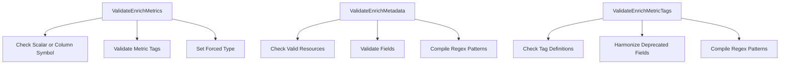

# Introduction to SNMP Configuration Validation

SNMP Configuration Validation ensures that the configurations for SNMP metrics, metadata, and tags are correct and complete before they are used. This process involves checking for required fields, validating data formats, and enriching configurations with additional information if necessary.

# Validate and Enrich Metrics

The function <SwmToken path="pkg/collector/corechecks/snmp/internal/configvalidation/config_validate_enrich.go" pos="64:2:2" line-data="// ValidateEnrichMetrics will validate MetricsConfig and enrich it.">`ValidateEnrichMetrics`</SwmToken> validates and enriches the metrics configuration. It checks if either a scalar or column symbol is provided, but not both, and ensures that the necessary tags and types are correctly set.

<SwmSnippet path="/pkg/collector/corechecks/snmp/internal/configvalidation/config_validate_enrich.go" line="64">

---

The function <SwmToken path="pkg/collector/corechecks/snmp/internal/configvalidation/config_validate_enrich.go" pos="64:2:2" line-data="// ValidateEnrichMetrics will validate MetricsConfig and enrich it.">`ValidateEnrichMetrics`</SwmToken> checks if either a scalar or column symbol is provided, but not both. It also ensures that the necessary tags and types are correctly set.

```go
// ValidateEnrichMetrics will validate MetricsConfig and enrich it.
// Example of enrichment:
// - storage of compiled regex pattern
func ValidateEnrichMetrics(metrics []profiledefinition.MetricsConfig) []string {
	var errors []string
	for i := range metrics {
		metricConfig := &metrics[i]
		if !metricConfig.IsScalar() && !metricConfig.IsColumn() {
			errors = append(errors, fmt.Sprintf("either a table symbol or a scalar symbol must be provided: %#v", metricConfig))
		}
		if metricConfig.IsScalar() && metricConfig.IsColumn() {
			errors = append(errors, fmt.Sprintf("table symbol and scalar symbol cannot be both provided: %#v", metricConfig))
		}
		if metricConfig.IsScalar() {
			errors = append(errors, validateEnrichSymbol(&metricConfig.Symbol, ScalarSymbol)...)
		}
		if metricConfig.IsColumn() {
			for j := range metricConfig.Symbols {
				errors = append(errors, validateEnrichSymbol(&metricConfig.Symbols[j], ColumnSymbol)...)
			}
			if len(metricConfig.MetricTags) == 0 {
```

---

</SwmSnippet>

# Validate and Enrich Metadata

The function <SwmToken path="pkg/collector/corechecks/snmp/internal/configvalidation/config_validate_enrich.go" pos="104:2:2" line-data="// ValidateEnrichMetadata will validate MetadataConfig and enrich it.">`ValidateEnrichMetadata`</SwmToken> validates and enriches the metadata configuration. It verifies that the resources and fields specified in the metadata are valid and supported, and it enriches the configuration by compiling regex patterns and ensuring compatibility.

<SwmSnippet path="/pkg/collector/corechecks/snmp/internal/configvalidation/config_validate_enrich.go" line="104">

---

The function <SwmToken path="pkg/collector/corechecks/snmp/internal/configvalidation/config_validate_enrich.go" pos="104:2:2" line-data="// ValidateEnrichMetadata will validate MetadataConfig and enrich it.">`ValidateEnrichMetadata`</SwmToken> verifies that the resources and fields specified in the metadata are valid and supported. It also enriches the configuration by compiling regex patterns and ensuring compatibility.

```go
// ValidateEnrichMetadata will validate MetadataConfig and enrich it.
func ValidateEnrichMetadata(metadata profiledefinition.MetadataConfig) []string {
	var errors []string
	for resName := range metadata {
		_, isValidRes := validMetadataResources[resName]
		if !isValidRes {
			errors = append(errors, fmt.Sprintf("invalid resource: %s", resName))
		} else {
			res := metadata[resName]
			for fieldName := range res.Fields {
				_, isValidField := validMetadataResources[resName][fieldName]
				if !isValidField {
					errors = append(errors, fmt.Sprintf("invalid resource (%s) field: %s", resName, fieldName))
					continue
				}
				field := res.Fields[fieldName]
				for i := range field.Symbols {
					errors = append(errors, validateEnrichSymbol(&field.Symbols[i], MetadataSymbol)...)
				}
				if field.Symbol.OID != "" {
					errors = append(errors, validateEnrichSymbol(&field.Symbol, MetadataSymbol)...)
```

---

</SwmSnippet>

# Validate and Enrich Metric Tags

The function <SwmToken path="pkg/collector/corechecks/snmp/internal/configvalidation/config_validate_enrich.go" pos="55:2:2" line-data="// ValidateEnrichMetricTags validates and enrich metric tags">`ValidateEnrichMetricTags`</SwmToken> validates and enriches metric tags. It ensures that the tags are correctly defined, harmonizes deprecated fields, and compiles regex patterns for matching tags.

&nbsp;

*This is an auto-generated document by Swimm AI 🌊 and has not yet been verified by a human*

<SwmMeta version="3.0.0" repo-id="Z2l0aHViJTNBJTNBZGF0YWRvZy1hZ2VudCUzQSUzQVN3aW1tLURlbW8=" repo-name="datadog-agent"><sup>Powered by [Swimm](/)</sup></SwmMeta>
